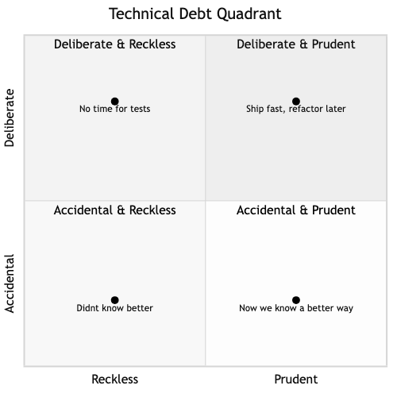

# Clean Code & Software Craftsmanship

## Diagrams





## Concepts

### What is Clean Code?

Clean code is code that is easy to read, easy to understand, and easy to change. It communicates its intent clearly to other developers (including your future self).

> "Any fool can write code that a computer can understand. Good programmers write code that humans can understand." — Martin Fowler

The average developer spends **10x more time reading code than writing it**. Clean code optimizes for the reader, not the writer.

### Naming

Names are the most important tool for communicating intent. A good name tells you *what* something is and *why* it exists without needing a comment.

**Bad naming:**
```text
FUNCTION CALC(d: list of integers) → integer
    r ← 0
    FOR x IN d
        IF x > 0
            r ← r + x
    RETURN r
```

**Clean naming:**
```text
FUNCTION SUM_POSITIVE_TRANSACTIONS(transactions: list of integers) → integer
    total_revenue ← 0
    FOR amount IN transactions
        IF amount > 0
            total_revenue ← total_revenue + amount
    RETURN total_revenue
```

**Naming rules of thumb:**
- Variables: describe what they hold (`user_count`, not `n`)
- Functions: describe what they do (`validate_email`, not `check`)
- Booleans: phrase as questions (`is_active`, `has_permission`, `can_edit`)
- Constants: describe the meaning, not the value (`MAX_RETRY_ATTEMPTS`, not `THREE`)
- Avoid abbreviations unless universally understood (`id`, `url`, `http` are fine; `usr_mgr_svc` is not)

### Readability & Cognitive Complexity

Cognitive complexity measures how hard code is to *mentally* process. Code with deep nesting, long functions, and hidden side effects has high cognitive complexity.

**High cognitive complexity:**
```text
FUNCTION PROCESS_ORDER(order, user) → Result or Error
    IF user.is_active
        IF order.items.length > 0
            IF user.balance ≥ order.TOTAL()
                IF NOT order.CONTAINS_RESTRICTED_ITEMS() OR user.is_verified
                    // actually process the order...
                    RETURN Ok
                ELSE
                    RETURN Error::RestrictedItems
            ELSE
                RETURN Error::InsufficientBalance
        ELSE
            RETURN Error::EmptyOrder
    ELSE
        RETURN Error::InactiveUser
```

**Low cognitive complexity (early returns / guard clauses):**
```text
FUNCTION PROCESS_ORDER(order, user) → Result or Error
    IF NOT user.is_active
        RETURN Error::InactiveUser
    IF order.items IS EMPTY
        RETURN Error::EmptyOrder
    IF user.balance < order.TOTAL()
        RETURN Error::InsufficientBalance
    IF order.CONTAINS_RESTRICTED_ITEMS() AND NOT user.is_verified
        RETURN Error::RestrictedItems

    // actually process the order...
    RETURN Ok
```

The second version reads top-to-bottom. Each guard clause handles one error condition. The happy path is clear at the bottom.

### DRY, KISS, YAGNI

**DRY (Don't Repeat Yourself)** — Every piece of knowledge should have a single, authoritative representation. If you change something, you should only need to change it in one place.

But beware: DRY is about *knowledge duplication*, not *code duplication*. Two functions with identical code might represent different concepts. Prematurely extracting shared code creates coupling between unrelated things.

**KISS (Keep It Simple, Stupid)** — Choose the simplest solution that works. Simple code is easier to understand, test, debug, and modify. Complexity should be justified by actual need.

**YAGNI (You Aren't Gonna Need It)** — Don't build features or abstractions for hypothetical future requirements. Build what you need now. If that future requirement actually arrives, you'll have more context to design it correctly.

**Example of YAGNI violation:**
```text
// Building a plugin system for a config parser that only reads JSON
// "Just in case" we need YAML or TOML later
INTERFACE ConfigParser
    FUNCTION PARSE(input: string) → Config or ParseError
    FUNCTION SUPPORTED_EXTENSIONS() → list of strings
    FUNCTION VALIDATE_SCHEMA(schema) → Ok or SchemaError
// ... 200 lines of plugin registry, loader, discovery...
```

**What you actually needed:**
```text
FUNCTION PARSE_CONFIG(input: string) → Config or JsonError
    RETURN JSON_PARSE(input)
```

### Code Smells & Refactoring

Code smells are surface-level indicators that something *might* be wrong. They're not bugs — the code works. But they suggest the design could be improved.

**Common code smells:**

| Smell | Description | Fix |
|-------|-------------|-----|
| **Long function** | Function does too many things, hard to name | Extract into smaller functions with clear names |
| **Long parameter list** | Function takes 5+ parameters | Group related parameters into a struct |
| **Primitive obsession** | Using `String` or `i32` where a domain type belongs | Create newtypes (`Email(String)`, `UserId(i64)`) |
| **Feature envy** | A function mostly uses data from another struct | Move the function to the struct it's envious of |
| **God object** | One struct that knows and does everything | Split into focused, single-responsibility structs |
| **Magic numbers** | `if retries > 3` — what does 3 mean? | Use a named constant: `MAX_RETRIES` |
| **Dead code** | Unreachable or unused code | Delete it. Version control remembers. |
| **Comments explaining what** | `// increment counter by 1` | Rewrite the code so it's self-explanatory |

**When comments ARE valuable:** Explaining *why* (business rules, workarounds, non-obvious decisions), linking to external docs or tickets, and documenting public APIs.

### Linting & Formatting

Automated tools enforce consistency and catch issues humans miss.

**Rust tooling:**
- **rustfmt** — Automatic code formatting. Eliminates all style debates. Run it on every commit.
- **clippy** — Lints for common mistakes, unidiomatic code, and performance issues. Treats your code like a code review from an experienced Rustacean.

```bash
# Format all code
cargo fmt

# Run lints
cargo clippy -- -W clippy::all
```

The key insight: automate everything that can be automated. Don't waste code review time on formatting or style — let tools handle it so humans can focus on logic and design.

### Technical Debt

Technical debt is the accumulated cost of shortcuts, quick fixes, and deferred improvements in a codebase. Like financial debt, it accrues interest — future development gets slower and riskier.

**Types of technical debt:**

| Type | How it happens | Example |
|------|---------------|---------|
| **Deliberate, prudent** | Conscious decision to ship faster | "We know this won't scale past 1K users, but we need to validate the idea first" |
| **Deliberate, reckless** | Cutting corners knowingly | "We don't have time for tests" |
| **Accidental, prudent** | Learned a better approach after shipping | "Now that we understand the domain better, we'd design this differently" |
| **Accidental, reckless** | Didn't know better | Junior developer patterns, copy-pasted Stack Overflow code |

**Managing technical debt:**
1. **Make it visible** — Track it in your issue tracker, label it, estimate the cost
2. **Quantify the interest** — "This workaround costs us 2 hours per week in debugging time"
3. **Pay it down incrementally** — Allocate 10-20% of sprint capacity to debt reduction
4. **Prevent new debt** — Code review, linting, testing standards

## Business Value

- **Reduced onboarding time**: Clean code with clear naming and structure lets new hires contribute in days instead of weeks. At scale (hiring 10+ engineers/year), this saves months of productivity.
- **Lower maintenance cost**: 60-80% of software cost is maintenance. Clean code makes changes cheaper and safer.
- **Fewer production incidents**: Code smells often hide bugs. Refactoring reduces the surface area for defects.
- **Faster feature delivery**: Teams with clean codebases ship features 2-3x faster than teams drowning in technical debt. Each new feature doesn't require archaeologically understanding layers of hacks.
- **Developer retention**: Engineers leave companies with terrible codebases. Clean code is a recruiting and retention tool.

## Real-World Examples

### Google's Code Review Culture
Every code change at Google must be reviewed by at least one other engineer. Reviewers focus on readability, naming, and simplicity — not just correctness. Google even has a "readability" certification process where engineers demonstrate mastery of clean code practices in a specific language. This investment in code quality at scale enables their monorepo (billions of lines) to remain navigable by any engineer.

### Stripe's API Design
Stripe's API is consistently praised as one of the cleanest in the industry. Their secret: obsessive naming consistency (`customer.id`, not `cust_identifier`), predictable patterns, and clear error messages. This clean design *is* their competitive advantage — developers choose Stripe over competitors partly because the API is a pleasure to use.

### The Boy Scout Rule at Atlassian
Atlassian (makers of Jira, Confluence) follows the Boy Scout Rule: "Leave the code cleaner than you found it." Engineers are expected to improve any code they touch — rename unclear variables, extract a function, remove dead code. This prevents debt accumulation without dedicated "cleanup sprints."

### Martin Fowler's Refactoring at ThoughtWorks
Martin Fowler (author of *Refactoring*) demonstrated at ThoughtWorks that continuous, disciplined refactoring keeps delivery speed constant over time. Projects that skip refactoring start fast but slow to a crawl within 12-18 months as the codebase becomes increasingly difficult to change.

## Common Mistakes & Pitfalls

- **Premature abstraction** — Extracting a shared utility after seeing a pattern twice. Wait for three occurrences and a clear understanding of the *actual* shared concept. Two similar functions might diverge.

- **Refactoring without tests** — Changing code structure without a test safety net. Refactoring should not change behavior, but you need tests to verify that.

- **DRY fanaticism** — Merging two functions that happen to look similar but serve different purposes. This creates coupling: changing one use case breaks the other.

- **Clean code as a goal, not a tool** — Spending days polishing code that will be thrown away. Clean code serves business goals — it's not an end in itself.

- **Ignoring the team's skill level** — Writing clever, ultra-concise code that only you understand. Clean code must be clean *for your team*, not for you.

- **All-or-nothing thinking** — "The codebase is too messy to fix." You don't need to rewrite everything. Improve what you touch, incrementally.

## Trade-offs

| Approach | Pros | Cons |
|----------|------|------|
| **Strict clean code standards** | Consistent, readable, easy to onboard | Slower initial development, can feel bureaucratic |
| **Pragmatic / "good enough"** | Faster delivery, less process | Debt accumulates if "good enough" keeps dropping |
| **Heavy refactoring investment** | Keeps codebase healthy long-term | Short-term feature velocity decreases |
| **No refactoring** | Maximum short-term speed | Codebase decays, team slows to a crawl within 1-2 years |

## When to Use / When Not to Use

**Invest heavily in clean code when:**
- The codebase will live for years
- Multiple people work on it
- It's a core system that changes frequently
- You're building a public API or library

**Acceptable to be less rigorous when:**
- Building a prototype to validate an idea (but be honest about when it stops being a prototype)
- One-off scripts with a single user
- Exploratory code that will be thrown away
- Time-critical hotfixes (but schedule cleanup immediately after)

## Key Takeaways

1. Clean code optimizes for the reader, not the writer. You write code once; it gets read hundreds of times.
2. Good naming is the highest-leverage clean code practice. Invest time in names.
3. DRY is about knowledge duplication, not code duplication. Don't prematurely abstract.
4. Technical debt is unavoidable. The goal is to manage it intentionally, not let it manage you.
5. Automate everything automatable (formatting, linting). Save human attention for design and logic.
6. The Boy Scout Rule works: leave code cleaner than you found it, every time you touch it.

## Further Reading

- **Books:**
  - *Clean Code* — Robert C. Martin (2008) — The foundational text on writing readable, maintainable code
  - *Refactoring* — Martin Fowler (2018, 2nd edition) — Systematic techniques for improving code structure
  - *A Philosophy of Software Design* — John Ousterhout (2018) — A refreshing take focused on reducing complexity

- **Papers & Articles:**
  - [Technical Debt Quadrant](https://martinfowler.com/bliki/TechnicalDebtQuadrant.html) — Martin Fowler's framework for categorizing tech debt
  - [The Wrong Abstraction](https://sandimetz.com/blog/2016/1/20/the-wrong-abstraction) — Sandi Metz on why duplication is better than the wrong abstraction

- **Tools:**
  - [rustfmt](https://github.com/rust-lang/rustfmt) — Rust code formatter
  - [clippy](https://github.com/rust-lang/rust-clippy) — Rust linter with 600+ lint rules
