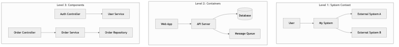
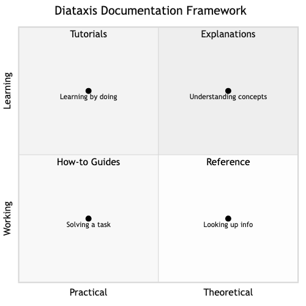

# Documentation Engineering

## Diagrams






## Concepts

### Why Documentation Matters

Code tells you *what* the system does. Documentation tells you *why* it exists, *how* to use it, and *what decisions* shaped it.

Without documentation:
- New engineers spend weeks asking questions instead of shipping
- Knowledge lives in people's heads — when they leave, it leaves with them
- Teams repeat the same mistakes because past decisions are forgotten
- Users can't adopt your API or library without reading the source code

> "Documentation is a love letter that you write to your future self." — Damian Conway

### Types of Documentation

| Type | Audience | Purpose | Example |
|------|----------|---------|---------|
| **API docs** | External/internal developers | How to use your API | Endpoint reference, request/response examples |
| **Architecture docs** | Engineers on the team | How the system is structured and why | C4 diagrams, ADRs, system overviews |
| **Runbooks** | On-call engineers | How to respond to incidents | Step-by-step playbook for "database CPU > 90%" |
| **Onboarding docs** | New hires | How to get started | Setup guide, codebase walkthrough, key contacts |
| **Design docs / RFCs** | Team + stakeholders | Propose and evaluate a technical approach | Problem statement, options considered, decision |
| **User docs** | End users | How to use the product | Tutorials, how-to guides, FAQ |
| **README** | Anyone encountering the project | What this project is and how to get started | Project overview, install, quickstart |
| **Inline comments** | Future code readers | Why non-obvious code exists | Business rule explanations, workaround context |

### The Diátaxis Framework

Diátaxis (created by Daniele Procida) organizes documentation into four types based on *what the reader needs*:

```
                 Practical          Theoretical
              ┌──────────────┬──────────────────┐
  Learning    │  Tutorials   │  Explanations    │
              │  (learning)  │  (understanding) │
              ├──────────────┼──────────────────┤
  Working     │  How-to      │  Reference       │
              │  guides      │  (information)   │
              │  (goals)     │                  │
              └──────────────┴──────────────────┘
```

- **Tutorials** — Learning-oriented. Walk the reader through a complete experience. "Build your first REST API with our framework."
- **How-to guides** — Task-oriented. Solve a specific problem. "How to add authentication to your API."
- **Reference** — Information-oriented. Dry, accurate, complete. "List of all configuration options."
- **Explanations** — Understanding-oriented. Discuss concepts and decisions. "Why we chose event sourcing over CRUD."

Most documentation problems happen when these types are mixed. A tutorial that suddenly becomes a reference dump loses the reader. A reference page that tries to teach concepts becomes bloated.

### API Documentation

Good API documentation is often the single biggest factor in API adoption. Developers evaluate an API by reading the docs *before* writing a single line of code.

**What good API docs include:**

1. **Authentication** — How to get credentials and authenticate requests
2. **Quickstart** — A working example in under 5 minutes
3. **Endpoint reference** — Method, URL, parameters, request/response bodies, status codes
4. **Error reference** — What errors can occur and how to handle them
5. **Code examples** — In multiple languages, copy-pasteable, actually tested
6. **Rate limits** — What the limits are and what happens when you hit them
7. **Changelog** — What changed between versions

**OpenAPI / Swagger:**

OpenAPI is a specification for describing REST APIs in a machine-readable format (YAML/JSON). From an OpenAPI spec, you can auto-generate:
- Interactive documentation (Swagger UI)
- Client SDKs in multiple languages
- Server stubs
- Test suites

```yaml
paths:
  /users/{id}:
    get:
      summary: Get a user by ID
      parameters:
        - name: id
          in: path
          required: true
          schema:
            type: integer
      responses:
        '200':
          description: User found
          content:
            application/json:
              schema:
                $ref: '#/components/schemas/User'
        '404':
          description: User not found
```

### Architecture Documentation (C4 Model)

The C4 model (created by Simon Brown) provides four levels of abstraction for visualizing software architecture:

**Level 1 — System Context:** The big picture. Your system as a box, showing who uses it and what external systems it interacts with. Audience: everyone, including non-technical stakeholders.

**Level 2 — Container:** Zoom into your system. Shows the major containers (applications, databases, message queues) and how they communicate. Audience: developers, architects.

**Level 3 — Component:** Zoom into a single container. Shows the internal components (modules, services, controllers) and their relationships. Audience: developers working on that container.

**Level 4 — Code:** Zoom into a component. Class diagrams, module structure. Usually auto-generated from code. Audience: developers actively modifying the code.

Most teams only need Levels 1-3. Level 4 goes stale too quickly to maintain manually.

### Design Docs & RFCs

A design doc (or RFC — Request for Comments) is a written proposal for a significant technical change. It forces clear thinking before writing code.

**Structure of a design doc:**

```markdown
# Title: [Feature/Change Name]
**Author:** [name]
**Status:** Draft | In Review | Accepted | Rejected | Superseded
**Date:** YYYY-MM-DD

## Context & Problem Statement
What is the problem? Why does it need to be solved now?

## Goals & Non-Goals
What this proposal achieves. What it explicitly does NOT address.

## Proposed Solution
Detailed description of the approach.

## Alternatives Considered
Other approaches evaluated and why they were rejected.

## Risks & Mitigations
What could go wrong and how to handle it.

## Rollout Plan
How to deploy this safely (feature flags, gradual rollout, rollback plan).

## Open Questions
Unresolved decisions that need input.
```

**Why design docs matter:**
- Force the author to think through edge cases *before* writing code
- Enable asynchronous review — people can review on their own time
- Create a record of *why* decisions were made (invaluable 2 years later)
- Surface disagreements early, when changing direction is cheap

### Runbooks & Playbooks

A runbook is a step-by-step guide for responding to a specific operational event. It's written for a stressed, possibly sleep-deprived on-call engineer at 3am.

**Good runbook structure:**

```markdown
# Alert: Database CPU > 90%

## Severity: High

## Impact
Queries slow down, timeouts increase, user-facing latency spikes.

## Diagnosis Steps
1. Check which queries are consuming CPU:
   `SELECT * FROM pg_stat_activity WHERE state = 'active' ORDER BY duration DESC;`
2. Check if a migration or batch job is running
3. Check recent deployments in the last 2 hours

## Resolution Steps
- If a runaway query: kill it with `SELECT pg_cancel_backend(pid);`
- If a batch job: pause the job via admin panel
- If sustained load: scale up read replicas

## Escalation
If not resolved in 15 minutes, page the database team (#db-oncall in Slack).
```

**Rules for runbooks:**
- No ambiguity — a junior engineer should be able to follow it
- Include actual commands, not "check the database"
- Keep them updated — stale runbooks are worse than no runbooks
- Link to dashboards and monitoring

### Docs-as-Code

Docs-as-code treats documentation like source code:

- **Stored in the repo** alongside the code it describes
- **Version controlled** with Git
- **Reviewed** via pull requests
- **Tested** — links are checked, examples are compiled/run
- **Built automatically** via CI/CD (using tools like mdBook, Docusaurus, or mkdocs)

**Why this works:** Documentation that lives outside the repo (in Confluence, Google Docs, Notion) inevitably drifts from reality. When docs live next to the code, developers are more likely to update them when the code changes.

### Documentation in Rust (rustdoc)

Rust has first-class support for docs-as-code through its built-in documentation toolchain, `rustdoc`. Documentation is written as comments directly in the source code, version controlled alongside it, and — uniquely — documentation examples are compiled and executed as tests. This means your docs can never silently drift from reality: if the code changes and the example breaks, your test suite catches it.

**Writing documentation comments:**

Rust uses `///` for documenting the item that follows (functions, structs, enums, etc.) and `//!` for documenting the enclosing item (typically a module or crate root). Documentation is written in Markdown.

```text
// MODULE: my_math
// A small library for common math operations.
// This module-level comment appears on the front page of the generated docs.

// Computes the greatest common divisor of two positive integers
// using the Euclidean algorithm.
//
// Arguments:
//   a - The first positive integer
//   b - The second positive integer
//
// Examples:
//   GCD(54, 24) = 6
//   GCD(17, 1) = 1
//   GCD(0, 5) = 5
//
FUNCTION GCD(a: unsigned integer, b: unsigned integer) → unsigned integer
    WHILE b ≠ 0
        temp ← b
        b ← a MOD b
        a ← temp
    RETURN a

// A 2D point in Cartesian space.
//
// Example:
//   p ← NEW Point(3.0, 4.0)
//   ASSERT |p.DISTANCE_TO_ORIGIN() - 5.0| < EPSILON
//
STRUCTURE Point
    x: float    // The x-coordinate
    y: float    // The y-coordinate

    // Creates a new Point at the given coordinates.
    FUNCTION NEW(x: float, y: float) → Point
        RETURN Point { x: x, y: y }

    // Returns the Euclidean distance from this point to the origin.
    //
    // Example:
    //   p ← NEW Point(0.0, 0.0)
    //   ASSERT p.DISTANCE_TO_ORIGIN() = 0.0
    //
    FUNCTION DISTANCE_TO_ORIGIN(self) → float
        RETURN SQRT(self.x^2 + self.y^2)
```

**Conventional `rustdoc` sections:** The `# Examples`, `# Panics`, `# Errors`, `# Safety`, and `# Arguments` headings are conventions recognized by the Rust community and rendered clearly in the generated HTML.

**How doc tests work:**

Every fenced code block inside a `///` comment is extracted by `cargo test` and compiled as an independent test case. This means the examples above are not just illustrative — they are run on every CI build. If someone changes `gcd` to return the wrong result, the doc test fails:

```
$ cargo test --doc
   Doc-tests my_math

running 4 tests
test src/lib.rs - gcd (line 12) ... ok
test src/lib.rs - Point (line 36) ... ok
test src/lib.rs - Point::distance_to_origin (line 57) ... ok
test src/lib.rs - Point::new (line 49) ... ok

test result: ok. 4 passed; 0 failed; 0 ignored
```

You can also hide setup lines from the rendered documentation while still compiling them, using `#`:

```text
// Parses a config string and returns the port number.
//
// Example:
//   port ← PARSE_PORT("port=8080")
//   ASSERT port = 8080
//
FUNCTION PARSE_PORT(config: string) → port number or Error
    val ← SPLIT config BY '=' AND TAKE second part
    IF val IS missing
        RETURN Error("missing value")
    RETURN PARSE val AS unsigned 16-bit integer
```

**Generating HTML documentation:**

```
$ cargo doc --open
```

This builds browsable HTML documentation for your crate and all its dependencies, then opens it in a browser. The output mirrors the style of [docs.rs](https://docs.rs), the central documentation host for all published Rust crates.

**Why this matters for documentation engineering:** Rust's approach embodies several docs-as-code principles simultaneously: documentation lives in the source file (so it is version controlled and reviewed in PRs), examples are tested (so they cannot go stale), and the generated output is consistent and navigable across the entire ecosystem. It is one of the strongest real-world examples of documentation that is automatically kept honest by the toolchain itself.

### README-Driven Development

Write the README *before* writing the code. This forces you to think about:
- Who is the user of this project/module?
- What problem does it solve?
- What's the simplest way to use it?
- What are the key concepts?

If you can't write a clear README, the design probably isn't clear enough yet.

## Business Value

- **Reduced onboarding time**: Companies with good docs report onboarding times of 1-2 weeks vs 1-2 months. At $150k/year engineer salary, a month of unproductive onboarding costs ~$12,500 per hire.
- **API adoption**: Stripe, Twilio, and Algolia consistently attribute their developer adoption to documentation quality. Developers choose tools they can understand quickly.
- **Incident response speed**: Teams with runbooks resolve incidents 2-5x faster. At $5,000-$100,000/hour downtime cost (depending on the business), this is directly measurable.
- **Reduced "tribal knowledge" risk**: When key engineers leave (and they will), their knowledge leaves with them — unless it's documented. Bus factor of 1 is a business risk.
- **Fewer interruptions**: Good docs reduce "hey, how does X work?" Slack messages that break engineers out of flow state. Each interruption costs 15-25 minutes of productivity.

## Real-World Examples

### Stripe's Documentation
Stripe's docs are widely considered the gold standard for API documentation. Key practices:
- Every endpoint has copy-pasteable examples in 7+ languages
- Code examples are automatically tested against the live API
- The docs site has a built-in terminal where you can make real API calls
- A dedicated documentation engineering team maintains quality

The result: developers can integrate Stripe payments in under an hour. This is a direct competitive advantage — developers choose Stripe partly because the docs are excellent.

### Google's Design Doc Culture
At Google, no significant technical change happens without a design doc. Design docs are reviewed by peers and stakeholders before implementation begins. These docs are stored in a searchable archive, creating an institutional memory of *why* systems are built the way they are. Years later, engineers can look up why a particular architectural decision was made, preventing repeated mistakes.

### GitLab's Handbook-First Approach
GitLab (a fully remote company of 1,500+ employees) runs on documentation. Their entire company handbook is public — processes, policies, onboarding, engineering standards, everything. The rule: if it's not in the handbook, it doesn't exist. This approach enabled them to scale a remote company across 65+ countries. Their handbook is >2,000 pages and is updated hundreds of times per week via merge requests.

### AWS's "Working Backwards" Press Release
Amazon requires teams to write a mock press release and FAQ *before* building a product. This forces clarity about who the customer is, what problem is being solved, and why it matters. If the press release isn't compelling, the product isn't worth building. This is documentation-driven product development.

## Common Mistakes & Pitfalls

- **Writing docs nobody reads** — Documentation without a clear audience or purpose. Before writing, ask: "Who will read this, and what will they do with it?" If you can't answer, don't write it.

- **Docs that duplicate code** — Describing what every function does line by line. The code already says *what*. Docs should say *why* and *how to use*.

- **Stale documentation** — Docs written once and never updated. Stale docs are actively harmful — they mislead. Include doc updates in your definition of done for feature work.

- **Too much documentation** — Documenting everything creates a maintenance burden and makes it hard to find what matters. Document decisions, concepts, and non-obvious behavior. Don't document the obvious.

- **Documentation as afterthought** — Writing docs after the project ships. By then, context is lost and motivation is gone. Write docs as you go, especially design docs and ADRs.

- **Choosing the wrong tool** — Using a wiki for API reference (goes stale), using inline comments for architecture explanations (wrong audience), putting runbooks in a Google Doc nobody can find at 3am.

## Trade-offs

| Approach | Pros | Cons |
|----------|------|------|
| **Docs in repo (docs-as-code)** | Version controlled, reviewed, stays in sync | Harder for non-engineers to contribute |
| **Wiki (Confluence, Notion)** | Easy for everyone to edit, rich formatting | Drifts from reality, hard to enforce review |
| **Auto-generated docs** | Always accurate, low maintenance | Missing context, "why" is absent |
| **Comprehensive documentation** | Complete reference, great for compliance | Expensive to maintain, much goes unread |
| **Minimal documentation** | Low maintenance overhead | Knowledge is lost, onboarding is painful |

## When to Use / When Not to Use

**Always document:**
- Architecture decisions (ADRs) — you *will* forget why you chose X over Y
- Public APIs — your users can't read your source code (and shouldn't have to)
- Runbooks for production systems — you *will* be paged at 3am
- Onboarding guides — you *will* hire new people

**Document selectively:**
- Internal implementation details — only when non-obvious
- Design docs — for significant changes, not every PR
- Code comments — only for *why*, never for *what*

**Skip documentation when:**
- The code is the documentation (simple, well-named functions)
- The project is a short-lived prototype (but be honest about its lifespan)
- You're duplicating what's already in the code or commit messages

## Key Takeaways

1. Documentation exists in four types (Diátaxis): tutorials, how-to guides, reference, explanations. Don't mix them.
2. Docs-as-code (in the repo, version controlled, CI-tested) keeps documentation in sync with reality.
3. Design docs are the highest-leverage documentation practice. They prevent costly mistakes by forcing clear thinking before coding.
4. API documentation quality directly drives adoption. Invest in it like a product feature.
5. Runbooks save lives (and revenue) during incidents. Write them before you need them.
6. The best documentation is the minimum documentation that prevents real problems. Don't document for documentation's sake.

## Further Reading

- **Books:**
  - *Docs for Developers* — Jared Bhatti et al. (2021) — Practical guide to writing developer documentation
  - *Living Documentation* — Cyrille Martraire (2019) — Keeping docs alive through automation and code-doc coupling

- **Papers & Articles:**
  - [Diátaxis Framework](https://diataxis.fr/) — The systematic approach to documentation
  - [The C4 Model](https://c4model.com/) — Architecture documentation at four levels of abstraction
  - [Google's Design Doc Template](https://google.github.io/eng-practices/) — How Google structures technical proposals
  - [GitLab Handbook](https://handbook.gitlab.com/) — A real-world example of handbook-first culture

- **Tools:**
  - [mdBook](https://rust-lang.github.io/mdBook/) — Rust-based documentation from Markdown
  - [Swagger/OpenAPI](https://swagger.io/) — API documentation specification and tooling
  - [Mermaid](https://mermaid.js.org/) — Diagrams as code in Markdown
