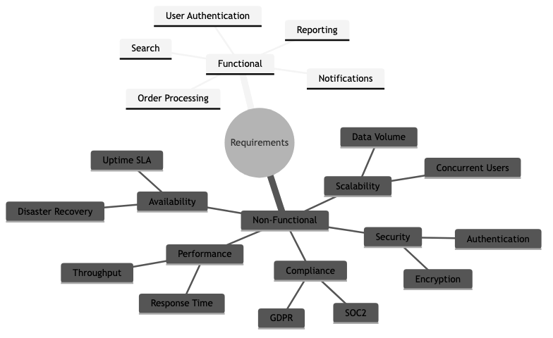

# 05 - Requirements Engineering

## Diagrams




## Concepts

### What is Requirements Engineering?

Requirements engineering is the process of discovering, documenting, validating, and managing what a software system should do. It bridges the gap between business needs and technical implementation.

Building software without clear requirements is like constructing a building without blueprints — you might finish something, but it probably won't be what the client wanted.

> "The hardest single part of building a software system is deciding precisely what to build." — Fred Brooks, *No Silver Bullet* (1986)

### Functional vs Non-Functional Requirements

**Functional requirements** describe *what* the system does — its features, behaviors, and interactions.

Examples:
- "Users can log in with email and password"
- "The system sends a confirmation email after order placement"
- "Admins can export transaction reports as CSV"

**Non-functional requirements (NFRs)** describe *how well* the system performs — its quality attributes.

| Category | Example | Why it matters |
|----------|---------|----------------|
| **Performance** | "Page load time < 2 seconds at 95th percentile" | Users abandon slow pages |
| **Scalability** | "Handle 10,000 concurrent users" | Growth without re-architecture |
| **Availability** | "99.9% uptime (8.7 hours downtime/year)" | Revenue loss during outages |
| **Security** | "All data encrypted at rest and in transit" | Compliance, trust |
| **Maintainability** | "New payment method added in < 1 sprint" | Speed of future development |
| **Accessibility** | "WCAG 2.1 AA compliant" | Legal requirements, broader user base |
| **Compliance** | "GDPR-compliant data handling" | Legal obligation |

**The mistake most teams make:** Focusing only on functional requirements and treating NFRs as afterthoughts. You can't bolt on "handles 10x traffic" after the architecture is set. NFRs shape architecture decisions from day one.

### User Stories

A user story captures a requirement from the perspective of the person who needs it.

**Format:**
```
As a [type of user],
I want [some goal],
so that [some reason].
```

**Examples:**

```
As a customer,
I want to save items to a wishlist,
so that I can purchase them later without searching again.

As a warehouse manager,
I want to receive low-stock alerts,
so that I can reorder before items run out.

As a security auditor,
I want to view a log of all admin actions,
so that I can investigate suspicious activity.
```

The "so that" clause is the most important part — it forces you to articulate *why* this feature matters. Without it, teams build features nobody needs.

**INVEST criteria for good user stories:**

| Letter | Meaning | Description |
|--------|---------|-------------|
| **I** | Independent | Can be developed without depending on other stories |
| **N** | Negotiable | Details can be discussed, not rigid contracts |
| **V** | Valuable | Delivers value to the user or business |
| **E** | Estimable | Small and clear enough to estimate effort |
| **S** | Small | Fits within a single sprint |
| **T** | Testable | You can define when it's "done" |

### Use Cases

A use case describes a complete interaction between a user (actor) and the system to achieve a goal. More detailed than user stories — useful for complex workflows.

**Example: "Place an Order"**

```
Use Case: Place an Order
Actor: Customer
Precondition: Customer is logged in, cart is not empty

Main Flow:
1. Customer navigates to cart
2. System displays cart items with prices and total
3. Customer clicks "Checkout"
4. System prompts for shipping address
5. Customer enters/selects shipping address
6. System calculates shipping cost and displays updated total
7. Customer selects payment method
8. System processes payment
9. System creates order and displays confirmation
10. System sends confirmation email

Alternative Flows:
- 8a. Payment fails → System displays error, customer retries or selects another method
- 4a. Customer is not logged in → System redirects to login, then returns to checkout

Postcondition: Order is created, payment is captured, confirmation email sent
```

### Acceptance Criteria

Acceptance criteria define the conditions that must be met for a user story to be considered "done." They remove ambiguity and give QA engineers concrete test cases.

**Format (Given-When-Then):**

```
Given [some precondition],
When [some action is performed],
Then [some expected result].
```

**Example for "User Login":**

```
Given a registered user with valid credentials,
When they enter their email and password and click "Login",
Then they are redirected to the dashboard and see a welcome message.

Given a user with an incorrect password,
When they attempt to login,
Then they see "Invalid email or password" and remain on the login page.

Given a user who has failed login 5 times,
When they attempt to login again,
Then their account is locked for 15 minutes and they see a lockout message.
```

**Why this matters:** Without acceptance criteria, "done" is subjective. The developer thinks it's done, the PM thinks it's not, the QA engineer doesn't know what to test. Acceptance criteria align everyone.

### Requirements Traceability

Requirements traceability tracks each requirement from its origin (business need) through design, implementation, testing, and deployment. It answers: "Why does this code exist?" and "Is every requirement implemented and tested?"

**Traceability matrix (simplified):**

| Requirement ID | Description | Design Doc | Code Module | Test Case | Status |
|----------------|-------------|------------|-------------|-----------|--------|
| REQ-001 | User login | DD-003 | auth/login.rs | TC-012, TC-013 | Done |
| REQ-002 | Password reset | DD-003 | auth/reset.rs | TC-014 | In Progress |
| REQ-003 | Export CSV | DD-007 | reports/export.rs | TC-021 | Not Started |

**Who needs this:** Regulated industries (healthcare, finance, aviation) require traceability for compliance. Most startups don't need a formal matrix, but should still be able to answer "why does this feature exist?"

### Requirements Change Management

Requirements *will* change. The question is how you handle it.

**Without change management:**
- Features creep in through casual conversations
- Scope grows silently ("oh, and can you also add...")
- Deadlines slip because nobody tracked the additions
- The team builds different things than stakeholders expect

**With change management:**
1. **All changes go through a process** — even if it's just a Slack message to the PM
2. **Impact assessment** — How much effort? What does it delay? What does it depend on?
3. **Explicit prioritization** — Is this more important than what's currently planned?
4. **Documented decision** — "We added X and deprioritized Y because [reason]"

### Prototyping & Wireframing

Prototyping validates requirements *before* writing code. It's cheaper to change a wireframe than to refactor a shipped feature.

**Levels of fidelity:**

| Level | Tool | Purpose | When to use |
|-------|------|---------|-------------|
| **Sketch** | Pen and paper, whiteboard | Explore ideas quickly | Very early, brainstorming |
| **Low-fi wireframe** | Balsamiq, Excalidraw | Layout and flow, no visual design | Validating structure with stakeholders |
| **High-fi mockup** | Figma, Sketch | Pixel-perfect visual design | Before implementation, with real content |
| **Interactive prototype** | Figma prototype, HTML/CSS | Clickable, simulates real interactions | User testing, complex flows |

**The prototype trap:** Don't build a prototype so polished that stakeholders think it's the real product. Set expectations: "This is a mockup. It doesn't work yet."

### Specification Documents

**SRS (Software Requirements Specification):**
A formal document describing the complete requirements for a system. Common in government contracts, regulated industries, and large enterprise projects.

Typical sections: Introduction, Overall Description, Functional Requirements, Non-Functional Requirements, Interface Requirements, Constraints, Appendices.

**PRD (Product Requirements Document):**
A more modern, product-focused version of the SRS. Used in product companies (startups, tech companies). Less formal, more focused on user problems and business outcomes.

Typical sections: Problem Statement, User Personas, User Stories, Success Metrics, Scope (in/out), Technical Constraints, Timeline.

**The trend:** Industry has moved from heavyweight SRS documents to lightweight PRDs + user stories + acceptance criteria. The goal is the same — shared understanding — but the format is leaner and more iterative.

## Business Value

- **Reduced rework**: The cost of fixing a requirements error found in production is 50-200x the cost of catching it during requirements gathering (IBM Systems Sciences Institute study). Clear requirements catch misunderstandings *before* code is written.
- **Scope control**: Requirements engineering provides a baseline against which scope changes can be evaluated. Without it, scope creep is invisible until the deadline passes.
- **Faster development**: Engineers who understand *why* a feature exists make better implementation decisions without constant back-and-forth with PMs.
- **Stakeholder alignment**: Written requirements force stakeholders to agree on what they want *before* development starts. Verbal agreements are forgotten and reinterpreted.
- **Accurate estimation**: You can't estimate what you don't understand. Clear requirements enable realistic timelines, which enable business planning.

## Real-World Examples

### Amazon's "Working Backwards" Process
Before building anything, Amazon teams write a mock press release and a FAQ document. The press release forces clarity about the customer, the problem, and why the solution matters. The FAQ addresses tough questions from both customers and internal stakeholders. Only after these documents are reviewed and approved does engineering begin. This is requirements engineering disguised as product strategy.

### Healthcare.gov's Missing Requirements
The Healthcare.gov launch failure was partly a requirements failure. The system needed to verify income, citizenship, and eligibility across multiple federal and state databases — but these integration requirements weren't fully understood until development was well underway. Requirements gathering across 55 contractors with no unified process led to conflicting assumptions, missed edge cases, and a system that couldn't handle real-world scenarios.

### Spotify's "Think It, Build It, Ship It, Tweak It"
Spotify uses lightweight requirements processes. Squads start with a brief (problem statement + constraints + success metrics), build a thin slice, ship it to a percentage of users, measure results, and iterate. Requirements emerge through experimentation rather than upfront specification. This works because they have fast deployment cycles, feature flags, and robust A/B testing — they can afford to learn requirements through production data.

### Boeing 737 MAX — When Requirements Go Wrong
The Boeing 737 MAX crashes (2018-2019) involved requirements failures at multiple levels. The MCAS (Maneuvering Characteristics Augmentation System) had requirements that depended on a single sensor (single point of failure), didn't adequately account for sensor failure scenarios, and the pilot training requirements didn't cover MCAS behavior. This tragic example shows that in safety-critical systems, requirements engineering is literally life-or-death.

## Common Mistakes & Pitfalls

- **Building what stakeholders ask for, not what they need** — Stakeholders describe solutions ("add a dropdown"), not problems ("I need to filter by region"). Your job is to understand the underlying need and find the best solution.

- **Analysis paralysis** — Spending months perfecting requirements before writing any code. In practice, you'll discover new requirements once users interact with the software. Balance upfront analysis with iterative discovery.

- **Missing non-functional requirements** — "It should be fast" is not a requirement. "95th percentile response time < 200ms under 1,000 concurrent users" is a requirement. Vague NFRs lead to architecture mismatches.

- **Assuming shared understanding** — "Everyone knows what 'search' means." Does it mean full-text search? Fuzzy matching? Filters? Faceted search? Spell correction? Write it down.

- **Gold plating** — Engineers adding features not in the requirements because "users will want this." Maybe they will, maybe they won't. Build what's needed, then iterate.

- **Ignoring edge cases** — Requirements that only describe the happy path. What happens when payment fails? When the user has no internet? When the database is down? Edge cases are where bugs live.

## Trade-offs

| Approach | Pros | Cons |
|----------|------|------|
| **Heavyweight SRS** | Complete, unambiguous, auditable | Slow to produce, expensive, often stale before implementation starts |
| **Lightweight PRD + stories** | Fast, iterative, easy to update | May miss edge cases, requires ongoing conversation |
| **No written requirements** | Maximum speed, no documentation overhead | Misunderstandings, scope creep, rework |
| **Upfront requirements** | Shared understanding, better estimates | Requirements change, may do unnecessary work |
| **Emergent requirements (iterate)** | Adapts to real user needs, fast learning | Requires fast deployment, metrics, and discipline |

## When to Use / When Not to Use

**Invest heavily in requirements engineering when:**
- Building for regulated industries (healthcare, finance, aviation)
- Large teams (10+ engineers) where misalignment is expensive
- Fixed-bid contracts where scope must be explicit
- Safety-critical systems where errors have severe consequences
- Integration projects with multiple external systems

**Keep requirements lightweight when:**
- Small teams (2-5) with direct access to stakeholders
- Building consumer products where user research drives discovery
- Early-stage startups validating product-market fit
- Internal tools where the team is also the user

**Always have (at minimum):**
- A clear problem statement
- Success criteria (how do you know it works?)
- Non-functional requirements (even rough ones)

## Key Takeaways

1. Requirements engineering answers "what should we build and why?" — the most expensive question to get wrong.
2. Non-functional requirements (performance, security, scalability) shape architecture. Address them early, not as afterthoughts.
3. User stories with acceptance criteria (Given-When-Then) provide the right level of detail for most teams.
4. Requirements will change. Have a process for managing changes — even a lightweight one.
5. Prototyping is the cheapest way to validate requirements. A wireframe costs hours; a wrong feature costs months.
6. Match your requirements process to your context. Regulated industries need formal specs. Startups need clear problem statements and fast iteration.

## Further Reading

- **Books:**
  - *Software Requirements* — Karl Wiegers & Joy Beatty (3rd edition, 2013) — The definitive guide to requirements engineering
  - *User Story Mapping* — Jeff Patton (2014) — Organizing user stories into a coherent product vision
  - *Inspired* — Marty Cagan (2017) — Product discovery and requirements from a product management perspective

- **Papers & Articles:**
  - [INVEST in Good Stories](https://xp123.com/articles/invest-in-good-stories-and-smart-tasks/) — Bill Wake's original article on the INVEST criteria
  - [Working Backwards (Amazon)](https://www.aboutamazon.com/news/workplace/working-backwards) — Amazon's press-release-driven development
  - [The Standish Group CHAOS Report](https://www.standishgroup.com/) — Data on project success/failure rates and the impact of requirements

- **Tools:**
  - [Figma](https://www.figma.com/) — Collaborative design and prototyping
  - [Excalidraw](https://excalidraw.com/) — Quick, sketch-style wireframes
  - [Cucumber](https://cucumber.io/) — BDD tool that turns Given-When-Then into executable specs
