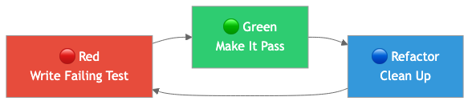
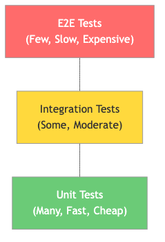

# 06 - Unit & Integration Testing

This topic covers the full spectrum of testing in software engineering, from isolated unit tests through integration tests that verify real system behavior. All examples use Rust.

## Contents

1. [Unit Testing Fundamentals](01-unit-testing-fundamentals.md) — What makes a good unit test, the AAA pattern, test naming, Rust testing mechanics, assert macros, `#[should_panic]`.
2. [Test-Driven Development](02-test-driven-development.md) — The Red-Green-Refactor cycle, step-by-step TDD in Rust, when TDD works well and when it is awkward, anti-patterns.
3. [Property-Based Testing](03-property-based-testing.md) — Properties vs. examples, `proptest` in Rust, custom strategies, shrinking, real bugs found by property tests.
4. [Mocking and Test Doubles](04-mocking-and-test-doubles.md) — Stubs, mocks, fakes, spies. Trait-based dependency injection in Rust, the `mockall` crate, when to mock vs. use real implementations.
5. [Integration Testing](05-integration-testing.md) — Testing with real databases (`sqlx` test fixtures), API endpoint testing, test containers, test isolation strategies.
6. [Code Coverage and Metrics](06-code-coverage-and-metrics.md) — Line vs. branch vs. function coverage, the coverage trap, useful targets (70-80%), `cargo-tarpaulin`, `nextest`.

## Diagrams

