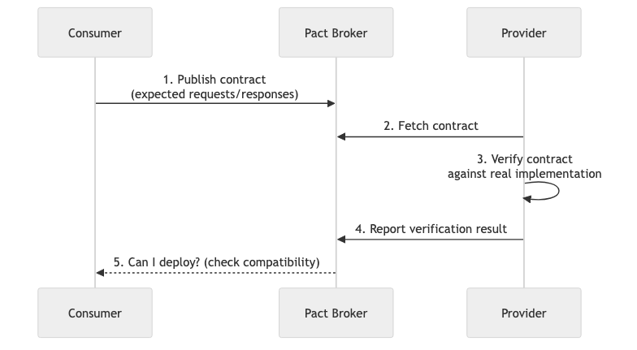
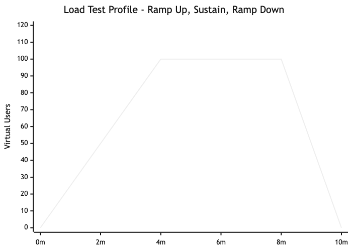

# 07 - End-to-End & Performance Testing

## Diagrams






## Concepts

### End-to-End (E2E) Testing

E2E tests simulate real user behavior from start to finish. They interact with the system the same way a user would — clicking buttons, filling forms, navigating pages — and verify that the entire stack works together.

**What E2E tests cover that unit and integration tests don't:**
- Full request lifecycle (browser → frontend → API → database → response)
- Cross-service interactions in a microservice architecture
- UI rendering and user interaction flows
- Authentication and authorization flows end-to-end
- Third-party integration behavior

**Example flow:** "A user signs up, receives a confirmation email, clicks the link, logs in, adds an item to cart, and completes checkout."

### E2E Testing Strategies

**Critical path testing:** Only write E2E tests for flows that directly generate revenue or are essential for the business. For an e-commerce site: sign up, search, add to cart, checkout, and payment. Everything else gets tested at lower levels.

**The 80/20 rule for E2E:** 80% of user value flows through 20% of the features. Test those 20% end-to-end. Test the remaining 80% with unit and integration tests.

**Test environment management:**
E2E tests need a complete, running system. This introduces complexity:

| Approach | Pros | Cons |
|----------|------|------|
| **Dedicated test environment** | Stable, mirrors production | Expensive, drifts from production config |
| **Docker Compose** | Reproducible, runs locally | Doesn't match production scale/infra |
| **Ephemeral environments** | Fresh per PR, no state pollution | Slow to spin up, expensive at scale |
| **Production (canary)** | Tests real environment | Risk of affecting real users |

### Contract Testing

Contract testing verifies that two services (a consumer and a provider) agree on the shape of their communication — without testing the full E2E flow.

**The problem contract testing solves:**
Service A calls Service B's API. Service B changes a field name. Service B's tests pass (its code is correct). Service A's tests pass (it's mocking Service B). Production breaks because the contract between them was violated.

**How it works (Pact-style):**

1. **Consumer side:** The consumer defines what it expects from the provider (the "contract")
2. **Provider side:** The provider verifies it can fulfill the contract
3. **Broker:** A central service stores contracts and tracks compatibility

```
Consumer generates contract → Broker stores it → Provider verifies against it
```

**Example contract:**
```json
{
  "consumer": "OrderService",
  "provider": "UserService",
  "interactions": [
    {
      "description": "get user by ID",
      "request": {
        "method": "GET",
        "path": "/users/123"
      },
      "response": {
        "status": 200,
        "body": {
          "id": 123,
          "email": "alice@example.com",
          "name": "Alice"
        }
      }
    }
  ]
}
```

If UserService removes the `name` field, contract verification fails before deployment — preventing a production incident.

### Mutation Testing

Mutation testing measures the *quality* of your tests, not just coverage. It introduces small changes (mutations) to your code and checks if your tests catch them.

**How it works:**
1. Take your passing test suite
2. Introduce a mutation (e.g., change `>` to `>=`, replace `+` with `-`, remove a function call)
3. Run the tests
4. If tests still pass → the mutation "survived" → your tests missed a potential bug
5. Repeat with hundreds of mutations

**Example mutations:**

| Original code | Mutation | What it tests |
|--------------|----------|---------------|
| `if age >= 18` | `if age > 18` | Does a test check the boundary (age = 18)? |
| `total + tax` | `total - tax` | Does a test verify the calculation result? |
| `send_email(user)` | *(delete the line)* | Does a test verify the email is sent? |
| `return Ok(result)` | `return Err(error)` | Does a test check the success path? |

**Mutation score** = killed mutations / total mutations. A score of 90%+ means your tests are thorough.

### Fuzz Testing

Fuzz testing (fuzzing) feeds random, unexpected, or malformed input to your program to find crashes, panics, and security vulnerabilities that you'd never think to test for.

**Why it matters:**
- Finds edge cases that human testers miss
- Discovers buffer overflows, parsing errors, and panic-inducing inputs
- Especially valuable for parsers, deserializers, network protocols, and any code that handles untrusted input

**Example with `cargo-fuzz` in Rust:**

```rust
// fuzz/fuzz_targets/parse_config.rs
#![no_main]
use libfuzzer_sys::fuzz_target;

fuzz_target!(|data: &[u8]| {
    if let Ok(input) = std::str::from_utf8(data) {
        // If this panics on any input, the fuzzer will report it
        let _ = my_crate::parse_config(input);
    }
});
```

```bash
cargo fuzz run parse_config
```

The fuzzer generates millions of random inputs and reports any that cause crashes or panics. It uses coverage-guided fuzzing — it tracks which code paths each input exercises and generates new inputs that explore unexplored paths.

### Performance Testing Types

| Type | Purpose | Duration | Load Pattern |
|------|---------|----------|--------------|
| **Load test** | Verify system handles expected load | 10-60 minutes | Normal expected traffic |
| **Stress test** | Find the breaking point | 30-60 minutes | Gradually increasing beyond capacity |
| **Soak test** | Find memory leaks and degradation | 4-24 hours | Sustained normal load over extended time |
| **Spike test** | Verify handling of sudden traffic surges | 10-30 minutes | Sudden burst, then back to normal |
| **Capacity test** | Determine maximum throughput | Variable | Increase until SLAs are violated |

### Load Testing

Load testing simulates real-world traffic to verify the system meets performance requirements under expected conditions.

**What to measure:**
- **Response time** — p50, p95, p99 (not averages — averages hide outliers)
- **Throughput** — Requests per second the system can handle
- **Error rate** — What percentage of requests fail under load
- **Resource utilization** — CPU, memory, disk I/O, network during the test

**Why percentiles matter:**

```
Average response time: 200ms   ← Looks great!
p50 (median):         150ms   ← Half of users see this
p95:                  800ms   ← 5% of users wait this long
p99:                  3,200ms ← 1% of users wait 3+ seconds
```

If you have 1 million daily users, p99 = 3.2 seconds means 10,000 users per day have a terrible experience. Averages hide this completely.

**Example with k6 (JavaScript-based load testing tool):**

```javascript
import http from 'k6/http';
import { check, sleep } from 'k6';

export const options = {
  stages: [
    { duration: '2m', target: 100 },  // Ramp up to 100 users
    { duration: '5m', target: 100 },  // Stay at 100 users
    { duration: '2m', target: 0 },    // Ramp down
  ],
  thresholds: {
    http_req_duration: ['p(95)<500'],  // 95% of requests < 500ms
    http_req_failed: ['rate<0.01'],    // Less than 1% failure rate
  },
};

export default function () {
  const res = http.get('https://api.example.com/products');
  check(res, {
    'status is 200': (r) => r.status === 200,
    'response time < 500ms': (r) => r.timings.duration < 500,
  });
  sleep(1);
}
```

### Stress Testing

Stress testing pushes the system beyond its limits to find where it breaks and *how* it breaks.

**What you want to learn:**
- At what load does the system start degrading?
- Does it degrade gracefully (slower responses) or catastrophically (crashes, data loss)?
- Does it recover automatically when load decreases?
- Which component is the bottleneck (database, API server, cache, network)?

**Graceful degradation vs cascading failure:**

```
Graceful: Load increases → Response times increase → Some requests timeout → System stays up
Cascade:  Load increases → Service A slows → Service B retries → Service A overwhelmed → Both crash
```

### Soak Testing

Soak tests (endurance tests) run at normal load for hours or days to find issues that only appear over time:

- **Memory leaks** — Memory usage slowly climbs until the process is killed
- **Connection pool exhaustion** — Connections aren't properly released
- **File descriptor leaks** — Handles accumulate until the OS limit is hit
- **Database connection drift** — Connections go stale and error
- **Log file growth** — Logs fill the disk

### Test Environment Management

E2E and performance tests need environments that are:

**Isolated** — Tests shouldn't affect other tests or real users
**Reproducible** — Same setup every time
**Representative** — Close enough to production to be meaningful
**Disposable** — Easy to create and destroy

**Common patterns:**

- **Per-PR environments**: Spin up a complete environment for each pull request using Docker or Kubernetes. Tests run against it, then it's destroyed.
- **Shared staging environment**: A long-lived environment that mirrors production. Risk: tests pollute shared state.
- **Production with feature flags**: Run tests against real production infrastructure but behind feature flags that prevent user impact.

## Business Value

- **Revenue protection**: E2E tests on critical paths (checkout, payment, sign-up) prevent bugs that directly block revenue. A broken checkout page during Black Friday can cost millions per hour.
- **Performance SLA compliance**: Load testing proves your system meets contractual SLAs before launch, not after customers complain.
- **Capacity planning**: Stress tests reveal your system's ceiling, enabling infrastructure decisions before traffic spikes (product launches, marketing campaigns, seasonal peaks).
- **Cost avoidance**: Finding memory leaks in soak tests prevents production crashes. A production memory leak at Slack once caused hours of degraded service — soak testing would have caught it in staging.
- **Contract testing ROI**: At Atlassian, adopting contract testing reduced integration failures by 80% and saved weeks of debugging time per quarter.

## Real-World Examples

### How Amazon Tests for Prime Day
Amazon runs "GameDay" exercises — simulated Prime Day-level traffic against their systems weeks before the actual event. They load test at 2-3x expected peak traffic to ensure headroom. They also inject failures (kill services, overwhelm databases) during these tests to verify resilience. This preparation is why Prime Day handles hundreds of millions of transactions without major outages.

### Netflix's Chaos Engineering
Netflix pioneered chaos engineering with Chaos Monkey — a tool that randomly kills production instances during business hours. Their philosophy: if the system can't handle a random instance failure, it's not resilient enough. Beyond Chaos Monkey, they run "Chaos Kong" (simulates an entire AWS region going down) and "FIT" (Failure Injection Testing) for controlled experiments. This builds confidence that their system handles real failures gracefully.

### Pact Contract Testing at Atlassian
Atlassian adopted Pact (a contract testing tool) across their microservice ecosystem. Before contract testing, a breaking API change in one service could cascade across dozens of dependent services, causing production incidents that took days to diagnose. With Pact, breaking changes are caught in CI before deployment. They report that contract testing paid for itself within the first quarter through reduced incident costs.

### Twitter's Fail Whale Era
In its early years, Twitter experienced frequent outages under load — the infamous "Fail Whale" error page. The root cause: insufficient load testing. They hadn't stress tested at the scale of real-world events (Super Bowl tweets, celebrity announcements). After investing heavily in load testing infrastructure and performance engineering, they evolved to handle 150,000+ tweets per second during peak events without issues.

## Common Mistakes & Pitfalls

- **Too many E2E tests** — E2E tests are slow, expensive, and fragile. If your test suite is 80% E2E, you have an inverted pyramid. Push tests down to unit and integration levels where possible.

- **Flaky E2E tests** — Tests that fail randomly due to timing, animation delays, or shared state. A flaky test that fails 5% of the time will fail in every CI run. Fix the flakiness or delete the test.

- **Load testing in unrealistic environments** — Testing against a single-node staging server and extrapolating to a 10-node production cluster. Your bottlenecks will be completely different.

- **Testing average response time** — Averages hide tail latency. Always measure and set thresholds on p95 and p99 percentiles.

- **Not testing failure modes** — Load testing only the happy path. What happens when the database is slow? When a downstream service returns errors? Test degraded scenarios too.

- **Performance testing only before launch** — Performance is not a one-time check. Run performance tests in CI on every merge to catch regressions early.

- **Ignoring soak test results** — Running a soak test, seeing "everything looks fine," and not analyzing memory, CPU, and connection trends over time. The issue might be a slow leak that takes hours to manifest.

## Trade-offs

| Approach | Pros | Cons |
|----------|------|------|
| **E2E tests for everything** | High confidence in real behavior | Slow, flaky, expensive, hard to maintain |
| **E2E only for critical paths** | Fast suite, focused on what matters | Less coverage of secondary flows |
| **Contract testing** | Fast, catches integration breaks early | Doesn't test full behavior, only shape |
| **Load testing in staging** | Safe, no user impact | May not reflect production behavior |
| **Load testing in production** | Most realistic results | Risk of affecting real users |
| **Chaos engineering** | Finds real resilience gaps | Requires mature monitoring and incident response |

## When to Use / When Not to Use

**E2E tests — use for:**
- Revenue-critical flows (checkout, payment, sign-up)
- Flows involving multiple services or third-party integrations
- Regulatory requirements that mandate full-flow verification

**E2E tests — avoid for:**
- Testing business logic (use unit tests)
- Testing individual API endpoints (use integration tests)
- Anything that changes frequently (UI layouts, copy)

**Contract testing — use for:**
- Microservice architectures with many service-to-service calls
- Teams that deploy independently
- APIs consumed by external partners

**Performance testing — use for:**
- Any system with defined SLAs
- Before major launches or expected traffic increases
- After significant architecture changes
- Regularly in CI to catch regressions

**Fuzz testing — use for:**
- Parsers, deserializers, protocol handlers
- Any code processing untrusted input
- Security-sensitive code

## Key Takeaways

1. E2E tests are expensive. Reserve them for critical business flows — the 20% of features that drive 80% of value.
2. Contract testing prevents integration failures faster and cheaper than E2E tests. Essential for microservices.
3. Mutation testing tells you if your tests are actually catching bugs, not just covering lines.
4. Fuzz testing finds bugs you'd never think to test for. Use it for anything handling untrusted input.
5. Always measure p95 and p99 latency, never just averages. Averages lie.
6. Performance is a feature. Test it continuously, not just before launch.
7. Test *how* the system fails, not just whether it works. Graceful degradation is a design goal.

## Further Reading

- **Books:**
  - *Release It!* — Michael T. Nygard (2nd edition, 2018) — Design patterns for resilient systems, including testing strategies
  - *Chaos Engineering* — Casey Rosenthal & Nora Jones (2020) — Principles and practices of chaos engineering

- **Papers & Articles:**
  - [The Practical Test Pyramid](https://martinfowler.com/articles/practical-test-pyramid.html) — Full guide including E2E and contract testing
  - [Consumer-Driven Contracts](https://martinfowler.com/articles/consumerDrivenContracts.html) — Martin Fowler on contract testing
  - [Principles of Chaos Engineering](https://principlesofchaos.org/) — The founding document of chaos engineering

- **Tools:**
  - [k6](https://k6.io/) — Modern load testing tool (JavaScript scripts)
  - [Pact](https://pact.io/) — Contract testing framework
  - [cargo-fuzz](https://github.com/rust-fuzz/cargo-fuzz) — Fuzz testing for Rust
  - [cargo-mutants](https://github.com/sourcefrog/cargo-mutants) — Mutation testing for Rust
  - [Chaos Monkey](https://netflix.github.io/chaosmonkey/) — Netflix's chaos engineering tool
