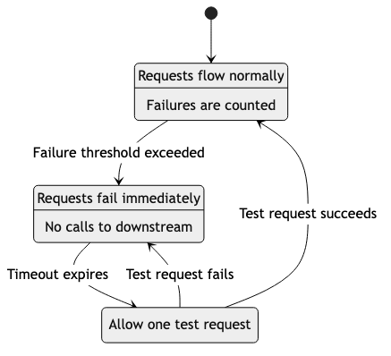
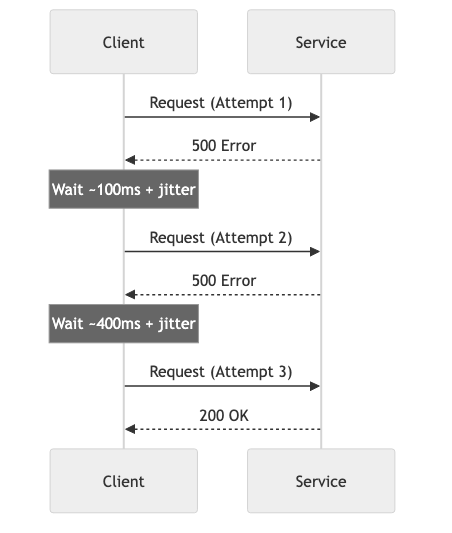

# Error Handling, Resilience & Fault Tolerance

## Diagrams






## Concepts

### The Reality of Failure

In production systems, failure is not exceptional — it's normal. Networks drop packets. Disks fill up. Services go down. Databases time out. External APIs return errors. Memory runs out.

The question is not *whether* your system will encounter failures, but *how* it will behave when they occur.

**Two approaches:**
- **Fragile systems**: Assume everything works. When something fails, the entire system crashes or returns garbage.
- **Resilient systems**: Assume things will fail. Design for it. Degrade gracefully. Recover automatically.

### Error Handling in Rust

Rust's type system forces you to handle errors at compile time. You can't ignore errors — the compiler won't let you.

**`Result<T, E>` — Recoverable errors:**

```text
FUNCTION READ_CONFIG(path: string) -> Config or ConfigError
    content <- READ_FILE_TO_STRING(path)
        ON ERROR: RETURN ConfigError::FileNotFound(path, error)

    config <- PARSE_TOML(content) AS Config
        ON ERROR: RETURN ConfigError::ParseError(error)

    IF config.port = 0
        RETURN Err(ConfigError::InvalidPort)

    RETURN Ok(config)
```

**`Option<T>` — Absence of value:**

```text
FUNCTION FIND_USER(users: list of User, email: string) -> optional User
    RETURN FIND user IN users WHERE user.email = email

// Caller must handle the None case
MATCH FIND_USER(users, "alice@example.com")
    CASE Some(user): PRINT "Found: " + user.name
    CASE None: PRINT "User not found"
```

**The `?` operator — Error propagation:**

The `?` operator propagates errors up the call stack. If the expression is `Err`, it returns early. This eliminates nested match statements and keeps the happy path readable.

```text
FUNCTION PROCESS_ORDER(order_id: unsigned integer) -> Receipt or OrderError
    order <- FETCH_ORDER(order_id)?           // Returns early if Err
    payment <- CHARGE_PAYMENT(order)?         // Returns early if Err
    receipt <- GENERATE_RECEIPT(order, payment)?  // Returns early if Err
    SEND_CONFIRMATION_EMAIL(order)?           // Returns early if Err
    RETURN Ok(receipt)
```

### Error Hierarchies & Custom Error Types

**`thiserror` — Defining error types:**

```text
ENUMERATION OrderError
    NotFound(id)
        // "Order {id} not found"
    InsufficientInventory { item_id, requested, available }
        // "Insufficient inventory for item {item_id}: need {requested}, have {available}"
    PaymentFailed(PaymentError)
        // "Payment failed: {error}"
    Database(SqlError)
        // "Database error: {error}"

ENUMERATION PaymentError
    CardDeclined { reason: string }
        // "Card declined: {reason}"
    GatewayTimeout
        // "Payment gateway timeout"
    InvalidAmount(amount: float)
        // "Invalid amount: {amount}"
```

**`anyhow` — For application code:**

`anyhow` is for application-level code where you don't need callers to match on specific error variants — you just need to propagate errors with context.

```text
FUNCTION LOAD_AND_PROCESS() -> void or Error
    config <- READ_CONFIG("config.toml")
        ON ERROR: add context "Failed to load configuration"

    db <- CONNECT_TO_DATABASE(config.database_url)
        ON ERROR: add context "Failed to connect to database"

    PROCESS_PENDING_ORDERS(db)
        ON ERROR: add context "Failed to process pending orders"

    RETURN Ok
```

**When to use which:**
- **`thiserror`** — Libraries, APIs, code where callers need to match on error variants
- **`anyhow`** — Application code, CLI tools, where you just need errors to bubble up with context

### Retry Strategies

Transient failures (network blips, temporary overload) often resolve themselves. Retrying is appropriate when:
- The failure is likely temporary
- The operation is idempotent (safe to retry)
- You won't make things worse by retrying

**Exponential backoff with jitter:**

```
Attempt 1: wait 0ms (immediate)
Attempt 2: wait ~100ms  (base * 2^1 + random jitter)
Attempt 3: wait ~400ms  (base * 2^2 + random jitter)
Attempt 4: wait ~1600ms (base * 2^3 + random jitter)
Attempt 5: give up
```

**Why jitter matters:** Without jitter, if 1,000 clients all start retrying at the same time (after a service recovers), they'll all retry at the same intervals, creating periodic "thundering herd" spikes. Jitter randomizes the retry timing, spreading the load.

```text
ASYNC FUNCTION RETRY_WITH_BACKOFF(operation, max_retries, base_delay) -> T or Error
    rng <- NEW random number generator

    FOR attempt FROM 0 TO max_retries - 1
        MATCH operation()
            CASE Ok(result): RETURN Ok(result)
            CASE Err(e) IF attempt = max_retries - 1: RETURN Err(e)
            CASE Err(_):
                delay <- base_delay * 2^attempt
                jitter <- RANDOM duration between 0 and 100ms
                SLEEP(delay + jitter)
```

**When NOT to retry:**
- The error is permanent (404, 401, validation error)
- The operation is not idempotent (double-charging a payment)
- You're already in a retry loop (retrying retries = exponential request amplification)

### Circuit Breakers

A circuit breaker prevents a failing service from being called repeatedly, giving it time to recover.

**States:**

```
         success threshold met
  ┌──────────────────────────────┐
  ↓                              │
CLOSED ──(failures exceed)──→ OPEN ──(timeout)──→ HALF-OPEN
  ↑                                                   │
  └──────────────(success)────────────────────────────┘
                                                      │
                                  OPEN ←──(failure)───┘
```

- **Closed**: Requests flow normally. Failures are counted.
- **Open**: Requests are immediately rejected (fail fast). No calls to the failing service.
- **Half-Open**: After a timeout, allow one test request through. If it succeeds, close the circuit. If it fails, open again.

**Why it matters:** Without a circuit breaker, a slow downstream service causes your service to accumulate waiting threads/connections, eventually overwhelming your own system. The circuit breaker "fails fast" — returning an error immediately instead of waiting 30 seconds for a timeout.

### Bulkheads

Named after ship bulkheads that prevent a leak in one compartment from sinking the entire ship.

In software, bulkheads isolate components so that failure in one doesn't cascade to others:

- **Separate thread pools**: Database queries use one pool, external API calls use another. If the API is slow, database queries aren't affected.
- **Separate connection pools**: Each downstream service gets its own connection pool.
- **Process isolation**: Critical services run in separate processes/containers.

```
Without bulkhead:
[All requests] → [Shared thread pool] → Service A (slow!)
                                       → Service B (starved!)
                                       → Service C (starved!)

With bulkhead:
[Requests for A] → [Pool A: 10 threads] → Service A (slow, but contained)
[Requests for B] → [Pool B: 10 threads] → Service B (working fine)
[Requests for C] → [Pool C: 10 threads] → Service C (working fine)
```

### Timeouts

Every external call must have a timeout. Without timeouts, a hung service can cause your entire system to hang as threads/connections wait indefinitely.

**Types of timeouts:**

| Type | Purpose | Example |
|------|---------|---------|
| **Connection timeout** | How long to wait to establish a connection | 1-5 seconds |
| **Read timeout** | How long to wait for a response after connecting | 5-30 seconds |
| **Total timeout** | Maximum time for the entire operation including retries | 30-60 seconds |
| **Idle timeout** | How long to keep an unused connection alive | 60-300 seconds |

**The cascade problem:**

```
User request timeout: 30s
  → API Gateway timeout: 25s
    → Service A timeout: 20s
      → Service B timeout: 15s
        → Database timeout: 10s
```

Each layer should have a shorter timeout than its caller. If Service B's timeout is *longer* than Service A's, Service A will give up while Service B is still working — wasting resources.

### Graceful Degradation

When a component fails, the system continues working with reduced functionality instead of completely failing.

**Examples:**
- **Recommendation engine down** → Show popular items instead of personalized recommendations
- **Search index unavailable** → Fall back to database queries (slower but works)
- **Payment processor timeout** → Queue the order for retry, tell the user "we'll confirm shortly"
- **Profile image service down** → Show a default avatar instead of an error

**Feature flags enable graceful degradation:** You can pre-build fallback behaviors and activate them instantly when a service fails, without deploying new code.

### Chaos Engineering

Chaos engineering deliberately introduces failures into production systems to verify resilience.

**Principles:**
1. Define "steady state" — what does normal look like? (latency, error rate, throughput)
2. Hypothesize that steady state will continue during a failure
3. Introduce the failure (kill an instance, inject latency, block network)
4. Observe: did the system maintain steady state?
5. If not: fix the weakness, then re-test

**Types of chaos experiments:**

| Experiment | What it tests |
|-----------|---------------|
| Kill a random instance | Auto-scaling, load balancing |
| Inject network latency | Timeout configuration, circuit breakers |
| Fill a disk | Log rotation, alerting |
| Block DNS | DNS caching, fallback behavior |
| Corrupt a database response | Error handling, data validation |
| Spike CPU on one node | Load balancing, autoscaling |

## Business Value

- **Revenue protection**: Circuit breakers and graceful degradation keep the system generating revenue even when components fail. A fully crashed system earns $0; a degraded system still earns 80-90%.
- **Reduced incident severity**: Resilience patterns (timeouts, retries, bulkheads) prevent cascading failures that turn a minor issue into a total outage.
- **Customer trust**: Systems that degrade gracefully preserve user experience. Users tolerate "recommendations unavailable" better than a 500 error page.
- **Lower on-call burden**: Self-healing systems (retries, circuit breakers, autoscaling) resolve many issues without human intervention, reducing alert fatigue and on-call stress.
- **Compliance**: In regulated industries, error handling and resilience are auditable requirements. Documented failure modes and recovery procedures satisfy auditors.

## Real-World Examples

### Netflix's Resilience Stack
Netflix built an entire suite of resilience tools: Hystrix (circuit breaker — now deprecated in favor of resilience4j patterns), Zuul (API gateway with fault tolerance), and Chaos Monkey. Their philosophy: "Everything fails, all the time." Every service is designed to degrade gracefully when its dependencies fail. When AWS US-EAST-1 had a major outage in 2011, Netflix was one of the few large services to stay up — their resilience architecture routed traffic to other regions automatically.

### Amazon's Retry Storm (2013)
In 2013, Amazon experienced a cascading failure caused by retries. A minor issue in a dependency caused one service to start retrying. The retries overwhelmed the dependency, which caused more failures, which caused more retries — a feedback loop that took down multiple services. Amazon's post-mortem led to company-wide adoption of exponential backoff with jitter, circuit breakers, and request shedding. This incident is why retry strategies with backoff are now industry standard.

### Stripe's Idempotency Keys
Stripe's API uses idempotency keys to make retries safe. When you send a payment request with an idempotency key, Stripe guarantees that the payment is only processed once — even if the request is retried due to a network timeout. This solved a critical problem: is it safe to retry a failed payment request? With idempotency keys, the answer is always yes.

### How Google Handles Cascading Failures
Google's SRE book documents their approach to cascading failures. Key practices: every RPC has a deadline (timeout), services implement load shedding (rejecting requests when overloaded), and critical services have "emergency mode" (serving cached/stale data when backends are unavailable). They run regular "DiRT" (Disaster Recovery Testing) exercises to verify these mechanisms work.

## Common Mistakes & Pitfalls

- **Catching all errors and ignoring them** — `catch_all { /* do nothing */ }` hides bugs. If you catch an error, log it, handle it, or propagate it. Never swallow it silently.

- **Retrying non-idempotent operations** — Retrying a "create order" without idempotency can create duplicate orders. Only retry operations that are safe to repeat.

- **No timeout on external calls** — A single hung service can exhaust all your threads/connections. Every external call needs a timeout. No exceptions.

- **Retry storms** — When every client retries at the same time, the combined load can be 3-5x normal traffic, making a bad situation worse. Always use exponential backoff with jitter.

- **Circuit breaker with wrong thresholds** — Opening too aggressively (one failure opens the circuit) or too slowly (100 failures before opening). Tune based on your service's actual failure patterns.

- **Using panic/unwrap in production** — `unwrap()` in Rust panics on `None/Err`, crashing the thread. Use `?` for error propagation, and reserve `unwrap()` for cases where the value is guaranteed to exist.

- **Not testing failure paths** — Testing only the happy path. If you haven't tested what happens when the database is down, you don't know what happens when the database is down.

## Trade-offs

| Approach | Pros | Cons |
|----------|------|------|
| **Aggressive retries** | Recovers from transient failures automatically | Can amplify load during outages |
| **Circuit breakers** | Prevents cascading failures, fails fast | Added complexity, needs tuning |
| **Graceful degradation** | Users still get partial value during failures | More code to maintain, may mask underlying issues |
| **Chaos engineering** | Proves resilience works in real conditions | Risk of causing actual incidents, requires mature monitoring |
| **Strict error types (thiserror)** | Callers handle each error explicitly | More boilerplate, harder to evolve error types |
| **Dynamic errors (anyhow)** | Flexible, less boilerplate | Callers can't pattern match on error types |

## When to Use / When Not to Use

**Retries — use for:**
- Network calls to external services
- Transient database errors (connection reset, deadlock)
- Message queue publish failures

**Retries — avoid for:**
- Validation errors (will fail every time)
- Authentication errors (retrying won't help)
- Non-idempotent operations without idempotency keys

**Circuit breakers — use for:**
- Calls to external services that may go down
- Database connections during failover
- Any dependency where "fail fast" is better than "wait and timeout"

**Graceful degradation — use for:**
- Non-critical features (recommendations, analytics, personalization)
- Features with reasonable fallbacks (cached data, default values)

**Chaos engineering — use when:**
- You have monitoring and alerting in place
- You have the maturity to handle experiment-induced issues
- You need to verify resilience of critical systems

## Key Takeaways

1. In Rust, `Result` and `Option` force you to handle errors at compile time. Use `thiserror` for libraries, `anyhow` for applications.
2. Every external call needs a timeout. No exceptions. Without timeouts, one hung service can take down your entire system.
3. Retry with exponential backoff and jitter. Never retry without backoff — you'll amplify the problem.
4. Circuit breakers prevent cascading failures by failing fast instead of waiting for timeouts.
5. Design for graceful degradation: partial functionality is better than total failure.
6. Chaos engineering validates your resilience. If you haven't tested a failure scenario, you don't know how your system handles it.
7. Idempotency keys make retries safe. If an operation can't be safely retried, add idempotency.

## Further Reading

- **Books:**
  - *Release It!* — Michael T. Nygard (2nd edition, 2018) — The essential guide to building resilient production systems
  - *Site Reliability Engineering* — Google (2016) — Chapter on handling overload and cascading failures
  - *Chaos Engineering* — Casey Rosenthal & Nora Jones (2020) — Building confidence in system resilience

- **Papers & Articles:**
  - [Exponential Backoff and Jitter](https://aws.amazon.com/blogs/architecture/exponential-backoff-and-jitter/) — AWS Architecture Blog
  - [Circuit Breaker Pattern](https://martinfowler.com/bliki/CircuitBreaker.html) — Martin Fowler's explanation
  - [Google SRE Book — Addressing Cascading Failures](https://sre.google/sre-book/addressing-cascading-failures/) — Google's approach

- **Crates:**
  - [thiserror](https://crates.io/crates/thiserror) — Derive macro for custom error types
  - [anyhow](https://crates.io/crates/anyhow) — Flexible error handling for applications
  - [backon](https://crates.io/crates/backon) — Retry with backoff for Rust
  - [tower](https://crates.io/crates/tower) — Service abstractions with retry, rate limit, timeout middleware
