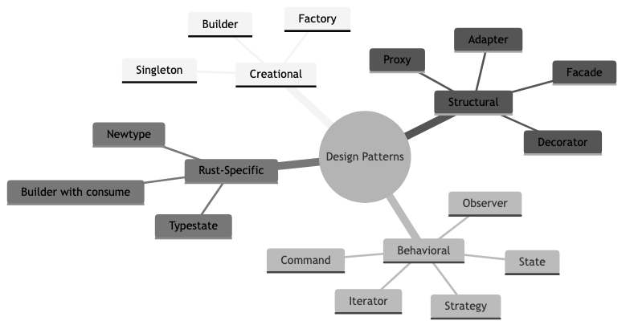
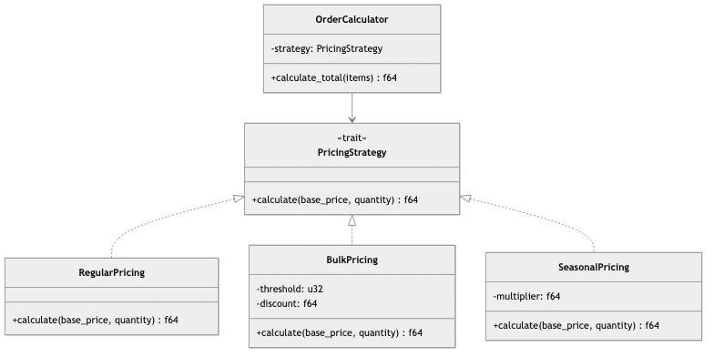

# Design Patterns

## Diagrams






## Concepts

### What are Design Patterns?

Design patterns are reusable solutions to common problems in software design. They're not code you copy-paste — they're templates for solving a category of problem.

The concept was popularized by the "Gang of Four" (GoF) book *Design Patterns: Elements of Reusable Object-Oriented Software* (1994). While the original patterns are OOP-centric, many translate well to other paradigms — including Rust's trait-based system.

**Why patterns matter:** They give teams a shared vocabulary. Saying "use the Builder pattern here" communicates an entire design approach in four words. Without patterns, every design discussion starts from scratch.

**The danger of patterns:** Over-application. Not every problem needs a pattern. Using a pattern where simple code suffices adds unnecessary complexity. Patterns are tools, not goals.

### Creational Patterns

Creational patterns deal with object/struct creation, providing flexibility in *what* gets created, *how*, and *when*.

#### Builder Pattern

**Problem:** A struct has many fields, some optional. Constructors with 10+ parameters are unreadable and error-prone.

**Solution:** A separate builder struct that accumulates configuration and produces the final object.

```text
STRUCTURE HttpRequest
    url: string
    method: string
    headers: list of (string, string)
    body: optional string
    timeout_ms: unsigned integer

STRUCTURE HttpRequestBuilder
    url: string, method: string, headers: list, body: optional string, timeout_ms: unsigned integer

    FUNCTION NEW(url: string) -> HttpRequestBuilder
        RETURN HttpRequestBuilder { url, method: "GET", headers: [], body: None, timeout_ms: 30000 }

    FUNCTION METHOD(self, method: string) -> self
        self.method <- method; RETURN self

    FUNCTION HEADER(self, key: string, value: string) -> self
        APPEND (key, value) TO self.headers; RETURN self

    FUNCTION BODY(self, body: string) -> self
        self.body <- Some(body); RETURN self

    FUNCTION TIMEOUT(self, ms: unsigned integer) -> self
        self.timeout_ms <- ms; RETURN self

    FUNCTION BUILD(self) -> HttpRequest
        RETURN HttpRequest { url, method, headers, body, timeout_ms }

// Usage -- reads like a sentence
request <- HttpRequestBuilder.NEW("https://api.example.com/users")
    .METHOD("POST")
    .HEADER("Content-Type", "application/json")
    .BODY('{"name": "Alice"}')
    .TIMEOUT(5000)
    .BUILD()
```

**Where you see this in the real world:** `reqwest::Client::builder()`, `tokio::runtime::Builder`, `clap::Command::new()`.

#### Factory Pattern

**Problem:** You need to create objects of different types based on runtime conditions, but callers shouldn't know about the concrete types.

**Solution:** A function or trait that returns a trait object based on input.

```text
INTERFACE NotificationSender
    FUNCTION SEND(to: string, message: string) -> void or SendError

STRUCTURE EmailSender   // implements NotificationSender
STRUCTURE SmsSender     // implements NotificationSender
STRUCTURE SlackSender   // implements NotificationSender

FUNCTION CREATE_SENDER(channel: string) -> NotificationSender
    MATCH channel
        CASE "email": RETURN NEW EmailSender()
        CASE "sms": RETURN NEW SmsSender()
        CASE "slack": RETURN NEW SlackSender()
        DEFAULT: ERROR "Unknown channel: " + channel
```

#### Singleton (and Why It's Often an Anti-Pattern)

**Problem:** You need exactly one instance of something (database connection pool, configuration, logger).

**In traditional OOP:** A class with a private constructor and a static `getInstance()` method.

**Why it's problematic:**
- Hidden global state makes testing hard
- Tight coupling — every user depends on the singleton directly
- Concurrency issues (who initializes it? thread safety?)

**In Rust, prefer these alternatives:**
- Pass shared resources explicitly as function parameters
- Use `Arc<T>` for shared ownership across threads
- Use `once_cell::sync::Lazy` or `std::sync::OnceLock` for one-time initialization

```text
GLOBAL CONFIG <- ONE-TIME initialized value

FUNCTION INIT_CONFIG(path: string)
    config <- LOAD_CONFIG(path)
    CONFIG.SET(config)  // Can only be set once

FUNCTION GET_CONFIG() -> Config reference
    RETURN CONFIG.GET()  // Panics if not initialized
```

**Better approach — dependency injection:**
```text
// Instead of accessing a global, pass the config explicitly
FUNCTION START_SERVER(config: Config, pool: PgPool) -> void or ServerError
    // ...
```

### Structural Patterns

Structural patterns deal with composing structs and traits to form larger structures.

#### Adapter Pattern

**Problem:** You have an existing interface, but a component expects a different one. You can't modify either.

**Solution:** A wrapper that translates between the two interfaces.

```text
// External library's interface -- you can't change this
STRUCTURE LegacyPaymentProcessor
    FUNCTION PROCESS_USD_CENTS(amount: unsigned integer, card: string) -> boolean
        // Legacy implementation...
        RETURN true

// Your application's interface
INTERFACE PaymentGateway
    FUNCTION CHARGE(amount_dollars: float, card_number: string) -> void or PaymentError

// Adapter -- bridges the gap
STRUCTURE LegacyPaymentAdapter
    processor: LegacyPaymentProcessor

// Implement PaymentGateway for LegacyPaymentAdapter
    FUNCTION CHARGE(amount_dollars: float, card_number: string) -> void or PaymentError
        cents <- ROUND(amount_dollars * 100.0) AS unsigned integer
        IF self.processor.PROCESS_USD_CENTS(cents, card_number)
            RETURN Ok
        ELSE
            RETURN Err(PaymentError::Declined)
```

**Real-world use:** Wrapping third-party libraries to match your application's interfaces, enabling you to swap implementations without changing callers.

#### Decorator Pattern

**Problem:** You want to add behavior to an object without modifying its code.

**Solution:** A wrapper that implements the same trait, adding behavior before/after delegating to the wrapped object.

```text
INTERFACE Logger
    FUNCTION LOG(message: string)

STRUCTURE ConsoleLogger
    FUNCTION LOG(message: string)
        PRINT message

// Decorator: adds timestamps
STRUCTURE TimestampLogger<L: Logger>
    inner: L

    FUNCTION LOG(message: string)
        now <- CURRENT_TIME formatted as "YYYY-MM-DD HH:MM:SS"
        self.inner.LOG("[" + now + "] " + message)

// Decorator: adds log levels
STRUCTURE LevelLogger<L: Logger>
    inner: L
    level: string

    FUNCTION LOG(message: string)
        self.inner.LOG("[" + self.level + "] " + message)

// Composable -- stack decorators
logger <- TimestampLogger { inner: LevelLogger { inner: ConsoleLogger, level: "INFO" } }
logger.LOG("Server started")
// Output: [2024-03-15 10:30:00] [INFO] Server started
```

#### Facade Pattern

**Problem:** A subsystem has a complex API with many components. Most callers only need simple operations.

**Solution:** A simplified interface that hides the complexity.

```text
// Complex subsystem
STRUCTURE CpuMonitor, MemoryMonitor, DiskMonitor, NetworkMonitor

// Facade -- simple interface for common operations
STRUCTURE SystemHealth
    cpu: CpuMonitor, memory: MemoryMonitor, disk: DiskMonitor, network: NetworkMonitor

    FUNCTION IS_HEALTHY() -> boolean
        RETURN cpu.USAGE() < 90.0
            AND memory.AVAILABLE_PERCENT() > 10.0
            AND disk.FREE_PERCENT() > 5.0
            AND network.IS_REACHABLE()

    FUNCTION SUMMARY() -> HealthReport
        RETURN HealthReport {
            cpu_usage: cpu.USAGE(),
            memory_free: memory.AVAILABLE_PERCENT(),
            disk_free: disk.FREE_PERCENT(),
            network_ok: network.IS_REACHABLE()
        }
```

### Behavioral Patterns

Behavioral patterns deal with communication between objects and distribution of responsibility.

#### Strategy Pattern

**Problem:** You need to swap algorithms at runtime without changing the code that uses them.

**Solution:** Define a family of algorithms behind a trait, and pass the desired implementation.

```text
INTERFACE PricingStrategy
    FUNCTION CALCULATE(base_price: float, quantity: unsigned integer) -> float

STRUCTURE RegularPricing
    FUNCTION CALCULATE(base_price, quantity) -> float
        RETURN base_price * quantity

STRUCTURE BulkPricing { threshold, discount }
    FUNCTION CALCULATE(base_price, quantity) -> float
        total <- base_price * quantity
        IF quantity ≥ self.threshold
            RETURN total * (1.0 - self.discount)
        ELSE
            RETURN total

STRUCTURE SeasonalPricing { multiplier }
    FUNCTION CALCULATE(base_price, quantity) -> float
        RETURN base_price * self.multiplier * quantity

// The order doesn't know which pricing strategy is used
FUNCTION CALCULATE_ORDER_TOTAL(items: list of (price, qty), strategy: PricingStrategy) -> float
    RETURN SUM OF strategy.CALCULATE(price, qty) FOR EACH (price, qty) IN items
```

#### Observer Pattern

**Problem:** When one object changes state, multiple other objects need to be notified — without tight coupling.

**Solution:** Maintain a list of listeners and notify them when state changes.

```text
STRUCTURE EventBus
    listeners: list of callback functions

    FUNCTION NEW() -> EventBus
        RETURN EventBus { listeners: empty list }

    FUNCTION SUBSCRIBE(callback)
        APPEND callback TO self.listeners

    FUNCTION PUBLISH(event: OrderEvent)
        FOR EACH listener IN self.listeners
            CALL listener(event)

// Usage
bus <- NEW EventBus()

bus.SUBSCRIBE(event => PRINT "Inventory: updating stock for order " + event.order_id)
bus.SUBSCRIBE(event => PRINT "Email: sending confirmation for order " + event.order_id)
bus.SUBSCRIBE(event => PRINT "Analytics: tracking order " + event.order_id)

bus.PUBLISH(OrderEvent { order_id: 42 })
```

#### State Pattern

**Problem:** An object behaves differently based on its internal state. The naive approach is a massive `match` statement that grows with every state.

**Solution:** Represent each state as a separate type/struct, with transitions between them.

```text
// State machine for an order
ENUMERATION OrderState
    Pending
    Confirmed { confirmed_at: DateTime }
    Shipped { tracking_number: string }
    Delivered { delivered_at: DateTime }
    Cancelled { reason: string }

    FUNCTION CONFIRM(self) -> OrderState or OrderError
        MATCH self
            CASE Pending: RETURN Ok(Confirmed { confirmed_at: NOW() })
            DEFAULT: RETURN Err("Can only confirm pending orders")

    FUNCTION SHIP(self, tracking: string) -> OrderState or OrderError
        MATCH self
            CASE Confirmed: RETURN Ok(Shipped { tracking_number: tracking })
            DEFAULT: RETURN Err("Can only ship confirmed orders")

    FUNCTION CANCEL(self, reason: string) -> OrderState or OrderError
        MATCH self
            CASE Pending OR Confirmed: RETURN Ok(Cancelled { reason })
            DEFAULT: RETURN Err("Cannot cancel shipped/delivered orders")
```

### Rust-Specific Patterns

#### Newtype Pattern

Wrap a primitive type to give it semantic meaning and type safety.

```text
// Without newtype -- easy to mix up
FUNCTION TRANSFER(from: integer, to: integer, amount: integer)
TRANSFER(amount, from_id, to_id)  // Compiles! But wrong!

// With newtype -- compiler catches mistakes
TYPE UserId <- wrapper around integer
TYPE Amount <- wrapper around integer

FUNCTION TRANSFER(from: UserId, to: UserId, amount: Amount)
TRANSFER(Amount(100), UserId(1), UserId(2))  // Compiler error!
```

#### Typestate Pattern

Use the type system to enforce valid state transitions at compile time.

```text
// State marker types (zero-sized, compile-time only)
TYPE Unlocked
TYPE Locked

STRUCTURE Door<State>
    // State is tracked in the type, not in data

// Methods only available when Door is Locked
FUNCTION UNLOCK(self: Door<Locked>, key: Key) -> Door<Unlocked> or LockError
    // verify key...
    RETURN Door<Unlocked>

// Methods only available when Door is Unlocked
FUNCTION LOCK(self: Door<Unlocked>) -> Door<Locked>
    RETURN Door<Locked>

FUNCTION OPEN(self: Door<Unlocked>)
    PRINT "Door is open"

// Compile-time enforcement:
door <- Door<Locked>
// door.OPEN()         // Compiler error! Can't open a locked door
door <- door.UNLOCK(key)?
door.OPEN()            // Works -- door is unlocked
```

**Real-world use:** HTTP request builders (can't send a request without setting the URL), database transaction builders (can't commit without beginning), protocol state machines.

### Anti-Patterns

| Anti-Pattern | Problem | Fix |
|-------------|---------|-----|
| **God Object** | One struct that does everything, knows everything | Split into focused, single-responsibility structs |
| **Spaghetti Code** | No clear structure, everything calls everything | Establish layers and dependency direction |
| **Lava Flow** | Dead code and unused abstractions nobody dares delete | Delete it. Git remembers. |
| **Golden Hammer** | Using one pattern for every problem | Choose patterns based on the problem, not familiarity |
| **Premature Abstraction** | Adding patterns before complexity justifies them | Wait for duplication and pain before abstracting |
| **Pattern Mania** | Using 5 patterns where simple functions would suffice | Simple code > clever code |

## Business Value

- **Shared vocabulary**: Patterns give teams a common language for design discussions. "Use Strategy here" communicates instantly, saving hours of whiteboard sessions.
- **Faster onboarding**: Engineers who know common patterns can understand unfamiliar codebases faster. The Builder pattern in any language looks recognizable.
- **Reduced design risk**: Patterns are battle-tested solutions. Using them correctly means you're building on proven approaches, not inventing from scratch.
- **Maintainability**: Patterns like Strategy and Observer enable extending behavior without modifying existing code (Open-Closed Principle), reducing regression risk.

## Real-World Examples

### Tokio's Builder Pattern
Tokio (Rust's async runtime) uses the Builder pattern extensively. `tokio::runtime::Builder` lets you configure thread count, thread names, enable/disable I/O and timer drivers — all through a fluent API. This makes the complex configuration of an async runtime approachable and self-documenting.

### Stripe's Strategy Pattern for Payment Processing
Stripe processes payments through hundreds of different payment processors worldwide. Each processor has its own API, error codes, and retry logic. They use the Strategy pattern: a common `PaymentProcessor` interface with a different implementation for each processor. Adding a new payment method means adding a new strategy, not modifying existing code.

### Linux Kernel's Observer Pattern
The Linux kernel uses the observer pattern (called "notifier chains") extensively. When a network interface goes up or down, dozens of subsystems need to be notified (routing table, firewall, DHCP, etc.). The notifier chain lets subsystems subscribe to events without the network code knowing about any of them.

### AWS SDK's Builder Pattern
Every AWS SDK uses the Builder pattern for API requests. Creating an S3 PutObject request involves setting the bucket, key, body, content type, ACL, metadata, and more. The builder makes this manageable and self-documenting, with IDE autocomplete guiding developers through the options.

## Common Mistakes & Pitfalls

- **Pattern for pattern's sake** — Applying the Observer pattern to notify a single listener. If there's only one subscriber, a direct function call is simpler.

- **Premature abstraction** — Introducing a Strategy pattern when there's only one strategy. Wait until you have 2-3 concrete strategies before abstracting.

- **Overusing inheritance** — GoF patterns were designed for OOP with inheritance. In Rust, prefer composition and traits. Don't force OOP patterns into Rust — use Rust-idiomatic alternatives.

- **Ignoring Rust's type system** — Rust's enums, pattern matching, and ownership system solve many problems that require complex patterns in other languages. A Rust `enum` often replaces the State pattern entirely.

- **Not knowing when to stop** — A system with 15 patterns and 3 lines of actual logic is over-engineered. Patterns should reduce complexity, not add it.

## Trade-offs

| Approach | Pros | Cons |
|----------|------|------|
| **Heavy pattern usage** | Extensible, well-structured, familiar | Over-engineered for simple problems, harder to follow |
| **Minimal patterns** | Simple, direct, easy to understand | May need refactoring as complexity grows |
| **Rust-idiomatic (enums, traits)** | Leverages type system, compile-time safety | May be unfamiliar to engineers from OOP backgrounds |
| **GoF patterns verbatim** | Well-documented, universally known | Often awkward in Rust, may fight the borrow checker |

## When to Use / When Not to Use

**Use design patterns when:**
- You recognize a recurring problem that a pattern solves
- The pattern reduces complexity (not adds it)
- Multiple team members need to understand and extend the design
- The code will be maintained for years

**Skip design patterns when:**
- Simple functions and structs solve the problem
- There's only one implementation (no need for Strategy with one strategy)
- The code is a prototype or script
- Adding the pattern makes the code harder to understand

**Rust-specific guidance:**
- Prefer `enum` over State/Strategy when the set of variants is known at compile time
- Prefer traits over abstract base classes
- Use the newtype pattern liberally — it's cheap and prevents bugs
- Typestate pattern is unique to Rust — use it for compile-time state machine enforcement

## Key Takeaways

1. Design patterns are vocabulary, not mandates. Know them, but apply them only when they reduce complexity.
2. Builder is the most commonly used pattern in Rust. Use it for any struct with 4+ fields or optional configuration.
3. Rust's enums + pattern matching often replace the State, Strategy, and Visitor patterns more elegantly than traditional OOP approaches.
4. The newtype pattern is cheap, powerful, and underused. Wrap primitive types to prevent mix-ups.
5. The typestate pattern leverages Rust's type system for compile-time enforcement of valid state transitions — something impossible in most languages.
6. Anti-patterns are just as important to recognize as patterns. The most common: premature abstraction and pattern mania.

## Further Reading

- **Books:**
  - *Design Patterns: Elements of Reusable Object-Oriented Software* — Gang of Four (1994) — The original patterns book
  - *Rust Design Patterns* — (online book) — Patterns adapted for Rust idioms
  - *Head First Design Patterns* — Freeman & Robson (2004) — Accessible introduction with visual explanations

- **Papers & Articles:**
  - [Rust Design Patterns (unofficial book)](https://rust-unofficial.github.io/patterns/) — Idiomatic Rust patterns
  - [Typestate Pattern in Rust](https://cliffle.com/blog/rust-typestate/) — Deep dive into typestate
  - [Newtype Pattern in Rust](https://doc.rust-lang.org/rust-by-example/generics/new_types.html) — Rust by Example

- **Crates:**
  - [derive_builder](https://crates.io/crates/derive_builder) — Auto-generate Builder pattern implementations
  - [typed-builder](https://crates.io/crates/typed-builder) — Compile-time checked builder pattern
