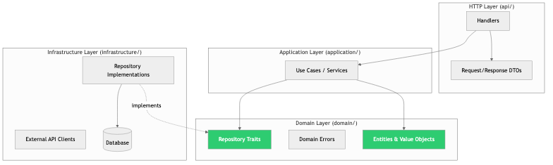
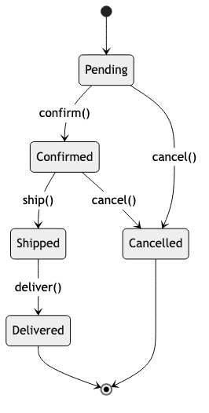

# Low-Level System Design

## Diagrams






## Concepts

### What is Low-Level System Design?

Low-level system design (LLD) focuses on the internal design of individual components: how to structure modules, define interfaces, manage state, and handle concurrency within a single service or application.

If high-level system design answers "what services do we need and how do they communicate?", low-level design answers "how do we build each service internally?"

LLD is where architecture meets code. It's the bridge between a box on an architecture diagram and the actual implementation.

### Module & Component Design

**Separation of concerns** is the core principle: each module should have one reason to change.

**Layered architecture within a service:**

```
┌─────────────────────────────────────┐
│         HTTP Handlers / API         │  ← Request parsing, response formatting
├─────────────────────────────────────┤
│         Application Logic           │  ← Use cases, orchestration, business rules
├─────────────────────────────────────┤
│         Domain Model                │  ← Core entities, value objects, domain rules
├─────────────────────────────────────┤
│         Infrastructure              │  ← Database, external APIs, message queues
└─────────────────────────────────────┘
```

**Dependency direction:** Upper layers depend on lower layers. Lower layers never import from upper layers. The domain model has zero dependencies on infrastructure — it's pure business logic.

**Example project structure in Rust:**

```
src/
├── main.rs                 # Entry point, wiring
├── api/
│   ├── mod.rs
│   ├── handlers.rs         # HTTP handlers (axum/actix)
│   ├── routes.rs           # Route definitions
│   └── dto.rs              # Request/response types (Data Transfer Objects)
├── application/
│   ├── mod.rs
│   └── order_service.rs    # Use cases: create_order, cancel_order
├── domain/
│   ├── mod.rs
│   ├── order.rs            # Order entity, business rules
│   ├── product.rs          # Product entity
│   └── errors.rs           # Domain errors
└── infrastructure/
    ├── mod.rs
    ├── database.rs          # Database connection, pool
    ├── order_repository.rs  # SQL queries for orders
    └── payment_client.rs    # External payment API client
```

**Why this matters:** When the database changes from PostgreSQL to MySQL, only `infrastructure/` changes. When business rules change, only `domain/` changes. When the API format changes, only `api/` changes. Each layer can be tested independently.

### Interface Design

Interfaces (traits in Rust) define contracts between components. Good interfaces enable flexibility, testability, and independent evolution.

**Principles of good interface design:**

**1. Program to interfaces, not implementations:**

```text
// Bad -- tightly coupled to PostgreSQL
FUNCTION CREATE_ORDER(pool: PgPool, order: Order) → Result<OrderId, SqlError>

// Good -- depends on an abstraction
INTERFACE OrderRepository
    FUNCTION SAVE(order: Order) → Result<OrderId, RepositoryError>
    FUNCTION FIND_BY_ID(id: OrderId) → Result<Optional<Order>, RepositoryError>
    FUNCTION FIND_BY_USER(user_id: UserId) → Result<List<Order>, RepositoryError>

// Now you can swap implementations without changing callers
RECORD PostgresOrderRepo { pool: PgPool }
RECORD InMemoryOrderRepo { orders: Map<OrderId, Order> }  // For testing
```

**2. Interface Segregation — small, focused interfaces:**

```text
// Bad -- one massive interface
INTERFACE UserService
    FUNCTION CREATE(user: NewUser) → Result<User, Error>
    FUNCTION FIND(id: UserId) → Result<Optional<User>, Error>
    FUNCTION UPDATE(id: UserId, changes: UserUpdate) → Result<User, Error>
    FUNCTION DELETE(id: UserId) → Result<Void, Error>
    FUNCTION AUTHENTICATE(email: String, password: String) → Result<Token, Error>
    FUNCTION RESET_PASSWORD(email: String) → Result<Void, Error>
    FUNCTION SEND_VERIFICATION_EMAIL(user: User) → Result<Void, Error>
    FUNCTION UPLOAD_AVATAR(user: User, image: Bytes) → Result<Url, Error>

// Good -- split by concern
INTERFACE UserRepository
    FUNCTION SAVE(user: User) → Result<Void, Error>
    FUNCTION FIND_BY_ID(id: UserId) → Result<Optional<User>, Error>

INTERFACE AuthService
    FUNCTION AUTHENTICATE(email: String, password: String) → Result<Token, Error>
    FUNCTION RESET_PASSWORD(email: String) → Result<Void, Error>

INTERFACE AvatarService
    FUNCTION UPLOAD(user_id: UserId, image: Bytes) → Result<Url, Error>
```

**3. Make impossible states unrepresentable:**

```text
// Bad -- caller must remember to check status before accessing fields
RECORD Payment
    status: PaymentStatus
    transaction_id: Optional<String>  // Only present if Completed
    error_message: Optional<String>   // Only present if Failed
    refund_id: Optional<String>       // Only present if Refunded

// Good -- the type system enforces valid combinations
ENUM Payment
    Pending { created_at: DateTime }
    Completed { transaction_id: String, completed_at: DateTime }
    Failed { error_message: String, failed_at: DateTime }
    Refunded { refund_id: String, original_transaction_id: String }
```

### Data Flow Design

How data moves through your system determines its complexity, testability, and performance.

**Pipes and filters:**

```
Input → [Validate] → [Enrich] → [Transform] → [Store] → Output
```

Each step is a pure function that takes input and produces output. This is easy to test (each step independently) and extend (add a new step).

```text
FUNCTION PROCESS_ORDER(raw: RawOrderInput) → Result<OrderConfirmation, OrderError>
    validated ← VALIDATE_ORDER(raw)?
    enriched ← ENRICH_WITH_PRICING(validated)?
    with_tax ← CALCULATE_TAX(enriched)?
    stored ← SAVE_TO_DATABASE(with_tax)?
    confirmation ← SEND_CONFIRMATION(stored)?
    RETURN confirmation
```

**Middleware / interceptor pattern:**

Common in web frameworks. Each middleware wraps the next, adding behavior (logging, auth, rate limiting) without modifying the core handler.

```
Request → [Logging] → [Auth] → [RateLimit] → [Handler] → Response
                                                    ↓
Response ← [Logging] ← [Auth] ← [RateLimit] ← [Response]
```

### State Machine Design

Many systems have well-defined states and transitions. Modeling them explicitly prevents invalid states and makes the system predictable.

**Example: Subscription lifecycle**

```
                    ┌──────────────┐
                    │              │
         ┌─────────▼──┐      ┌───┴────────┐
    ──→  │   Trial    │──→   │   Active   │
         └─────┬──────┘      └───┬────┬───┘
               │                 │    │
               │          ┌─────▼─┐  │
               └─────────→│ Expired│  │
                          └───────┘  │
                                     │
                          ┌──────────▼──┐
                          │  Cancelled  │
                          └─────────────┘
```

```text
ENUM SubscriptionState
    Trial { expires_at: DateTime }
    Active { plan: Plan, renews_at: DateTime }
    Expired { expired_at: DateTime }
    Cancelled { cancelled_at: DateTime, reason: String }

FUNCTION ACTIVATE(state: SubscriptionState, plan: Plan) → Result<SubscriptionState, SubscriptionError>
    MATCH state
        CASE Trial { .. }:
            RETURN Active { plan ← plan, renews_at ← NOW() + 30 days }
        DEFAULT:
            RETURN Error("Can only activate from trial")

FUNCTION CANCEL(state: SubscriptionState, reason: String) → Result<SubscriptionState, SubscriptionError>
    MATCH state
        CASE Trial { .. } OR Active { .. }:
            RETURN Cancelled { cancelled_at ← NOW(), reason ← reason }
        DEFAULT:
            RETURN Error("Cannot cancel expired or already cancelled subscription")
```

### Concurrency Design

Designing for concurrent access is critical in any system handling multiple requests simultaneously.

**Shared-nothing architecture:**
Each request handler gets its own copy of the data it needs. No shared mutable state. This is the simplest and most scalable approach.

```text
// Each request gets its own connection from the pool
ASYNC FUNCTION HANDLE_REQUEST(pool: PgPool) → Result<Response, Error>
    conn ← AWAIT pool.ACQUIRE()?    // Gets a connection, doesn't share it
    data ← AWAIT QUERY(conn)?
    RETURN Response.JSON(data)
```

**When shared state is necessary:**
Use `Arc<Mutex<T>>` or `Arc<RwLock<T>>` carefully:

```text
RECORD RateLimiter
    requests: Shared<ReadWriteLock<Map<IpAddr, List<Instant>>>>
    max_requests: Integer
    window: Duration

FUNCTION IS_ALLOWED(limiter: RateLimiter, ip: IpAddr) → Boolean
    ACQUIRE WRITE LOCK ON limiter.requests
    now ← CURRENT_INSTANT()
    window_start ← now - limiter.window

    entry ← requests.GET_OR_INSERT(ip, EMPTY_LIST)
    REMOVE all t FROM entry WHERE t ≤ window_start   // Remove expired entries

    IF LENGTH(entry) < limiter.max_requests THEN
        APPEND now TO entry
        RETURN TRUE
    ELSE
        RETURN FALSE
    RELEASE LOCK
```

**Message passing over shared memory:**
When possible, use channels instead of shared state. Each component owns its data and communicates via messages.

```text
ENUM Command
    IncrementCounter { name: String, amount: Integer }
    GetCounter { name: String, reply: Channel<Integer> }

ASYNC FUNCTION COUNTER_ACTOR(rx: Receiver<Command>)
    counters ← EMPTY Map<String, Integer>

    WHILE cmd ← AWAIT rx.RECEIVE()
        MATCH cmd
            CASE IncrementCounter { name, amount }:
                IF name NOT IN counters THEN
                    counters[name] ← 0
                counters[name] ← counters[name] + amount
            CASE GetCounter { name, reply }:
                value ← counters.GET(name) OR 0
                SEND value TO reply
```

### Schema Design for Specific Use Cases

**User activity feed:**
```sql
-- Fan-out on write: pre-compute each user's feed
CREATE TABLE feed_items (
    user_id     BIGINT NOT NULL,
    activity_id BIGINT NOT NULL,
    created_at  TIMESTAMPTZ NOT NULL,
    PRIMARY KEY (user_id, activity_id)
);
CREATE INDEX idx_feed_user_time ON feed_items (user_id, created_at DESC);
```

**Rate limiting with sliding window:**
```sql
CREATE TABLE rate_limits (
    key         TEXT NOT NULL,
    timestamp   TIMESTAMPTZ NOT NULL DEFAULT NOW()
);
CREATE INDEX idx_rate_key_time ON rate_limits (key, timestamp);
-- Count requests in window:
-- SELECT COUNT(*) FROM rate_limits WHERE key = ? AND timestamp > NOW() - INTERVAL '1 minute';
```

**Audit log (append-only):**
```sql
CREATE TABLE audit_log (
    id          BIGSERIAL PRIMARY KEY,
    entity_type TEXT NOT NULL,
    entity_id   BIGINT NOT NULL,
    action      TEXT NOT NULL,       -- 'created', 'updated', 'deleted'
    actor_id    BIGINT NOT NULL,
    changes     JSONB,               -- What changed
    created_at  TIMESTAMPTZ NOT NULL DEFAULT NOW()
);
CREATE INDEX idx_audit_entity ON audit_log (entity_type, entity_id, created_at DESC);
```

### Design Walkthrough: URL Shortener (LLD)

**Requirements:** Shorten URLs, redirect short URLs to originals, track click counts.

**Module design:**

```text
// domain/
RECORD ShortUrl
    code: ShortCode          // e.g., "abc123"
    original_url: Url
    created_at: DateTime
    expires_at: Optional<DateTime>
    click_count: Integer

TYPE ShortCode = WRAPPER(String)  // Newtype for type safety

FUNCTION GENERATE_SHORT_CODE() → ShortCode
    // Base62 encoding of random bytes → 7-char code
    // 62^7 = 3.5 trillion possibilities
    RETURN ShortCode(RANDOM_NANOID(length ← 7, alphabet ← BASE62))

// application/
RECORD UrlService<R: UrlRepository>
    repo: R

ASYNC FUNCTION SHORTEN(svc: UrlService, original: String) → Result<ShortUrl, UrlError>
    url ← PARSE_URL(original)
    IF url IS INVALID THEN RETURN Error(InvalidUrl)
    code ← GENERATE_SHORT_CODE()
    short_url ← NEW ShortUrl(code, url)
    AWAIT svc.repo.SAVE(short_url)?
    RETURN short_url

ASYNC FUNCTION RESOLVE(svc: UrlService, code: String) → Result<Url, UrlError>
    code ← ShortCode(code)
    short_url ← AWAIT svc.repo.FIND_BY_CODE(code)?
    IF short_url IS NONE THEN RETURN Error(NotFound)

    IF short_url.IS_EXPIRED() THEN
        RETURN Error(Expired)

    AWAIT svc.repo.INCREMENT_CLICKS(code)?
    RETURN short_url.original_url

// infrastructure/
INTERFACE UrlRepository
    ASYNC FUNCTION SAVE(url: ShortUrl) → Result<Void, RepositoryError>
    ASYNC FUNCTION FIND_BY_CODE(code: ShortCode) → Result<Optional<ShortUrl>, RepositoryError>
    ASYNC FUNCTION INCREMENT_CLICKS(code: ShortCode) → Result<Void, RepositoryError>
```

## Business Value

- **Reduced development time**: Clear internal design means developers know where new code belongs. No debating "where should this go?" for every change.
- **Independent team velocity**: Well-defined module boundaries let multiple developers work on the same service without stepping on each other.
- **Testability**: Clean interfaces and dependency injection make unit testing straightforward, reducing bugs and enabling confident refactoring.
- **Onboarding speed**: A well-structured codebase is navigable. New engineers can understand and contribute to individual modules without understanding the entire system.
- **Reduced coupling cost**: When modules are properly isolated, changing one module doesn't require changes in others — the #1 driver of software maintenance cost.

## Real-World Examples

### Shopify's Modular Monolith
Shopify runs one of the largest Ruby on Rails monoliths in the world. Rather than splitting into microservices, they invested in modular monolith design: strict module boundaries enforced by tooling, each module with its own database schema, and explicit interfaces between modules. This gave them the benefits of microservices (team independence, clear ownership) without the operational complexity.

### Rust's Type-Driven Design in Cloudflare Workers
Cloudflare Workers (their edge compute platform) uses Rust internally. They leverage Rust's type system for low-level design: newtypes for different kinds of IDs, enums for request states, and the typestate pattern for connection lifecycle management. This approach catches entire categories of bugs at compile time that would be runtime errors in other languages.

### How Uber Designs Internal Services
Uber's service design guidelines mandate: every service has a clear domain boundary, communicates via well-defined interfaces (Thrift/gRPC), and separates business logic from infrastructure. Each service is structured internally as domain → application → infrastructure layers. This consistency across thousands of services means any Uber engineer can navigate any service.

### Discord's State Machine for Voice Connections
Discord models voice connections as explicit state machines. A voice connection moves through states: Disconnected → Connecting → Connected → Reconnecting → Disconnected. Invalid transitions are impossible by design. This approach eliminated an entire class of bugs where voice connections would enter invalid states, causing dropped calls.

## Common Mistakes & Pitfalls

- **Anemic domain model** — Domain objects that are just data bags with no behavior. All logic lives in "service" classes. This scatters business rules across the codebase instead of keeping them with the data they govern.

- **Leaky abstractions** — When infrastructure details leak into domain logic (SQL queries in business logic, HTTP status codes in domain errors). Keep the domain pure.

- **Circular dependencies** — Module A imports Module B, which imports Module A. This indicates unclear boundaries. Resolve by extracting shared types into a third module or inverting the dependency with a trait.

- **Stringly-typed code** — Using `String` where a dedicated type belongs. `user_id: String` vs `user_id: UserId` — the second prevents entire categories of bugs.

- **Missing error types** — Using `String` for errors or a single catch-all error type. Structured error types (enums) let callers handle specific failure modes.

- **Over-designing upfront** — Spending weeks designing the perfect module structure before writing code. Start simple, refactor as understanding grows.

## Trade-offs

| Approach | Pros | Cons |
|----------|------|------|
| **Layered architecture** | Clear separation, familiar, testable | Can be rigid, ceremony for simple operations |
| **Flat structure** | Simple, fast to navigate for small projects | Breaks down as the codebase grows |
| **Trait-heavy design** | Flexible, testable, swappable implementations | More indirection, can be harder to follow |
| **Concrete types only** | Direct, easy to understand | Hard to test, hard to swap implementations |
| **Type-driven design (newtype, typestate)** | Compile-time safety, prevents entire bug classes | More boilerplate, learning curve for the team |

## When to Use / When Not to Use

**Invest in LLD when:**
- Building a service that multiple engineers will maintain
- The domain has complex business rules
- The service will live for years
- You need to test business logic independently from infrastructure

**Keep it simple when:**
- Building a CRUD API with no business logic
- Prototyping or validating an idea
- The service is small and maintained by one person
- The logic is straightforward data in → data out

## Key Takeaways

1. Low-level design bridges architecture and code. It answers "how do we structure the internals of a component?"
2. Separate concerns into layers: API → Application → Domain → Infrastructure. Dependencies point inward.
3. Design interfaces (traits) for your dependencies. This enables testing, flexibility, and independent evolution.
4. Make impossible states unrepresentable using Rust's enums. If a state combination is invalid, the type system should prevent it.
5. Model state machines explicitly. If your entity has defined states and transitions, encode them — don't scatter transition logic across the codebase.
6. Prefer message passing over shared mutable state for concurrency.
7. Start simple and refactor toward better design as complexity grows. Over-designing upfront is as costly as under-designing.

## Further Reading

- **Books:**
  - *A Philosophy of Software Design* — John Ousterhout (2018) — Focuses on reducing complexity in module and interface design
  - *Domain-Driven Design* — Eric Evans (2003) — The foundational text on modeling complex domains
  - *Implementing Domain-Driven Design* — Vaughn Vernon (2013) — Practical DDD implementation

- **Papers & Articles:**
  - [Making Impossible States Impossible](https://www.youtube.com/watch?v=IcgmSRJHu_8) — Richard Feldman's talk (Elm, but principles apply to Rust)
  - [Hexagonal Architecture](https://alistair.cockburn.us/hexagonal-architecture/) — Alistair Cockburn's original article
  - [Modular Monolith at Shopify](https://shopify.engineering/deconstructing-monolith-designing-software-maximizes-developer-productivity) — Shopify Engineering Blog

- **Crates:**
  - [axum](https://crates.io/crates/axum) — Web framework that exemplifies clean layered design
  - [sqlx](https://crates.io/crates/sqlx) — Async SQL toolkit (used in infrastructure layer)
  - [nanoid](https://crates.io/crates/nanoid) — URL-safe unique ID generation
