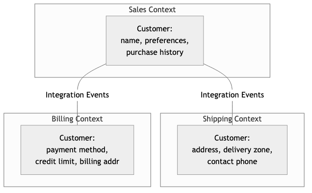
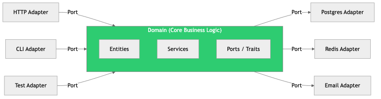

# 13 - Software Architecture

## Diagrams






## Concepts

### What is Software Architecture?

Software architecture is the set of high-level decisions about how a system is structured, how components interact, and what constraints guide development. It's the decisions that are expensive to change later.

> "Architecture is about the important stuff. Whatever that is." — Ralph Johnson

Architecture answers questions like:
- How is the system divided into components?
- How do components communicate?
- Where does data live and how does it flow?
- What are the constraints (performance, security, compliance)?
- How will the system evolve over time?

**Architecture vs. Design:** Architecture concerns structural decisions that affect the whole system. Design concerns how individual components are built internally (covered in Topic 11). The boundary is fuzzy — but if changing a decision requires rearchitecting multiple components, it's architecture.

### Architectural Styles

#### Layered Architecture

The most common and familiar style. The system is divided into horizontal layers, each with a specific responsibility. Each layer only depends on the layer directly below it.

```
┌─────────────────────────┐
│    Presentation Layer   │  UI, API endpoints
├─────────────────────────┤
│    Business Logic Layer │  Rules, workflows, validation
├─────────────────────────┤
│    Data Access Layer    │  Repositories, queries
├─────────────────────────┤
│    Database             │  Storage
└─────────────────────────┘
```

**Strengths:** Simple, familiar, good separation of concerns.
**Weaknesses:** Can become a "lasagna" — changes ripple through all layers. Business logic often leaks into other layers. Tendency to create "pass-through" layers that add ceremony without value.

#### Hexagonal Architecture (Ports & Adapters)

Invented by Alistair Cockburn. The core business logic sits at the center, completely isolated from external concerns. It communicates with the outside world through "ports" (interfaces) and "adapters" (implementations).

```
                 ┌──────────────────────┐
    HTTP ──→ [Adapter] ──→ │                      │
                           │   DOMAIN / BUSINESS   │
    CLI  ──→ [Adapter] ──→ │       LOGIC          │ ──→ [Adapter] ──→ PostgreSQL
                           │                      │
   Tests ──→ [Adapter] ──→ │   (Ports = Traits)   │ ──→ [Adapter] ──→ In-Memory
                 └──────────────────────┘
```

**Key insight:** The domain doesn't know whether it's being called by an HTTP handler, a CLI, or a test. It doesn't know whether data is stored in PostgreSQL or in memory. It only knows about its ports (traits).

```rust
// Port (trait) — defined in the domain
trait OrderRepository {
    async fn save(&self, order: &Order) -> Result<(), DomainError>;
    async fn find_by_id(&self, id: OrderId) -> Result<Option<Order>, DomainError>;
}

// Adapter — defined in infrastructure
struct PostgresOrderRepository { pool: PgPool }
impl OrderRepository for PostgresOrderRepository { /* ... */ }

// Another adapter — for testing
struct InMemoryOrderRepository { orders: HashMap<OrderId, Order> }
impl OrderRepository for InMemoryOrderRepository { /* ... */ }

// Domain service — knows nothing about PostgreSQL or HTTP
struct OrderService<R: OrderRepository> {
    repo: R,
}

impl<R: OrderRepository> OrderService<R> {
    async fn place_order(&self, items: Vec<Item>) -> Result<Order, DomainError> {
        let order = Order::new(items)?;  // Domain validation
        self.repo.save(&order).await?;
        Ok(order)
    }
}
```

**Strengths:** Highly testable, technology-agnostic core, easy to swap infrastructure.
**Weaknesses:** More indirection, can be over-engineered for simple CRUD.

#### Clean Architecture

Robert C. Martin's variation of hexagonal architecture. Adds explicit layers with strict dependency rules:

```
┌───────────────────────────────────────────────┐
│              Frameworks & Drivers              │  Web, DB, External APIs
├───────────────────────────────────────────────┤
│              Interface Adapters                │  Controllers, Presenters, Gateways
├───────────────────────────────────────────────┤
│              Application Business Rules        │  Use Cases
├───────────────────────────────────────────────┤
│              Enterprise Business Rules         │  Entities
└───────────────────────────────────────────────┘

                Dependencies point INWARD →
```

**The Dependency Rule:** Source code dependencies must only point inward. The inner layers know nothing about outer layers. Entities don't know about use cases. Use cases don't know about controllers. Controllers don't know about frameworks (ideally).

#### Event-Driven Architecture

Components communicate by producing and consuming events rather than calling each other directly.

```
[Order Service] ──publishes──→ "OrderPlaced" ──→ [Message Broker]
                                                       │
                              ┌─────────────────────────┤
                              ↓                         ↓
                    [Inventory Service]          [Email Service]
                    "Reserve stock"              "Send confirmation"
```

**Strengths:** Loose coupling (services don't know about each other), scalable, resilient (if email service is down, orders still process).
**Weaknesses:** Eventual consistency, debugging across events is harder, event ordering challenges.

### Separation of Concerns

Every module should have one reason to change. This is the Single Responsibility Principle applied at the architectural level.

**Example — violating separation:**
```rust
// This handler does everything: HTTP parsing, business logic, database, email
async fn create_order_handler(req: HttpRequest) -> HttpResponse {
    let body: OrderRequest = serde_json::from_slice(&req.body()).unwrap();

    // Business logic mixed with HTTP handling
    if body.items.is_empty() {
        return HttpResponse::BadRequest().body("Empty order");
    }

    // Database access mixed with business logic
    let total = sqlx::query_scalar("SELECT SUM(price) FROM products WHERE id = ANY($1)")
        .bind(&body.item_ids)
        .fetch_one(&pool).await.unwrap();

    sqlx::query("INSERT INTO orders (user_id, total) VALUES ($1, $2)")
        .bind(body.user_id).bind(total)
        .execute(&pool).await.unwrap();

    // Email sending mixed with everything
    send_email(&body.user_email, "Order confirmed", &format!("Total: {total}")).await;

    HttpResponse::Ok().json(json!({"status": "created"}))
}
```

**Example — proper separation:**
```rust
// HTTP layer — only handles HTTP concerns
async fn create_order_handler(
    State(service): State<OrderService>,
    Json(req): Json<CreateOrderRequest>,
) -> Result<Json<OrderResponse>, ApiError> {
    let order = service.create_order(req.into()).await?;
    Ok(Json(order.into()))
}

// Application layer — orchestrates the use case
impl OrderService {
    async fn create_order(&self, input: CreateOrderInput) -> Result<Order, OrderError> {
        let order = Order::new(input.items)?;  // Domain validation
        self.repo.save(&order).await?;         // Persistence
        self.events.publish(OrderCreated { order_id: order.id }).await?; // Event
        Ok(order)
    }
}

// Domain layer — pure business rules
impl Order {
    fn new(items: Vec<Item>) -> Result<Self, OrderError> {
        if items.is_empty() {
            return Err(OrderError::EmptyOrder);
        }
        // ... more validation
    }
}
```

### Dependency Inversion

High-level modules should not depend on low-level modules. Both should depend on abstractions.

**Without dependency inversion:**
```
OrderService → PostgresDatabase
```
The business logic depends directly on PostgreSQL. To test it, you need a database. To switch to MySQL, you modify business logic.

**With dependency inversion:**
```
OrderService → OrderRepository (trait)
                    ↑
            PostgresOrderRepo (implements trait)
```
The business logic depends on an abstraction. The database implementation also depends on the abstraction. Dependencies point toward the domain — the most stable part of the system.

### Domain-Driven Design (DDD)

DDD is an approach to modeling complex software by aligning the code structure with the business domain. Created by Eric Evans in 2003.

**Key concepts:**

#### Bounded Contexts
A bounded context is a boundary within which a particular domain model is defined and applicable. The same word can mean different things in different contexts.

```
┌─────────────────┐    ┌─────────────────┐    ┌─────────────────┐
│  Sales Context   │    │  Shipping Context│    │  Billing Context│
│                  │    │                  │    │                  │
│  Customer:       │    │  Customer:       │    │  Customer:       │
│  - name          │    │  - address       │    │  - payment method│
│  - preferences   │    │  - delivery zone │    │  - credit limit  │
│  - purchase hist │    │  - contact phone │    │  - billing addr  │
└─────────────────┘    └─────────────────┘    └─────────────────┘
```

"Customer" means something different in each context. Trying to create one universal Customer model that serves all contexts leads to a bloated, confusing God Object.

#### Aggregates
An aggregate is a cluster of domain objects treated as a single unit for data changes. One entity is the "aggregate root" — all access goes through it.

```rust
// Order is the aggregate root
pub struct Order {
    id: OrderId,
    customer_id: CustomerId,
    items: Vec<OrderItem>,      // Owned by the aggregate
    status: OrderStatus,
    total: Money,
}

impl Order {
    // All mutations go through the aggregate root
    pub fn add_item(&mut self, product: &Product, quantity: u32) -> Result<(), OrderError> {
        if self.status != OrderStatus::Draft {
            return Err(OrderError::CannotModify);
        }
        let item = OrderItem::new(product, quantity)?;
        self.items.push(item);
        self.recalculate_total();
        Ok(())
    }

    pub fn submit(&mut self) -> Result<(), OrderError> {
        if self.items.is_empty() {
            return Err(OrderError::EmptyOrder);
        }
        self.status = OrderStatus::Submitted;
        Ok(())
    }
}
```

**Rule:** Don't modify entities inside an aggregate except through the aggregate root. This maintains invariants (business rules that must always be true).

#### Entities vs Value Objects

**Entities** have identity — two entities with the same data but different IDs are different.
```rust
struct User {
    id: UserId,        // Identity
    name: String,
    email: String,
}
// User(1, "Alice", "alice@test.com") ≠ User(2, "Alice", "alice@test.com")
```

**Value Objects** are defined by their values — two with the same data are equal.
```rust
#[derive(PartialEq, Eq, Clone)]
struct Money {
    amount: i64,       // In cents
    currency: Currency,
}
// Money(1000, USD) == Money(1000, USD) — they're the same value
```

#### Domain Events
Events that represent something significant that happened in the domain.

```rust
enum OrderEvent {
    OrderPlaced { order_id: OrderId, customer_id: CustomerId, total: Money },
    OrderShipped { order_id: OrderId, tracking_number: String },
    OrderCancelled { order_id: OrderId, reason: String },
}
```

Domain events decouple parts of the system: when an order is placed, the Inventory context reacts by reserving stock, the Email context sends a confirmation, and the Analytics context records the sale — without the Order context knowing about any of them.

### Modular Monolith

A modular monolith is a single deployable application with strict internal module boundaries. It provides the organizational benefits of microservices without the operational complexity.

```
┌─────────────── Single Deployment ───────────────┐
│                                                   │
│  ┌───────────┐  ┌───────────┐  ┌───────────┐    │
│  │  Orders   │  │ Inventory │  │  Payments  │    │
│  │  Module   │  │  Module   │  │  Module    │    │
│  │           │  │           │  │            │    │
│  │ - domain  │  │ - domain  │  │ - domain   │    │
│  │ - app     │  │ - app     │  │ - app      │    │
│  │ - infra   │  │ - infra   │  │ - infra    │    │
│  └─────┬─────┘  └─────┬─────┘  └─────┬──────┘    │
│        │              │              │            │
│  ──────┴──────────────┴──────────────┴──────      │
│               Shared Infrastructure                │
│        (Database, Message Bus, Auth)               │
└───────────────────────────────────────────────────┘
```

**Rules:**
- Modules communicate through public interfaces (traits), never by reaching into each other's internals
- Each module can have its own database schema (or even its own database)
- A module can be extracted into a microservice later if needed

**Why start here:** Most systems don't need microservices from day one. A modular monolith gives you clean boundaries, independent development, and the option to split later — without the day-one cost of distributed systems (network latency, service discovery, distributed transactions).

### Architecture Decision Records (ADRs)

An ADR documents a significant architectural decision: what was decided, why, and what alternatives were considered.

**Template:**

```markdown
# ADR-001: Use PostgreSQL as primary database

## Status
Accepted

## Context
We need a primary database for our order management system. We expect
~1M orders/month initially, growing to 10M within 2 years. We need
ACID transactions for order processing and strong querying capabilities
for reporting.

## Decision
Use PostgreSQL as our primary database.

## Alternatives Considered
- **MySQL**: Similar capabilities but weaker JSON support and window functions.
- **MongoDB**: Better for unstructured data, but we need strong consistency
  and complex joins for reporting.
- **DynamoDB**: Excellent scalability, but lock-in to AWS and complex query
  patterns for our relational data model.

## Consequences
- We get strong ACID guarantees for order processing
- Rich SQL support for reporting (window functions, CTEs, JSONB)
- Need to manage schema migrations carefully
- May need read replicas or partitioning at scale
- Team is already experienced with PostgreSQL

## Date
2024-03-15
```

**Why ADRs matter:** Two years from now, someone will ask "why do we use PostgreSQL?" Without an ADR, the answer is "I don't know, it was before my time." With an ADR, the reasoning is preserved — including what alternatives were rejected and why.

## Business Value

- **Team independence**: Good architecture lets teams work on different modules/services without blocking each other. This directly scales engineering velocity with headcount.
- **Reduced cost of change**: Architecture that isolates concerns means changes are localized. Changing the database doesn't require changing business logic.
- **Risk management**: ADRs create institutional memory. Without them, teams repeat past mistakes or reverse good decisions because the context is lost.
- **Scalability path**: A modular monolith provides a clear path to microservices if and when needed — without committing to distributed system complexity on day one.
- **Faster onboarding**: Clear architectural boundaries help new engineers understand where code belongs and how the system fits together.

## Real-World Examples

### Shopify's Modular Monolith Evolution
Shopify's monolith grew to millions of lines of Ruby. Instead of rewriting as microservices, they invested in modular boundaries within the monolith: enforced module interfaces, separate database schemas per module, and tooling to detect boundary violations. This approach preserved the development speed of a monolith while gaining the organizational benefits of microservices. They now have 300+ modules in a single deployable application.

### Netflix's Migration from Monolith to Microservices
Netflix famously migrated from a monolithic Java application to hundreds of microservices. The migration took 7 years (2009-2016). Key lesson: they didn't migrate because microservices were trendy — they migrated because their monolith couldn't scale to global demand. Most companies don't have Netflix's scale constraints. Their engineering blog documents both the benefits and the enormous operational cost of microservices.

### Amazon's "Two-Pizza Team" Architecture
Amazon's architecture evolved from their organizational structure. Jeff Bezos mandated that all teams must communicate through APIs — no shared databases, no direct code access. This led to the service-oriented architecture that eventually became AWS. The architecture mirrored the organization (Conway's Law): small, autonomous teams with clear API contracts between them.

### Basecamp's "Majestic Monolith"
DHH (creator of Rails, CTO of Basecamp) advocates for the "Majestic Monolith" — a well-structured monolith that serves millions of users. Basecamp runs a single Rails application serving all of Basecamp and HEY email. Their argument: for most businesses, the complexity of microservices isn't justified. A well-maintained monolith is simpler, faster to develop, and cheaper to operate.

## Common Mistakes & Pitfalls

- **Premature microservices** — Splitting into microservices before understanding domain boundaries. If you don't know where to draw the boundaries, you'll draw them wrong — and distributed system boundaries are expensive to change.

- **Resume-driven architecture** — Choosing technologies because they look good on a resume, not because they fit the problem. Kubernetes for a 3-person startup with 100 daily users is over-engineering.

- **Ignoring Conway's Law** — "Organizations which design systems are constrained to produce designs which are copies of the communication structures of these organizations." Your architecture will mirror your team structure. Design your teams to match the architecture you want.

- **No architecture at all** — "We're agile, we don't need architecture." Agile doesn't mean no planning. It means the right amount of planning. Some architectural decisions must be made upfront because they're expensive to change.

- **Architecture astronauts** — Over-abstracting everything. Building a "general-purpose event-driven microservice platform" when you need a CRUD app. Start simple. Add complexity when you have evidence it's needed.

- **Not documenting decisions** — Making architectural decisions in meetings that are immediately forgotten. Use ADRs. They take 15 minutes to write and save months of confusion.

## Trade-offs

| Approach | Pros | Cons |
|----------|------|------|
| **Monolith** | Simple deployment, easy debugging, fast development | Can become tangled, scaling limits, team coupling |
| **Modular monolith** | Clean boundaries, team independence, simple ops | Requires discipline to maintain boundaries |
| **Microservices** | Independent scaling/deployment, technology flexibility | Distributed system complexity, operational overhead |
| **Hexagonal/Clean** | Testable, technology-agnostic core | More indirection, over-engineering risk for simple apps |
| **Event-driven** | Loose coupling, scalability, resilience | Eventual consistency, harder debugging |

## When to Use / When Not to Use

**Start with a modular monolith when:**
- You're a startup or small team (<20 engineers)
- Domain boundaries are still being discovered
- You need to move fast and iterate
- Operational simplicity is more valuable than independent scaling

**Consider microservices when:**
- Different components have fundamentally different scaling needs
- Teams need to deploy independently at high velocity
- You have the operational maturity (CI/CD, monitoring, incident response)
- Domain boundaries are well-understood and stable

**Use hexagonal/clean architecture when:**
- The domain has complex business logic
- You need to swap infrastructure (databases, APIs) without touching business logic
- Testability is a priority

**Use DDD when:**
- The domain is complex and unfamiliar
- Business rules are the primary source of complexity (not infrastructure)
- You have access to domain experts

## Key Takeaways

1. Architecture is the decisions that are expensive to change. Invest in getting them right, but don't over-invest.
2. Start with a modular monolith. It gives you clean boundaries without distributed system complexity. Extract microservices only when you have a concrete reason.
3. The Dependency Rule: dependencies point inward, toward the domain. The domain never depends on infrastructure.
4. DDD's Bounded Contexts prevent the "God Object" problem. The same word can mean different things in different contexts — model them separately.
5. Conway's Law is real. Design your teams to match the architecture you want, or accept that your architecture will match your current team structure.
6. Write ADRs. Future you (and future teammates) will be grateful. 15 minutes of writing saves months of archaeology.
7. The best architecture is the simplest one that solves your actual problems. Complexity should be justified by concrete needs, not hypothetical ones.

## Further Reading

- **Books:**
  - *Domain-Driven Design* — Eric Evans (2003) — The foundational text on modeling complex domains
  - *Clean Architecture* — Robert C. Martin (2017) — Architecture principles with the Dependency Rule
  - *Building Evolutionary Architectures* — Neal Ford, Rebecca Parsons, Patrick Kua (2017) — Architecture that supports change
  - *Fundamentals of Software Architecture* — Mark Richards & Neal Ford (2020) — Comprehensive overview of architectural styles

- **Papers & Articles:**
  - [Hexagonal Architecture](https://alistair.cockburn.us/hexagonal-architecture/) — Alistair Cockburn's original article
  - [Modular Monolith at Shopify](https://shopify.engineering/deconstructing-monolith-designing-software-maximizes-developer-productivity) — How Shopify modularized
  - [ADR GitHub Template](https://adr.github.io/) — Tools and templates for Architecture Decision Records
  - [The Majestic Monolith](https://m.signalvnoise.com/the-majestic-monolith/) — DHH's argument for monoliths

- **Talks:**
  - *Making Architecture Matter* — Martin Fowler (OSCON) — Why architecture decisions matter
  - *Modular Monoliths* — Simon Brown — Practical guide to modular monolith design
