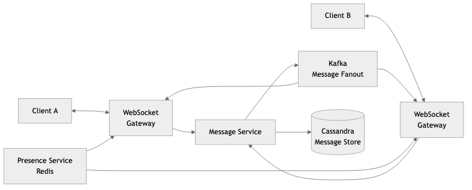
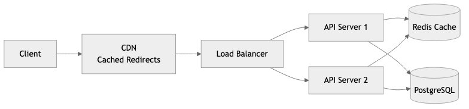

# 15 - High-Level System Design

## Contents

1. [Scaling Fundamentals](01-scaling-fundamentals.md) — Vertical vs horizontal scaling, back-of-the-envelope estimation, capacity planning, the practical scaling path
2. [Load Balancing](02-load-balancing.md) — L4 vs L7, algorithms (round robin, least connections, power of two choices), health checks, session affinity
3. [Caching Strategies](03-caching-strategies.md) — Cache-aside, write-through, write-behind, cache invalidation (TTL, event-based, version-based), CDN, real-world examples
4. [Message Queues and Event Streaming](04-message-queues-and-streaming.md) — Message queues (RabbitMQ, SQS) vs event streaming (Kafka, Redpanda), point-to-point vs pub/sub, partitions, ordering, replay
5. [Microservices vs Monolith](05-microservices-vs-monolith.md) — Detailed comparison, Conway's Law, migration strategies (strangler fig), API gateways, service mesh (Istio, Linkerd), real-world migrations (Netflix, Amazon, Shopify)
6. [System Design Case Studies](06-system-design-case-studies.md) — URL shortener, real-time chat system, news feed. Step-by-step walkthroughs: requirements, estimation, architecture, data model, API design. Twitter timeline evolution, WhatsApp architecture

## Diagrams

