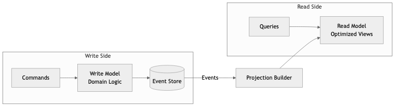
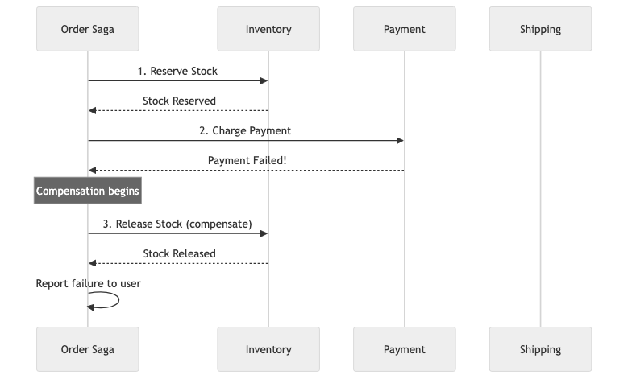

# 16 - Event-Driven Architecture & CQRS

## Diagrams






## Concepts

### Event-Driven Architecture (EDA)

In event-driven architecture, components communicate by producing and reacting to events rather than calling each other directly. An event represents a fact — something that happened in the past.

```
Traditional (request/response):
  OrderService ──calls──→ InventoryService ──calls──→ EmailService

Event-driven:
  OrderService ──publishes "OrderPlaced"──→ [Event Bus]
                                                │
                        ┌───────────────────────┤
                        ↓                       ↓
                  InventoryService         EmailService
                  (reacts to event)        (reacts to event)
```

**Key difference:** In the traditional model, OrderService must know about InventoryService and EmailService. In EDA, OrderService publishes an event and doesn't care who consumes it. This is *loose coupling* — services can be added, removed, or changed without modifying the producer.

### Events vs Commands vs Queries

| Type | Direction | Semantics | Example |
|------|-----------|-----------|---------|
| **Event** | Broadcast (one-to-many) | Something that happened (past tense) | `OrderPlaced`, `PaymentReceived`, `UserRegistered` |
| **Command** | Targeted (one-to-one) | A request to do something (imperative) | `PlaceOrder`, `ProcessPayment`, `SendEmail` |
| **Query** | Targeted (one-to-one) | A request for information | `GetOrderById`, `ListUserOrders` |

**Events are facts, not requests.** You can't reject an event — it already happened. You can only react to it. Commands can be accepted or rejected.

### Domain Events vs Integration Events

**Domain events** are internal to a bounded context. They represent something significant that happened within the domain.

```rust
// Domain event — internal to the Order context
enum OrderDomainEvent {
    ItemAdded { order_id: OrderId, item: OrderItem },
    DiscountApplied { order_id: OrderId, discount: Money },
    OrderSubmitted { order_id: OrderId, total: Money },
}
```

**Integration events** cross bounded context boundaries. They're the external-facing contract between services.

```rust
// Integration event — published to other services
#[derive(Serialize, Deserialize)]
struct OrderPlacedEvent {
    event_id: Uuid,
    order_id: String,
    customer_id: String,
    total_amount: f64,
    currency: String,
    items: Vec<OrderItemDto>,
    occurred_at: DateTime<Utc>,
}
```

**Why the distinction matters:** Domain events can change freely (internal implementation detail). Integration events are part of a public contract — changing them can break other services. Treat integration events like API versions.

### Event Sourcing

Instead of storing the current state of an entity, event sourcing stores the sequence of events that led to the current state. The current state is derived by replaying events.

**Traditional (state-based):**
```
Database row: { id: 1, balance: 750, name: "Alice" }
```
You know the current balance, but not *how* it got there.

**Event sourced:**
```
Event 1: AccountOpened { id: 1, name: "Alice", initial_deposit: 1000 }
Event 2: MoneyWithdrawn { id: 1, amount: 200, reason: "ATM" }
Event 3: MoneyDeposited { id: 1, amount: 50, source: "transfer" }
Event 4: MoneyWithdrawn { id: 1, amount: 100, reason: "purchase" }

Current state = replay all events → balance: 750
```

You have a complete audit trail: every change, when it happened, and why.

**Implementation in Rust:**

```rust
// Events
#[derive(Clone, Serialize, Deserialize)]
enum BankAccountEvent {
    Opened { account_id: Uuid, owner: String, initial_balance: Money },
    Deposited { amount: Money, source: String },
    Withdrawn { amount: Money, reason: String },
    Frozen { reason: String },
}

// Aggregate — state derived from events
struct BankAccount {
    id: Uuid,
    owner: String,
    balance: Money,
    is_frozen: bool,
}

impl BankAccount {
    // Rebuild state by replaying events
    fn from_events(events: &[BankAccountEvent]) -> Option<Self> {
        let mut account: Option<Self> = None;

        for event in events {
            match event {
                BankAccountEvent::Opened { account_id, owner, initial_balance } => {
                    account = Some(BankAccount {
                        id: *account_id,
                        owner: owner.clone(),
                        balance: *initial_balance,
                        is_frozen: false,
                    });
                }
                BankAccountEvent::Deposited { amount, .. } => {
                    if let Some(ref mut acc) = account {
                        acc.balance += *amount;
                    }
                }
                BankAccountEvent::Withdrawn { amount, .. } => {
                    if let Some(ref mut acc) = account {
                        acc.balance -= *amount;
                    }
                }
                BankAccountEvent::Frozen { .. } => {
                    if let Some(ref mut acc) = account {
                        acc.is_frozen = true;
                    }
                }
            }
        }

        account
    }

    // Command — validates business rules, produces events
    fn withdraw(&self, amount: Money, reason: String) -> Result<BankAccountEvent, AccountError> {
        if self.is_frozen {
            return Err(AccountError::AccountFrozen);
        }
        if amount > self.balance {
            return Err(AccountError::InsufficientFunds);
        }
        Ok(BankAccountEvent::Withdrawn { amount, reason })
    }
}
```

### Event Store

An event store is an append-only database optimized for storing and retrieving events.

**Schema:**

```sql
CREATE TABLE events (
    id              BIGSERIAL PRIMARY KEY,
    aggregate_type  TEXT NOT NULL,
    aggregate_id    UUID NOT NULL,
    event_type      TEXT NOT NULL,
    event_data      JSONB NOT NULL,
    metadata        JSONB,          -- correlation_id, user_id, etc.
    version         INTEGER NOT NULL,
    created_at      TIMESTAMPTZ NOT NULL DEFAULT NOW(),

    UNIQUE (aggregate_id, version)  -- Optimistic concurrency control
);

CREATE INDEX idx_events_aggregate ON events (aggregate_id, version);
```

**Optimistic concurrency:** The `(aggregate_id, version)` unique constraint prevents two concurrent writes from creating conflicting events. If two processes try to write version 5 for the same aggregate, one will fail with a unique constraint violation — telling it to reload and retry.

### Projections

If events are the source of truth, projections (also called "read models" or "views") are materialized views built from those events for efficient querying.

```
Events (append-only):
  OrderPlaced → OrderShipped → OrderDelivered

Projections (derived from events):
  ┌─────────────────────────────────────────┐
  │ Order Status View                        │
  │ { order_id: 123, status: "delivered" }  │
  └─────────────────────────────────────────┘
  ┌─────────────────────────────────────────┐
  │ Revenue Dashboard                        │
  │ { date: "2024-03", revenue: 125000 }    │
  └─────────────────────────────────────────┘
  ┌─────────────────────────────────────────┐
  │ Customer Order History                   │
  │ { customer: "alice", orders: [...] }    │
  └─────────────────────────────────────────┘
```

**Key insight:** You can build *different* projections from the *same* events, each optimized for a specific query pattern. Need a new dashboard? Build a new projection that replays all historical events — no schema migration needed.

### Snapshots

Replaying thousands of events to rebuild state is slow. Snapshots periodically save the current state, so you only replay events *after* the snapshot.

```
Without snapshot: Replay events 1-10,000 → Current state
With snapshot:    Load snapshot @event 9,950 → Replay events 9,951-10,000 → Current state
```

**When to snapshot:** Every N events (e.g., every 100) or when performance degrades.

### CQRS (Command Query Responsibility Segregation)

CQRS separates the write model (commands) from the read model (queries). Instead of one model that handles both reads and writes, you have two specialized models.

```
                    ┌──────────────────┐
   Commands ──────→ │   Write Model    │ ──→ Event Store
   (Create, Update) │   (Domain Logic) │         │
                    └──────────────────┘         │
                                                  │ Events
                                                  ↓
                    ┌──────────────────┐    ┌──────────┐
   Queries ───────→ │   Read Model     │ ←──│Projection│
   (List, Search)   │ (Optimized Views)│    │ Builder  │
                    └──────────────────┘    └──────────┘
```

**Why separate reads from writes?**

1. **Different optimization needs**: Writes need strong consistency, validation, and business rules. Reads need fast queries, denormalized data, and caching.
2. **Independent scaling**: Most systems are read-heavy (100:1 ratio). Scale read replicas without affecting write performance.
3. **Simpler models**: The write model focuses on invariants and business rules. The read model focuses on query performance. Neither is polluted by the other's concerns.

**Example:**

```rust
// Write side — handles commands, enforces business rules
impl OrderAggregate {
    fn handle_command(&self, cmd: OrderCommand) -> Result<Vec<OrderEvent>, OrderError> {
        match cmd {
            OrderCommand::PlaceOrder { items, customer_id } => {
                // Business validation
                if items.is_empty() {
                    return Err(OrderError::EmptyOrder);
                }
                // Produce events
                Ok(vec![OrderEvent::OrderPlaced {
                    order_id: OrderId::new(),
                    customer_id,
                    items,
                    placed_at: Utc::now(),
                }])
            }
            // ... other commands
        }
    }
}

// Read side — optimized for queries, denormalized
struct OrderListView {
    pool: PgPool,
}

impl OrderListView {
    // Handle events to update the read model
    async fn on_event(&self, event: &OrderEvent) -> Result<(), Error> {
        match event {
            OrderEvent::OrderPlaced { order_id, customer_id, items, placed_at } => {
                sqlx::query!(
                    "INSERT INTO order_list_view (id, customer_id, item_count, total, status, placed_at)
                     VALUES ($1, $2, $3, $4, 'placed', $5)",
                    order_id, customer_id, items.len() as i32,
                    items.iter().map(|i| i.price).sum::<f64>(),
                    placed_at
                ).execute(&self.pool).await?;
                Ok(())
            }
            // ... handle other events
        }
    }

    // Fast queries against the denormalized read model
    async fn get_customer_orders(&self, customer_id: &str) -> Result<Vec<OrderSummary>, Error> {
        sqlx::query_as!(OrderSummary,
            "SELECT id, item_count, total, status, placed_at
             FROM order_list_view WHERE customer_id = $1
             ORDER BY placed_at DESC LIMIT 50",
            customer_id
        ).fetch_all(&self.pool).await
    }
}
```

### Eventual Consistency

In event-driven systems, the read model is *eventually consistent* with the write model. After a command produces events, there's a delay before projections process those events and update the read model.

**Handling eventual consistency in practice:**
- **Return the written data directly**: After a write, return the result to the client without waiting for the projection to update
- **Optimistic UI**: The frontend updates immediately and reconciles later
- **Causal consistency**: Include a version/timestamp so clients know if their read is "fresh enough"
- **Read-your-writes**: Route the writing user's subsequent reads to the write model (or a guaranteed-consistent read replica)

### Event-Driven Microservices

In an event-driven microservice architecture, services communicate primarily through events rather than synchronous API calls.

**Choreography vs Orchestration:**

**Choreography:** Each service reacts to events independently. No central coordinator.

```
OrderService publishes "OrderPlaced"
  → InventoryService reserves stock, publishes "StockReserved"
    → PaymentService charges card, publishes "PaymentCompleted"
      → ShippingService creates shipment, publishes "ShipmentCreated"
```

Pro: Loose coupling, each service is autonomous.
Con: Hard to see the full flow, harder to debug, scattered business logic.

**Orchestration:** A central coordinator (saga orchestrator) directs the workflow.

```
OrderSaga:
  1. Tell InventoryService to reserve stock
  2. If success → Tell PaymentService to charge
  3. If success → Tell ShippingService to ship
  4. If any step fails → Run compensating actions (release stock, refund payment)
```

Pro: Business flow is visible in one place, easier to debug.
Con: The orchestrator is a single point of coordination (not failure, if designed well).

### Compensation & Saga Pattern

In distributed systems, you can't have ACID transactions across services. The Saga pattern replaces a single transaction with a sequence of local transactions, each with a compensating action.

```
Forward actions:          Compensating actions:
1. Reserve inventory      → Release inventory
2. Charge payment         → Refund payment
3. Create shipment        → Cancel shipment

If step 2 fails:
  → Run compensation for step 1 (release inventory)
  → Report failure to user
```

## Business Value

- **Real-time capabilities**: Event-driven systems enable real-time features (notifications, dashboards, live updates) without polling — directly improving user engagement.
- **Complete audit trail**: Event sourcing provides an immutable log of everything that happened. For financial services, healthcare, and regulated industries, this is a compliance requirement.
- **Business insights**: Replaying events through new projections enables analytics that weren't planned at design time. "How many users abandoned checkout last month?" — build a projection, replay events, get the answer.
- **System evolution**: New services can subscribe to existing events without modifying producers. Adding analytics, fraud detection, or ML pipelines to an existing system requires zero changes to existing services.
- **Temporal queries**: Event sourcing enables time-travel queries: "What was this account's balance on March 1st?" Replay events up to that date.

## Real-World Examples

### Event Sourcing at Financial Institutions
Banks are natural fits for event sourcing. Every transaction (deposit, withdrawal, transfer) is an event. The account balance is a projection. This isn't new — double-entry bookkeeping (invented in the 15th century) is essentially event sourcing. Modern banks like ING and Capital One use event sourcing for their core banking platforms, where the audit trail isn't a feature — it's a regulatory requirement.

### LMAX Exchange — Event Sourcing for Trading
LMAX built a foreign exchange trading platform using event sourcing. All market events are stored in sequence. The trading engine replays events to rebuild state after a restart. This architecture enables them to process 6 million transactions per second on a single thread — because the event log is the system of record, and the trading engine is a pure function of events.

### Walmart's Event-Driven Inventory
Walmart's inventory system uses event-driven architecture to track billions of inventory changes across 11,000+ stores. When an item is sold, an event is published. Multiple consumers react: inventory counts update, reorder alerts trigger, analytics update, and regional warehouses adjust. Trying to manage this with synchronous calls would be impossibly complex and fragile.

### Uber's Event-Driven Dispatch
Uber's ride matching system is event-driven. Events include: ride requested, driver location updated, ride accepted, trip started, trip completed. Each event triggers downstream processes (ETA calculation, pricing, notifications). The event-driven design enables Uber to add new features (tipping, ratings, surge pricing) by adding new event consumers without modifying the core dispatch system.

## Common Mistakes & Pitfalls

- **Events as commands in disguise** — `UserShouldBeDeleted` is a command, not an event. Events describe what happened (`UserDeleted`), not what should happen. This distinction matters for system design.

- **Overly fine-grained events** — An event for every field change (`UserEmailChanged`, `UserNameChanged`, `UserPhoneChanged`). Group related changes into meaningful domain events (`UserProfileUpdated`).

- **Not handling duplicate events** — Events may be delivered more than once (at-least-once delivery). Consumers must be idempotent — processing the same event twice should have no additional effect.

- **Ignoring event ordering** — Events for the same entity should be processed in order. Kafka guarantees ordering within a partition. Use the entity ID as the partition key.

- **Event schema evolution** — Events are stored forever. Adding a new field is easy (use defaults). Removing or renaming fields breaks old events. Use versioning or schema registries.

- **CQRS everywhere** — CQRS adds complexity. Use it where read and write patterns are fundamentally different. Simple CRUD doesn't need CQRS.

- **Not planning for projection rebuilds** — Projections will need rebuilding (bug fixes, new requirements). Design your event store for efficient replay.

## Trade-offs

| Approach | Pros | Cons |
|----------|------|------|
| **Event sourcing** | Complete audit trail, temporal queries, replay | Complexity, eventual consistency, event schema evolution |
| **State-based (traditional)** | Simple, consistent, familiar | No audit trail, hard to derive new views from history |
| **CQRS** | Optimized reads and writes independently | Two models to maintain, eventual consistency |
| **Single model (no CQRS)** | Simple, one source of truth | Read/write optimization conflicts |
| **Choreography** | Loose coupling, autonomous services | Hard to trace flows, scattered logic |
| **Orchestration** | Visible flow, centralized logic | Orchestrator coupling, more coordination |

## When to Use / When Not to Use

**Event sourcing — use for:**
- Financial systems (audit trail is essential)
- Systems where "why did this state change?" needs an answer
- Domains with complex state transitions
- When you need temporal queries ("what was the state on date X?")

**Event sourcing — avoid for:**
- Simple CRUD applications
- Systems with simple, rarely-changing state
- Teams without experience in event-driven systems (high learning curve)

**CQRS — use for:**
- Read-heavy systems with complex read patterns
- When read and write models have fundamentally different structures
- Systems needing independent read/write scaling

**CQRS — avoid for:**
- Simple applications with uniform read/write patterns
- Small teams that can't afford the additional complexity

**Event-driven microservices — use for:**
- Systems where services need to react to changes in other services
- When temporal decoupling is valuable (producer and consumer don't need to be online simultaneously)
- When you need to add new consumers without modifying producers

## Key Takeaways

1. Events represent facts — things that happened. They're immutable and form an append-only log.
2. Event sourcing stores the history, not just the current state. Current state is derived by replaying events.
3. CQRS separates read and write models. Use it when read and write patterns are fundamentally different — not for every service.
4. Eventual consistency is the trade-off for loose coupling. Plan for it explicitly in your UI and API design.
5. Sagas replace distributed transactions. Design compensating actions for every forward action.
6. Event consumers must be idempotent. Assume every event will be delivered at least once.
7. Start with simple event-driven communication before adopting full event sourcing. You can add event sourcing to critical aggregates where the audit trail justifies the complexity.

## Further Reading

- **Books:**
  - *Domain-Driven Design* — Eric Evans (2003) — Domain events and bounded contexts
  - *Implementing Domain-Driven Design* — Vaughn Vernon (2013) — Practical event sourcing and CQRS
  - *Designing Data-Intensive Applications* — Martin Kleppmann (2017) — Event logs, stream processing

- **Papers & Articles:**
  - [Event Sourcing Pattern](https://martinfowler.com/eaaDev/EventSourcing.html) — Martin Fowler's explanation
  - [CQRS Pattern](https://martinfowler.com/bliki/CQRS.html) — Martin Fowler's overview
  - [The Log: What every software engineer should know](https://engineering.linkedin.com/distributed-systems/log-what-every-software-engineer-should-know-about-real-time-datas-unifying) — Jay Kreps (LinkedIn/Kafka creator)

- **Crates:**
  - [cqrs-es](https://crates.io/crates/cqrs-es) — CQRS and event sourcing framework for Rust
  - [eventstore](https://crates.io/crates/eventstore) — Client for EventStoreDB
  - [rdkafka](https://crates.io/crates/rdkafka) — Kafka client for Rust
