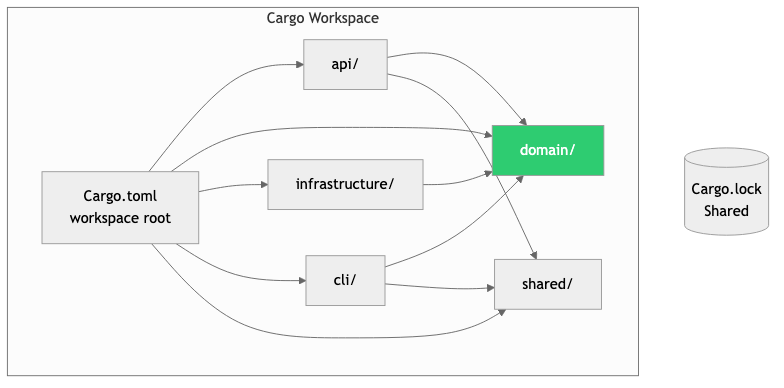
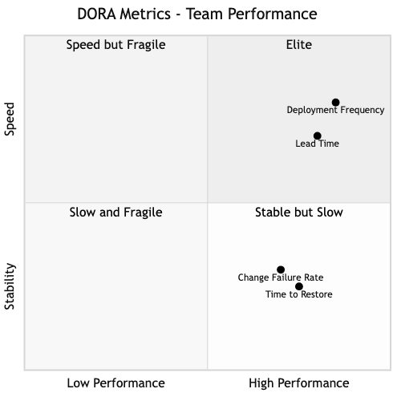

# Build Systems, Tooling & Developer Experience

## Diagrams






## Concepts

### Why Developer Experience Matters

Developer Experience (DX) is the overall experience developers have when working with your tools, codebase, and infrastructure. Good DX means: fast feedback loops, minimal friction, clear error messages, and reliable tooling.

Poor DX is a silent productivity killer. If CI takes 45 minutes, developers context-switch. If the build system is confusing, new hires waste their first week fighting it instead of shipping code. If dependency updates break the build, teams freeze versions and accumulate security vulnerabilities.

### Build Systems

A build system automates the process of transforming source code into executable software: compiling, linking, bundling, testing, and packaging.

#### Cargo (Rust)

Cargo is Rust's build system and package manager. It handles compilation, dependency management, testing, benchmarking, and publishing — all in one tool.

**Cargo workspace management:**

A workspace lets multiple related packages share dependencies and build artifacts.

```toml
# Cargo.toml (workspace root)
[workspace]
members = [
    "api",           # HTTP API server
    "domain",        # Core business logic
    "infrastructure",# Database, external APIs
    "cli",           # Command-line tool
    "shared",        # Shared types and utilities
]

[workspace.dependencies]
serde = { version = "1.0", features = ["derive"] }
tokio = { version = "1", features = ["full"] }
sqlx = { version = "0.7", features = ["postgres", "runtime-tokio"] }
```

```toml
# api/Cargo.toml
[package]
name = "api"

[dependencies]
domain = { path = "../domain" }
shared = { path = "../shared" }
serde.workspace = true
tokio.workspace = true
```

**Benefits of workspaces:**
- Shared `Cargo.lock` — all packages use the same dependency versions
- Shared build cache — compiling one package reuses artifacts from others
- Atomic changes — modify multiple packages in one commit

**Feature flags:**

Feature flags enable conditional compilation — include or exclude code at build time.

```toml
[features]
default = ["postgres"]
postgres = ["sqlx/postgres"]
mysql = ["sqlx/mysql"]
telemetry = ["opentelemetry", "tracing-opentelemetry"]
```

```rust
#[cfg(feature = "telemetry")]
fn init_tracing() {
    // OpenTelemetry setup
}

#[cfg(not(feature = "telemetry"))]
fn init_tracing() {
    // Simple stdout logging
}
```

```bash
# Build with specific features
cargo build --features "postgres,telemetry"
cargo build --no-default-features --features "mysql"
```

#### Build Optimization

**Incremental compilation:** Cargo only recompiles what changed. But some changes (modifying a widely-imported module) trigger large recompilations.

**Strategies for faster builds:**

| Strategy | Impact | How |
|----------|--------|-----|
| **Split large crates** | Reduces recompilation scope | Use workspace with focused crates |
| **Minimize proc macros** | Proc macros can't be incrementally compiled | Limit `derive` macro usage in hot paths |
| **Use `lld` or `mold` linker** | Linking is often the bottleneck | Set in `.cargo/config.toml` |
| **`cargo-nextest`** | Faster test execution | Parallel test runner |
| **`sccache`** | Shared compilation cache | Cache across CI runs and developers |
| **Release profile tuning** | Faster debug builds | Set `opt-level = 1` for dev profile |

```toml
# .cargo/config.toml
[target.x86_64-unknown-linux-gnu]
linker = "clang"
rustflags = ["-C", "link-arg=-fuse-ld=mold"]

[profile.dev]
opt-level = 1  # Slight optimization for debug builds
```

#### Monorepo Tooling

Large monorepos need tools to answer: "What changed? What needs to be rebuilt? What tests need to run?"

**Bazel** (Google's build system):
- Hermetic builds — builds are reproducible regardless of environment
- Fine-grained dependency graph — rebuilds only what's affected by changes
- Remote caching — share build artifacts across the team
- Multi-language support — same build system for Rust, Go, Java, etc.

**Nx** (JavaScript ecosystem):
- Computation caching — skip tasks whose inputs haven't changed
- Affected commands — `nx affected:test` only tests packages affected by your changes
- Dependency graph visualization

**Turborepo:**
- Task-based build system for monorepos
- Remote caching out of the box
- Simpler than Bazel, focused on JavaScript/TypeScript

### Dependency Management

#### Dependency Security

Dependencies are a supply chain. A compromised or vulnerable dependency can compromise your application.

```bash
# Audit dependencies for known vulnerabilities
cargo audit

# Check for outdated dependencies
cargo outdated

# Update dependencies (respecting semver)
cargo update
```

**`cargo-deny`** — A more comprehensive dependency checker:

```toml
# deny.toml
[licenses]
allow = ["MIT", "Apache-2.0", "BSD-3-Clause"]
deny = ["GPL-3.0"]

[bans]
deny = [
    { name = "openssl", wrappers = ["openssl-sys"] },  # Prefer rustls
]

[advisories]
db-urls = ["https://github.com/rustsec/advisory-db"]
vulnerability = "deny"
```

```bash
cargo deny check
```

**Best practices:**
- Pin major versions in `Cargo.toml`, let `Cargo.lock` pin exact versions
- Run `cargo audit` in CI — fail the build on known vulnerabilities
- Review dependency changes in PRs — a new dependency is a supply chain decision
- Minimize dependency count — fewer dependencies = smaller attack surface

### Developer Productivity Metrics

#### DORA Metrics

DORA (DevOps Research and Assessment) identified four key metrics that predict software delivery performance:

| Metric | Elite | High | Medium | Low |
|--------|-------|------|--------|-----|
| **Deployment Frequency** | On-demand (multiple/day) | Weekly-monthly | Monthly-biannual | Biannual+ |
| **Lead Time for Changes** | <1 hour | 1 day-1 week | 1-6 months | 6+ months |
| **Change Failure Rate** | 0-15% | 16-30% | 16-30% | 46-60% |
| **Time to Restore Service** | <1 hour | <1 day | 1 day-1 week | 6+ months |

**How to use DORA metrics:**
- Measure them regularly (weekly/monthly)
- Use them as team health indicators, not individual performance metrics
- Focus on improving the worst metric first — it's usually the bottleneck

#### SPACE Framework

SPACE (by GitHub, Microsoft, University of Victoria) measures developer productivity across five dimensions:

- **Satisfaction** — How happy are developers with their tools and processes?
- **Performance** — Quality of code, reliability of systems
- **Activity** — Volume of work (commits, PRs, deployments) — use carefully, easily gamed
- **Communication** — Quality of collaboration, code review speed
- **Efficiency** — Minimal friction, fast feedback loops

**Key insight:** No single metric captures developer productivity. Use a balanced set across multiple dimensions.

### IDE & Language Server

**rust-analyzer** is the language server for Rust, providing:
- Code completion and inline type hints
- Go-to-definition across crates
- Inline error messages
- Refactoring tools (rename, extract function)
- Macro expansion visualization

**Maximizing rust-analyzer performance:**
- Use a workspace — rust-analyzer analyzes the entire workspace
- Add `rust-analyzer.check.command = "clippy"` to run clippy on save
- Configure `rust-analyzer.cargo.features` for feature-flag-dependent code

## Business Value

- **Developer retention**: Developers leave companies with poor tooling and slow build systems. Good DX is a recruiting and retention advantage.
- **Faster time-to-market**: Reducing build times from 30 minutes to 5 minutes saves each developer ~1 hour/day in waiting. For a 20-person team, that's 20 hours/day — 4,000 hours/year.
- **Reduced security risk**: Automated dependency auditing catches vulnerabilities before they reach production. A single compromised dependency can cost millions (the SolarWinds attack cost affected companies an estimated $100B collectively).
- **Predictable delivery**: DORA metrics provide leading indicators of delivery capability. Teams that track and improve these metrics deliver more reliably.
- **Onboarding speed**: Good tooling and a well-configured workspace let new hires run the project on day one instead of fighting environment setup for a week.

## Real-World Examples

### Google's Bazel
Google built Bazel (internally called Blaze) to handle their monorepo of billions of lines of code. Bazel provides hermetic, reproducible builds with remote caching — a build that takes 30 minutes locally completes in 2 minutes using cached artifacts. This infrastructure is what enables Google's trunk-based development at scale: every engineer commits to the same branch, and CI validates the change against all affected code.

### Vercel's Turborepo
Vercel acquired Turborepo to solve JavaScript monorepo build performance. Key innovation: content-addressable hashing of task inputs. If the inputs to a build step haven't changed since the last run, the output is served from cache (local or remote). This reduced build times for some teams from 45 minutes to 5 minutes.

### Shopify's Developer Productivity Team
Shopify has a dedicated developer productivity team that measures and improves DX. They track: time from laptop open to first commit, CI duration, time to first PR review, and developer satisfaction scores. When they identified CI as a bottleneck (tests took 30+ minutes), they invested in parallelization, selective testing, and caching — cutting CI to under 10 minutes. This measurably increased deployment frequency.

### Rust's Compilation Speed Improvements
The Rust compiler team continuously invests in compilation speed. Incremental compilation (added in 2018) reduced rebuild times by 50-80% for typical changes. The `mold` linker (created by Rui Ueyama, who also wrote `lld`) further cuts link times by 5-10x. These infrastructure improvements compound across the entire Rust ecosystem.

## Common Mistakes & Pitfalls

- **"Works on my machine"** — Development environments that aren't reproducible. Use lockfiles, containerized dev environments, or Nix for reproducibility.

- **Ignoring build times** — "30-minute builds are just how it is." No. Slow builds kill productivity. Invest in caching, parallelization, and incremental builds.

- **No dependency policy** — Anyone can add any dependency without review. Every dependency is a maintenance and security commitment. Review new dependencies in PRs.

- **Measuring only activity metrics** — Counting commits, lines of code, or PRs per week. These metrics are easily gamed and don't correlate with value delivered. Use DORA and SPACE frameworks instead.

- **Monorepo without tooling** — Adopting a monorepo without the tooling to support it. Without affected-path detection and build caching, a monorepo CI runs everything on every change — and gets slower linearly.

- **Over-engineering the build** — Custom build scripts that nobody understands. Prefer standard tooling (Cargo, Bazel) over bespoke solutions.

## Trade-offs

| Approach | Pros | Cons |
|----------|------|------|
| **Cargo workspaces** | Simple, Rust-native, zero config | Limited to Rust, no cross-language support |
| **Bazel** | Multi-language, hermetic, remote caching | Steep learning curve, complex configuration |
| **Custom build scripts** | Exactly what you need | Maintenance burden, tribal knowledge |
| **Monorepo** | Shared tooling, atomic changes | Needs specialized tooling at scale |
| **Polyrepo** | Simple per-repo, independent CI | Cross-repo changes are painful |

## When to Use / When Not to Use

**Cargo workspaces — use when:**
- Your project has multiple related Rust packages
- You want shared dependency versions and build caching
- Your team is primarily Rust

**Bazel — use when:**
- You have a large monorepo with multiple languages
- Build reproducibility is critical (regulated industries)
- You need remote build caching for large teams

**DORA metrics — always track:**
- They're the best predictor of software delivery performance
- Use them for team improvement, never for individual evaluation

**Dependency auditing — always do:**
- Run `cargo audit` and `cargo deny` in CI
- Review new dependencies in code review

## Key Takeaways

1. Build speed is a multiplier on everything else. Every minute of build time is paid by every developer, every day.
2. Cargo workspaces are the right default for multi-crate Rust projects. They share dependencies, build cache, and lockfile.
3. Feature flags enable compile-time customization without maintaining multiple codebases.
4. Dependency security is supply chain security. Audit dependencies automatically in CI.
5. DORA metrics (deployment frequency, lead time, change failure rate, recovery time) are the best predictors of team performance.
6. Developer productivity is multi-dimensional (SPACE). Don't reduce it to a single number.
7. Invest in DX like a product. Measure it, prioritize improvements, and treat developer friction as a bug.

## Further Reading

- **Books:**
  - *Accelerate* — Nicole Forsgren, Jez Humble, Gene Kim (2018) — The research behind DORA metrics
  - *Software Engineering at Google* — Chapter on build systems and dependency management

- **Papers & Articles:**
  - [DORA State of DevOps Report](https://dora.dev/) — Annual research on software delivery performance
  - [SPACE Framework](https://queue.acm.org/detail.cfm?id=3454124) — Developer productivity framework
  - [Cargo Book — Workspaces](https://doc.rust-lang.org/cargo/reference/workspaces.html) — Official Cargo workspace documentation

- **Tools:**
  - [cargo-audit](https://crates.io/crates/cargo-audit) — Security vulnerability auditing
  - [cargo-deny](https://crates.io/crates/cargo-deny) — License, ban, and advisory checking
  - [cargo-nextest](https://nexte.st/) — Faster test runner for Rust
  - [sccache](https://github.com/mozilla/sccache) — Shared compilation cache
  - [mold](https://github.com/rui314/mold) — High-performance linker
