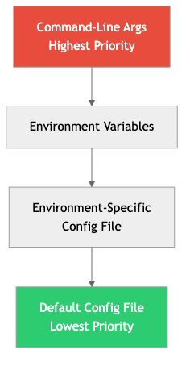

# Software Configuration Management

## Diagrams




## Concepts

### What is Configuration Management?

Configuration management is the practice of managing application behavior through external settings rather than code changes. It enables the same code to behave differently across environments (development, staging, production) and to change behavior at runtime without redeployment.

**Configuration includes:** Database URLs, API keys, feature flags, rate limits, log levels, timeouts, UI settings, experiment parameters, and any value that might differ between environments or need to change without a code deploy.

### Config as Code

Configuration should be treated like code: version controlled, reviewed, tested, and auditable.

**Environment-specific config files:**

```toml
# config/development.toml
[database]
url = "postgres://localhost:5432/myapp_dev"
max_connections = 5

[server]
port = 3000
log_level = "debug"

# config/production.toml
[database]
url = "${DATABASE_URL}"  # Injected from environment
max_connections = 50

[server]
port = 8080
log_level = "info"
```

**Loading configuration in Rust:**

```rust
use config::{Config, Environment, File};

#[derive(Deserialize)]
struct AppConfig {
    database: DatabaseConfig,
    server: ServerConfig,
}

fn load_config() -> Result<AppConfig, config::ConfigError> {
    let env = std::env::var("APP_ENV").unwrap_or_else(|_| "development".to_string());

    Config::builder()
        .add_source(File::with_name("config/default"))
        .add_source(File::with_name(&format!("config/{env}")).required(false))
        .add_source(Environment::with_prefix("APP").separator("__"))
        .build()?
        .try_deserialize()
}
```

**Priority order (later overrides earlier):**
1. Default config file
2. Environment-specific config file
3. Environment variables
4. Command-line arguments

### Feature Flags & Toggles

Feature flags decouple deployment from release. You deploy code to production but control whether users see it through flags.

**Types of feature flags:**

| Type | Lifetime | Purpose | Example |
|------|----------|---------|---------|
| **Release toggle** | Days-weeks | Hide incomplete features | `new_checkout_flow: false` |
| **Experiment toggle** | Weeks-months | A/B testing | `show_recommendations: 50%` |
| **Ops toggle** | Permanent | Circuit breaker, kill switch | `enable_external_api: true` |
| **Permission toggle** | Permanent | Access control | `beta_features: [user_123, user_456]` |

**Feature flag evaluation:**

```rust
struct FeatureFlags {
    flags: HashMap<String, FlagConfig>,
}

enum FlagConfig {
    Boolean(bool),
    Percentage(f64),                    // Roll out to X% of users
    UserList(HashSet<String>),          // Specific users only
    Rule(Box<dyn Fn(&User) -> bool>),  // Custom targeting
}

impl FeatureFlags {
    fn is_enabled(&self, flag: &str, user: &User) -> bool {
        match self.flags.get(flag) {
            Some(FlagConfig::Boolean(v)) => *v,
            Some(FlagConfig::Percentage(pct)) => {
                // Deterministic: same user always gets the same result
                let hash = hash_user_flag(user.id, flag);
                (hash % 100) as f64 / 100.0 < *pct
            }
            Some(FlagConfig::UserList(users)) => users.contains(&user.id),
            Some(FlagConfig::Rule(rule)) => rule(user),
            None => false,
        }
    }
}
```

**Feature flag lifecycle:**
1. Create the flag (disabled)
2. Deploy the code behind the flag
3. Enable for internal testing
4. Gradually roll out (10% → 50% → 100%)
5. Remove the flag and the old code path

**The flag debt problem:** Feature flags that are never cleaned up accumulate. Every flag doubles potential code paths. Track flag age and schedule cleanup as part of the release process.

### Secrets Management

Secrets (API keys, database passwords, encryption keys, tokens) require special handling. They must never be stored in code, version control, or plain-text config files.

**Hierarchy of secrets management:**

| Approach | Security | Complexity | Use case |
|----------|----------|------------|----------|
| **Environment variables** | Low-medium | Low | Small projects, dev environments |
| **Encrypted config files (SOPS)** | Medium | Medium | Config-as-code with encryption |
| **Secrets manager (Vault, AWS SM)** | High | High | Production, regulated industries |
| **Hardware security modules (HSM)** | Highest | Highest | Cryptographic keys, financial systems |

**SOPS (Secrets OPerationS):**
Encrypts specific values in config files while leaving keys in plaintext (readable structure, encrypted values).

```yaml
# secrets.yaml (encrypted with SOPS)
database:
    password: ENC[AES256_GCM,data:abc123...,type:str]
    host: production-db.internal  # Not encrypted
api_keys:
    stripe: ENC[AES256_GCM,data:def456...,type:str]
```

**HashiCorp Vault:**
A centralized secrets management system. Applications authenticate to Vault and retrieve secrets at runtime.

```rust
// Application fetches secrets from Vault at startup
async fn get_database_url(vault: &VaultClient) -> Result<String, Error> {
    let secret = vault.read_secret("secret/data/myapp/database").await?;
    Ok(secret.get("url").unwrap().to_string())
}
```

**Secrets rotation:** Secrets should be rotated regularly. Vault can automatically rotate database credentials, generating new passwords and updating the database — without application downtime.

### Runtime Configuration

Some configuration needs to change without restart or redeployment: rate limits during traffic spikes, feature flag toggles during incidents, log levels for debugging.

**Approaches:**
- **Polling:** Application periodically checks a config source (every 30 seconds)
- **Push-based:** Config service pushes changes to applications (WebSocket, SSE)
- **Config reload signal:** Send SIGHUP to the process to trigger a config reload

### Configuration Drift Detection

Configuration drift occurs when the actual state of a system diverges from the intended state — usually through manual changes.

**Example:** Someone manually changes a database setting in production via psql, but the change isn't reflected in the config-as-code repo. The next deployment reverts the change, causing an incident.

**Prevention:**
- All changes go through config-as-code (no manual changes)
- Regular drift detection: compare actual state to declared state
- Immutable infrastructure: instead of changing config, deploy a new instance with the correct config

### A/B Testing Infrastructure

A/B testing (split testing) is a specific application of feature flags for measuring the impact of changes.

```
User request → [Experiment Assignment] → Variant A (control) → Track metrics
                                       → Variant B (treatment) → Track metrics

After statistical significance is reached:
  → Variant B converts 15% better → Roll out to everyone
  → Variant B is worse → Roll back to Variant A
```

**Key requirements:**
- **Deterministic assignment:** Same user always sees the same variant
- **Statistical significance:** Wait for enough data before declaring a winner
- **Isolation:** Experiments don't interfere with each other
- **Metric tracking:** Connect experiment assignment to business metrics (conversion, revenue, engagement)

## Business Value

- **Faster incident response**: Feature flags let you disable broken features in seconds without deploying code. An ops toggle saved Slack from a 30-minute outage — they disabled a problematic feature in 15 seconds.
- **Risk-free releases**: Gradual rollouts (1% → 10% → 50% → 100%) limit blast radius. If the new feature causes errors, only a fraction of users are affected.
- **Data-driven decisions**: A/B testing replaces opinions with data. Amazon runs thousands of experiments simultaneously. A/B testing their checkout button color once increased revenue by millions annually.
- **Security compliance**: Proper secrets management prevents credential exposure — the #1 cause of data breaches according to Verizon's Data Breach Investigations Report.
- **Environment consistency**: Config-as-code ensures all environments are configured identically, preventing the "works in staging but not production" class of bugs.

## Real-World Examples

### LaunchDarkly and Feature Flag Management
LaunchDarkly (a feature flag platform) serves trillions of feature flag evaluations per day. Their clients (IBM, Microsoft, GoDaddy) use feature flags for gradual rollouts, A/B testing, and kill switches. LaunchDarkly's architecture evaluates flags at the edge (in SDKs, not via API calls), enabling <10ms evaluation times even at massive scale.

### Netflix's Configuration Management
Netflix's Archaius system manages configuration across thousands of microservices. Configuration is hierarchical: global defaults → service-specific → environment-specific → instance-specific. Changes propagate in real-time (push-based). During incidents, operators can change rate limits, disable features, or redirect traffic — all through configuration changes, without deploying code.

### GitHub's Feature Flags (Scientist)
GitHub built "Scientist," a library for safely refactoring critical code paths. It runs the old and new code simultaneously, compares results, and reports discrepancies — all controlled by feature flags. This let them refactor their merge algorithm (a critical, high-risk code path) with confidence that the new implementation produced identical results.

### The SolarWinds Attack — Why Secrets Management Matters
The SolarWinds supply chain attack (2020) was partly enabled by a hardcoded credential ("solarwinds123") that was committed to a public GitHub repository. This password protected the update server used to distribute compromised software to 18,000 customers, including US government agencies. Proper secrets management (never in code, rotated regularly, least-privilege access) would have prevented this attack vector.

## Common Mistakes & Pitfalls

- **Secrets in source code** — Hardcoded API keys, passwords in config files committed to Git. Use environment variables or a secrets manager. Run `git-secrets` or `gitleaks` in CI.

- **Feature flag sprawl** — Hundreds of flags, many stale. Old flags create dead code paths and testing complexity. Track flag creation dates, set expiration reminders, and enforce cleanup.

- **Configuration spaghetti** — Settings scattered across env vars, config files, database rows, and hardcoded values. Centralize configuration loading in one module with clear precedence rules.

- **No config validation at startup** — Application starts with invalid config and fails later at runtime. Validate all configuration eagerly at startup and fail fast with clear error messages.

- **Same secrets across environments** — Using the same API key in development and production. Each environment should have its own credentials with appropriate access levels.

- **Manual production changes** — Changing config directly on servers. This creates drift and makes it impossible to reproduce the environment. All changes through config-as-code.

## Trade-offs

| Approach | Pros | Cons |
|----------|------|------|
| **Environment variables** | Simple, universal, no external dependency | Flat namespace, hard to manage many vars |
| **Config files** | Structured, readable, version controlled | Secrets need separate handling |
| **Vault/Secrets Manager** | Secure, rotation, audit trail | Operational complexity, single point of dependency |
| **Feature flag service** | Real-time toggles, targeting, A/B testing | Added dependency, evaluation latency |
| **Database-stored config** | Runtime changeable, UI-manageable | Deployment mismatch, harder to version control |

## When to Use / When Not to Use

**Feature flags — use for:**
- Gradual rollouts of risky features
- A/B testing
- Kill switches for non-critical features
- Long-lived branches that need to merge early

**Feature flags — avoid for:**
- Permanent branching logic (use proper if/else)
- Replacing proper access control (use RBAC)
- When the old code path will never be needed again (just delete it)

**Secrets manager (Vault) — use for:**
- Production environments
- Regulated industries
- Automated credential rotation
- Teams with 10+ services needing shared secrets

**SOPS — use for:**
- Small to medium teams wanting secrets in Git (encrypted)
- When Vault is overkill but env vars are insufficient

## Key Takeaways

1. Configuration should be separate from code. The same code should run in any environment with different config.
2. Feature flags decouple deployment from release. Deploy code any time; control who sees it through flags.
3. Secrets never belong in source code or plain-text config. Use environment variables (minimum), SOPS (medium), or Vault (production).
4. Validate configuration at startup. Fail fast with clear errors, not at runtime with cryptic failures.
5. Feature flags create technical debt. Track them, set expiration dates, and clean them up after full rollout.
6. A/B testing requires statistical rigor. Don't declare a winner with 50 data points — wait for significance.
7. Configuration drift is a silent risk. Use config-as-code and detect drift automatically.

## Further Reading

- **Books:**
  - *Feature Flags: A Practical Guide* — Various authors — Comprehensive guide to feature flag patterns
  - *Release It!* — Michael T. Nygard — Configuration and operational patterns for production

- **Papers & Articles:**
  - [Twelve-Factor App — Config](https://12factor.net/config) — Config in the environment
  - [Feature Toggles (aka Feature Flags)](https://martinfowler.com/articles/feature-toggles.html) — Martin Fowler's comprehensive guide
  - [Netflix Archaius](https://github.com/Netflix/archaius) — Netflix's configuration library

- **Tools:**
  - [config (Rust crate)](https://crates.io/crates/config) — Layered configuration for Rust
  - [SOPS](https://github.com/getsops/sops) — Encrypted file editor for secrets
  - [HashiCorp Vault](https://www.vaultproject.io/) — Secrets management
  - [LaunchDarkly](https://launchdarkly.com/) / [Unleash](https://www.getunleash.io/) — Feature flag platforms
