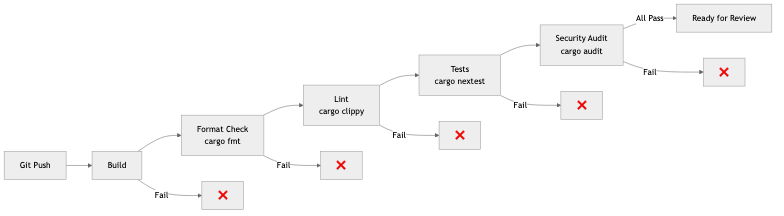
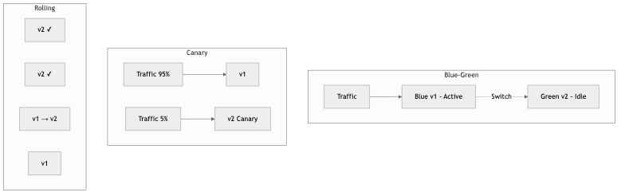

# 19 - CI/CD & Deployment

## Diagrams






## Concepts

### Continuous Integration (CI)

CI is the practice of merging all developers' work into a shared mainline frequently (at least daily), with each merge validated by automated builds and tests.

**A CI pipeline typically runs:**

```
Push to branch → [Build] → [Lint] → [Unit Tests] → [Integration Tests] → [Security Scan] → ✅ Ready for review
```

**What CI validates:**
- **Compilation** — Does the code compile without errors?
- **Linting** — Does it meet coding standards? (`cargo clippy`, `cargo fmt --check`)
- **Tests** — Do unit and integration tests pass?
- **Security** — Are there known vulnerabilities? (`cargo audit`)
- **Type checking** — In Rust, the compiler is your most powerful CI tool

**Example GitHub Actions CI for Rust:**

```yaml
name: CI
on: [push, pull_request]

jobs:
  check:
    runs-on: ubuntu-latest
    steps:
      - uses: actions/checkout@v4
      - uses: dtolnay/rust-toolchain@stable
        with:
          components: clippy, rustfmt

      - name: Format check
        run: cargo fmt --all --check

      - name: Clippy
        run: cargo clippy --all-targets -- -D warnings

      - name: Tests
        run: cargo nextest run

      - name: Security audit
        run: cargo audit
```

### Continuous Delivery vs Continuous Deployment

**Continuous Delivery:** Every change that passes CI is *ready* to deploy, but a human decides when to deploy.

**Continuous Deployment:** Every change that passes CI is *automatically* deployed to production. No human gate.

```
Continuous Delivery:
  Code → CI → [Staging] → Manual approval → [Production]

Continuous Deployment:
  Code → CI → [Staging] → Auto-deploy → [Production]
```

Most teams practice continuous delivery. Continuous deployment requires very high confidence in your test suite and monitoring.

### Deployment Strategies

#### Blue-Green Deployment

Maintain two identical environments. Deploy to the inactive one, verify, then switch traffic.

```
Before:  Traffic → [Blue (v1)] ← active     [Green (idle)]
Deploy:  Traffic → [Blue (v1)] ← active     [Green (v2)] ← deploying
Switch:  Traffic → [Blue (idle)]             [Green (v2)] ← active
```

**Pros:** Instant rollback (switch back to Blue), zero downtime
**Cons:** Double infrastructure cost, database migrations need careful handling

#### Canary Deployment

Route a small percentage of traffic to the new version. Monitor for errors. Gradually increase if healthy.

```
Step 1: 5% traffic  → [v2]    95% traffic → [v1]
Step 2: 25% traffic → [v2]    75% traffic → [v1]
Step 3: 50% traffic → [v2]    50% traffic → [v1]
Step 4: 100% traffic → [v2]   0% traffic  → [v1]
```

**Pros:** Limited blast radius, real production validation
**Cons:** More complex routing, need good metrics to detect issues

#### Rolling Deployment

Update instances one at a time. Each instance is taken out of the load balancer, updated, health-checked, and returned.

```
[v1] [v1] [v1] [v1]    ← Start
[v2] [v1] [v1] [v1]    ← First instance updated
[v2] [v2] [v1] [v1]    ← Second instance updated
[v2] [v2] [v2] [v1]    ← Third instance updated
[v2] [v2] [v2] [v2]    ← Complete
```

**Pros:** No extra infrastructure, gradual rollout
**Cons:** Mix of versions during deployment, slower rollback

### Containers & Docker

Containers package an application with all its dependencies into a portable, isolated unit that runs consistently across environments.

**Docker internals:**
Docker uses Linux kernel features to isolate processes:
- **Namespaces** — Isolate process IDs, network, filesystem, users
- **cgroups** — Limit CPU, memory, I/O
- **Union filesystem** — Layer images efficiently (shared base layers)

**Multi-stage Dockerfile for Rust:**

```dockerfile
# Stage 1: Build
FROM rust:1.77 AS builder
WORKDIR /app
COPY Cargo.toml Cargo.lock ./
COPY src ./src
RUN cargo build --release

# Stage 2: Runtime (minimal image)
FROM debian:bookworm-slim
RUN apt-get update && apt-get install -y ca-certificates && rm -rf /var/lib/apt/lists/*
COPY --from=builder /app/target/release/myapp /usr/local/bin/
EXPOSE 8080
CMD ["myapp"]
```

**Why multi-stage:** The build image (with Rust toolchain) is ~1.5 GB. The runtime image (just the binary) is ~80 MB. Smaller images = faster deploys, less attack surface.

### Kubernetes Fundamentals

Kubernetes orchestrates containers across a cluster of machines. It handles deployment, scaling, networking, and self-healing.

**Key concepts:**

| Concept | Purpose | Analogy |
|---------|---------|---------|
| **Pod** | Smallest deployable unit (one or more containers) | A single running instance |
| **Deployment** | Manages a set of identical pods | "Run 3 copies of my app" |
| **Service** | Stable network endpoint for pods | Load balancer for pods |
| **Ingress** | External traffic routing (HTTP) | Reverse proxy |
| **ConfigMap** | Non-sensitive configuration | Environment variables |
| **Secret** | Sensitive configuration | Encrypted env vars |
| **Namespace** | Logical cluster partitioning | Folders for resources |

**Example Kubernetes deployment:**

```yaml
apiVersion: apps/v1
kind: Deployment
metadata:
  name: myapp
spec:
  replicas: 3
  selector:
    matchLabels:
      app: myapp
  template:
    metadata:
      labels:
        app: myapp
    spec:
      containers:
        - name: myapp
          image: myregistry/myapp:v1.2.3
          ports:
            - containerPort: 8080
          resources:
            requests:
              cpu: 100m
              memory: 128Mi
            limits:
              cpu: 500m
              memory: 512Mi
          readinessProbe:
            httpGet:
              path: /health
              port: 8080
            initialDelaySeconds: 5
          livenessProbe:
            httpGet:
              path: /health
              port: 8080
            initialDelaySeconds: 15
```

#### Health Check Endpoint in Rust (axum)

The Kubernetes deployment above references `/health` for its readiness and liveness probes. Here is how to implement that endpoint so the cluster knows when a pod is ready to receive traffic and when it should be restarted:

```rust
use axum::{routing::get, Json, Router};
use serde::Serialize;
use std::sync::Arc;
use tokio::sync::RwLock;

#[derive(Clone)]
struct AppState {
    /// Flipped to false when the process receives a shutdown signal.
    ready: Arc<RwLock<bool>>,
}

#[derive(Serialize)]
struct HealthResponse {
    status: &'static str,
    version: &'static str,
}

/// Liveness probe — "is the process alive?"
/// Returns 200 as long as the server can respond at all.
async fn liveness() -> Json<HealthResponse> {
    Json(HealthResponse {
        status: "alive",
        version: env!("CARGO_PKG_VERSION"),
    })
}

/// Readiness probe — "should the load balancer send traffic here?"
/// Returns 503 once a shutdown has been initiated so that the
/// load balancer drains traffic before the pod terminates.
async fn readiness(
    axum::extract::State(state): axum::extract::State<AppState>,
) -> (axum::http::StatusCode, Json<HealthResponse>) {
    let ready = *state.ready.read().await;
    let status_code = if ready {
        axum::http::StatusCode::OK
    } else {
        axum::http::StatusCode::SERVICE_UNAVAILABLE
    };
    (
        status_code,
        Json(HealthResponse {
            status: if ready { "ready" } else { "shutting_down" },
            version: env!("CARGO_PKG_VERSION"),
        }),
    )
}

fn health_routes(state: AppState) -> Router {
    Router::new()
        .route("/healthz", get(liveness))
        .route("/ready", get(readiness))
        .with_state(state)
}
```

A common pattern is to separate liveness (`/healthz`) from readiness (`/ready`). Kubernetes uses liveness to decide whether to *restart* a pod (the process is hung) and readiness to decide whether to *route traffic* to it (the pod is still starting up, or is draining before shutdown).

#### Graceful Shutdown in Rust (axum + tokio)

During a rolling deployment, Kubernetes sends `SIGTERM` to the old pod and expects it to finish in-flight requests before exiting. If the process ignores the signal and dies immediately, users see failed requests. A graceful shutdown handler solves this:

```rust
use std::sync::Arc;
use tokio::net::TcpListener;
use tokio::sync::RwLock;

#[tokio::main]
async fn main() {
    let state = AppState {
        ready: Arc::new(RwLock::new(true)),
    };

    let app = Router::new()
        .route("/healthz", get(liveness))
        .route("/ready", get(readiness))
        // ... application routes ...
        .with_state(state.clone());

    let listener = TcpListener::bind("0.0.0.0:8080").await.unwrap();
    println!("listening on {}", listener.local_addr().unwrap());

    // `axum::serve` accepts a future that resolves when the server
    // should begin shutting down.  We use a tokio signal listener
    // that completes on SIGTERM (the signal Kubernetes sends).
    axum::serve(listener, app)
        .with_graceful_shutdown(shutdown_signal(state))
        .await
        .unwrap();

    println!("shutdown complete");
}

async fn shutdown_signal(state: AppState) {
    let ctrl_c = async {
        tokio::signal::ctrl_c()
            .await
            .expect("failed to listen for ctrl+c");
    };

    let sigterm = async {
        tokio::signal::unix::signal(tokio::signal::unix::SignalKind::terminate())
            .expect("failed to listen for SIGTERM")
            .recv()
            .await;
    };

    // Wait for either signal.
    tokio::select! {
        _ = ctrl_c => {},
        _ = sigterm => {},
    }

    println!("shutdown signal received, draining connections...");

    // Mark the pod as not-ready so the readiness probe fails and
    // Kubernetes stops sending new traffic to this pod.
    *state.ready.write().await = false;

    // Give the load balancer a moment to notice the failing probe
    // before axum starts refusing new connections.
    tokio::time::sleep(std::time::Duration::from_secs(5)).await;
}
```

**How this interacts with Kubernetes during a rolling deployment:**

1. Kubernetes sends `SIGTERM` to the old pod.
2. `shutdown_signal` fires and sets `ready` to `false`.
3. The readiness probe starts returning 503, so the Service stops routing new requests here.
4. After a 5-second grace period, axum stops accepting new connections but finishes all in-flight requests.
5. Once all responses are sent, the server exits cleanly.
6. Only then does Kubernetes remove the pod.

This is why the deployment YAML above sets `readinessProbe` — without it, users hit pods that are mid-shutdown.

### GitOps

GitOps uses Git as the single source of truth for infrastructure and application configuration. Changes to infrastructure happen through Git commits and pull requests, not through manual commands.

**GitOps workflow:**

```
Developer changes config → PR → Review → Merge → GitOps agent detects change → Apply to cluster
```

**Tools:**
- **ArgoCD** — Kubernetes GitOps controller. Watches a Git repo, syncs cluster state to match.
- **Flux** — Alternative GitOps toolkit for Kubernetes.

**Benefits:** Audit trail (Git history), rollback (revert a commit), consistency (declared state = actual state), review process (infrastructure changes go through PRs).

### Infrastructure as Code (IaC)

IaC manages infrastructure through declarative configuration files rather than manual processes.

**Terraform example:**

```hcl
resource "aws_rds_instance" "main" {
  identifier        = "myapp-production"
  engine            = "postgres"
  engine_version    = "15.4"
  instance_class    = "db.r6g.large"
  allocated_storage = 100

  db_name  = "myapp"
  username = var.db_username
  password = var.db_password

  multi_az               = true
  backup_retention_period = 7

  tags = {
    Environment = "production"
  }
}
```

**Terraform vs Pulumi:**

| Feature | Terraform | Pulumi |
|---------|-----------|--------|
| **Language** | HCL (domain-specific) | Real programming languages (TypeScript, Python, Go, etc.) |
| **State** | Remote state file | Managed service or self-hosted |
| **Ecosystem** | Largest provider ecosystem | Growing, uses Terraform providers |
| **Testing** | Limited (terratest) | Standard testing frameworks |
| **Best for** | Most infrastructure, large community | Complex logic, existing language expertise |

### Reproducible Builds

A reproducible build produces identical output from identical input, regardless of when or where it's built.

**Why it matters:**
- Security — Verify that the deployed binary matches the source code
- Debugging — Reproduce the exact build that's running in production
- Compliance — Prove the build chain is untampered

**Techniques:**
- Pin all dependency versions (lockfiles)
- Pin toolchain versions (rust-toolchain.toml)
- Deterministic build environments (Docker, Nix)
- Content-addressable artifact storage (store artifacts by their hash)

### Artifact Management

Build artifacts (Docker images, binaries, packages) need storage, versioning, and distribution.

**Best practices:**
- Tag images with the Git SHA, not just `latest`: `myapp:a1b2c3d`
- Use a private registry (GitHub Container Registry, AWS ECR, Docker Hub)
- Scan images for vulnerabilities before deploying
- Implement image signing for supply chain security

## Business Value

- **Faster time-to-market**: Teams with mature CI/CD deploy 200x more frequently than those without (DORA research). Features reach users in hours, not months.
- **Reduced deployment risk**: Blue-green and canary deployments limit blast radius. A bug affects 5% of users for 5 minutes instead of 100% for 2 hours.
- **Developer productivity**: Automated CI catches bugs before code review, saving reviewer time and reducing back-and-forth.
- **Compliance**: GitOps provides complete audit trails for every change. IaC ensures environments are consistent and reproducible.
- **Cost optimization**: Containerized, auto-scaling deployments right-size infrastructure based on actual demand.

## Real-World Examples

### GitHub's Deployment System
GitHub deploys to production dozens of times per day using a ChatOps system. Engineers type `/deploy` in a chat channel, which triggers a canary deployment. The system monitors error rates and latency for 10 minutes. If healthy, it proceeds to full rollout. If not, it automatically rolls back. The entire process takes ~15 minutes from command to full deployment.

### Spotify's Deployment Pipeline
Spotify's CI/CD pipeline runs ~15,000 builds per day. They use a progressive delivery model: code goes through CI, deploys to a canary environment, gets validated by automated checks and synthetic tests, then gradually rolls out. Their golden rule: every deploy must be independently rollbackable.

### Amazon's Deployment Velocity
Amazon deploys code every 11.7 seconds on average (across all services). This velocity is enabled by: fully automated CI/CD pipelines, automated canary analysis, one-box deployment (deploy to one instance first), and automatic rollback triggered by metric anomalies. Their deployment philosophy: small changes, deployed frequently, are safer than large changes deployed rarely.

### Etsy's Continuous Deployment Pioneer
Etsy was an early pioneer of continuous deployment (2010). They deployed to production 50+ times per day with a team of ~200 engineers. Key practices: feature flags for incomplete work, comprehensive monitoring dashboards visible to everyone, and a culture where deploying was normal (not a special event). They showed that frequent, small deployments are safer than infrequent, large ones.

## Common Mistakes & Pitfalls

- **Slow CI pipelines** — CI that takes 45 minutes kills developer flow. Target <10 minutes. Parallelize tests, cache dependencies, and only run affected tests.

- **Testing in production without monitoring** — Canary deployments without automated metric comparison are just deployments. You need automated anomaly detection to catch regressions.

- **"It works on my machine" Docker** — Dockerfile that depends on host state (cached layers, local files). Use multi-stage builds, pin base image versions, and test the built image.

- **Manual deployments** — Any manual step is a step that can be forgotten, done wrong, or skipped under pressure. Automate everything.

- **No rollback plan** — Every deployment should have a defined rollback procedure. Test rollbacks regularly — a rollback that doesn't work is worse than no rollback.

- **Deploying on Friday** — Unless your monitoring and on-call are excellent, avoid deploying before weekends. Bugs discovered on Saturday with skeleton staffing are painful.

## Trade-offs

| Strategy | Pros | Cons |
|----------|------|------|
| **Blue-green** | Instant rollback, zero downtime | Double infrastructure cost |
| **Canary** | Real traffic validation, limited blast radius | Complex routing, needs good metrics |
| **Rolling** | No extra infrastructure | Mixed versions during deploy |
| **Kubernetes** | Powerful orchestration, self-healing | Complex, steep learning curve |
| **Serverless** | No infrastructure management, auto-scaling | Cold starts, vendor lock-in |
| **GitOps** | Audit trail, declarative, reviewable | Requires Git workflow discipline |

## When to Use / When Not to Use

**Canary deployments — use for:**
- User-facing services where regressions directly impact revenue
- Services with good observability (metrics, alerting)

**Blue-green — use for:**
- Services where instant rollback is critical
- Stateless services (stateful is harder — database schemas)

**Kubernetes — use for:**
- Teams running 5+ services with different scaling needs
- When you need auto-scaling, self-healing, and rolling updates

**Kubernetes — avoid for:**
- Single-service applications
- Teams without Kubernetes operational experience
- When a PaaS (Fly.io, Railway, Render) is sufficient

## Key Takeaways

1. CI is non-negotiable. Every merge to main should be automatically built, linted, tested, and security-scanned.
2. Deployment strategy should match risk tolerance. Canary for user-facing, rolling for internal, blue-green for critical.
3. Containers (Docker) solve "works on my machine." Multi-stage builds keep images small and secure.
4. GitOps makes infrastructure changes auditable, reviewable, and reversible through Git.
5. Automate everything. Manual deployment steps are where mistakes happen, especially under pressure at 2am.
6. Small, frequent deployments are safer than large, infrequent ones. This is counter-intuitive but consistently proven.
7. Always have a rollback plan. Test it before you need it.

## Further Reading

- **Books:**
  - *Continuous Delivery* — Jez Humble & David Farley (2010) — The foundational text on CI/CD
  - *The DevOps Handbook* — Gene Kim et al. (2016) — Comprehensive guide to DevOps practices
  - *Kubernetes in Action* — Marko Lukša (2nd edition) — Practical Kubernetes guide

- **Papers & Articles:**
  - [GitOps Principles](https://opengitops.dev/) — The official GitOps specification
  - [Twelve-Factor App](https://12factor.net/) — Methodology for building SaaS applications
  - [Amazon's Builder's Library — Deployment](https://aws.amazon.com/builders-library/) — Amazon's deployment practices

- **Tools:**
  - [GitHub Actions](https://docs.github.com/en/actions) — CI/CD platform
  - [ArgoCD](https://argo-cd.readthedocs.io/) — GitOps for Kubernetes
  - [Terraform](https://www.terraform.io/) — Infrastructure as Code
  - [Docker](https://docs.docker.com/) — Container runtime
  - [cross](https://github.com/cross-rs/cross) — Cross-compilation for Rust
