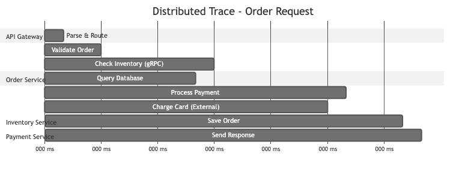
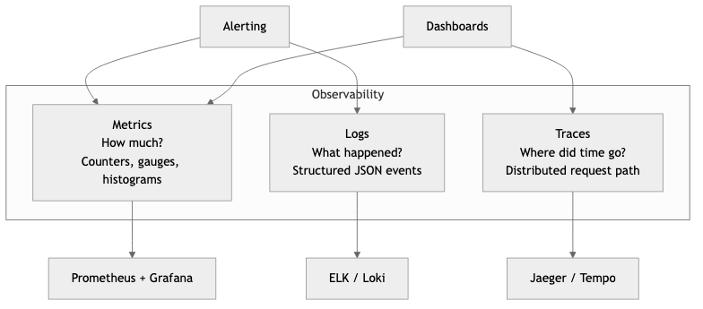

# Observability & Monitoring

## Diagrams






## Concepts

### The Three Pillars of Observability

Observability is the ability to understand the internal state of a system by examining its external outputs. Unlike monitoring, which answers "is the system working?", observability answers "why is the system not working?" Three complementary signal types form the foundation.

```
                          Observability
                    ┌─────────┼─────────┐
                    │         │         │
                  Logs     Metrics    Traces
                    │         │         │
              What happened  How much   Where did
              in detail?     of what?   time go?
```

**Logs** — Discrete, timestamped records of events. Logs tell you *what* happened. They are the most familiar signal and the easiest to produce, but the hardest to query at scale without structure.

**Metrics** — Numeric measurements aggregated over time. Metrics tell you *how much* or *how fast*. They are cheap to store, fast to query, and ideal for dashboards and alerting. Examples: request count, error rate, p99 latency, CPU usage.

**Traces** — Records of a request's journey through multiple services. Traces tell you *where* time was spent and which service caused a failure. Each trace consists of spans, and each span represents a unit of work.

```
Trace: GET /api/orders/123
│
├── [Span] api-gateway         12ms
│   ├── [Span] auth-service     3ms
│   └── [Span] order-service   85ms
│       ├── [Span] db-query    40ms
│       ├── [Span] cache-check  1ms
│       └── [Span] payment-svc 38ms
│           └── [Span] stripe   35ms
│
Total: 97ms
```

### Structured Logging with the `tracing` Crate

Unstructured logs (`println!("user {} logged in", user_id)`) are nearly useless at scale. You cannot reliably search, filter, or aggregate free-form text. Structured logging emits events as key-value pairs that can be indexed and queried.

In Rust, the `tracing` crate is the standard for structured, contextual logging. Unlike `log`, `tracing` supports spans (units of work with duration) and structured fields natively.

**Cargo.toml dependencies:**

```toml
[dependencies]
tracing = "0.1"
tracing-subscriber = { version = "0.3", features = ["env-filter", "json"] }
tracing-appender = "0.2"
```

**Basic setup with JSON output:**

```text
PROCEDURE INIT_TRACING()
    CONFIGURE_SUBSCRIBER(
        format ← JSON,                         // Structured JSON output
        env_filter ← FROM_ENV("RUST_LOG"),      // e.g. RUST_LOG=info,my_crate=debug
        default_level ← INFO,
        include_target ← TRUE,                  // Include module path
        include_thread_ids ← TRUE,              // Include thread ID
        include_file ← TRUE,                    // Include source file
        include_line_number ← TRUE              // Include line number
    )
    INSTALL_SUBSCRIBER()
```

**Using spans and structured fields:**

```text
// Automatically creates a span with order_id, tracks entry/exit
PROCEDURE PROCESS_ORDER(order_id, db_pool) → Result<OrderResult>
    LOG INFO "processing order"

    items ← FETCH_ITEMS(db_pool, order_id)
    LOG INFO "fetched order items", item_count ← LENGTH(items)

    total ← CALCULATE_TOTAL(items)
    IF total > 1000000 THEN
        LOG WARN "high-value order detected",
            total_cents ← total,
            threshold ← 1000000
    END IF

    result ← CHARGE_PAYMENT(order_id, total)
    LOG INFO "payment processed",
        payment_id ← result.payment_id,
        amount_cents ← total

    RETURN Ok(result)
```

The `#[instrument]` macro automatically creates a span around the function, records its arguments as structured fields, and tracks entry/exit. The JSON output looks like:

```json
{
  "timestamp": "2026-03-23T14:22:01.443Z",
  "level": "INFO",
  "target": "order_service::handlers",
  "message": "fetched order items",
  "span": { "name": "process_order", "order_id": 42 },
  "item_count": 5,
  "file": "src/handlers.rs",
  "line": 18
}
```

This is queryable. You can filter by `order_id`, aggregate by `item_count`, or alert on `level = "ERROR"`.

### Metrics Collection and Dashboarding

#### Prometheus

Prometheus is a pull-based metrics system. Your application exposes a `/metrics` endpoint, and Prometheus scrapes it at regular intervals. Metrics are stored as time series (metric name + labels + timestamp + value).

**Four metric types in Prometheus:**

| Type | Description | Example |
|------|-------------|---------|
| **Counter** | Monotonically increasing value | Total HTTP requests, total errors |
| **Gauge** | Value that goes up and down | Current memory usage, active connections |
| **Histogram** | Observations bucketed by value | Request latency distribution |
| **Summary** | Similar to histogram, pre-calculated quantiles | p50/p90/p99 latency (client-side) |

**Rust metrics with the `metrics` crate and Prometheus exporter:**

```toml
[dependencies]
metrics = "0.24"
metrics-exporter-prometheus = "0.16"
axum = "0.8"
tokio = { version = "1", features = ["full"] }
```

```text
PROCEDURE INIT_METRICS()
    // Starts a metrics exporter on 0.0.0.0:9000/metrics
    INSTALL_PROMETHEUS_EXPORTER(listen ← "0.0.0.0:9000")

PROCEDURE HANDLE_REQUEST(req) → Response
    start ← CURRENT_TIME()

    INCREMENT COUNTER "http_requests_total" WITH method ← req.method, path ← req.path
    INCREMENT GAUGE "http_requests_in_flight" BY 1.0

    response ← PROCESS(req)

    duration ← ELAPSED_SECONDS(start)
    RECORD HISTOGRAM "http_request_duration_seconds" WITH method ← req.method, value ← duration
    DECREMENT GAUGE "http_requests_in_flight" BY 1.0

    INCREMENT COUNTER "http_responses_total" WITH status ← response.status

    RETURN response
```

The exposed `/metrics` endpoint produces output Prometheus can scrape:

```
# HELP http_requests_total Total HTTP requests
# TYPE http_requests_total counter
http_requests_total{method="GET",path="/api/orders"} 14832
http_requests_total{method="POST",path="/api/orders"} 1247

# HELP http_request_duration_seconds Request latency histogram
# TYPE http_request_duration_seconds histogram
http_request_duration_seconds_bucket{method="GET",le="0.01"} 12040
http_request_duration_seconds_bucket{method="GET",le="0.05"} 14210
http_request_duration_seconds_bucket{method="GET",le="0.1"} 14700
http_request_duration_seconds_bucket{method="GET",le="+Inf"} 14832
```

#### Grafana

Grafana reads from Prometheus (and dozens of other data sources) to build dashboards. A useful service dashboard follows the RED method:

- **R**ate — requests per second
- **E**rrors — error rate as a percentage
- **D**uration — latency percentiles (p50, p90, p99)

Example PromQL queries for Grafana panels:

```promql
# Request rate (per second, 5-minute window)
rate(http_requests_total[5m])

# Error rate percentage
100 * rate(http_responses_total{status=~"5.."}[5m])
  / rate(http_requests_total[5m])

# p99 latency
histogram_quantile(0.99, rate(http_request_duration_seconds_bucket[5m]))
```

### Distributed Tracing with OpenTelemetry

OpenTelemetry (OTel) is the vendor-neutral standard for collecting traces, metrics, and logs. It provides a single SDK that can export to Jaeger, Zipkin, Datadog, Honeycomb, Grafana Tempo, or any OTLP-compatible backend.

**Rust OpenTelemetry setup:**

```toml
[dependencies]
opentelemetry = "0.27"
opentelemetry_sdk = { version = "0.27", features = ["rt-tokio"] }
opentelemetry-otlp = { version = "0.27", features = ["tonic"] }
tracing-opentelemetry = "0.28"
tracing = "0.1"
tracing-subscriber = { version = "0.3", features = ["env-filter"] }
```

```text
PROCEDURE INIT_TELEMETRY() → TracerProvider
    exporter ← BUILD_OTLP_SPAN_EXPORTER(transport ← "gRPC/tonic")

    provider ← BUILD_TRACER_PROVIDER(
        exporter ← exporter,
        resource ← Resource(service_name ← "order-service")
    )

    tracer ← provider.GET_TRACER("order-service")

    INSTALL_SUBSCRIBER(
        env_filter ← FROM_ENV_DEFAULT(),
        json_logging_layer,
        opentelemetry_layer ← OpenTelemetryLayer(tracer)
    )

    RETURN provider
```

With this setup, every `#[instrument]`-annotated function automatically becomes a span in a distributed trace. The `tracing-opentelemetry` bridge means your existing `tracing` instrumentation produces both logs and trace spans with zero additional code.

**Context propagation** is critical. When Service A calls Service B, the trace context (trace ID + span ID) must be passed in HTTP headers. OpenTelemetry uses the W3C `traceparent` header:

```
traceparent: 00-4bf92f3577b34da6a3ce929d0e0e4736-00f067aa0ba902b7-01
              │  │                                │                  │
              │  trace-id                         parent-span-id     sampled
              version
```

### Alerting Strategies

Good alerting is about notifying humans only when human action is needed. Bad alerting creates noise that gets ignored.

**Alerting on symptoms, not causes:**

```
Bad:   Alert when CPU > 80%         (cause — maybe it's fine)
Good:  Alert when p99 latency > 500ms (symptom — users are affected)

Bad:   Alert when disk > 90%        (cause — maybe it's a temp spike)
Good:  Alert when disk will be full in <4 hours at current rate (prediction)
```

**Severity levels:**

| Severity | Response | Example |
|----------|----------|---------|
| **Critical (P1)** | Page on-call, immediate action | Service down, data loss |
| **High (P2)** | Page during business hours | Error rate > 5%, degraded latency |
| **Warning (P3)** | Ticket, fix this week | Disk at 70%, cert expires in 14 days |
| **Info** | No action, dashboard only | Deploy completed, scaling event |

**Prometheus alerting rule example:**

```yaml
groups:
  - name: order-service
    rules:
      - alert: HighErrorRate
        expr: |
          rate(http_responses_total{service="order-service", status=~"5.."}[5m])
          / rate(http_requests_total{service="order-service"}[5m]) > 0.05
        for: 5m
        labels:
          severity: critical
        annotations:
          summary: "Order service error rate above 5%"
          description: "Error rate is {{ $value | humanizePercentage }} over the last 5 minutes."

      - alert: HighLatency
        expr: |
          histogram_quantile(0.99, rate(http_request_duration_seconds_bucket{service="order-service"}[5m])) > 1.0
        for: 10m
        labels:
          severity: high
        annotations:
          summary: "Order service p99 latency above 1s"
```

The `for: 5m` clause means the condition must be true for 5 consecutive minutes before firing. This prevents alert flapping.

### Dashboarding Best Practices

A dashboard should answer a question. If you cannot state the question, the dashboard should not exist.

**Dashboard hierarchy:**

```
Level 1: Service overview    — "Is the system healthy?"     (RED metrics)
Level 2: Service detail      — "Which component is slow?"   (per-endpoint breakdown)
Level 3: Infrastructure      — "Is the host the problem?"   (CPU, memory, disk, network)
Level 4: Business metrics    — "Are users converting?"      (signups, purchases, revenue)
```

**Rules for effective dashboards:**

1. **Top-left is most important.** Eyes start there. Put the metric you check first.
2. **Use consistent time ranges.** If one panel shows 1 hour and another shows 24 hours, comparisons are meaningless.
3. **Show error budgets, not just error rates.** "We have consumed 40% of our monthly error budget" is more actionable than "error rate is 0.2%."
4. **Add annotations for deploys.** A latency spike at the exact moment of a deploy is immediately diagnosable if the deploy is marked on the graph.
5. **Fewer panels, more signal.** A dashboard with 40 panels is a screensaver, not a diagnostic tool. Aim for 6-12 panels per dashboard.

## Business Value

Observability directly protects revenue. When a production incident occurs, the time to detect (TTD) and time to resolve (TTR) determine how much money is lost. Strong observability reduces both.

- **Reduced downtime costs** — For e-commerce companies processing $100K/hour, reducing mean time to recovery from 60 minutes to 15 minutes saves $75K per incident. At one incident per month, that is $900K/year.

- **Faster feature delivery** — Teams with good observability deploy more frequently because they can detect regressions quickly. This means features reach customers sooner and experiments produce results faster.

- **Proactive capacity planning** — Metrics trends reveal when you need to scale before users experience degradation. This avoids emergency scaling (which is expensive) and over-provisioning (which wastes money).

- **SLA/SLO compliance** — Enterprise customers require uptime guarantees (99.9%, 99.99%). Observability is what lets you measure, report, and maintain those guarantees. Failing SLAs triggers contractual penalties.

- **Developer productivity** — Engineers spend 30-50% of their time debugging in organizations with poor observability. Structured logs and traces reduce debugging time from hours to minutes.

- **Compliance and audit** — Structured, centralized logs provide the audit trail that regulations (SOC 2, HIPAA, PCI-DSS) require. Without observability, compliance is a manual, expensive process.

## Real-World Examples

### Google's SRE and SLO-Driven Alerting

Google pioneered the SRE (Site Reliability Engineering) model where observability is built around Service Level Objectives. Rather than alerting on every metric deviation, Google defines error budgets: if a service has a 99.9% availability SLO, it is allowed 43.2 minutes of downtime per month. Alerts fire only when the error budget burn rate suggests the budget will be exhausted. This dramatically reduces alert noise. Google's internal monitoring system (Monarch) processes billions of time series, and their approach to alerting is codified in the book *Site Reliability Engineering* (2016). The key insight: alert on user-visible symptoms and error budget burn, not on internal causes.

### Netflix's Real-Time Observability at Scale

Netflix processes over 1 trillion events per day through its observability pipeline. Their system, Atlas, is a custom time-series database built to handle the scale of 200+ million subscribers across hundreds of microservices. Netflix uses observability for automated canary analysis: when a new deployment rolls out, their Kayenta system automatically compares metrics between the canary and baseline groups. If the canary shows statistically significant regression, the deployment is automatically rolled back without human intervention. This allows Netflix to deploy hundreds of times per day with confidence.

### Datadog's Approach to Unified Observability

Datadog built its business on the insight that logs, metrics, and traces must be correlated in a single platform. When an alert fires for high latency, an engineer can click through to the exact traces that were slow, then drill into the logs for those specific request IDs. This correlation reduces context-switching between tools from minutes to seconds. Datadog processes trillions of data points per day and their architecture demonstrates that the three pillars are most powerful when unified under a single query interface.

### Honeycomb and High-Cardinality Observability

Honeycomb, founded by Charity Majors (former Facebook infrastructure engineer), advocates for high-cardinality observability. Traditional metrics systems struggle when you need to query by user_id or session_id (millions of unique values). Honeycomb's approach stores structured events (similar to wide log lines) and allows ad-hoc queries across any combination of fields. This lets engineers debug novel problems they have never seen before without pre-defining what to measure. Their approach proved especially effective for debugging distributed systems where the failure mode is unique to a specific combination of conditions.

## Common Mistakes & Pitfalls

- **Logging everything, querying nothing** — Teams instrument exhaustively but never build dashboards or alerts. Terabytes of logs accumulate in S3, costing thousands per month in storage, while engineers still SSH into production boxes to debug. Observability only has value if it is actively consumed.

- **Unstructured log messages** — `log::info!("Something went wrong with order {}", id)` cannot be queried, filtered, or aggregated. Once unstructured logging is in production, migrating to structured logging is a multi-month effort across teams. Start structured from day one.

- **Alert fatigue** — Setting thresholds too low or alerting on causes (CPU > 80%) instead of symptoms (latency > target) produces hundreds of alerts per week. On-call engineers start ignoring all alerts, including the critical ones. Every alert should require a specific human action; if it does not, it is not an alert, it is a log line.

- **Missing context propagation** — Instrumenting each service individually but failing to propagate trace context between services. Without propagation, you get isolated spans per service but cannot reconstruct the full request journey. This makes distributed tracing useless for cross-service debugging.

- **Cardinality explosion** — Using unbounded values (user ID, request ID, full URL path) as metric labels in Prometheus. A label with 1 million unique values creates 1 million time series per metric, consuming enormous amounts of memory and storage. Use high-cardinality values in logs and traces, not in metrics.

- **No baseline, no anomaly detection** — Alerting requires knowing what "normal" looks like. Teams that set alert thresholds based on guesses instead of measured baselines either miss real incidents or drown in false positives. Record at least two weeks of baseline data before setting production alerts.

## Trade-offs

| Approach | Strengths | Weaknesses | Best For |
|----------|-----------|------------|----------|
| **Self-hosted Prometheus + Grafana** | Free, full control, no data leaves your network | Operational burden, scaling is your problem | Teams with infra expertise, data sovereignty needs |
| **Managed SaaS (Datadog, New Relic)** | Zero operational overhead, powerful UIs, correlation | Expensive at scale ($20-50+/host/month), vendor lock-in | Small-to-mid teams, fast time-to-value |
| **OpenTelemetry + vendor backend** | Vendor-neutral instrumentation, switch backends freely | OTel SDK complexity, still need a backend | Teams wanting portability across vendors |
| **ELK Stack (Elasticsearch, Logstash, Kibana)** | Powerful log search, mature ecosystem | Resource-hungry, complex to operate, expensive | Log-heavy workloads, full-text search needs |
| **Honeycomb-style event stores** | High cardinality, ad-hoc debugging, novel queries | Less mature for metrics/alerting, different mental model | Microservices with complex, unpredictable failure modes |
| **Structured logs only (no metrics/traces)** | Simplest to implement, one signal type | Slow aggregation, no latency distribution, no request flow | Early-stage projects, single-service applications |

## When to Use / When Not to Use

**Full distributed tracing -- use for:**
- Microservice architectures with 5+ services in a request path
- When latency debugging requires understanding cross-service dependencies
- Organizations with SLO commitments that require root-cause analysis

**Full distributed tracing -- avoid for:**
- Monolithic applications (a single-process profiler is simpler and more precise)
- Very early-stage products where architecture is still changing weekly

**Prometheus + Grafana -- use for:**
- Any production service, regardless of size (metrics are always worth having)
- Teams that need cost-effective, self-hosted monitoring
- Kubernetes environments (Prometheus is the de facto standard)

**Managed SaaS (Datadog, etc.) -- use for:**
- Teams without dedicated infrastructure engineers
- When time-to-value matters more than per-unit cost
- Organizations that need built-in correlation between signals

**Managed SaaS -- avoid for:**
- High-volume workloads where ingestion costs exceed $50K/month
- Environments with strict data residency requirements
- Teams that only need basic metrics and can self-host cheaply

**Structured logging -- use always:**
- There is no scenario where unstructured logging is the right choice. Use the `tracing` crate from day one, even for side projects. The cost is near zero and the debugging benefit is enormous.

## Key Takeaways

1. Observability is not monitoring. Monitoring tells you *something* is broken. Observability tells you *why* it is broken by letting you ask arbitrary questions about system state.

2. Start with structured logging on day one. Migrating from `println!` to structured logging in a running system is painful. The `tracing` crate in Rust costs almost nothing to adopt and pays dividends immediately.

3. Metrics are for alerting and dashboards; logs are for debugging; traces are for understanding request flow. Use all three -- they answer different questions and are not interchangeable.

4. Alert on symptoms (user-facing impact) not causes (internal metrics). An alert should require a specific human action. If the correct response is "wait and see," it should not be an alert.

5. Use OpenTelemetry for instrumentation. It is the vendor-neutral standard, supported by every major observability vendor, and it decouples your code from your backend choice.

6. Cardinality matters. Put high-cardinality data (user IDs, request IDs) in logs and traces. Keep metric labels bounded (HTTP method, status code class, service name).

7. The best observability investment is correlating signals. Being able to go from an alert to the relevant traces to the specific log lines in under 60 seconds is the difference between a 5-minute incident and a 5-hour incident.

## Further Reading

- **Books:**
  - *Site Reliability Engineering* -- Betsy Beyer, Chris Jones, et al. (2016) -- Google's SRE practices, especially chapters on monitoring and alerting
  - *Observability Engineering* -- Charity Majors, Liz Fong-Jones, George Miranda (2022) -- Modern observability principles, high-cardinality debugging
  - *The Art of Monitoring* -- James Turnbull (2018) -- Practical guide to building monitoring infrastructure
  - *Distributed Systems Observability* -- Cindy Sridharan (2018) -- Concise guide to the three pillars, free from O'Reilly

- **Articles & Papers:**
  - [Google SRE Book - Monitoring Distributed Systems](https://sre.google/sre-book/monitoring-distributed-systems/) -- The foundational chapter on symptom-based alerting
  - [Dapper, a Large-Scale Distributed Systems Tracing Infrastructure](https://research.google/pubs/pub36356/) -- Google's seminal paper on distributed tracing
  - [Monitoring and Observability](https://copyconstruct.medium.com/monitoring-and-observability-8417d1952e1c) -- Cindy Sridharan's influential article distinguishing the two concepts

- **Rust Crates:**
  - [tracing](https://crates.io/crates/tracing) -- Structured, contextual logging and diagnostics
  - [tracing-subscriber](https://crates.io/crates/tracing-subscriber) -- Subscribers for the tracing crate (JSON output, filtering)
  - [tracing-opentelemetry](https://crates.io/crates/tracing-opentelemetry) -- Bridge between tracing and OpenTelemetry
  - [metrics](https://crates.io/crates/metrics) -- Application-level metrics facade
  - [metrics-exporter-prometheus](https://crates.io/crates/metrics-exporter-prometheus) -- Prometheus exporter for the metrics crate
  - [opentelemetry](https://crates.io/crates/opentelemetry) -- OpenTelemetry SDK for Rust
  - [opentelemetry-otlp](https://crates.io/crates/opentelemetry-otlp) -- OTLP exporter for OpenTelemetry

- **Tools:**
  - [Prometheus](https://prometheus.io/) -- Pull-based metrics collection and alerting
  - [Grafana](https://grafana.com/) -- Dashboarding and visualization
  - [Jaeger](https://www.jaegertracing.io/) -- Open-source distributed tracing backend
  - [Grafana Tempo](https://grafana.com/oss/tempo/) -- Scalable, cost-effective trace storage
  - [OpenTelemetry Collector](https://opentelemetry.io/docs/collector/) -- Vendor-agnostic telemetry pipeline
