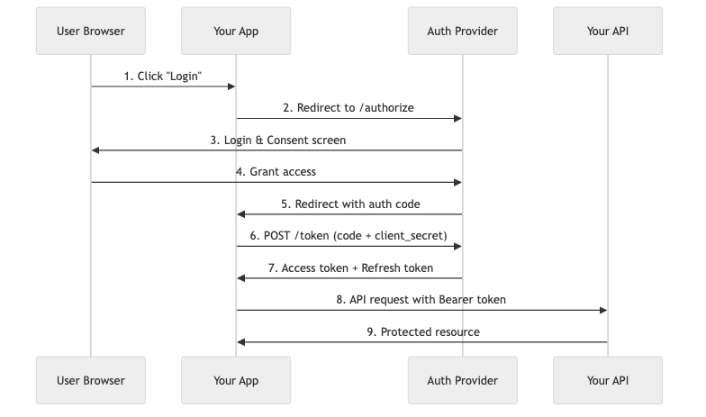
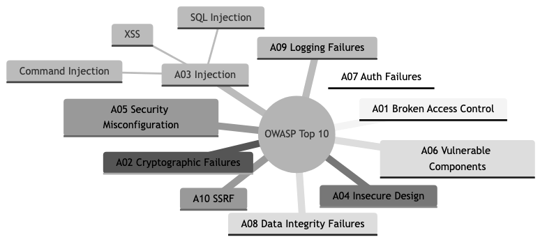

# 22 - Application Security

## Diagrams






## Concepts

### Why Application Security Matters

Every application exposed to a network is under attack. Automated scanners, bots, and adversaries constantly probe for weaknesses. A single vulnerability can expose user data, destroy trust, trigger regulatory fines, and shut down a business.

Application security is not a phase you bolt on at the end. It is a property of how you design, code, test, and deploy software. Rust's type system and memory safety eliminate entire categories of vulnerabilities (buffer overflows, use-after-free, data races), but application-level flaws — broken authentication, injection, misconfiguration — require deliberate engineering effort.

### OWASP Top 10

The OWASP Top 10 is the industry-standard list of the most critical web application security risks. Every engineer should know these.

**A01: Broken Access Control** — Users can act outside their intended permissions. Missing authorization checks on endpoints, IDOR (Insecure Direct Object Reference), or exposing admin functionality to regular users.

```rust
use axum::{extract::Path, http::StatusCode, Extension};

// BAD — no authorization check, any user can view any order
async fn get_order_bad(Path(order_id): Path<u64>) -> Result<Json<Order>, StatusCode> {
    let order = db::get_order(order_id).await.map_err(|_| StatusCode::NOT_FOUND)?;
    Ok(Json(order))
}

// GOOD — verify the authenticated user owns the resource
async fn get_order(
    Path(order_id): Path<u64>,
    Extension(current_user): Extension<AuthenticatedUser>,
) -> Result<Json<Order>, StatusCode> {
    let order = db::get_order(order_id).await.map_err(|_| StatusCode::NOT_FOUND)?;
    if order.user_id != current_user.id {
        return Err(StatusCode::FORBIDDEN);
    }
    Ok(Json(order))
}
```

**A02: Cryptographic Failures** — Storing passwords in plaintext, using broken hashing algorithms (MD5, SHA1 for passwords), transmitting sensitive data without TLS, or hardcoding encryption keys.

**A03: Injection** — Untrusted data sent to an interpreter as part of a command or query. SQL injection, command injection, LDAP injection. Parameterized queries eliminate SQL injection entirely.

```rust
use sqlx::PgPool;

// BAD — string interpolation creates SQL injection
async fn find_user_bad(pool: &PgPool, email: &str) -> Result<User, sqlx::Error> {
    let query = format!("SELECT * FROM users WHERE email = '{}'", email);
    sqlx::query_as::<_, User>(&query).fetch_one(pool).await
}

// GOOD — parameterized query, the database driver handles escaping
async fn find_user(pool: &PgPool, email: &str) -> Result<User, sqlx::Error> {
    sqlx::query_as::<_, User>("SELECT * FROM users WHERE email = $1")
        .bind(email)
        .fetch_one(pool)
        .await
}
```

**A04: Insecure Design** — Missing threat modeling. No rate limiting on login endpoints. No account lockout. Security controls missing by design, not by implementation bug.

**A05: Security Misconfiguration** — Default credentials left in place. Overly permissive CORS. Stack traces exposed to users. Debug mode in production. Unnecessary features enabled.

**A06: Vulnerable and Outdated Components** — Using dependencies with known vulnerabilities. In Rust, `cargo audit` checks your dependencies against the RustSec advisory database.

**A07: Identification and Authentication Failures** — Weak passwords allowed. No multi-factor authentication. Session tokens that don't expire. Credential stuffing not mitigated.

**A08: Software and Data Integrity Failures** — Unsigned updates. Deserialization of untrusted data without validation. CI/CD pipelines without integrity verification.

**A09: Security Logging and Monitoring Failures** — No logging of authentication events. No alerting on suspicious activity. Breaches go undetected for months.

**A10: Server-Side Request Forgery (SSRF)** — Application fetches a URL supplied by the user without validating the destination, allowing access to internal services or metadata endpoints.

### Authentication

Authentication answers: "Who are you?"

**Session-based authentication:**

The server creates a session after login, stores it server-side (database, Redis), and sends a session ID in a cookie. Every subsequent request includes the cookie. The server looks up the session to identify the user.

```rust
use axum::{extract::Form, http::{HeaderMap, StatusCode}};
use axum_extra::extract::cookie::{Cookie, CookieJar, SameSite};
use uuid::Uuid;

async fn login(
    Form(credentials): Form<LoginRequest>,
    jar: CookieJar,
    Extension(pool): Extension<PgPool>,
    Extension(session_store): Extension<RedisPool>,
) -> Result<(CookieJar, StatusCode), StatusCode> {
    let user = db::find_user_by_email(&pool, &credentials.email)
        .await
        .map_err(|_| StatusCode::UNAUTHORIZED)?;

    // Verify password using argon2
    let parsed_hash = argon2::PasswordHash::new(&user.password_hash)
        .map_err(|_| StatusCode::INTERNAL_SERVER_ERROR)?;

    argon2::Argon2::default()
        .verify_password(credentials.password.as_bytes(), &parsed_hash)
        .map_err(|_| StatusCode::UNAUTHORIZED)?;

    // Create session
    let session_id = Uuid::new_v4().to_string();
    session_store::set(&session_store, &session_id, user.id, Duration::from_secs(86400))
        .await
        .map_err(|_| StatusCode::INTERNAL_SERVER_ERROR)?;

    let cookie = Cookie::build(("session_id", session_id))
        .http_only(true)
        .secure(true)
        .same_site(SameSite::Strict)
        .max_age(time::Duration::days(1))
        .path("/")
        .build();

    Ok((jar.add(cookie), StatusCode::OK))
}
```

Key properties of the session cookie:
- `HttpOnly` — JavaScript cannot read it, preventing XSS-based session theft
- `Secure` — Only sent over HTTPS
- `SameSite=Strict` — Not sent with cross-origin requests, preventing CSRF

**JWT (JSON Web Tokens):**

JWTs are self-contained tokens. The server signs them; clients send them in the `Authorization` header. No server-side session storage needed. The server verifies the signature to trust the claims.

```rust
use jsonwebtoken::{encode, decode, Header, Algorithm, Validation, EncodingKey, DecodingKey};
use serde::{Deserialize, Serialize};
use chrono::Utc;

#[derive(Debug, Serialize, Deserialize)]
struct Claims {
    sub: String,       // user id
    role: String,      // user role
    exp: usize,        // expiration (UNIX timestamp)
    iat: usize,        // issued at
}

fn create_jwt(user_id: &str, role: &str, secret: &[u8]) -> Result<String, jsonwebtoken::errors::Error> {
    let now = Utc::now().timestamp() as usize;
    let claims = Claims {
        sub: user_id.to_string(),
        role: role.to_string(),
        exp: now + 3600,  // 1 hour
        iat: now,
    };
    encode(&Header::default(), &claims, &EncodingKey::from_secret(secret))
}

fn verify_jwt(token: &str, secret: &[u8]) -> Result<Claims, jsonwebtoken::errors::Error> {
    let validation = Validation::new(Algorithm::HS256);
    let token_data = decode::<Claims>(token, &DecodingKey::from_secret(secret), &validation)?;
    Ok(token_data.claims)
}
```

**Sessions vs. JWTs:**

| Property | Sessions | JWTs |
|----------|----------|------|
| Storage | Server-side (Redis, DB) | Client-side (token) |
| Revocation | Immediate (delete from store) | Difficult (must wait for expiry or maintain a blocklist) |
| Scalability | Requires shared session store | Stateless, any server can verify |
| Size | Small cookie (~36 bytes) | Larger token (~500+ bytes) |
| Security | Server controls session data | Claims are visible (base64), only signature is secret |

**OAuth 2.0 and OpenID Connect (OIDC):**

OAuth 2.0 is an authorization framework that lets users grant third-party applications limited access to their resources without sharing credentials. OIDC is an identity layer on top of OAuth 2.0 that adds authentication — it tells you *who* the user is, not just *what they can access*.

The Authorization Code flow (most common for server-side apps):
1. User clicks "Login with Google"
2. App redirects to Google's authorization endpoint with a `code_challenge` (PKCE)
3. User authenticates with Google, consents to requested scopes
4. Google redirects back with an authorization `code`
5. App exchanges `code` + `code_verifier` for tokens at Google's token endpoint
6. App receives an `id_token` (who they are) and an `access_token` (what they can access)

### Authorization

Authorization answers: "What are you allowed to do?"

**Role-Based Access Control (RBAC):**

Users are assigned roles. Roles have permissions. Simple and effective for most applications.

```rust
use std::collections::HashSet;

#[derive(Debug, Clone, PartialEq, Eq, Hash)]
enum Permission {
    ReadOrders,
    CreateOrders,
    DeleteOrders,
    ManageUsers,
    ViewAnalytics,
}

#[derive(Debug, Clone)]
enum Role {
    Viewer,
    Editor,
    Admin,
}

fn permissions_for_role(role: &Role) -> HashSet<Permission> {
    match role {
        Role::Viewer => HashSet::from([Permission::ReadOrders, Permission::ViewAnalytics]),
        Role::Editor => HashSet::from([
            Permission::ReadOrders,
            Permission::CreateOrders,
            Permission::ViewAnalytics,
        ]),
        Role::Admin => HashSet::from([
            Permission::ReadOrders,
            Permission::CreateOrders,
            Permission::DeleteOrders,
            Permission::ManageUsers,
            Permission::ViewAnalytics,
        ]),
    }
}

fn authorize(user: &AuthenticatedUser, required: Permission) -> Result<(), StatusCode> {
    let perms = permissions_for_role(&user.role);
    if perms.contains(&required) {
        Ok(())
    } else {
        Err(StatusCode::FORBIDDEN)
    }
}
```

**Attribute-Based Access Control (ABAC):**

Decisions based on attributes of the user, resource, and environment. More flexible than RBAC, but more complex. Example: "A user can edit a document if they are in the same department AND the document is not archived AND it is during business hours."

RBAC works for most applications. Reach for ABAC when your authorization rules depend on dynamic attributes beyond role membership.

### Secure Coding Practices

**Password hashing with Argon2:**

Never store passwords in plaintext or use fast hashing algorithms (MD5, SHA-256). Use a memory-hard, slow-by-design algorithm like Argon2.

```rust
use argon2::{
    password_hash::{rand_core::OsRng, PasswordHash, PasswordHasher, PasswordVerifier, SaltString},
    Argon2,
};

fn hash_password(password: &str) -> Result<String, argon2::password_hash::Error> {
    let salt = SaltString::generate(&mut OsRng);
    let argon2 = Argon2::default();
    let hash = argon2.hash_password(password.as_bytes(), &salt)?;
    Ok(hash.to_string())
}

fn verify_password(password: &str, hash: &str) -> Result<bool, argon2::password_hash::Error> {
    let parsed_hash = PasswordHash::new(hash)?;
    Ok(Argon2::default()
        .verify_password(password.as_bytes(), &parsed_hash)
        .is_ok())
}
```

**Input validation:**

Validate all input at the boundary. Use strong types to make invalid states unrepresentable.

```rust
use validator::Validate;

#[derive(Debug, Deserialize, Validate)]
struct CreateUserRequest {
    #[validate(email)]
    email: String,

    #[validate(length(min = 8, max = 128))]
    password: String,

    #[validate(length(min = 1, max = 100))]
    name: String,
}

async fn create_user(
    Json(payload): Json<CreateUserRequest>,
) -> Result<Json<User>, (StatusCode, String)> {
    payload.validate().map_err(|e| {
        (StatusCode::BAD_REQUEST, format!("Validation error: {}", e))
    })?;
    // proceed with validated data
    todo!()
}
```

### XSS, CSRF, and SQL Injection Prevention

**Cross-Site Scripting (XSS):**

An attacker injects malicious JavaScript into a page viewed by other users. Three types:
- **Stored XSS** — Malicious script saved in the database, served to every user who views the page.
- **Reflected XSS** — Malicious script in a URL parameter, reflected back in the response.
- **DOM-based XSS** — Malicious script manipulates the DOM client-side.

Prevention:
- Escape all output rendered in HTML. Template engines (Tera, Askama) escape by default.
- Set `Content-Security-Policy` headers to restrict script sources.
- Use `HttpOnly` cookies so JavaScript cannot steal session tokens.

```rust
use axum::response::Html;

// BAD — raw user input injected into HTML
async fn profile_bad(name: &str) -> Html<String> {
    Html(format!("<h1>Hello, {}</h1>", name))
    // If name is: <script>alert('xss')</script>, it executes
}

// GOOD — use a template engine that escapes by default (Askama)
#[derive(askama::Template)]
#[template(path = "profile.html")]
struct ProfileTemplate<'a> {
    name: &'a str,  // Askama auto-escapes this in the template
}
```

**Cross-Site Request Forgery (CSRF):**

An attacker tricks a user's browser into making a request to your site while the user is authenticated. The browser automatically includes cookies, so the request looks legitimate.

Prevention: `SameSite=Strict` cookies, anti-CSRF tokens, or requiring a custom header that browsers don't send in cross-origin requests.

**SQL Injection prevention** is covered above under A03 (Injection). The single rule: never concatenate user input into SQL strings. Always use parameterized queries.

### Security Headers

```rust
use axum::{middleware, http::{Request, HeaderValue}, response::Response};

async fn security_headers<B>(request: Request<B>, next: middleware::Next<B>) -> Response {
    let mut response = next.run(request).await;
    let headers = response.headers_mut();

    headers.insert("X-Content-Type-Options", HeaderValue::from_static("nosniff"));
    headers.insert("X-Frame-Options", HeaderValue::from_static("DENY"));
    headers.insert("X-XSS-Protection", HeaderValue::from_static("0"));
    headers.insert(
        "Strict-Transport-Security",
        HeaderValue::from_static("max-age=31536000; includeSubDomains"),
    );
    headers.insert(
        "Content-Security-Policy",
        HeaderValue::from_static("default-src 'self'; script-src 'self'; style-src 'self'"),
    );
    headers.insert("Referrer-Policy", HeaderValue::from_static("strict-origin-when-cross-origin"));

    response
}
```

### Security Testing

**Static Application Security Testing (SAST):**

Analyzes source code for vulnerabilities without running the application. In Rust:
- `cargo audit` — Checks dependencies against the RustSec advisory database
- `cargo clippy` — Catches common code issues, some security-relevant
- `cargo deny` — Policy enforcement for dependencies (licenses, advisories, sources)

**Dynamic Application Security Testing (DAST):**

Tests the running application by sending requests and analyzing responses. Tools like OWASP ZAP or Burp Suite crawl your API, send malicious payloads, and report vulnerabilities found. DAST finds issues that static analysis cannot: misconfigurations, missing headers, improper error handling at runtime.

**Dependency scanning:**

```bash
# Check for known vulnerabilities in dependencies
cargo install cargo-audit
cargo audit

# Enforce dependency policies
cargo install cargo-deny
cargo deny check advisories
cargo deny check licenses
```

**Secret scanning:**

Prevent credentials from being committed to version control. Tools like `trufflehog`, `gitleaks`, or GitHub's built-in secret scanning detect API keys, passwords, and tokens in your repository history.

## Business Value

- **Breach cost avoidance**: The average cost of a data breach in 2024 was $4.88 million (IBM). Application security is the cheapest insurance policy a company can buy compared to the cost of a breach.
- **Customer trust and retention**: Users abandon products after a breach. 65% of customers lose trust in a company after a data breach. Security is a competitive advantage — "we've never been breached" is a selling point.
- **Regulatory compliance**: GDPR, HIPAA, PCI DSS, SOC 2 all require security controls. Non-compliance means fines (GDPR: up to 4% of global annual revenue), legal liability, and loss of ability to process payments.
- **Faster sales cycles**: Enterprise customers require security questionnaires and audits. A mature security posture (SOC 2 Type II, penetration test reports) accelerates enterprise sales.
- **Reduced incident response costs**: Preventing a vulnerability costs 10-100x less than responding to an active exploitation. A SQL injection found in code review costs an hour to fix; the same flaw exploited in production triggers incident response, forensics, customer notification, and potential litigation.

## Real-World Examples

### Equifax Breach (2017)

Equifax failed to patch a known vulnerability in Apache Struts (CVE-2017-5638) for over two months after the patch was available. Attackers exploited it to steal personal data of 147 million people, including Social Security numbers. The breach cost Equifax over $1.4 billion. Root cause: no dependency scanning or patch management process. `cargo audit` in a CI pipeline would catch the Rust equivalent of this — a known vulnerability in a dependency.

### Heartbleed (2014)

A buffer over-read vulnerability in OpenSSL allowed attackers to read up to 64KB of server memory per request, potentially exposing private keys, session tokens, and user credentials. The bug existed for two years before discovery. This class of vulnerability — memory safety bugs — is eliminated by Rust's ownership system. You cannot read beyond buffer bounds in safe Rust. This is one of the strongest arguments for writing security-critical software in a memory-safe language.

### Log4Shell (2021)

A remote code execution vulnerability in Log4j (CVE-2021-44228) affected virtually every Java application using the library. Attackers could execute arbitrary code by sending a crafted string that the logger would evaluate as a JNDI lookup. The incident demonstrated the danger of transitive dependencies — most affected teams did not even know they depended on Log4j. This reinforced the importance of software bills of materials (SBOMs) and dependency scanning.

### GitHub OAuth Token Theft (2022)

Attackers stole OAuth tokens issued to Heroku and Travis CI, which were stored and used as integrations in GitHub. These tokens granted access to private repositories of dozens of organizations, including npm. The incident showed that OAuth token storage, scope limitation, and token rotation are not optional — they are critical. Tokens should have the minimum scope necessary and be rotated regularly.

## Common Mistakes & Pitfalls

- **Storing secrets in code or environment variables without encryption** — API keys hardcoded in source, `.env` files committed to git, secrets passed as plaintext environment variables. Use a secrets manager (HashiCorp Vault, AWS Secrets Manager) and never commit secrets. Add `.env` to `.gitignore` on day one.

- **Rolling your own authentication or cryptography** — Custom password hashing, homebrew token schemes, self-designed encryption. These are almost always broken. Use battle-tested libraries: `argon2` for password hashing, `jsonwebtoken` for JWTs, `ring` or `rustls` for TLS. Cryptography is hard; let experts build it.

- **Missing authorization checks on the backend** — Relying on the UI to hide buttons or links instead of enforcing authorization on the server. Attackers bypass the UI entirely and call your API directly. Every endpoint must independently verify that the authenticated user is authorized for the requested action.

- **Overly broad CORS policies** — Setting `Access-Control-Allow-Origin: *` on an API that uses cookies or returns sensitive data. This allows any website to make authenticated requests on behalf of your users. CORS should be locked down to your known frontend origins.

- **Logging sensitive data** — Passwords, credit card numbers, tokens, or personal data appearing in application logs. Logs are often stored with weaker access controls than production databases and may be shipped to third-party log aggregation services. Sanitize sensitive fields before logging.

- **Not rate-limiting authentication endpoints** — Without rate limiting, attackers can attempt millions of passwords per hour (credential stuffing, brute force). Rate limit login, password reset, and MFA verification endpoints. Use exponential backoff or account lockout after repeated failures.

## Trade-offs

| Approach | Pros | Cons |
|----------|------|------|
| **Session-based auth** | Easy revocation, server controls state, small cookie | Requires server-side storage, harder to scale horizontally |
| **JWT-based auth** | Stateless, scales easily, works across services | Difficult to revoke, larger payload, token theft is severe |
| **OAuth 2.0 delegation** | No password handling, leverages identity providers | Complex flow, dependency on external provider availability |
| **RBAC** | Simple to understand and implement, auditable | Inflexible for fine-grained rules, role explosion in complex systems |
| **ABAC** | Highly flexible, context-aware decisions | Complex policy engine, harder to audit, performance overhead |
| **SAST** | Catches bugs early, integrates into CI, fast | False positives, cannot detect runtime issues |
| **DAST** | Finds runtime misconfigurations, tests real behavior | Slower, requires running application, may miss code-level flaws |
| **WAF (Web Application Firewall)** | Blocks known attack patterns at the perimeter | Bypassable, can block legitimate traffic, false sense of security |

## When to Use / When Not to Use

**Session-based auth — use when:**
- You have a single-domain web application
- You need immediate session revocation (logout, account compromise)
- Server-side storage is not a scalability concern

**JWT auth — use when:**
- You have a distributed system or microservices that need to verify identity without calling a central session store
- You are building APIs consumed by mobile apps or SPAs
- Accept that revocation requires a blocklist or short-lived tokens with refresh rotation

**OAuth 2.0 / OIDC — use when:**
- You want "Login with Google/GitHub" social login
- You are building an API that third parties will integrate with
- You do not want to store or manage user passwords

**RBAC — use when:**
- Your authorization rules map cleanly to a small number of roles (viewer, editor, admin)
- You need simple, auditable access control

**ABAC — use when:**
- Authorization depends on resource attributes, environmental conditions, or relationships
- RBAC leads to too many roles or cannot express your access rules

**SAST in CI — always:**
- Run `cargo audit` and `cargo deny` on every pull request. This is non-negotiable for any project with dependencies.

**DAST — use when:**
- You have a deployed staging environment
- Before major releases or after significant changes to authentication/authorization logic
- As part of periodic security assessments

## Key Takeaways

1. Security is not a feature you add later. It is a property of how you design, implement, and operate software. Retrofitting security is 10-100x more expensive than building it in.
2. Rust eliminates memory safety vulnerabilities (buffer overflows, use-after-free, data races), but application-layer flaws — injection, broken auth, misconfig — still require deliberate engineering.
3. Never store passwords in plaintext. Use Argon2 with a random salt. Never roll your own cryptography.
4. Use parameterized queries for all database access. String concatenation in SQL is the root cause of injection vulnerabilities that have persisted for decades.
5. Authenticate every request. Authorize every action. The UI is not a security boundary — enforce access control on the server.
6. Run `cargo audit` and dependency scanning in CI on every pull request. Known vulnerabilities in dependencies are the easiest attack vector and the easiest to prevent.
7. Apply defense in depth: input validation, output encoding, security headers, HTTPS, least privilege, monitoring, and alerting. No single control is sufficient.

## Further Reading

- **Books:**
  - *The Web Application Hacker's Handbook* -- Dafydd Stuttard & Marcus Pinto (2nd edition, 2011) -- Comprehensive guide to web application security testing
  - *Designing Secure Software* -- Loren Kohnfelder (2021) -- Security design principles for developers
  - *Serious Cryptography* -- Jean-Philippe Aumasson (2017) -- Practical cryptography for engineers
  - *OAuth 2 in Action* -- Justin Richer & Antonio Sanso (2017) -- Deep dive into OAuth 2.0 implementation

- **Papers & Articles:**
  - [OWASP Top 10 (2021)](https://owasp.org/Top10/) -- The industry-standard list of critical web application security risks
  - [OWASP Cheat Sheet Series](https://cheatsheetseries.owasp.org/) -- Practical guidance for specific security topics
  - [Google's BeyondCorp](https://cloud.google.com/beyondcorp) -- Zero-trust security model
  - [CWE/SANS Top 25](https://cwe.mitre.org/top25/) -- Most dangerous software weaknesses

- **Crates:**
  - [argon2](https://crates.io/crates/argon2) -- Password hashing using the Argon2 algorithm
  - [jsonwebtoken](https://crates.io/crates/jsonwebtoken) -- JWT creation and validation
  - [axum-extra](https://crates.io/crates/axum-extra) -- Cookie handling, typed headers, and security middleware for axum
  - [validator](https://crates.io/crates/validator) -- Struct validation with derive macros
  - [ring](https://crates.io/crates/ring) -- Safe, fast cryptographic primitives
  - [rustls](https://crates.io/crates/rustls) -- Modern TLS library written in Rust
  - [tower-http](https://crates.io/crates/tower-http) -- HTTP-specific middleware including CORS, compression, and security headers
  - [cargo-audit](https://crates.io/crates/cargo-audit) -- Audit Cargo.lock for dependencies with known vulnerabilities
  - [cargo-deny](https://crates.io/crates/cargo-deny) -- Lint dependencies for advisories, licenses, and sources
