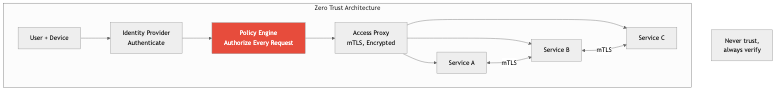

# Infrastructure Security

## Diagrams




## Concepts

### Network Security

Network security encompasses the controls, policies, and tools used to protect the integrity, confidentiality, and availability of your infrastructure's communication channels. In a software engineering context, you are responsible for understanding how traffic flows between your services and what mechanisms keep that traffic safe.

#### Firewalls

A firewall filters network traffic based on a defined set of rules. In cloud environments, firewalls manifest as security groups, network ACLs, and web application firewalls (WAFs).

**Layered firewall strategy:**

```
Internet
   │
   ▼
[WAF — blocks known attack patterns, rate limiting]
   │
   ▼
[Load Balancer — terminates TLS, only ports 80/443 open]
   │
   ▼
[Application Security Group — only allows traffic from LB on port 8080]
   │
   ▼
[Database Security Group — only allows traffic from app on port 5432]
```

**Key principles:**
- **Default deny** — Block everything, then explicitly allow only what is needed.
- **Least privilege** — Each layer only permits the minimum traffic required.
- **Egress filtering** — Do not just filter inbound traffic. Restrict outbound traffic too, so a compromised service cannot phone home to an attacker's server.

Example Terraform security group demonstrating least-privilege access:

```hcl
resource "aws_security_group" "app_server" {
  name   = "app-server-sg"
  vpc_id = aws_vpc.main.id

  # Only allow inbound from the load balancer on the app port
  ingress {
    from_port       = 8080
    to_port         = 8080
    protocol        = "tcp"
    security_groups = [aws_security_group.load_balancer.id]
  }

  # Restrict egress to only the database and HTTPS for external APIs
  egress {
    from_port       = 5432
    to_port         = 5432
    protocol        = "tcp"
    security_groups = [aws_security_group.database.id]
  }

  egress {
    from_port   = 443
    to_port     = 443
    protocol    = "tcp"
    cidr_blocks = ["0.0.0.0/0"]
  }
}
```

#### VPNs and Private Networking

A Virtual Private Network creates an encrypted tunnel between two endpoints, ensuring traffic traverses untrusted networks safely. In infrastructure design, VPNs serve two primary roles:

- **Site-to-site VPN** — Connecting an on-premises data center to a cloud VPC.
- **Client VPN** — Giving individual engineers access to internal resources without exposing them to the public internet.

Modern alternatives include tools like Tailscale and WireGuard, which simplify mesh VPN topologies. The underlying principle is the same: never expose internal services to the public internet when they only need to be reached by known, authenticated parties.

#### TLS (Transport Layer Security)

TLS encrypts data in transit between clients and servers. Every production service must use TLS. There are no exceptions.

**What TLS protects against:**
- **Eavesdropping** — Attackers reading traffic between your services.
- **Tampering** — Attackers modifying requests or responses in flight.
- **Impersonation** — Attackers pretending to be your server (via certificate verification).

**Mutual TLS (mTLS)** takes this further: both the client and server present certificates, so each side verifies the other's identity. This is standard practice in service mesh architectures (Istio, Linkerd) for internal service-to-service communication.

Example of a Rust server configured with TLS using `axum` and `rustls`:

```rust
use axum::{routing::get, Router};
use axum_server::tls_rustls::RustlsConfig;
use std::net::SocketAddr;

#[tokio::main]
async fn main() {
    let tls_config = RustlsConfig::from_pem_file(
        "/etc/certs/server.crt",
        "/etc/certs/server.key",
    )
    .await
    .expect("Failed to load TLS certificates");

    let app = Router::new().route("/health", get(|| async { "ok" }));

    let addr = SocketAddr::from(([0, 0, 0, 0], 443));
    axum_server::bind_rustls(addr, tls_config)
        .serve(app.into_make_service())
        .await
        .expect("Server failed to start");
}
```

On the client side, configuring a TLS client that enforces certificate verification is equally important. Here is an example using `rustls` with `reqwest` to make HTTPS requests with strict certificate validation:

```rust
use reqwest::Client;
use rustls::{ClientConfig, RootCertStore};
use std::sync::Arc;

fn build_secure_client() -> Result<Client, Box<dyn std::error::Error>> {
    // Load the system's trusted root certificates
    let mut root_store = RootCertStore::empty();
    for cert in rustls_native_certs::load_native_certs()? {
        root_store.add(cert)?;
    }

    let tls_config = ClientConfig::builder()
        .with_root_certificates(root_store)
        .with_no_client_auth();

    let client = Client::builder()
        .use_preconfigured_tls(tls_config)
        // Enforce HTTPS -- refuse to follow HTTP redirects
        .https_only(true)
        // Set a reasonable timeout so connections do not hang indefinitely
        .timeout(std::time::Duration::from_secs(30))
        .build()?;

    Ok(client)
}

async fn fetch_data(client: &Client, url: &str) -> Result<String, reqwest::Error> {
    let response = client.get(url).send().await?.error_for_status()?;
    response.text().await
}
```

The key detail is `https_only(true)` -- this ensures the client will never accidentally downgrade to plaintext HTTP, even if a server issues a redirect. Combined with the system root certificate store, this gives you a client that validates server identity and encrypts all traffic.

### Secrets Management

Secrets -- API keys, database passwords, TLS private keys, signing tokens -- must never be stored in source code, environment variables baked into images, or configuration files committed to version control.

**The hierarchy of secrets management maturity:**

| Level | Approach | Risk |
|-------|----------|------|
| 0 | Hardcoded in source code | Catastrophic -- secrets in git history forever |
| 1 | Environment variables set manually | Secrets visible in process listings, shell history |
| 2 | `.env` files excluded from version control | Secrets on disk, easy to leak accidentally |
| 3 | Centralized secrets manager (Vault, AWS Secrets Manager) | Secrets encrypted at rest, access audited |
| 4 | Dynamic/short-lived credentials with automatic rotation | Minimal blast radius, no static secrets |

**Best practices:**
- Use a dedicated secrets manager (HashiCorp Vault, AWS Secrets Manager, GCP Secret Manager).
- Rotate secrets automatically on a schedule.
- Audit every access to a secret -- who read it, when, from where.
- Use short-lived credentials. A database password that expires in one hour is far less dangerous if leaked than one that never expires.
- Never log secrets. Implement redaction in your logging pipeline.

Even when using environment variables (levels 1-2 in the maturity table above), you should validate that all required secrets are present and well-formed at startup rather than discovering a missing secret at runtime when a request fails. Here is a pattern for loading and validating secrets from environment variables:

```rust
use std::env;

#[derive(Debug, Clone)]
pub struct AppSecrets {
    pub database_url: String,
    pub jwt_signing_key: String,
    pub api_key: String,
}

impl AppSecrets {
    /// Load all required secrets from environment variables at startup.
    /// Panics with a clear message if any secret is missing or invalid.
    /// Call this once during initialization -- fail fast, not at request time.
    pub fn from_env() -> Self {
        let mut errors: Vec<String> = Vec::new();

        let database_url = require_env("DATABASE_URL", &mut errors);
        let jwt_signing_key = require_env("JWT_SIGNING_KEY", &mut errors);
        let api_key = require_env("API_KEY", &mut errors);

        // Validate format constraints, not just presence
        if let Some(ref url) = database_url {
            if !url.starts_with("postgres://") && !url.starts_with("postgresql://") {
                errors.push(
                    "DATABASE_URL must start with postgres:// or postgresql://".to_string(),
                );
            }
        }

        if let Some(ref key) = jwt_signing_key {
            if key.len() < 32 {
                errors.push(
                    "JWT_SIGNING_KEY must be at least 32 characters".to_string(),
                );
            }
        }

        if !errors.is_empty() {
            // Log every problem at once so operators can fix them all in one pass
            eprintln!("FATAL: missing or invalid configuration:");
            for err in &errors {
                eprintln!("  - {err}");
            }
            std::process::exit(1);
        }

        AppSecrets {
            database_url: database_url.unwrap(),
            jwt_signing_key: jwt_signing_key.unwrap(),
            api_key: api_key.unwrap(),
        }
    }
}

fn require_env(name: &str, errors: &mut Vec<String>) -> Option<String> {
    match env::var(name) {
        Ok(val) if val.is_empty() => {
            errors.push(format!("{name} is set but empty"));
            None
        }
        Ok(val) => Some(val),
        Err(_) => {
            errors.push(format!("{name} is not set"));
            None
        }
    }
}
```

This approach collects all configuration errors and reports them together, so an operator does not have to fix and redeploy one variable at a time. In production, replace this pattern with a proper secrets manager (level 3+).

Example of fetching a secret from AWS Secrets Manager in Rust:

```rust
use aws_sdk_secretsmanager::Client;

async fn get_database_url(client: &Client) -> Result<String, Box<dyn std::error::Error>> {
    let response = client
        .get_secret_value()
        .secret_id("production/database/credentials")
        .send()
        .await?;

    let secret_string = response
        .secret_string()
        .ok_or("Secret value was not a string")?;

    // Parse JSON secret containing username, password, host, port, dbname
    let creds: serde_json::Value = serde_json::from_str(secret_string)?;
    let url = format!(
        "postgres://{}:{}@{}:{}/{}",
        creds["username"].as_str().unwrap(),
        creds["password"].as_str().unwrap(),
        creds["host"].as_str().unwrap(),
        creds["port"].as_u64().unwrap(),
        creds["dbname"].as_str().unwrap(),
    );

    Ok(url)
}
```

### Supply Chain Security

Your software is only as secure as its weakest dependency. Supply chain attacks target the libraries, build tools, and distribution channels your software relies on.

**Attack vectors:**
- **Typosquatting** — Publishing malicious packages with names similar to popular ones (`reqwest` vs `reqwets`).
- **Dependency confusion** — Exploiting package manager resolution to substitute a public package for an internal one.
- **Compromised maintainer accounts** — An attacker gains access to a legitimate maintainer's credentials and pushes a malicious update.
- **Build system compromise** — Injecting malicious code during the CI/CD build process itself (the SolarWinds attack).

**Mitigations:**
- Pin exact dependency versions. In Rust, use `Cargo.lock` and commit it to version control for binary projects.
- Use `cargo audit` to check for known vulnerabilities in dependencies.
- Use `cargo deny` to enforce policies on licenses, sources, and known-bad crates.
- Verify checksums and signatures of downloaded artifacts.
- Use SLSA (Supply chain Levels for Software Artifacts) framework to assess build integrity.

### Dependency Auditing

Dependency auditing is the continuous practice of evaluating your project's transitive dependency tree for known vulnerabilities, license compliance issues, and maintenance health.

```bash
# Check for known vulnerabilities in the dependency tree
cargo audit

# Enforce supply chain policies (licenses, banned crates, sources)
cargo deny check

# Generate a Software Bill of Materials (SBOM)
cargo cyclonedx
```

A mature CI pipeline includes dependency auditing as a blocking step. If `cargo audit` finds a vulnerability with a CVSS score above your threshold, the pipeline fails.

Example `deny.toml` configuration:

```toml
[advisories]
vulnerability = "deny"
unmaintained = "warn"
yanked = "deny"

[licenses]
unlicensed = "deny"
allow = [
    "MIT",
    "Apache-2.0",
    "BSD-2-Clause",
    "BSD-3-Clause",
    "ISC",
]

[bans]
multiple-versions = "warn"
deny = [
    { name = "openssl", wrappers = ["openssl-sys"] },
]

[sources]
unknown-registry = "deny"
unknown-git = "deny"
allow-registry = ["https://github.com/rust-lang/crates.io-index"]
```

### Container Security

Containers add a significant attack surface if not secured properly. A container is not a security boundary by default -- it shares the host kernel, and a misconfigured container can escalate privileges to the host.

**Container security checklist:**

1. **Use minimal base images** — Use `scratch` or `distroless` images for Rust binaries. There is no reason for your production image to contain a shell, package manager, or curl.

2. **Never run as root** — Set a non-root user in your Dockerfile.

3. **Scan images for vulnerabilities** — Use Trivy, Grype, or Snyk to scan container images in CI.

4. **Sign and verify images** — Use cosign (from the Sigstore project) to sign container images and verify them before deployment.

5. **Use read-only filesystems** — Mount the container filesystem as read-only and explicitly allow writes only where needed.

6. **Drop all capabilities** — Linux capabilities grant fine-grained privileges. Drop all of them and add back only what is required.

Example multi-stage Dockerfile for a hardened Rust binary:

```dockerfile
# Build stage
FROM rust:1.77-slim AS builder
WORKDIR /app
COPY . .
RUN cargo build --release

# Production stage — distroless, no shell, no package manager
FROM gcr.io/distroless/cc-debian12:nonroot
COPY --from=builder /app/target/release/myservice /usr/local/bin/myservice

# Run as non-root user (uid 65534 is 'nobody' in distroless)
USER nonroot:nonroot

ENTRYPOINT ["/usr/local/bin/myservice"]
```

Kubernetes security context enforcing least privilege:

```yaml
apiVersion: v1
kind: Pod
metadata:
  name: myservice
spec:
  securityContext:
    runAsNonRoot: true
    runAsUser: 65534
    fsGroup: 65534
  containers:
    - name: myservice
      image: registry.example.com/myservice:v1.2.3@sha256:abc123...
      securityContext:
        allowPrivilegeEscalation: false
        readOnlyRootFilesystem: true
        capabilities:
          drop: ["ALL"]
      volumeMounts:
        - name: tmp
          mountPath: /tmp
  volumes:
    - name: tmp
      emptyDir: {}
```

### Zero-Trust Architecture

The traditional security model is "castle and moat": everything inside the network perimeter is trusted, everything outside is not. Zero-trust rejects this entirely. The core principle is **never trust, always verify** -- regardless of whether a request originates from inside or outside the network.

**Zero-trust principles:**
- **Verify explicitly** — Authenticate and authorize every request based on all available data (identity, device, location, service health).
- **Least-privilege access** — Grant only the minimum permissions needed, only for the time needed (just-in-time access).
- **Assume breach** — Design systems as if an attacker is already inside the network. Segment access, encrypt everything, monitor continuously.

**Implementation in practice:**
- mTLS between all services (no service trusts another just because it is on the same network).
- Short-lived, scoped tokens (e.g., SPIFFE/SPIRE for workload identity).
- Network micro-segmentation (each service can only reach the specific services it needs).
- Continuous authorization, not just authentication at the perimeter.

In practice, "verify every request" often means validating a signed token (such as a JWT) on every incoming request. Here is a middleware for `axum` that validates JWT tokens and extracts claims, rejecting any request that lacks a valid token:

```rust
use axum::{
    extract::Request,
    http::{header, StatusCode},
    middleware::Next,
    response::Response,
    Extension,
};
use jsonwebtoken::{decode, DecodingKey, TokenData, Validation, Algorithm};
use serde::{Deserialize, Serialize};

#[derive(Debug, Clone, Serialize, Deserialize)]
pub struct Claims {
    /// Subject -- who the token was issued to (user ID or service name)
    pub sub: String,
    /// Expiration time (UTC timestamp)
    pub exp: usize,
    /// Issued-at time (UTC timestamp)
    pub iat: usize,
    /// Scopes or permissions granted to this token
    pub scopes: Vec<String>,
}

/// Middleware that extracts and validates a JWT from the Authorization header.
/// On success, injects the decoded `Claims` as a request extension so
/// downstream handlers can inspect identity and scopes without re-parsing.
pub async fn require_auth(
    mut request: Request,
    next: Next,
) -> Result<Response, StatusCode> {
    let auth_header = request
        .headers()
        .get(header::AUTHORIZATION)
        .and_then(|v| v.to_str().ok())
        .ok_or(StatusCode::UNAUTHORIZED)?;

    let token = auth_header
        .strip_prefix("Bearer ")
        .ok_or(StatusCode::UNAUTHORIZED)?;

    let decoding_key = DecodingKey::from_secret(
        std::env::var("JWT_SIGNING_KEY")
            .expect("JWT_SIGNING_KEY must be set")
            .as_bytes(),
    );

    let mut validation = Validation::new(Algorithm::HS256);
    validation.validate_exp = true;
    // Require the "sub" claim to be present
    validation.set_required_spec_claims(&["sub", "exp", "iat"]);

    let token_data: TokenData<Claims> = decode(token, &decoding_key, &validation)
        .map_err(|_| StatusCode::UNAUTHORIZED)?;

    // Make claims available to downstream handlers via Extension
    request.extensions_mut().insert(token_data.claims);

    Ok(next.run(request).await)
}

// Usage with axum Router:
//
//   use axum::{routing::get, middleware, Router};
//
//   let app = Router::new()
//       .route("/api/protected", get(protected_handler))
//       .layer(middleware::from_fn(require_auth));
//
//   async fn protected_handler(
//       Extension(claims): Extension<Claims>,
//   ) -> String {
//       format!("Hello, {}. Your scopes: {:?}", claims.sub, claims.scopes)
//   }
```

This middleware enforces authentication at the application layer. In a zero-trust architecture, every service runs this kind of validation independently -- it does not rely on the network perimeter or an upstream gateway having already checked the token.

### Security Incident Response

When a security incident occurs -- and it will -- the difference between a minor event and a catastrophic breach often comes down to how quickly and effectively you respond.

**Incident response phases:**

1. **Preparation** — Runbooks, communication channels, escalation paths, and regular tabletop exercises. Define severity levels and who gets paged.
2. **Detection and Analysis** — Identify indicators of compromise. Correlate logs, alerts, and anomalies. Determine scope and severity.
3. **Containment** — Stop the bleeding. Revoke compromised credentials, isolate affected systems, block malicious IPs. Distinguish between short-term containment (stop the attack) and long-term containment (apply permanent fix).
4. **Eradication** — Remove the attacker's foothold. Patch vulnerabilities, rebuild compromised systems from clean images.
5. **Recovery** — Restore services to normal operation. Monitor closely for re-compromise.
6. **Post-Incident Review** — Blameless post-mortem. Document what happened, what went well, what did not, and what will change. Update runbooks and detection rules.

**Critical practices:**
- Pre-provision "break glass" accounts with elevated access that are only used during incidents and fully audited.
- Maintain an inventory of all secrets, certificates, and access tokens so you know what to rotate when something is compromised.
- Practice incident response regularly. An untested plan is not a plan.

### Penetration Testing

Penetration testing (pen testing) is the authorized simulation of attacks against your systems to find vulnerabilities before real attackers do.

**Types of penetration tests:**
- **Black box** — Tester has no prior knowledge of the system. Simulates an external attacker.
- **White box** — Tester has full access to source code, architecture diagrams, and credentials. Most thorough.
- **Gray box** — Tester has partial knowledge (e.g., authenticated user access but no source code).

**What pen testing covers in infrastructure:**
- Network perimeter testing (open ports, misconfigured services).
- Cloud configuration review (public S3 buckets, overly permissive IAM roles).
- Container escape attempts.
- Lateral movement within the network after initial access.
- Secrets exposure (can a compromised service access secrets it should not?).

Pen testing should be performed regularly (at least annually) and after major infrastructure changes. Many compliance frameworks (SOC 2, PCI DSS, HIPAA) require it.

---

## Business Value

Infrastructure security is not a cost center -- it is a business enabler and a competitive advantage.

**Revenue protection:**
- A single data breach costs an average of $4.45 million (IBM Cost of a Data Breach Report, 2023). For large enterprises, the figure can exceed $100 million when including regulatory fines, legal fees, remediation, and lost customer trust.
- Downtime from ransomware attacks averages $1.85 million per incident. Secure infrastructure prevents these losses.

**Compliance as a market requirement:**
- SOC 2, ISO 27001, PCI DSS, HIPAA, GDPR, and FedRAMP are not optional for many markets. Without these certifications, you cannot sell to enterprises, handle financial data, or operate in regulated industries.
- Strong infrastructure security practices make compliance audits faster and cheaper. A well-configured secrets manager with full audit logs can satisfy dozens of SOC 2 controls.

**Customer trust and retention:**
- After a breach, customer churn increases by 2-5%. Customers increasingly evaluate vendors based on their security posture before signing contracts.
- Enterprise sales cycles routinely include security questionnaires. The faster you can answer them with evidence of strong practices, the faster deals close.

**Engineering velocity:**
- Teams with mature security infrastructure move faster, not slower. Automated dependency scanning, secrets management, and container hardening remove entire classes of incidents that would otherwise halt development.
- A zero-trust architecture enables teams to deploy microservices independently without worrying about network-level trust assumptions.

---

## Real-World Examples

### SolarWinds Supply Chain Attack (2020)

Attackers compromised the build system of SolarWinds' Orion software, injecting a backdoor (SUNBURST) into legitimate software updates. Approximately 18,000 organizations installed the compromised update, including the U.S. Treasury, Department of Homeland Security, and major technology companies.

**Root cause:** The build pipeline lacked integrity verification. Attackers modified source code during the build process, and the resulting artifacts were signed with SolarWinds' legitimate certificates, making detection nearly impossible through standard means.

**Lesson:** Build system integrity matters as much as source code integrity. Implement reproducible builds, verify build artifacts independently, and treat your CI/CD pipeline as a critical security boundary. The SLSA framework was created in direct response to this attack.

### Log4Shell / Log4j (2021)

CVE-2021-44228, a critical remote code execution vulnerability in the Apache Log4j logging library (Java), affected virtually every organization running Java software. The vulnerability allowed attackers to execute arbitrary code by simply sending a crafted string that the application would log.

**Root cause:** A widely-used transitive dependency contained a dangerous feature (JNDI lookup in log messages) that was enabled by default. Most organizations had no idea they were even using Log4j because it was buried deep in their dependency trees.

**Lesson:** You must have visibility into your entire transitive dependency tree. Automated dependency auditing (`cargo audit`, `cargo deny`) and Software Bills of Materials (SBOMs) are not optional. The Rust ecosystem's approach of `Cargo.lock` and `cargo audit` provided a model for how dependency management should work.

### Capital One Data Breach (2019)

A former AWS employee exploited a misconfigured WAF and an overly permissive IAM role to access an S3 bucket containing 106 million customer records, including Social Security numbers and bank account numbers. Capital One was fined $80 million and spent over $150 million on remediation.

**Root cause:** The IAM role attached to the WAF had permissions far exceeding what was needed. It could access S3 buckets across the account, list all buckets, and read arbitrary objects. Additionally, the server-side request forgery (SSRF) vulnerability in the WAF allowed the attacker to obtain temporary credentials from the EC2 metadata service.

**Lesson:** Least-privilege IAM policies are non-negotiable. Every role should have the minimum permissions required, scoped to specific resources. Additionally, the EC2 Instance Metadata Service v2 (IMDSv2), which requires session tokens, should always be enforced to prevent SSRF-based credential theft.

### Codecov Bash Uploader Compromise (2021)

Attackers modified Codecov's bash uploader script, which was downloaded and executed by thousands of CI/CD pipelines. The modified script exfiltrated environment variables -- including secrets, tokens, and API keys -- from CI environments to an attacker-controlled server.

**Root cause:** CI pipelines downloaded and executed an external script without verifying its integrity (no checksum or signature verification). The script had access to all environment variables in the CI runner, including secrets.

**Lesson:** Never pipe a URL directly to a shell (`curl | bash`) in CI/CD without verifying checksums. Pin external dependencies by hash. Minimize the secrets available to CI jobs -- use scoped, short-lived tokens instead of long-lived credentials.

---

## Common Mistakes & Pitfalls

### 1. Overly Permissive IAM Policies

The most common infrastructure security mistake is granting `*:*` (all actions on all resources) because "we'll tighten it later." Teams rarely go back and tighten permissions. Use the principle of least privilege from day one, and use tools like IAM Access Analyzer (AWS) or Forseti (GCP) to detect overly broad policies.

### 2. Secrets in Environment Variables and Git History

Once a secret is committed to git, it exists in the repository history permanently, even if the file is deleted in a later commit. Similarly, environment variables baked into container images or deployment manifests persist in image layer history. Use a secrets manager, and if a secret is ever accidentally committed, rotate it immediately -- do not just remove it from the code.

### 3. Neglecting Egress Filtering

Most teams focus on ingress (inbound) firewall rules but leave egress (outbound) wide open. This means a compromised service can freely communicate with attacker-controlled infrastructure, exfiltrate data, or download additional malicious payloads. Restrict outbound traffic to only known, required destinations.

### 4. Running Containers as Root

The default user in most container images is root. If an attacker exploits a vulnerability in your application, they now have root privileges inside the container, which dramatically increases the chance of container escape and host compromise. Always specify a non-root user and drop all Linux capabilities.

### 5. Treating the Network Perimeter as a Security Boundary

Assuming that services inside the VPC can trust each other is the castle-and-moat fallacy. Once an attacker breaches one service (via an application vulnerability, stolen credentials, or supply chain compromise), they can move laterally to every other service on the network. Implement mTLS, network segmentation, and per-service authorization.

### 6. Not Practicing Incident Response

Having a documented incident response plan is necessary but insufficient. If the team has never practiced it, response during a real incident will be slow, chaotic, and error-prone. Run tabletop exercises quarterly and conduct at least one full simulation per year. After every real incident, update the runbook based on what actually happened.

---

## Trade-offs

| Approach | Security Strength | Operational Complexity | Cost | Best For |
|----------|-------------------|----------------------|------|----------|
| **Static secrets in env vars** | Low | Low | Free | Local development only |
| **Centralized secrets manager (Vault, AWS SM)** | High | Medium | Moderate | Production workloads |
| **Dynamic/short-lived credentials** | Very High | High | Moderate | High-security environments |
| **Network perimeter (castle-and-moat)** | Low | Low | Low | Legacy/single-service apps |
| **Zero-trust with mTLS** | Very High | High | Moderate | Microservices, multi-team |
| **Container scanning in CI only** | Medium | Low | Low | Small teams, early stage |
| **Container scanning + runtime protection** | High | High | High | Regulated industries |
| **Annual pen test only** | Medium | Low | Moderate | Compliance checkbox |
| **Continuous pen testing + bug bounty** | Very High | Medium | High | Public-facing products |
| **Manual dependency review** | Low | Very High | Low (time-expensive) | Small dependency trees |
| **Automated `cargo audit` + `cargo deny` in CI** | High | Low | Free | All Rust projects |

---

## When to Use / When Not to Use

### Always Use (Non-Negotiable)

- **TLS for all traffic** — There is no legitimate reason to transmit data in plaintext in production.
- **Secrets manager** — From the first production deployment. Technical debt in secrets management is the most dangerous kind.
- **Dependency auditing in CI** — Adding `cargo audit` to your pipeline takes five minutes and catches real vulnerabilities.
- **Non-root containers** — Zero additional effort in the Dockerfile, significant reduction in blast radius.
- **Committed Cargo.lock** — For binary projects, always commit the lock file to ensure reproducible, auditable builds.

### Use When You Reach This Stage

- **Zero-trust / mTLS** — When you have more than a few services, or when multiple teams deploy independently. The operational overhead is justified by the reduction in lateral movement risk.
- **Dynamic credentials with automatic rotation** — When you handle sensitive data (PII, financial, health) or are pursuing compliance certifications.
- **Runtime container security (Falco, Sysdig)** — When you need to detect anomalous behavior in running containers, not just scan images at build time.
- **Dedicated security team / red team** — When your organization is large enough that security cannot be a part-time responsibility for engineers.
- **SBOM generation and distribution** — When customers or regulators require visibility into your software composition.

### Consider Carefully Before Adopting

- **Full SASE / zero-trust network product suites** — For small teams, the operational overhead of enterprise zero-trust products (Zscaler, Palo Alto Prisma) often exceeds the benefit. Start with simpler tools (Tailscale, mTLS via service mesh).
- **Custom cryptography** — Never implement your own cryptographic algorithms. Use well-audited libraries (`ring`, `rustls`, `RustCrypto`). This applies even to "simple" operations like password hashing -- use `argon2` from a trusted crate.
- **Air-gapped build systems** — Only if you are building software for defense, critical infrastructure, or similarly sensitive contexts. The operational cost is enormous.

---

## Key Takeaways

1. **Defense in depth is not optional.** No single security measure is sufficient. Layer network controls, secrets management, dependency auditing, container hardening, and monitoring so that the failure of any one layer does not result in a breach.

2. **Your software supply chain is an attack surface.** The code you write is a small fraction of what runs in production. Audit your dependencies, pin versions, verify checksums, and treat your CI/CD pipeline as a security-critical system.

3. **Secrets management maturity directly correlates with breach risk.** Progress from hardcoded secrets to a centralized secrets manager with automatic rotation as early as possible. Every secret should have an owner, an expiration, and an audit trail.

4. **The network perimeter is dead.** Zero-trust architecture -- verify every request, encrypt all traffic, assume breach -- is the only model that holds up against modern attack patterns where adversaries routinely operate inside the network.

5. **Container security starts with the image and extends to runtime.** Use minimal base images, run as non-root, drop all capabilities, scan in CI, and sign images. For high-security environments, add runtime monitoring to detect anomalous behavior.

6. **Incident response is a skill that atrophies without practice.** A documented plan that has never been exercised will fail when it matters most. Run tabletop exercises, simulate incidents, and update runbooks after every real event.

7. **Security enables velocity when done right.** Automated scanning, centralized secrets management, and zero-trust networking remove friction and entire categories of production incidents. The teams that invest in infrastructure security early move faster in the long run.

---

## Further Reading

### Books

- **"Zero Trust Networks" by Evan Gilman and Doug Barth** — The definitive guide to implementing zero-trust architecture, covering identity, device trust, network segmentation, and practical implementation patterns.
- **"Container Security" by Liz Rice** — Comprehensive coverage of Linux primitives underlying containers, attack surfaces, image scanning, runtime security, and Kubernetes-specific hardening.
- **"The Art of Software Security Assessment" by Dowd, McDonald, and Schuh** — Deep technical coverage of vulnerability classes and how to find them. Essential for anyone conducting or evaluating penetration tests.
- **"Practical Cloud Security" by Chris Dotson** — Cloud-specific security guidance covering IAM, network architecture, encryption, logging, and incident response across AWS, GCP, and Azure.

### Articles and Reports

- **NIST Cybersecurity Framework (CSF)** — The foundational framework for organizing and improving cybersecurity practices. Free and widely adopted.
- **SLSA Framework (slsa.dev)** — Supply chain Levels for Software Artifacts. A framework for ensuring the integrity of software artifacts throughout the supply chain, created in response to attacks like SolarWinds.
- **CIS Benchmarks** — Detailed, consensus-driven hardening guides for operating systems, cloud providers, containers, and Kubernetes. Available free at cisecurity.org.
- **IBM Cost of a Data Breach Report** — Annual report quantifying the financial impact of data breaches. Useful for justifying security investments to leadership.

### Tools

- **cargo audit** — Checks Rust dependencies against the RustSec Advisory Database for known vulnerabilities.
- **cargo deny** — Enforces policies on licenses, dependency sources, banned crates, and duplicate dependencies.
- **Trivy** — Open-source vulnerability scanner for container images, filesystems, and IaC configurations.
- **HashiCorp Vault** — Industry-standard secrets management with dynamic credentials, encryption as a service, and comprehensive audit logging.
- **Falco** — Runtime security tool that detects anomalous behavior in containers and Kubernetes using system call monitoring.
- **cosign (Sigstore)** — Tool for signing, verifying, and attesting container images and other software artifacts.
- **OWASP ZAP** — Open-source web application security testing tool for automated penetration testing.
