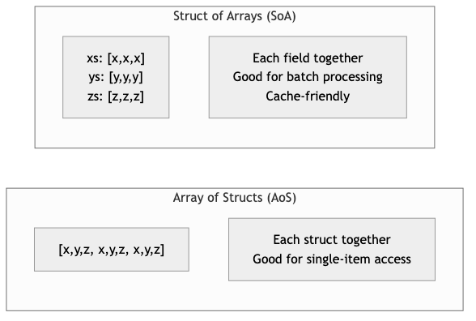
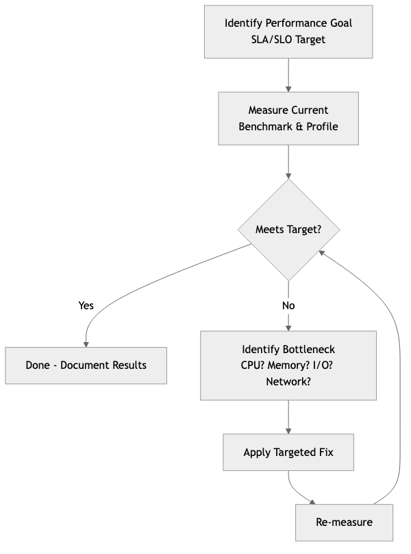

# Performance Engineering

## Diagrams






Performance engineering is the discipline of designing, measuring, and optimizing software systems to meet specific throughput, latency, and resource utilization targets. Unlike ad-hoc optimization -- where developers chase bottlenecks after complaints roll in -- performance engineering treats performance as a first-class requirement from the earliest stages of design through production operations.

This topic covers the full spectrum: from micro-benchmarks of individual functions to system-wide load testing, from CPU cache behavior to database query plans, and from frontend rendering metrics to backend SLA compliance.

---

## Concepts

### Benchmarking with Criterion in Rust

Benchmarking is the foundation of performance engineering. Without reliable measurements, optimization is guesswork. The `criterion` crate provides statistically rigorous benchmarking for Rust, automatically detecting performance regressions and producing detailed reports.

```text
/// A naive sorting implementation for comparison.
PROCEDURE BUBBLE_SORT(data)
    n ← LENGTH(data)
    FOR i ← 0 TO n - 1 DO
        FOR j ← 0 TO n - 2 - i DO
            IF data[j] > data[j + 1] THEN
                SWAP(data[j], data[j + 1])
            END IF
        END FOR
    END FOR

/// An optimized merge sort that reuses a scratch buffer.
PROCEDURE MERGE_SORT_WITH_BUFFER(data, buffer)
    len ← LENGTH(data)
    IF len ≤ 1 THEN RETURN
    IF len ≤ 32 THEN
        // Insertion sort for small arrays -- better cache behavior.
        FOR i ← 1 TO len - 1 DO
            key ← data[i]
            j ← i
            WHILE j > 0 AND data[j - 1] > key DO
                data[j] ← data[j - 1]
                j ← j - 1
            END WHILE
            data[j] ← key
        END FOR
        RETURN
    END IF

    mid ← len / 2
    MERGE_SORT_WITH_BUFFER(data[0..mid], buffer)
    MERGE_SORT_WITH_BUFFER(data[mid..len], buffer)

    CLEAR(buffer)
    COPY data[0..mid] INTO buffer

    i ← 0; j ← mid; k ← 0
    WHILE i < LENGTH(buffer) AND j < len DO
        IF buffer[i] ≤ data[j] THEN
            data[k] ← buffer[i]; i ← i + 1
        ELSE
            data[k] ← data[j]; j ← j + 1
        END IF
        k ← k + 1
    END WHILE
    WHILE i < LENGTH(buffer) DO
        data[k] ← buffer[i]; i ← i + 1; k ← k + 1
    END WHILE

PROCEDURE SORTING_BENCHMARKS()
    FOR EACH size IN [100, 1000, 10000] DO
        data ← REVERSED_RANGE(0, size)

        BENCHMARK "bubble_sort" WITH size:
            d ← CLONE(data)
            BUBBLE_SORT(d)

        BENCHMARK "merge_sort" WITH size:
            d ← CLONE(data)
            buffer ← NEW LIST(capacity ← size)
            MERGE_SORT_WITH_BUFFER(d, buffer)
    END FOR
```

Key details about `criterion`:

- `black_box` prevents the compiler from optimizing away computations whose results are unused.
- `BenchmarkId` allows parameterized benchmarks so you can observe how performance scales with input size.
- Criterion automatically runs warmup iterations, detects outliers, and uses statistical methods (bootstrapping) to estimate confidence intervals.
- Reports include comparison against previous runs, making it possible to detect regressions in CI.

### CPU, Memory, and I/O Profiling

Profiling identifies where a program actually spends its time or allocates its memory, as opposed to where developers assume it does.

**CPU Profiling** reveals hot functions and call paths. On Linux, `perf` is the standard tool. On macOS, Instruments serves the same role. In Rust, the `pprof` crate can generate CPU flame graphs programmatically:

```text
PROCEDURE CPU_INTENSIVE_WORK() → Integer
    sum ← 0
    FOR i ← 0 TO 9999999 DO
        sum ← WRAPPING_ADD(sum, WRAPPING_MUL(i, i))
    END FOR
    RETURN sum

PROCEDURE PROFILE_CPU_WORK()
    guard ← START_PROFILER(
        frequency ← 1000,       // Sample 1000 times per second.
        blocklist ← ["libc", "libgcc", "pthread", "vdso"]
    )

    result ← CPU_INTENSIVE_WORK()
    PRINT "Result: " + result

    report ← guard.BUILD_REPORT()
    IF report IS OK THEN
        file ← CREATE_FILE("flamegraph.svg")
        WRITE_FLAMEGRAPH(report, file)
        PRINT "Flamegraph written to flamegraph.svg"
    END IF
```

**Memory Profiling** tracks allocations and identifies leaks. The `dhat` crate is a Rust-native heap profiler:

```text
// Uses a heap profiler to track allocations.

PROCEDURE ALLOCATE_HEAVILY()
    vecs ← EMPTY LIST
    FOR i ← 0 TO 999 DO
        // Each iteration allocates a new vector of increasing size.
        APPEND NEW_ARRAY(size ← i * 1024, fill ← 0) TO vecs
    END FOR
    // Only the last 100 are kept; the rest are dropped.
    REMOVE vecs[0..900]
    PRINT "Retained " + LENGTH(vecs) + " vectors"

PROCEDURE MAIN()
    profiler ← START_HEAP_PROFILER()
    ALLOCATE_HEAVILY()
    // On profiler cleanup, writes a JSON report for analysis
```

**I/O Profiling** examines disk and network operations. Tools like `strace` (Linux) or `dtrace` (macOS) trace system calls. In application code, wrapping I/O in timing instrumentation is standard practice:

```text
STRUCTURE InstrumentedReader
    inner : Reader
    bytes_read : Integer ← 0
    read_calls : Integer ← 0
    total_duration : Duration ← 0

PROCEDURE InstrumentedReader.NEW(inner) → InstrumentedReader
    RETURN InstrumentedReader { inner ← inner }

PROCEDURE InstrumentedReader.REPORT()
    avg ← IF read_calls > 0 THEN bytes_read / read_calls ELSE 0
    PRINT "I/O Report: " + bytes_read + " bytes across "
          + read_calls + " calls in "
          + (total_duration * 1000) + "ms (avg " + avg + " bytes/call)"

PROCEDURE InstrumentedReader.READ(buf) → Result<Integer>
    start ← CURRENT_TIME()
    result ← self.inner.READ(buf)
    self.total_duration ← self.total_duration + ELAPSED(start)
    IF result IS OK THEN
        n ← result.VALUE
        self.bytes_read ← self.bytes_read + n
        self.read_calls ← self.read_calls + 1
    END IF
    RETURN result
```

### Optimization Techniques

**Zero-Copy Parsing** avoids allocating new buffers by borrowing directly from the input data. This is critical in high-throughput systems that parse network packets, log lines, or serialization formats:

```text
/// A zero-copy HTTP header parser. Fields reference the original data
/// rather than allocating new strings.
STRUCTURE HttpRequest
    method : StringRef      // points into original buffer
    path : StringRef        // points into original buffer
    headers : List<(StringRef, StringRef)>

PROCEDURE PARSE_HTTP_REQUEST(raw) → Option<HttpRequest>
    lines ← SPLIT(raw, "\r\n")

    request_line ← FIRST(lines)
    IF request_line IS NULL THEN RETURN NULL
    parts ← SPLIT(request_line, " ", max ← 3)
    method ← parts[0]
    path ← parts[1]
    // We intentionally ignore the HTTP version for brevity.

    headers ← EMPTY LIST
    FOR EACH line IN REMAINING(lines) DO
        IF line IS EMPTY THEN BREAK
        (name, value) ← SPLIT_ONCE(line, ": ")
        APPEND (name, value) TO headers
    END FOR

    RETURN HttpRequest { method, path, headers }

PROCEDURE DEMONSTRATE_ZERO_COPY()
    raw_request ← "GET /api/users HTTP/1.1\r\nHost: example.com\r\n..."

    request ← PARSE_HTTP_REQUEST(raw_request)
    // All string fields point into raw_request -- no heap allocations
    // were made for the parsed data.
    PRINT request.method + " " + request.path + " with " + LENGTH(request.headers) + " headers"
```

**Cache-Friendly Data Structures** organize data to minimize CPU cache misses. The classic example is "struct of arrays" (SoA) versus "array of structs" (AoS):

```text
/// Array of Structs -- poor cache utilization when iterating over
/// a single field, because each struct occupies a full cache line
/// and fields are interleaved in memory.
STRUCTURE ParticleAoS
    x, y, z : Float64
    mass : Float64
    velocity_x, velocity_y, velocity_z : Float64
    charge : Float64    // 64 bytes total -- exactly one cache line.

/// Struct of Arrays -- excellent cache utilization when processing
/// one field at a time, because values are contiguous in memory.
STRUCTURE ParticlesSoA
    x, y, z : Array<Float64>
    mass : Array<Float64>
    velocity_x, velocity_y, velocity_z : Array<Float64>
    charge : Array<Float64>

PROCEDURE ParticlesSoA.NEW(capacity) → ParticlesSoA
    RETURN ParticlesSoA WITH each array pre-allocated to capacity

/// Update all positions using velocity. This iterates over x, y, z
/// and velocity arrays contiguously, maximizing cache line utilization.
PROCEDURE ParticlesSoA.UPDATE_POSITIONS(dt)
    FOR i ← 0 TO LENGTH(self.x) - 1 DO
        self.x[i] ← self.x[i] + self.velocity_x[i] * dt
        self.y[i] ← self.y[i] + self.velocity_y[i] * dt
        self.z[i] ← self.z[i] + self.velocity_z[i] * dt
    END FOR

/// Compute total kinetic energy. Only touches mass and velocity arrays,
/// so the x/y/z/charge data never pollutes the cache.
PROCEDURE ParticlesSoA.TOTAL_KINETIC_ENERGY() → Float64
    total ← 0.0
    FOR i ← 0 TO LENGTH(self.mass) - 1 DO
        v_sq ← self.velocity_x[i]^2 + self.velocity_y[i]^2 + self.velocity_z[i]^2
        total ← total + 0.5 * self.mass[i] * v_sq
    END FOR
    RETURN total
```

**SIMD (Single Instruction, Multiple Data)** processes multiple data elements in a single CPU instruction. Rust provides access through `std::simd` (nightly) or the `packed_simd` / `wide` crates:

```text
/// Sum an array of f32 values using manual loop unrolling to hint at
/// auto-vectorization. The compiler can often convert this to SIMD
/// instructions with appropriate target features enabled.
PROCEDURE SUM_F32_VECTORIZABLE(data) → Float32
    // Use four accumulators to break data dependencies and allow
    // the CPU to pipeline additions across SIMD lanes.
    sum0 ← 0.0; sum1 ← 0.0; sum2 ← 0.0; sum3 ← 0.0

    FOR EACH chunk OF 4 IN data DO
        sum0 ← sum0 + chunk[0]
        sum1 ← sum1 + chunk[1]
        sum2 ← sum2 + chunk[2]
        sum3 ← sum3 + chunk[3]
    END FOR

    FOR EACH val IN REMAINDER(data, 4) DO
        sum0 ← sum0 + val
    END FOR

    RETURN sum0 + sum1 + sum2 + sum3

/// Using explicit SIMD intrinsics for x86_64 platforms.
/// Processes 8 floats at a time using 256-bit AVX registers.
PROCEDURE SUM_F32_EXPLICIT_SIMD(data) → Float32
    acc ← SIMD_ZERO_256()         // 8 x f32 accumulator

    FOR EACH chunk OF 8 IN data DO
        vals ← SIMD_LOAD_256(chunk)
        acc ← SIMD_ADD_256(acc, vals)
    END FOR

    // Horizontal sum of the 8 lanes.
    total ← SIMD_HORIZONTAL_SUM(acc)

    FOR EACH val IN REMAINDER(data, 8) DO
        total ← total + val
    END FOR

    RETURN total
```

### Load Testing with k6 and Locust

Load testing verifies that a system meets performance targets under realistic traffic patterns. While k6 (JavaScript-based) and locust (Python-based) are the industry standards for writing load test scripts, the Rust backend being tested is what matters here.

A Rust HTTP service designed for load testing should expose metrics endpoints and handle backpressure gracefully:

```text
/// Tracks request metrics for monitoring during load tests (thread-safe).
STRUCTURE LoadTestMetrics
    request_count : AtomicInteger ← 0
    error_count : AtomicInteger ← 0
    total_latency_micros : AtomicInteger ← 0
    max_latency_micros : AtomicInteger ← 0
    start_time : Timestamp

PROCEDURE LoadTestMetrics.RECORD_REQUEST(latency_micros, is_error)
    ATOMIC_INCREMENT(self.request_count, 1)
    ATOMIC_ADD(self.total_latency_micros, latency_micros)

    IF is_error THEN
        ATOMIC_INCREMENT(self.error_count, 1)
    END IF

    // Update max latency using compare-and-swap loop.
    current_max ← ATOMIC_LOAD(self.max_latency_micros)
    WHILE latency_micros > current_max DO
        IF COMPARE_AND_SWAP(self.max_latency_micros, current_max, latency_micros) THEN
            BREAK
        END IF
        current_max ← ATOMIC_LOAD(self.max_latency_micros)
    END WHILE

PROCEDURE LoadTestMetrics.SNAPSHOT() → MetricsSnapshot
    count ← ATOMIC_LOAD(self.request_count)
    errors ← ATOMIC_LOAD(self.error_count)
    total_latency ← ATOMIC_LOAD(self.total_latency_micros)
    max_latency ← ATOMIC_LOAD(self.max_latency_micros)
    elapsed ← ELAPSED_SECONDS(self.start_time)

    RETURN MetricsSnapshot {
        total_requests ← count,
        error_rate ← IF count > 0 THEN errors / count ELSE 0.0,
        avg_latency_ms ← IF count > 0 THEN (total_latency / count) / 1000.0 ELSE 0.0,
        max_latency_ms ← max_latency / 1000.0,
        requests_per_second ← IF elapsed > 0 THEN count / elapsed ELSE 0.0
    }

STRUCTURE MetricsSnapshot
    total_requests : Integer
    error_rate : Float
    avg_latency_ms : Float
    max_latency_ms : Float
    requests_per_second : Float
```

### Database Query Optimization

Database performance is often the single largest bottleneck in web applications. Key optimization strategies include proper indexing, query plan analysis, connection pooling, and avoiding the N+1 query problem.

```text
/// Demonstrates the N+1 problem and its solution.
///
/// BAD: Fetching orders, then fetching items for each order separately.
/// This issues 1 + N queries where N is the number of orders.
///
/// GOOD: A single JOIN query that fetches everything at once.

/// Connection pool configuration tuned for performance.
/// These values should be adjusted based on load testing results.
STRUCTURE PoolConfig
    // Keep some connections warm to avoid cold-start latency.
    min_connections ← 5
    // Limit max connections to avoid overwhelming the database.
    // A common formula: max_connections = (core_count * 2) + disk_spindles
    max_connections ← 20
    // Fail fast if no connection is available.
    acquire_timeout_secs ← 3
    // Recycle idle connections to free database resources.
    idle_timeout_secs ← 600
    // Rotate connections to prevent stale state accumulation.
    max_lifetime_secs ← 1800

/// Pagination using keyset (cursor-based) pagination instead of OFFSET.
/// OFFSET-based pagination degrades as the offset grows because the database
/// must scan and discard all preceding rows.
///
/// BAD:  SELECT * FROM events ORDER BY created_at DESC LIMIT 20 OFFSET 10000;
/// GOOD: SELECT * FROM events WHERE created_at < $1 ORDER BY created_at DESC LIMIT 20;
STRUCTURE KeysetPaginator
    last_seen_cursor : Optional<String>
    page_size : Integer

PROCEDURE KeysetPaginator.WHERE_CLAUSE() → String
    IF self.last_seen_cursor IS NOT NULL THEN
        RETURN "WHERE created_at < '" + self.last_seen_cursor + "'"
    ELSE
        RETURN ""
    END IF

PROCEDURE KeysetPaginator.QUERY(table) → String
    RETURN "SELECT * FROM " + table + " "
           + self.WHERE_CLAUSE()
           + " ORDER BY created_at DESC LIMIT " + self.page_size
```

### Frontend Performance: Core Web Vitals and Bundle Optimization

While the frontend itself may not be written in Rust, the backend APIs and asset serving pipelines that support frontend performance often are. Core Web Vitals are Google's metrics for user experience:

- **Largest Contentful Paint (LCP)**: Time until the largest visible element renders. Target: under 2.5 seconds.
- **Interaction to Next Paint (INP)**: Responsiveness to user input. Target: under 200 milliseconds.
- **Cumulative Layout Shift (CLS)**: Visual stability during loading. Target: under 0.1.

A Rust backend can improve frontend performance through efficient asset compression and cache header management:

```text
/// Manages HTTP cache headers for static assets to improve LCP.
STRUCTURE CachePolicy
    policies : Map<String, CachePolicyEntry>

STRUCTURE CachePolicyEntry
    max_age : Duration
    immutable : Boolean
    public : Boolean

PROCEDURE CachePolicy.NEW() → CachePolicy
    policies ← EMPTY MAP

    // Hashed assets (e.g., app.a1b2c3.js) can be cached forever.
    SET policies["js"]   ← { max_age ← 1 year, immutable ← TRUE, public ← TRUE }
    SET policies["css"]  ← { max_age ← 1 year, immutable ← TRUE, public ← TRUE }
    // HTML should be revalidated on every request.
    SET policies["html"] ← { max_age ← 0, immutable ← FALSE, public ← TRUE }
    // Images with content hashes.
    SET policies["webp"] ← { max_age ← 30 days, immutable ← TRUE, public ← TRUE }

    RETURN CachePolicy { policies }

PROCEDURE CachePolicy.CACHE_CONTROL_HEADER(extension) → String
    entry ← self.policies[extension]
    IF entry IS NOT NULL THEN
        parts ← EMPTY LIST
        APPEND (IF entry.public THEN "public" ELSE "private") TO parts
        APPEND "max-age=" + entry.max_age_seconds TO parts
        IF entry.immutable THEN APPEND "immutable" TO parts
        RETURN JOIN(parts, ", ")
    ELSE
        RETURN "public, max-age=3600"
    END IF
```

### SLA, SLO, and SLI

These three concepts form a hierarchy that connects business promises to engineering measurements:

- **SLI (Service Level Indicator)**: A quantitative metric -- for example, "the proportion of HTTP requests that complete in under 200ms."
- **SLO (Service Level Objective)**: A target for an SLI -- for example, "99.9% of requests will complete in under 200ms, measured over a 30-day rolling window."
- **SLA (Service Level Agreement)**: A contractual commitment that includes consequences -- for example, "If the 99.9% latency SLO is breached, the customer receives a 10% service credit."

```text
/// Tracks an SLI and evaluates it against an SLO.
STRUCTURE SloTracker
    name : String               // Name of the SLI being tracked
    target : Float              // SLO target as fraction (e.g., 0.999 for 99.9%)
    window : Duration           // Rolling window duration
    events : Deque<(Timestamp, Boolean)>  // Timestamped outcomes

PROCEDURE SloTracker.RECORD(success)
    now ← CURRENT_TIME()
    PUSH_BACK (now, success) TO self.events
    self.EVICT_OLD_EVENTS(now)

PROCEDURE SloTracker.EVICT_OLD_EVENTS(now)
    WHILE self.events IS NOT EMPTY DO
        (timestamp, _) ← FRONT(self.events)
        IF now - timestamp > self.window THEN
            POP_FRONT(self.events)
        ELSE
            BREAK
        END IF
    END WHILE

PROCEDURE SloTracker.CURRENT_LEVEL() → Float
    self.EVICT_OLD_EVENTS(CURRENT_TIME())
    IF self.events IS EMPTY THEN RETURN 1.0
    good ← COUNT events WHERE success = TRUE
    RETURN good / LENGTH(self.events)

PROCEDURE SloTracker.ERROR_BUDGET_REMAINING() → Float
    current ← self.CURRENT_LEVEL()
    allowed_bad_rate ← 1.0 - self.target
    actual_bad_rate ← 1.0 - current
    IF allowed_bad_rate = 0.0 THEN RETURN 0.0
    RETURN 1.0 - (actual_bad_rate / allowed_bad_rate)

PROCEDURE SloTracker.IS_MEETING_SLO() → Boolean
    RETURN self.CURRENT_LEVEL() ≥ self.target
```

---

## Business Value

Performance engineering directly impacts revenue, user retention, and infrastructure costs.

**Revenue impact**: Research from Google, Amazon, and Akamai consistently shows that every 100ms of additional latency reduces conversion rates by approximately 1%. For a business processing $1M/day in transactions, a 300ms latency regression could represent $30,000 in lost daily revenue.

**Infrastructure cost reduction**: Optimized software requires fewer servers. A 2x throughput improvement means half the compute instances, which at cloud scale can translate to hundreds of thousands of dollars in annual savings. Companies like Discord have famously reduced their server count by 10x by rewriting performance-critical services in Rust.

**User retention**: Slow applications lose users. Mobile users on constrained networks are especially sensitive. A study by Portent found that pages loading in 1 second have a conversion rate 3x higher than pages loading in 5 seconds.

**Competitive advantage**: In markets where multiple products offer similar features -- trading platforms, gaming backends, search engines -- performance is the differentiator. Users gravitate toward the faster experience.

**SLA compliance**: Breaching contractual SLAs results in financial penalties and reputational damage. Proactive performance engineering prevents SLA violations before they occur.

---

## Real-World Examples

### Discord: Migrating from Go to Rust

Discord's Read States service -- which tracks which messages each user has read across every channel -- was originally written in Go. The service suffered from latency spikes caused by Go's garbage collector pausing all goroutines during collection cycles. Even after extensive tuning of GC parameters, p99 latency remained unpredictable, spiking to several hundred milliseconds every few minutes.

After rewriting the service in Rust, Discord eliminated GC pauses entirely. The p99 latency dropped from ~300ms (with periodic spikes) to a consistent ~5ms. Memory usage also decreased because Rust's ownership model allowed more precise control over allocation lifetimes. The team reported that the Rust service handled the same traffic on fewer instances while providing more predictable performance.

### Netflix: Optimizing Encoding Pipelines

Netflix re-encodes its entire video library whenever improved codecs or encoding algorithms become available. This is a compute-intensive operation that processes petabytes of video data. Their encoding pipeline uses performance engineering principles extensively: SIMD-optimized codec implementations, cache-friendly frame processing order (processing all frames of a single scene together rather than interleaving scenes), and parallel encoding of independent segments.

The result is that Netflix can re-encode its catalog in days rather than months, enabling faster rollout of quality improvements. Their per-title encoding optimization -- which analyzes each piece of content individually to find optimal bitrate ladders -- saves bandwidth costs estimated at hundreds of millions of dollars annually.

### Cloudflare: Workers Runtime Performance

Cloudflare's edge computing platform runs customer code in V8 isolates across more than 300 data centers. The performance engineering challenge is cold start time: creating a new isolate and loading customer code must happen in single-digit milliseconds to avoid impacting the first request. Cloudflare engineered their runtime to pre-warm isolates, snapshot V8 heap state, and use copy-on-write memory pages so that new isolates share read-only memory with existing ones. The result is cold start times under 5ms, compared to hundreds of milliseconds for container-based serverless platforms.

### Figma: WebAssembly Rendering Engine

Figma's collaborative design tool renders complex vector graphics in the browser. Their original JavaScript canvas renderer struggled with large files containing thousands of objects. They rewrote the rendering engine in C++ compiled to WebAssembly (a strategy that applies equally to Rust targeting wasm). The WebAssembly renderer achieved 3x faster rendering performance compared to the JavaScript implementation, with more predictable frame times. This allowed designers to work with files containing 10x more objects without the interface becoming sluggish.

---

## Common Mistakes and Pitfalls

**1. Optimizing without measuring.** The most common mistake is changing code based on intuition rather than profiling data. Developers frequently optimize the wrong function -- the one they suspect is slow rather than the one the profiler identifies. Always profile first, establish a baseline, make one change at a time, and measure again.

**2. Benchmarking in debug mode.** Rust's debug builds include bounds checks, integer overflow checks, and disable all optimizations. Performance characteristics in debug mode bear little resemblance to release mode. A function that appears slow in debug may be entirely optimized away in release. Always benchmark with `--release`, and consider enabling `lto = true` and `codegen-units = 1` in your release profile for benchmarks that must match production behavior.

**3. Premature optimization at the expense of correctness.** Reaching for unsafe Rust, custom allocators, or SIMD intrinsics before exhausting safe optimization opportunities. Often, choosing a better algorithm (e.g., replacing O(n^2) with O(n log n)) yields far greater improvements than micro-optimizing the inner loop of a poor algorithm. The correct order is: right algorithm first, then data structure layout, then micro-optimizations.

**4. Ignoring tail latency.** Reporting only average or median latency hides problems that affect a meaningful fraction of users. A service with 50ms average latency but 5-second p99 latency is providing a terrible experience to 1% of users. At scale -- say, 10 million requests per day -- that is 100,000 users experiencing multi-second delays daily. Always measure and optimize for p95 and p99, not just the median.

**5. Load testing with unrealistic traffic patterns.** A load test that sends the same request repeatedly at a constant rate does not resemble real traffic. Production traffic has bursty patterns, diverse request types, varying payload sizes, and temporal correlations (e.g., popular items get requested together). Load tests must model realistic distributions and include think time between requests.

**6. Caching without invalidation strategy.** Adding a cache improves read latency but introduces consistency problems. Developers often add caches to fix performance issues without designing the invalidation logic, leading to stale data bugs that are difficult to reproduce and diagnose. Every cache must have a clear invalidation strategy, bounded TTLs, and monitoring for hit rates.

---

## Trade-offs

| Approach | Benefit | Cost | When Appropriate |
|---|---|---|---|
| Zero-copy parsing | Eliminates allocation overhead; reduces GC/allocator pressure | Code is harder to write and reason about; lifetimes become complex; data cannot outlive the source buffer | High-throughput parsing of network protocols, log ingestion, serialization formats |
| Struct of Arrays (SoA) layout | Dramatically better cache utilization for field-oriented access patterns | Harder to maintain; adding a field requires updating multiple vectors; indexing logic is error-prone | Numerical simulations, game engines, columnar data processing |
| SIMD intrinsics | 4-8x throughput improvement for data-parallel operations | Platform-specific code; harder to debug; requires deep understanding of CPU architecture; limits portability | Image processing, audio processing, cryptography, scientific computing |
| Connection pooling | Amortizes connection setup cost; bounds resource usage | Adds complexity; pool exhaustion causes request queuing; stale connections need health checks | Any application with more than trivial database or HTTP client usage |
| Aggressive caching | Reduces latency and database load by orders of magnitude | Stale data risk; memory consumption; cache stampede potential; invalidation complexity | Read-heavy workloads with tolerance for bounded staleness |
| Async I/O (tokio) | High concurrency without thread-per-connection overhead | Colored function problem; harder debugging; potential for blocking the runtime accidentally | I/O-bound services with many concurrent connections |
| Pre-computation | Eliminates runtime computation entirely for known inputs | Increased memory usage; stale results if inputs change; build-time cost | Static configuration, lookup tables, compile-time known values |

---

## When to Use / When Not to Use

### When to Invest in Performance Engineering

- **User-facing latency is a product requirement.** Search engines, trading platforms, gaming backends, and real-time collaboration tools must meet strict latency budgets. Performance is a feature.
- **Infrastructure costs are significant.** If your cloud bill is a material portion of operating expenses, optimizing throughput per instance directly reduces costs.
- **You have identified a specific bottleneck through measurement.** Profiling has revealed that a particular service, query, or code path is the constraint. Focused optimization of known bottlenecks has high return on investment.
- **You are approaching SLO/SLA boundaries.** When your error budget is being consumed faster than expected, performance engineering prevents contractual breaches.
- **Scale is increasing faster than you can add resources.** Horizontal scaling has diminishing returns due to coordination overhead. Vertical optimization of critical paths buys time.

### When Not to Invest in Performance Engineering

- **The product has not found market fit.** If you are still iterating on what the product does, optimizing how fast it does it is premature. Ship features, validate hypotheses, and optimize later.
- **The system is not under load.** A service handling 10 requests per second does not need SIMD-optimized parsers or struct-of-arrays layouts. Use simple, correct code and revisit when traffic grows.
- **The bottleneck is external.** If the database is the constraint, optimizing application code will not help. If the network is the constraint, optimizing CPU usage will not help. Identify the actual bottleneck before optimizing.
- **You lack benchmarking infrastructure.** Optimization without measurement is guesswork. Invest in benchmarking and profiling tooling before attempting performance improvements.
- **The codebase is unstable.** Heavily optimized code is harder to change. If the module's interface or behavior is still in flux, optimization work will be discarded when the next refactor arrives.

---

## Key Takeaways

1. **Measure before optimizing.** Use criterion for micro-benchmarks, profilers (pprof, dhat, perf) for identifying bottlenecks, and load testing tools (k6, locust) for system-level validation. Never optimize based on intuition alone.

2. **Optimize the algorithm first, then the implementation.** Replacing an O(n^2) algorithm with an O(n log n) one will always outperform micro-optimizing the O(n^2) inner loop. Data structure and algorithm choice dominates constant-factor improvements.

3. **Understand your memory hierarchy.** The difference between an L1 cache hit (1ns) and a main memory access (100ns) is two orders of magnitude. Cache-friendly data layouts (SoA, contiguous arrays, avoiding pointer chasing) can improve performance dramatically without changing the algorithm.

4. **Track tail latency, not just averages.** P95 and p99 latency reveal the experience of your worst-served users. Systems that look healthy at the median can be failing at the tail. SLOs should be defined on percentile metrics.

5. **Use Rust's ownership model as a performance tool.** Zero-copy parsing, stack allocation, and deterministic destruction are not just safety features -- they are performance features. Rust's guarantees enable optimizations that would be unsafe or impractical in garbage-collected languages.

6. **Treat performance as a continuous practice, not a one-time project.** Integrate benchmarks into CI. Track performance metrics in production. Set SLOs and monitor error budgets. Performance regressions caught early are cheap to fix; those discovered in production incidents are expensive.

7. **Know when to stop.** Performance engineering has diminishing returns. Once you meet your SLOs with adequate error budget, further optimization adds complexity without proportional value. Redirect engineering effort toward features and reliability.

---

## Further Reading

### Books

- **"Systems Performance: Enterprise and the Cloud" by Brendan Gregg** -- The definitive reference on performance analysis methodology, covering CPU, memory, file systems, disks, network, and cloud environments. Essential for anyone doing serious performance work.
- **"The Art of Writing Efficient Programs" by Fedor G. Pikus** -- Focuses on modern CPU architecture, memory hierarchy, and how to write code that exploits hardware effectively. Covers C++ but the principles apply directly to Rust.
- **"Database Internals" by Alex Petrov** -- Deep dive into how storage engines and distributed databases work internally. Critical for understanding why certain query patterns are fast and others are not.
- **"High Performance Browser Networking" by Ilya Grigorik** -- Covers TCP, TLS, HTTP/2, WebSocket, and WebRTC performance. Essential for understanding frontend performance from the network layer up.
- **"Performance Analysis and Tuning on Modern CPUs" by Denis Bakhvalov** -- Practical guide to using hardware performance counters, understanding branch prediction, and diagnosing CPU-level performance issues.

### Articles and Resources

- "The Flame Graph" by Brendan Gregg -- the original paper introducing flame graphs for performance visualization.
- Google's Web Vitals documentation (web.dev/vitals) -- authoritative source on Core Web Vitals metrics and optimization strategies.
- "Latency Numbers Every Programmer Should Know" -- Jeff Dean's reference table of approximate latency for common operations, from L1 cache access to cross-continent network round trips.
- The Rust Performance Book (nnethercote.github.io/perf-book) -- Rust-specific optimization techniques including compile-time configuration, profiling, and common performance pitfalls.

### Rust Crates

- **criterion** (crates.io/crates/criterion) -- Statistical benchmarking framework with HTML reports and regression detection.
- **pprof** (crates.io/crates/pprof) -- CPU profiler that generates flame graphs, integrates with pprof format.
- **dhat** (crates.io/crates/dhat) -- Heap profiler for tracking allocations, measuring memory usage, and finding leaks.
- **tracing** (crates.io/crates/tracing) -- Structured instrumentation framework for adding observability to performance-critical code paths.
- **bytes** (crates.io/crates/bytes) -- Efficient byte buffer abstractions for zero-copy networking, used extensively in tokio.
- **serde** (crates.io/crates/serde) -- Serialization framework with zero-copy deserialization support via `#[serde(borrow)]`.
- **crossbeam** (crates.io/crates/crossbeam) -- Lock-free data structures and utilities for concurrent programming, often faster than std equivalents.
- **rayon** (crates.io/crates/rayon) -- Data parallelism library that converts sequential iterators to parallel with minimal code changes.
