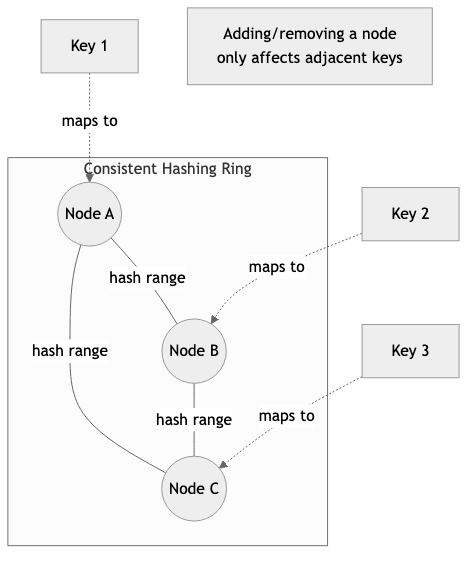
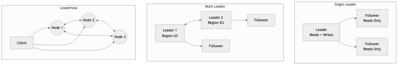

# Distributed Systems Engineering

## Diagrams






Distributed systems engineering is the discipline of designing, building, and operating software that runs across multiple networked machines and coordinates work to appear as a single coherent system. It is one of the most challenging areas of software engineering because the network is fundamentally unreliable, clocks drift, nodes fail independently, and partial failures are the norm rather than the exception. Mastering distributed systems requires a deep understanding of consistency models, fault tolerance patterns, and the inherent trade-offs articulated by results like the CAP theorem and the FLP impossibility result.

---

## Concepts

### Service Discovery

In a distributed system composed of many services, each service needs to locate the others. Hardcoding addresses breaks down when services scale horizontally, move across hosts, or restart on different ports. Service discovery solves this by maintaining a registry of available service instances and their network locations.

There are two primary models:

- **Client-side discovery**: The client queries a service registry (e.g., Consul, etcd, ZooKeeper) and selects an instance using a load-balancing strategy. The client bears the responsibility of choosing a healthy instance.
- **Server-side discovery**: The client sends requests to a load balancer or API gateway, which queries the registry and forwards the request. This simplifies the client at the cost of an additional network hop.

```text
/// Represents a single service instance in the registry.
STRUCTURE ServiceInstance
    id : String
    host : String
    port : Integer
    last_heartbeat : Timestamp

/// A simple in-memory service registry with TTL-based health tracking.
STRUCTURE ServiceRegistry
    services : ThreadSafe<Map<String, List<ServiceInstance>>>
    ttl : Duration

PROCEDURE ServiceRegistry.NEW(ttl) → ServiceRegistry
    RETURN ServiceRegistry { services ← EMPTY MAP, ttl ← ttl }

/// Register a service instance under a given service name.
PROCEDURE ServiceRegistry.REGISTER(service_name, instance)
    ACQUIRE WRITE LOCK ON self.services
    IF service_name NOT IN self.services THEN
        self.services[service_name] ← EMPTY LIST
    END IF
    APPEND instance TO self.services[service_name]

/// Discover healthy instances for a given service name.
PROCEDURE ServiceRegistry.DISCOVER(service_name) → List<ServiceInstance>
    ACQUIRE READ LOCK ON self.services
    now ← CURRENT_TIME()
    instances ← self.services[service_name]
    IF instances IS NULL THEN RETURN EMPTY LIST
    RETURN FILTER instances WHERE (now - inst.last_heartbeat) < self.ttl

/// Remove stale instances that have not sent a heartbeat within the TTL.
PROCEDURE ServiceRegistry.EVICT_STALE()
    ACQUIRE WRITE LOCK ON self.services
    now ← CURRENT_TIME()
    FOR EACH instances IN self.services.VALUES() DO
        RETAIN instances WHERE (now - inst.last_heartbeat) < self.ttl
    END FOR
```

### Distributed Tracing

When a single user request fans out across dozens of services, understanding latency and diagnosing failures requires tracing the entire call graph. Distributed tracing assigns a unique trace ID to each incoming request and propagates it through every downstream call. Each service records a span -- a named, timed segment of work -- and exports it to a collector (e.g., Jaeger, Zipkin, or an OpenTelemetry backend).

```text
/// A minimal representation of a trace span.
STRUCTURE Span
    trace_id : String
    span_id : String
    parent_span_id : Optional<String>
    operation_name : String
    start : Timestamp
    duration_ms : Optional<Integer>
    tags : List<(String, String)>

PROCEDURE Span.START_SPAN(trace_id, span_id, parent, operation) → Span
    RETURN Span {
        trace_id ← trace_id,
        span_id ← span_id,
        parent_span_id ← parent,
        operation_name ← operation,
        start ← CURRENT_TIME(),
        duration_ms ← NULL,
        tags ← EMPTY LIST
    }

PROCEDURE Span.FINISH()
    self.duration_ms ← ELAPSED_MILLIS(self.start)

PROCEDURE Span.SET_TAG(key, value)
    APPEND (key, value) TO self.tags
```

### Data Replication Patterns

Replication copies data across multiple nodes to improve availability and read throughput. The three dominant strategies are:

- **Single-leader (primary-replica)**: One node accepts writes and replicates to followers. Simple, but the leader is a bottleneck and single point of failure during leader election.
- **Multi-leader**: Multiple nodes accept writes and synchronize with each other. Useful for multi-datacenter deployments but introduces write conflicts that must be resolved (last-writer-wins, CRDTs, application-level merging).
- **Leaderless (Dynamo-style)**: Clients write to and read from multiple replicas. Consistency is tuned via quorum parameters (W + R > N for strong consistency).

```text
/// Quorum parameters for a leaderless replication system.
STRUCTURE QuorumConfig
    num_replicas : Integer      // N
    write_quorum : Integer      // W
    read_quorum : Integer       // R

PROCEDURE QuorumConfig.NEW(n, w, r) → QuorumConfig
    ASSERT w + r > n, "W + R must exceed N for strong consistency"
    ASSERT w ≤ n AND r ≤ n, "Quorum sizes cannot exceed replica count"
    RETURN QuorumConfig { num_replicas ← n, write_quorum ← w, read_quorum ← r }

PROCEDURE QuorumConfig.IS_STRONGLY_CONSISTENT() → Boolean
    RETURN self.write_quorum + self.read_quorum > self.num_replicas

/// Check if we received enough acknowledgments.
PROCEDURE QuorumConfig.WRITE_SUCCEEDED(acks) → Boolean
    RETURN acks ≥ self.write_quorum

PROCEDURE QuorumConfig.READ_SUCCEEDED(responses) → Boolean
    RETURN responses ≥ self.read_quorum
```

### Sharding Strategies

Sharding (also called partitioning) splits data across multiple nodes so that no single node must store or process everything. Common strategies include:

- **Range-based sharding**: Data is split by key ranges (e.g., users A-M on shard 1, N-Z on shard 2). Simple but prone to hotspots if key distribution is skewed.
- **Hash-based sharding**: A hash function maps keys to shards uniformly. Distributes load evenly but makes range queries difficult.
- **Consistent hashing**: Nodes are placed on a hash ring. Keys are assigned to the next node clockwise on the ring. Adding or removing a node only redistributes a fraction of keys, which is critical for elastic scaling.

```text
/// A consistent hash ring supporting virtual nodes for better distribution.
STRUCTURE ConsistentHashRing
    ring : SortedMap<Integer, String>
    virtual_nodes_per_physical : Integer

PROCEDURE ConsistentHashRing.NEW(virtual_nodes) → ConsistentHashRing
    RETURN ConsistentHashRing { ring ← EMPTY SORTED MAP, virtual_nodes_per_physical ← virtual_nodes }

PROCEDURE HASH_KEY(key) → Integer
    RETURN HASH(key)

PROCEDURE ConsistentHashRing.ADD_NODE(node_id)
    FOR i ← 0 TO self.virtual_nodes_per_physical - 1 DO
        virtual_key ← node_id + "#" + i
        hash ← HASH_KEY(virtual_key)
        self.ring[hash] ← node_id
    END FOR

PROCEDURE ConsistentHashRing.REMOVE_NODE(node_id)
    FOR i ← 0 TO self.virtual_nodes_per_physical - 1 DO
        virtual_key ← node_id + "#" + i
        hash ← HASH_KEY(virtual_key)
        DELETE self.ring[hash]
    END FOR

/// Find the node responsible for a given key.
PROCEDURE ConsistentHashRing.GET_NODE(key) → Optional<String>
    IF self.ring IS EMPTY THEN RETURN NULL
    hash ← HASH_KEY(key)
    // Find the first node with a hash ≥ the key's hash (clockwise).
    node ← FIRST ENTRY IN self.ring WHERE entry.key ≥ hash
    IF node IS NULL THEN
        node ← FIRST ENTRY IN self.ring    // Wrap around the ring.
    END IF
    RETURN node.value
```

### Distributed Caching

Caching in distributed systems reduces latency and load on backend stores. Patterns include:

- **Cache-aside (lazy loading)**: The application checks the cache first. On a miss, it reads from the database, populates the cache, and returns the result.
- **Write-through**: Every write goes to both the cache and the database. Ensures consistency at the cost of higher write latency.
- **Write-behind (write-back)**: Writes go to the cache first and are asynchronously flushed to the database. Low write latency but risks data loss if the cache node fails before flushing.

```text
STRUCTURE CacheEntry<V>
    value : V
    inserted_at : Timestamp
    ttl : Duration

PROCEDURE CacheEntry.IS_EXPIRED() → Boolean
    RETURN ELAPSED(self.inserted_at) > self.ttl

/// A cache-aside implementation with TTL-based expiration.
STRUCTURE CacheAside<V>
    store : Map<String, CacheEntry<V>>
    default_ttl : Duration

/// Attempt to read from cache. Returns NULL on miss or expiration.
PROCEDURE CacheAside.GET(key) → Optional<V>
    entry ← self.store[key]
    IF entry IS NOT NULL THEN
        IF NOT entry.IS_EXPIRED() THEN
            RETURN entry.value
        END IF
        // Expired -- remove and treat as miss.
        DELETE self.store[key]
    END IF
    RETURN NULL

/// Populate the cache after a database read.
PROCEDURE CacheAside.SET(key, value)
    self.store[key] ← CacheEntry {
        value ← value,
        inserted_at ← CURRENT_TIME(),
        ttl ← self.default_ttl
    }

/// Invalidate a cache entry, typically after a write to the database.
PROCEDURE CacheAside.INVALIDATE(key)
    DELETE self.store[key]
```

### Idempotency

In distributed systems, network failures and retries mean that a request may be delivered more than once. An operation is idempotent if performing it multiple times produces the same result as performing it once. Idempotency keys -- typically UUIDs attached to each request -- allow servers to detect and deduplicate repeated operations.

```text
/// Stores results of previously processed requests for deduplication.
STRUCTURE IdempotencyStore<R>
    entries : Map<String, (R, Timestamp)>
    retention : Duration

/// Check whether a request with this idempotency key was already processed.
PROCEDURE IdempotencyStore.GET_EXISTING_RESULT(key) → Optional<R>
    (result, created_at) ← self.entries[key]
    IF result IS NOT NULL AND ELAPSED(created_at) < self.retention THEN
        RETURN result
    END IF
    RETURN NULL

/// Record the result of a processed request.
PROCEDURE IdempotencyStore.RECORD(key, result)
    self.entries[key] ← (result, CURRENT_TIME())

/// Purge entries older than the retention period.
PROCEDURE IdempotencyStore.PURGE_EXPIRED()
    RETAIN entries WHERE ELAPSED(created_at) < self.retention
```

### Saga Pattern

The saga pattern manages distributed transactions by breaking them into a sequence of local transactions, each with a corresponding compensating action. If any step fails, the saga executes compensations in reverse order to undo the work of previously completed steps. There are two coordination styles:

- **Choreography**: Each service publishes events, and downstream services react. No central coordinator but harder to reason about the overall flow.
- **Orchestration**: A central saga orchestrator directs each step and triggers compensations on failure. Easier to understand but introduces a single coordination point.

```text
/// Represents a single step in a saga with its action and compensation.
STRUCTURE SagaStep
    name : String
    execute : Function → Result        // Returns Ok on success, Error(reason) on failure
    compensate : Function → Result     // Compensating action to undo this step

/// An orchestration-based saga executor.
STRUCTURE SagaOrchestrator
    steps : List<SagaStep>

/// Execute the saga. On failure, compensate all completed steps in reverse.
PROCEDURE SagaOrchestrator.EXECUTE() → Result
    completed ← EMPTY LIST

    FOR i ← 0 TO LENGTH(self.steps) - 1 DO
        step ← self.steps[i]
        PRINT "Executing step: " + step.name
        result ← step.EXECUTE()
        IF result IS OK THEN
            APPEND i TO completed
        ELSE
            reason ← result.ERROR
            PRINT "Step '" + step.name + "' failed: " + reason + ". Initiating compensation."
            // Compensate in reverse order.
            FOR EACH idx IN REVERSE(completed) DO
                comp_step ← self.steps[idx]
                PRINT "Compensating step: " + comp_step.name
                comp_result ← comp_step.COMPENSATE()
                IF comp_result IS ERROR THEN
                    PRINT "Compensation for '" + comp_step.name + "' failed: "
                          + comp_result.ERROR + ". Manual intervention required."
                END IF
            END FOR
            RETURN Error("Saga failed at step '" + step.name + "': " + reason)
        END IF
    END FOR

    RETURN Ok
```

### Distributed Transactions

Traditional two-phase commit (2PC) provides atomicity across multiple nodes but at a steep cost: it is a blocking protocol that can leave participants in an uncertain state if the coordinator crashes. Three-phase commit (3PC) attempts to address this but is rarely used in practice because network partitions still break its assumptions.

Modern systems tend to avoid distributed transactions entirely, favoring eventual consistency, sagas, or careful schema design that keeps transactions local to a single service.

---

## Business Value

Distributed systems engineering directly determines whether a product can scale to meet demand, remain available during failures, and deliver acceptable latency to users worldwide.

- **Availability and uptime**: Replication and fault tolerance patterns keep systems operational when individual nodes fail, directly protecting revenue. A minute of downtime for a large e-commerce platform can cost hundreds of thousands of dollars.
- **Horizontal scalability**: Sharding and stateless service design allow systems to grow by adding machines rather than buying bigger ones. This translates to a more predictable and often lower cost curve as the business scales.
- **Global reach**: Multi-region replication and edge caching reduce latency for users regardless of geography, improving conversion rates and user satisfaction.
- **Data integrity in complex flows**: Patterns like sagas and idempotency keys ensure that multi-step business processes (placing orders, processing payments, booking travel) complete correctly even in the face of partial failures.
- **Operational efficiency**: Distributed tracing and service discovery reduce mean time to detection (MTTD) and mean time to resolution (MTTR) for production incidents, freeing engineering time for feature work rather than firefighting.
- **Competitive advantage**: Companies that master distributed systems can ship features that require real-time coordination, large-scale data processing, or extreme reliability -- capabilities that are difficult for competitors to replicate quickly.

---

## Real-World Examples

### Netflix -- Microservices, Chaos Engineering, and Distributed Caching

Netflix operates hundreds of microservices serving over 200 million subscribers. They use Eureka for service discovery, allowing services to register themselves and find each other without hardcoded addresses. Their EVCache system, built on top of Memcached, provides a distributed caching layer that handles millions of requests per second, reducing load on backend data stores. Netflix pioneered chaos engineering with Chaos Monkey, which randomly terminates production instances to ensure the system degrades gracefully rather than catastrophically.

### Uber -- Sharding and Distributed Databases

Uber's real-time marketplace (matching riders with drivers) requires extremely low-latency reads and writes. They developed Schemaless, a sharded MySQL-based datastore, and later moved critical workloads to CacheFront and DocStore. Their geospatial indexing uses a custom sharding strategy based on geographic cells to co-locate data that is frequently accessed together. Uber also built Cadence (now Temporal) for orchestrating long-running, distributed workflows -- an implementation of the saga/workflow pattern at massive scale.

### Stripe -- Idempotency and Exactly-Once Payment Processing

Stripe's payment API is a textbook example of idempotency in production. Every API request can include an Idempotency-Key header. If Stripe receives a duplicate request (same key), it returns the original response without re-executing the operation. This is critical in payment processing where a retry after a network timeout must not charge a customer twice. Internally, Stripe stores idempotency keys alongside request fingerprints in a durable store and uses them to short-circuit duplicate processing.

### Google -- Spanner and Globally Consistent Distributed Transactions

Google Spanner is a globally distributed database that provides external consistency (the strongest form of consistency) using TrueTime, a clock synchronization system based on GPS receivers and atomic clocks in every datacenter. Spanner uses two-phase commit within a Paxos group and across Paxos groups to support distributed transactions at global scale. This allows Google to run globally distributed applications (such as Google Ads) that require strong consistency guarantees without sacrificing availability in practice.

---

## Common Mistakes and Pitfalls

### 1. Treating the Network as Reliable

The first of the "fallacies of distributed computing" is assuming the network is reliable. Developers who do not account for packet loss, reordering, duplication, and partitions build systems that fail unpredictably in production. Every remote call must have a timeout, a retry policy, and a fallback behavior.

### 2. Ignoring Partial Failures

In a monolith, an operation either succeeds or fails entirely. In a distributed system, some participants may succeed while others fail. Failing to handle partial failures leads to data inconsistency -- for example, charging a customer but not creating their order. The saga pattern and compensating transactions exist precisely to address this.

### 3. Over-Sharding Too Early

Sharding introduces significant operational complexity: cross-shard queries become expensive, rebalancing is disruptive, and joins across shards are difficult or impossible. Many teams shard prematurely when a single well-tuned database with read replicas would suffice. Shard only when you have evidence that a single node cannot handle the load.

### 4. Choosing Strong Consistency Everywhere

Strong consistency (linearizability) is expensive in terms of latency and availability. Many use cases -- displaying a user's profile, showing product recommendations, rendering a news feed -- tolerate slightly stale data. Applying strong consistency uniformly wastes resources and reduces availability. Choose the weakest consistency model that your business requirements allow.

### 5. Neglecting Idempotency from the Start

Retrofitting idempotency into existing APIs is painful. If your system does not handle duplicate requests correctly from the beginning, you will encounter double charges, duplicate records, and inconsistent state. Design every mutating operation to be idempotent from day one.

### 6. Distributed Monolith Anti-Pattern

Splitting a monolith into microservices without proper boundaries often produces a "distributed monolith" -- services that are tightly coupled, must be deployed together, and communicate synchronously in long chains. This has all the complexity of a distributed system with none of the benefits. If your services cannot be deployed and scaled independently, reconsider your service boundaries.

---

## Trade-offs

| Decision | Advantage | Disadvantage |
|---|---|---|
| Strong consistency (e.g., linearizability) | Simplifies application logic; no stale reads | Higher latency; reduced availability during partitions (CAP theorem) |
| Eventual consistency | Lower latency; higher availability; better partition tolerance | Application must handle stale or conflicting data; harder to reason about |
| Single-leader replication | Simple write path; easy to reason about ordering | Leader is a bottleneck; failover introduces brief unavailability |
| Multi-leader replication | Writes accepted in multiple regions; lower write latency globally | Conflict resolution is complex; risk of data divergence |
| Synchronous replication | Guarantees durability before acknowledging writes | Higher write latency; reduced availability if replicas are slow |
| Asynchronous replication | Lower write latency; higher write availability | Risk of data loss if the leader fails before replication completes |
| Hash-based sharding | Uniform data distribution; avoids hotspots | Range queries require scatter-gather across all shards |
| Range-based sharding | Efficient range scans; natural data locality | Prone to hotspots if key distribution is skewed |
| Saga (choreography) | Loose coupling; no single point of failure | Harder to debug and monitor; implicit control flow |
| Saga (orchestration) | Explicit control flow; easier to monitor and test | Central orchestrator is a coordination bottleneck |
| Distributed caching | Dramatically reduces read latency and database load | Cache invalidation is notoriously difficult; stale data risk |
| Two-phase commit (2PC) | Provides atomicity across multiple nodes | Blocking protocol; vulnerable to coordinator failure; high latency |

---

## When to Use / When Not to Use

### When to Use Distributed Systems Patterns

- **Traffic exceeds single-machine capacity**: When a single server cannot handle the request volume, sharding and horizontal scaling become necessary.
- **High availability is a hard requirement**: If the business cannot tolerate downtime (e.g., payment processing, healthcare, emergency services), replication and failover are essential.
- **Multi-region deployment**: Serving users globally with low latency requires data replication across geographic regions and region-aware routing.
- **Complex multi-service workflows**: When a business process spans multiple services (e.g., e-commerce checkout involving inventory, payment, shipping, and notification services), sagas or workflow orchestration provide correctness guarantees.
- **Read-heavy workloads with latency sensitivity**: Distributed caching is appropriate when the same data is read frequently and the cost of a cache miss (a database round trip) is unacceptable.

### When Not to Use Distributed Systems Patterns

- **Your application fits on a single machine**: If a single well-provisioned server handles your load, adding distribution introduces unnecessary complexity. PostgreSQL on a single node with connection pooling handles more traffic than most teams realize.
- **Your team lacks operational maturity**: Distributed systems require sophisticated monitoring, deployment pipelines, and incident response capabilities. Without these, distributed architectures amplify problems rather than solving them.
- **Strong consistency is easy to achieve locally**: If all data needed for a transaction lives in a single database, use a local ACID transaction rather than a distributed saga or 2PC.
- **Prototyping or MVP stage**: Early-stage products need to iterate quickly on features, not on infrastructure. Start with a monolith and decompose when the need is demonstrated by evidence.
- **The data set is small**: Sharding a dataset that fits comfortably in memory on a single node adds complexity with no performance benefit.

---

## Key Takeaways

1. **The network is not reliable, and clocks are not synchronized.** Every design decision in a distributed system must account for message loss, reordering, duplication, and clock skew. These are not edge cases; they are the normal operating conditions.

2. **Choose the weakest consistency model your business can tolerate.** Linearizability is expensive. Many workloads function correctly with eventual consistency, causal consistency, or read-your-writes consistency. Stronger guarantees should be reserved for operations that truly require them (e.g., financial transactions, inventory decrements).

3. **Idempotency is non-negotiable for any operation that mutates state.** Retries are inevitable in distributed systems. If your operations are not idempotent, retries will corrupt your data. Use idempotency keys, conditional writes, or naturally idempotent operations (like setting a value rather than incrementing it).

4. **Sagas replace distributed transactions in microservice architectures.** Two-phase commit does not scale well and creates tight coupling between services. Sagas, whether choreographed or orchestrated, provide a practical way to maintain data consistency across service boundaries with acceptable trade-offs.

5. **Shard only when you must, and choose your shard key carefully.** A poorly chosen shard key creates hotspots that negate the benefits of sharding. The shard key should align with your most common access patterns, and you should have strong evidence that a single node is insufficient before introducing sharding.

6. **Distributed tracing is essential, not optional.** Without tracing, debugging latency issues or failures in a system with more than a handful of services becomes guesswork. Invest in tracing infrastructure (OpenTelemetry, Jaeger, or similar) early, before the system grows too complex to retrofit.

7. **Test for failure, not just success.** Chaos engineering, fault injection, and game days are how you discover weaknesses before your users do. A system that has never been tested under partial failure conditions will behave unpredictably when those failures inevitably occur in production.

---

## Further Reading

### Books

- **"Designing Data-Intensive Applications" by Martin Kleppmann** -- The definitive guide to the principles behind distributed data systems. Covers replication, partitioning, consistency, and consensus in exceptional depth.
- **"Distributed Systems" by Maarten van Steen and Andrew S. Tanenbaum** -- A comprehensive academic treatment of distributed systems fundamentals including naming, synchronization, consistency, and fault tolerance.
- **"Building Microservices" by Sam Newman (2nd Edition)** -- Practical guidance on decomposing systems into services, with detailed coverage of sagas, service discovery, and deployment patterns.
- **"Database Internals" by Alex Petrov** -- Deep coverage of distributed database internals including gossip protocols, anti-entropy, and distributed transactions.
- **"Understanding Distributed Systems" by Roberto Vitillo** -- A concise and accessible introduction to distributed systems patterns aimed at working engineers.

### Articles and Papers

- **"Harvest, Yield, and Scalable Tolerant Systems" by Armando Fox and Eric Brewer** -- The original paper behind the CAP theorem, reframed in practical terms of harvest (completeness of results) and yield (probability of completing a request).
- **"Life Beyond Distributed Transactions" by Pat Helland** -- A foundational paper arguing that distributed transactions do not scale and proposing alternatives based on idempotency and application-level coordination.
- **"Sagas" by Hector Garcia-Molina and Kenneth Salem (1987)** -- The original paper introducing the saga concept for long-lived transactions.
- **"Dynamo: Amazon's Highly Available Key-Value Store"** -- The paper that popularized consistent hashing, vector clocks, and quorum-based replication in production systems.
- **"Spanner: Google's Globally-Distributed Database"** -- Describes how Google achieves external consistency at global scale using TrueTime.

### Rust Crates

- **`tonic`** -- A gRPC framework for Rust, commonly used for inter-service communication in distributed systems. Provides code generation from Protocol Buffer definitions, streaming, and interceptors.
- **`tower`** -- A library of modular and composable middleware for networking clients and servers. Provides retry policies, rate limiting, load balancing, and timeout layers -- essential building blocks for resilient distributed communication.
- **`opentelemetry` and `tracing`** -- The `tracing` crate provides structured, context-aware logging and diagnostics. Combined with `opentelemetry`, it enables distributed tracing with export to backends like Jaeger and Zipkin.
- **`rdkafka`** -- Rust bindings for librdkafka, providing a high-performance Kafka client for event-driven architectures and distributed messaging.
- **`redis`** -- An async-capable Redis client for Rust, useful for distributed caching, distributed locking (via Redlock), and pub/sub messaging.
- **`consul-rs` and `etcd-client`** -- Clients for Consul and etcd respectively, used for service discovery, distributed configuration, and leader election.
- **`uuid`** -- Generates universally unique identifiers, essential for idempotency keys, trace IDs, and distributed entity identification.
