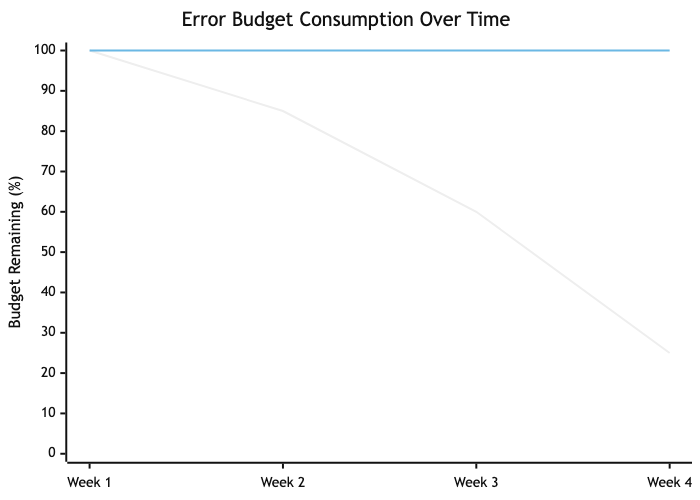

# Topic 26: Site Reliability Engineering (SRE)

## Diagrams




Site Reliability Engineering is a discipline that applies software engineering principles to infrastructure and operations problems. Originated at Google, SRE treats operations as a software problem, building systems and tooling to manage large-scale, high-reliability production environments. The core thesis is that reliability is the most fundamental feature of any system -- if users cannot reach your service, nothing else matters.

---

## Concepts

### Service Level Indicators (SLIs)

An SLI is a quantitative measure of some aspect of the level of service being provided. SLIs are the raw metrics that describe how your system behaves from the user's perspective. Common SLIs include:

- **Availability**: The proportion of requests that succeed (e.g., HTTP 2xx responses divided by total requests).
- **Latency**: The distribution of response times for requests (e.g., p50, p95, p99).
- **Throughput**: The rate at which requests are processed successfully.
- **Error rate**: The proportion of requests resulting in errors.
- **Durability**: The likelihood that data, once written, can be read back (critical for storage systems).

Good SLIs are chosen based on what users actually care about. An internal batch processing system might prioritize throughput, while a consumer-facing API prioritizes latency and availability.

### Service Level Objectives (SLOs)

An SLO is a target value or range for an SLI. It is an internal agreement on how reliable a service should be. For example:

- "99.9% of HTTP requests will return successfully within 200ms over a rolling 30-day window."
- "99.95% availability measured monthly."

SLOs are not aspirational -- they are precise engineering targets that drive operational decisions. Setting SLOs too high wastes engineering effort on diminishing returns. Setting them too low erodes user trust. The right SLO balances user expectations, business needs, and engineering cost.

The following example shows how to track multiple SLOs for a service, record request outcomes, and determine whether each objective is currently being met:

```rust
use std::collections::HashMap;
use std::time::{Duration, SystemTime};

/// A single SLO definition with its measurement window and target.
struct SloDefinition {
    name: String,
    target: f64,           // e.g., 0.999 for 99.9%
    window: Duration,      // rolling measurement window
}

/// A timestamped request outcome used for windowed SLO calculation.
struct RequestOutcome {
    timestamp: SystemTime,
    success: bool,
    latency: Duration,
}

/// Tracks multiple SLOs for a service and computes real-time compliance.
struct SloTracker {
    definitions: Vec<SloDefinition>,
    outcomes: Vec<RequestOutcome>,
}

#[derive(Debug)]
struct SloStatus {
    name: String,
    target: f64,
    actual: f64,
    compliant: bool,
    error_budget_remaining: f64, // fraction of budget left (0.0 to 1.0)
    total_in_window: usize,
    failures_in_window: usize,
}

impl SloTracker {
    fn new(definitions: Vec<SloDefinition>) -> Self {
        Self {
            definitions,
            outcomes: Vec::new(),
        }
    }

    fn record(&mut self, success: bool, latency: Duration) {
        self.outcomes.push(RequestOutcome {
            timestamp: SystemTime::now(),
            success,
            latency,
        });
    }

    /// Evaluate all SLOs against the current window of request data.
    fn evaluate(&self, now: SystemTime) -> Vec<SloStatus> {
        self.definitions
            .iter()
            .map(|slo| {
                let cutoff = now - slo.window;
                let windowed: Vec<&RequestOutcome> = self
                    .outcomes
                    .iter()
                    .filter(|o| o.timestamp >= cutoff)
                    .collect();

                let total = windowed.len();
                let failures = windowed.iter().filter(|o| !o.success).count();
                let actual = if total == 0 {
                    1.0
                } else {
                    1.0 - (failures as f64 / total as f64)
                };

                let budget_fraction = 1.0 - slo.target; // e.g., 0.001 for 99.9%
                let allowed_failures = (total as f64 * budget_fraction).floor() as usize;
                let budget_remaining = if allowed_failures == 0 {
                    if failures == 0 { 1.0 } else { 0.0 }
                } else {
                    1.0 - (failures as f64 / allowed_failures as f64)
                };

                SloStatus {
                    name: slo.name.clone(),
                    target: slo.target,
                    actual,
                    compliant: actual >= slo.target,
                    error_budget_remaining: budget_remaining.max(0.0),
                    total_in_window: total,
                    failures_in_window: failures,
                }
            })
            .collect()
    }

    /// Returns true if any SLO has exhausted its error budget.
    fn any_budget_exhausted(&self, now: SystemTime) -> bool {
        self.evaluate(now)
            .iter()
            .any(|s| s.error_budget_remaining <= 0.0)
    }
}

fn main() {
    let tracker = SloTracker::new(vec![
        SloDefinition {
            name: "availability".into(),
            target: 0.999,
            window: Duration::from_secs(30 * 24 * 3600),
        },
        SloDefinition {
            name: "latency-p99-under-200ms".into(),
            target: 0.99,
            window: Duration::from_secs(7 * 24 * 3600),
        },
    ]);

    for status in tracker.evaluate(SystemTime::now()) {
        println!(
            "SLO '{}': actual={:.4}%, target={:.4}%, compliant={}, budget_remaining={:.1}%",
            status.name,
            status.actual * 100.0,
            status.target * 100.0,
            status.compliant,
            status.error_budget_remaining * 100.0,
        );
    }
}
```

### Error Budgets

The error budget is the inverse of an SLO. If your SLO is 99.9% availability, your error budget is 0.1% -- roughly 43 minutes of downtime per month. The error budget is a powerful concept because it reframes reliability as a resource to be spent, not a constraint to be maximized.

When the error budget is healthy, teams can push risky deployments, run experiments, and take on technical debt. When the budget is exhausted, the team shifts focus to reliability work. This creates an objective, data-driven mechanism for balancing feature velocity against stability.

```rust
/// Represents an error budget tracker for a service.
struct ErrorBudget {
    slo_target: f64,           // e.g., 0.999 for 99.9%
    window_seconds: u64,       // e.g., 2_592_000 for 30 days
    total_requests: u64,
    failed_requests: u64,
}

impl ErrorBudget {
    fn new(slo_target: f64, window_seconds: u64) -> Self {
        Self {
            slo_target,
            window_seconds,
            total_requests: 0,
            failed_requests: 0,
        }
    }

    /// Returns the allowed failure count given total requests.
    fn allowed_failures(&self) -> u64 {
        let budget_fraction = 1.0 - self.slo_target;
        (self.total_requests as f64 * budget_fraction).floor() as u64
    }

    /// Returns the remaining error budget as a fraction (0.0 to 1.0).
    /// Values below 0.0 indicate budget exhaustion.
    fn remaining_fraction(&self) -> f64 {
        let allowed = self.allowed_failures();
        if allowed == 0 {
            return if self.failed_requests == 0 { 1.0 } else { -1.0 };
        }
        1.0 - (self.failed_requests as f64 / allowed as f64)
    }

    fn record(&mut self, success: bool) {
        self.total_requests += 1;
        if !success {
            self.failed_requests += 1;
        }
    }

    /// Returns true if the team should freeze deployments and focus on reliability.
    fn should_freeze_deployments(&self) -> bool {
        self.remaining_fraction() < 0.0
    }
}

fn main() {
    let mut budget = ErrorBudget::new(0.999, 30 * 24 * 3600);

    // Simulate 1,000,000 requests with 1,200 failures
    budget.total_requests = 1_000_000;
    budget.failed_requests = 1_200;

    println!("Allowed failures: {}", budget.allowed_failures());
    println!("Remaining budget: {:.2}%", budget.remaining_fraction() * 100.0);
    println!("Freeze deployments: {}", budget.should_freeze_deployments());
    // Output:
    // Allowed failures: 1000
    // Remaining budget: -20.00%
    // Freeze deployments: true
}
```

### Capacity Planning

Capacity planning is the practice of determining the production resources required to meet future demand. It involves:

1. **Demand forecasting**: Using historical data and growth projections to predict future load.
2. **Load testing**: Validating that systems can handle projected load with acceptable SLI values.
3. **Provisioning lead time**: Accounting for the time required to acquire and deploy additional capacity.
4. **Headroom**: Maintaining spare capacity for unexpected traffic spikes and graceful degradation.

Effective capacity planning prevents both over-provisioning (wasted cost) and under-provisioning (outages during load spikes). SRE teams typically target N+1 or N+2 redundancy for critical services, meaning the system can lose one or two components and continue serving traffic within SLO.

### Incident Response and Management

Incident response is a structured process for detecting, mitigating, and resolving production issues. A mature incident response framework includes:

- **Detection**: Automated alerting based on SLI violations and anomaly detection.
- **Triage**: Quickly determining severity and impact. Common severity levels range from SEV-1 (critical, user-facing impact) to SEV-4 (minor, no user impact).
- **Communication**: Establishing an incident commander, a communication lead, and clear channels for coordination.
- **Mitigation**: Prioritizing stopping the bleeding over finding root cause. Roll back, redirect traffic, scale up -- whatever restores service fastest.
- **Resolution**: Fixing the underlying problem after the immediate impact is mitigated.

```rust
use std::time::SystemTime;

#[derive(Debug, Clone, PartialEq)]
enum Severity {
    Sev1, // Critical: major user-facing impact, data loss risk
    Sev2, // High: significant degradation, partial outage
    Sev3, // Medium: minor user impact, workaround available
    Sev4, // Low: no user impact, internal tooling issue
}

#[derive(Debug, Clone, PartialEq)]
enum IncidentState {
    Detected,
    Triaged,
    Mitigating,
    Mitigated,
    Resolved,
    PostMortemScheduled,
    Closed,
}

struct Incident {
    id: String,
    title: String,
    severity: Severity,
    state: IncidentState,
    detected_at: SystemTime,
    mitigated_at: Option<SystemTime>,
    resolved_at: Option<SystemTime>,
    incident_commander: String,
    affected_services: Vec<String>,
    timeline: Vec<TimelineEntry>,
}

struct TimelineEntry {
    timestamp: SystemTime,
    author: String,
    message: String,
}

impl Incident {
    fn time_to_mitigate(&self) -> Option<std::time::Duration> {
        self.mitigated_at
            .map(|m| m.duration_since(self.detected_at).unwrap_or_default())
    }

    fn time_to_resolve(&self) -> Option<std::time::Duration> {
        self.resolved_at
            .map(|r| r.duration_since(self.detected_at).unwrap_or_default())
    }

    fn requires_postmortem(&self) -> bool {
        matches!(self.severity, Severity::Sev1 | Severity::Sev2)
    }
}
```

A structured incident logging system goes beyond modeling the incident itself -- it captures a machine-readable audit trail of every action taken during response, enabling analysis of response patterns across incidents:

```rust
use std::fmt;
use std::time::SystemTime;

#[derive(Debug, Clone)]
enum LogLevel {
    Info,
    Warning,
    Critical,
}

#[derive(Debug, Clone)]
enum IncidentAction {
    Detected { source: String, alert_name: String },
    SeverityAssigned(String),            // "SEV-1", "SEV-2", etc.
    CommanderAssigned(String),           // on-call engineer name
    CommunicationSent { channel: String, message: String },
    MitigationAttempted { action: String, successful: bool },
    Escalated { from: String, to: String, reason: String },
    ServiceImpact { service: String, impact_pct: f64 },
    Resolved { root_cause: String },
    PostMortemLink(String),
}

struct IncidentLogEntry {
    timestamp: SystemTime,
    level: LogLevel,
    action: IncidentAction,
    author: String,
}

/// A structured log that records every action during an incident for later analysis.
struct IncidentLog {
    incident_id: String,
    entries: Vec<IncidentLogEntry>,
}

impl IncidentLog {
    fn new(incident_id: &str) -> Self {
        Self {
            incident_id: incident_id.to_string(),
            entries: Vec::new(),
        }
    }

    fn append(&mut self, level: LogLevel, action: IncidentAction, author: &str) {
        self.entries.push(IncidentLogEntry {
            timestamp: SystemTime::now(),
            level,
            action,
            author: author.to_string(),
        });
    }

    /// Calculate time from detection to first mitigation attempt.
    fn time_to_first_mitigation(&self) -> Option<std::time::Duration> {
        let detected = self.entries.iter().find_map(|e| {
            if matches!(e.action, IncidentAction::Detected { .. }) {
                Some(e.timestamp)
            } else {
                None
            }
        });
        let first_mitigation = self.entries.iter().find_map(|e| {
            if matches!(e.action, IncidentAction::MitigationAttempted { .. }) {
                Some(e.timestamp)
            } else {
                None
            }
        });
        match (detected, first_mitigation) {
            (Some(d), Some(m)) => m.duration_since(d).ok(),
            _ => None,
        }
    }

    /// Count how many mitigation attempts were made before success.
    fn mitigation_attempts(&self) -> (usize, usize) {
        let mut total = 0;
        let mut successful = 0;
        for entry in &self.entries {
            if let IncidentAction::MitigationAttempted {
                successful: ok, ..
            } = &entry.action
            {
                total += 1;
                if *ok {
                    successful += 1;
                }
            }
        }
        (total, successful)
    }

    /// List all affected services and their impact percentages.
    fn affected_services(&self) -> Vec<(String, f64)> {
        self.entries
            .iter()
            .filter_map(|e| {
                if let IncidentAction::ServiceImpact {
                    service,
                    impact_pct,
                } = &e.action
                {
                    Some((service.clone(), *impact_pct))
                } else {
                    None
                }
            })
            .collect()
    }
}

impl fmt::Display for IncidentLog {
    fn fmt(&self, f: &mut fmt::Formatter<'_>) -> fmt::Result {
        writeln!(f, "=== Incident {} ===", self.incident_id)?;
        for entry in &self.entries {
            writeln!(
                f,
                "[{:?}] ({}) {:?} -- {}",
                entry.level, entry.author, entry.action,
                entry.timestamp
                    .duration_since(SystemTime::UNIX_EPOCH)
                    .map(|d| d.as_secs())
                    .unwrap_or(0)
            )?;
        }
        let (total, successful) = self.mitigation_attempts();
        writeln!(f, "Mitigation attempts: {total} total, {successful} successful")?;
        Ok(())
    }
}
```

### On-Call Practices

On-call is the practice of having engineers available to respond to production issues outside normal working hours. Healthy on-call practices include:

- **Rotation schedules**: Typically weekly rotations with primary and secondary on-call engineers. Rotations should be shared across the team to distribute load fairly.
- **Escalation policies**: Clear paths for escalation when the on-call engineer cannot resolve an issue alone.
- **Alert quality**: Alerts should be actionable, not noisy. Every page should require human intervention. If an alert fires and the response is "ignore it," that alert must be fixed or removed.
- **Compensation**: On-call work is real work. Engineers should receive compensation or time off for on-call shifts.
- **Sustainable load**: Google's guideline is that on-call engineers should receive no more than two events per shift on average. Exceeding this leads to burnout and decreased response quality.

### Post-Mortems and Blameless Culture

A post-mortem (also called a retrospective or incident review) is a written record of an incident: what happened, why, what the impact was, and what actions will prevent recurrence. The most critical attribute of effective post-mortems is blamelessness.

Blameless does not mean accountability-free. It means focusing on systemic failures rather than individual mistakes. Humans make errors -- the question is why the system allowed that error to cause an outage. A blameless post-mortem asks:

- What conditions allowed this failure to propagate?
- What monitoring gaps delayed detection?
- What safeguards could have prevented or limited the blast radius?
- What process changes would make the system more resilient?

Action items from post-mortems should be tracked to completion. A post-mortem that produces action items no one follows up on is worse than no post-mortem at all, because it creates an illusion of improvement.

### Toil Reduction

Toil is manual, repetitive, automatable operational work that scales linearly with service growth and produces no enduring value. Examples include:

- Manually restarting failed processes.
- Running database migrations by hand.
- Manually provisioning user accounts.
- Copy-pasting configuration across environments.

Google's SRE book recommends that SRE teams spend no more than 50% of their time on toil. The remaining time should be spent on engineering work that permanently reduces future toil. If toil exceeds this threshold, the team cannot invest in automation and the problem compounds.

### Reliability as a Feature

Reliability is not an afterthought or an ops concern -- it is a product feature. Users do not distinguish between "the feature is broken" and "the feature is unavailable." Both result in the same experience: the product does not work.

This means reliability work competes with feature work for engineering resources, and the error budget provides the mechanism for making that trade-off explicit and data-driven. Product managers and engineers negotiate SLOs together, and the error budget determines when reliability takes priority over new features.

A health check aggregator is a concrete example of reliability as a feature -- it gives operators and load balancers a single endpoint that reports whether the service and all its dependencies are functioning correctly:

```rust
use std::collections::HashMap;
use std::fmt;
use std::time::{Duration, Instant};

#[derive(Debug, Clone, PartialEq)]
enum HealthStatus {
    Healthy,
    Degraded(String), // reason for degradation
    Unhealthy(String), // reason for failure
}

#[derive(Debug, Clone)]
struct DependencyHealth {
    name: String,
    status: HealthStatus,
    latency: Duration,
    last_checked: Instant,
}

/// Simulates checking a dependency and returning its health.
/// In production, each function would make a real connection attempt.
trait HealthCheckable {
    fn name(&self) -> &str;
    fn check(&self) -> DependencyHealth;
}

struct DatabaseCheck {
    connection_string: String,
    timeout: Duration,
}

impl HealthCheckable for DatabaseCheck {
    fn name(&self) -> &str {
        "database"
    }

    fn check(&self) -> DependencyHealth {
        let start = Instant::now();
        // In production: attempt a lightweight query like "SELECT 1"
        let latency = start.elapsed();
        let status = if latency > self.timeout {
            HealthStatus::Unhealthy(format!(
                "query took {:?}, exceeds timeout {:?}",
                latency, self.timeout
            ))
        } else if latency > self.timeout / 2 {
            HealthStatus::Degraded(format!("query took {:?}, above warning threshold", latency))
        } else {
            HealthStatus::Healthy
        };

        DependencyHealth {
            name: self.name().to_string(),
            status,
            latency,
            last_checked: Instant::now(),
        }
    }
}

struct CacheCheck {
    host: String,
    timeout: Duration,
}

impl HealthCheckable for CacheCheck {
    fn name(&self) -> &str {
        "cache"
    }

    fn check(&self) -> DependencyHealth {
        let start = Instant::now();
        // In production: send a PING command to Redis/Memcached
        let latency = start.elapsed();
        DependencyHealth {
            name: self.name().to_string(),
            status: HealthStatus::Healthy,
            latency,
            last_checked: Instant::now(),
        }
    }
}

struct ExternalApiCheck {
    url: String,
    timeout: Duration,
}

impl HealthCheckable for ExternalApiCheck {
    fn name(&self) -> &str {
        "external-api"
    }

    fn check(&self) -> DependencyHealth {
        let start = Instant::now();
        // In production: HTTP GET to the external API's health endpoint
        let latency = start.elapsed();
        DependencyHealth {
            name: self.name().to_string(),
            status: HealthStatus::Healthy,
            latency,
            last_checked: Instant::now(),
        }
    }
}

#[derive(Debug)]
struct AggregatedHealth {
    overall: HealthStatus,
    dependencies: Vec<DependencyHealth>,
    checked_at: Instant,
}

/// Aggregates health checks across all dependencies into a single status.
struct HealthAggregator {
    checks: Vec<Box<dyn HealthCheckable>>,
}

impl HealthAggregator {
    fn new() -> Self {
        Self { checks: Vec::new() }
    }

    fn add_check(&mut self, check: Box<dyn HealthCheckable>) {
        self.checks.push(check);
    }

    /// Run all health checks and compute the overall status.
    /// Overall status follows the worst-case: if any dependency is unhealthy,
    /// the service is unhealthy. If any is degraded, the service is degraded.
    fn check_all(&self) -> AggregatedHealth {
        let results: Vec<DependencyHealth> =
            self.checks.iter().map(|c| c.check()).collect();

        let overall = if results
            .iter()
            .any(|r| matches!(r.status, HealthStatus::Unhealthy(_)))
        {
            let failed: Vec<&str> = results
                .iter()
                .filter_map(|r| match &r.status {
                    HealthStatus::Unhealthy(_) => Some(r.name.as_str()),
                    _ => None,
                })
                .collect();
            HealthStatus::Unhealthy(format!("failing dependencies: {}", failed.join(", ")))
        } else if results
            .iter()
            .any(|r| matches!(r.status, HealthStatus::Degraded(_)))
        {
            let degraded: Vec<&str> = results
                .iter()
                .filter_map(|r| match &r.status {
                    HealthStatus::Degraded(_) => Some(r.name.as_str()),
                    _ => None,
                })
                .collect();
            HealthStatus::Degraded(format!(
                "degraded dependencies: {}",
                degraded.join(", ")
            ))
        } else {
            HealthStatus::Healthy
        };

        AggregatedHealth {
            overall,
            dependencies: results,
            checked_at: Instant::now(),
        }
    }

    /// Returns true only if every dependency is fully healthy.
    fn is_ready(&self) -> bool {
        self.check_all().overall == HealthStatus::Healthy
    }
}

impl fmt::Display for AggregatedHealth {
    fn fmt(&self, f: &mut fmt::Formatter<'_>) -> fmt::Result {
        writeln!(f, "Overall: {:?}", self.overall)?;
        for dep in &self.dependencies {
            writeln!(
                f,
                "  {}: {:?} (latency: {:?})",
                dep.name, dep.status, dep.latency
            )?;
        }
        Ok(())
    }
}

fn main() {
    let mut aggregator = HealthAggregator::new();

    aggregator.add_check(Box::new(DatabaseCheck {
        connection_string: "postgres://localhost:5432/mydb".into(),
        timeout: Duration::from_millis(500),
    }));
    aggregator.add_check(Box::new(CacheCheck {
        host: "redis://localhost:6379".into(),
        timeout: Duration::from_millis(100),
    }));
    aggregator.add_check(Box::new(ExternalApiCheck {
        url: "https://api.example.com/health".into(),
        timeout: Duration::from_secs(2),
    }));

    let health = aggregator.check_all();
    println!("{health}");
    // Output:
    // Overall: Healthy
    //   database: Healthy (latency: 42ns)
    //   cache: Healthy (latency: 28ns)
    //   external-api: Healthy (latency: 31ns)

    println!("Service ready: {}", aggregator.is_ready());
}
```

---

## Business Value

SRE provides measurable business value across several dimensions:

**Revenue protection.** Downtime directly costs money. For an e-commerce platform processing $10M per day, a 99.9% SLO allows roughly 86 seconds of downtime per day. Improving to 99.99% reduces that to 8.6 seconds. The business value of that improvement depends on whether the lost revenue during those 77 seconds justifies the engineering cost.

**Engineering efficiency.** By automating toil and building self-healing systems, SRE frees engineers to work on features rather than firefighting. Organizations without SRE practices often find that 70-80% of engineering time goes to unplanned operational work.

**Faster iteration.** Error budgets create a clear signal for when it is safe to deploy aggressively. Teams with healthy error budgets can ship faster because they have a quantified safety margin, rather than relying on gut feelings about risk.

**Reduced burnout.** Structured on-call, blameless post-mortems, and toil reduction directly improve engineer quality of life. This reduces turnover, which is one of the most expensive hidden costs in software organizations.

**Customer trust.** Consistent reliability builds trust. Users and enterprise customers make purchasing decisions based on reliability track records. SLAs (the external, contractual cousins of SLOs) backed by strong SRE practices become a competitive advantage.

---

## Real-World Examples

### Google: The Origin of SRE

Google created the SRE discipline in 2003 under Ben Treynor Sloss. Google's SRE teams manage some of the largest systems on the planet (Search, Gmail, YouTube, Cloud). Key practices that emerged from Google's experience:

- SRE teams have the authority to hand services back to development teams if operational load becomes unsustainable. This creates a forcing function for developers to build operable software.
- Error budgets are enforced. When a service exhausts its error budget, feature freezes are mandated until reliability improves.
- Google publishes quarterly SLO reports internally, creating transparency and accountability across the organization.
- SRE candidates are hired as software engineers first. Every SRE at Google can (and does) write production code.

### Netflix: Chaos Engineering as SRE Practice

Netflix pioneered chaos engineering with Chaos Monkey (2011) and later the Simian Army. Their approach to reliability is distinctive:

- **Chaos Monkey** randomly terminates production instances to verify that services handle failure gracefully. This runs continuously in production, not just in staging.
- **Chaos Kong** simulates the failure of an entire AWS availability zone or region, validating that Netflix can serve traffic from remaining regions.
- Netflix maintains a "paved road" -- a set of standardized tools and libraries that bake in reliability patterns (circuit breakers, retry logic, bulkheads). Teams that stay on the paved road inherit reliability properties automatically.
- Their SRE equivalent teams focus heavily on developer tooling and platform capabilities rather than manual operational work.

### Slack: SLOs Driving Product Decisions

Slack adopted SRE principles to manage their real-time messaging infrastructure, which has stringent latency and availability requirements:

- Slack defines SLOs at the user-journey level rather than the individual service level. The SLO for "user sends a message and it appears in the recipient's channel" spans multiple backend services.
- They implemented an internal error budget dashboard that product managers and engineering leads review weekly. When a team's error budget runs low, that team's sprint priorities shift toward reliability.
- After a major outage in 2022, Slack invested in a formalized incident management process with dedicated incident commanders drawn from a trained rotation across engineering.

### Cloudflare: Incident Transparency and Post-Mortems

Cloudflare operates a global network serving millions of websites and has built a strong public post-mortem culture:

- Every significant incident results in a public blog post detailing what happened, with precise technical depth. Their June 2022 post-mortem about a BGP misconfiguration that took down 19 data centers is a model of transparent incident communication.
- Cloudflare uses canary deployments extensively -- changes roll out to a small percentage of traffic first, with automated rollback if SLI degradation is detected.
- Their SRE teams maintain per-data-center SLOs, which is unusual but necessary given their globally distributed architecture where regional failures do not necessarily constitute global outages.

---

## Common Mistakes and Pitfalls

### 1. Setting SLOs at 100%

A 100% SLO is unachievable and counterproductive. No system can guarantee perfect availability -- hardware fails, networks partition, software has bugs. A 100% target means zero error budget, which means any deployment that could theoretically cause a failure is forbidden. This paralyzes development. The correct question is not "how do we achieve 100% uptime?" but "what level of reliability do our users actually need?"

### 2. Measuring SLIs That Do Not Reflect User Experience

Monitoring CPU utilization, disk I/O, and memory usage is necessary but insufficient. These are system metrics, not user-facing SLIs. A server can have 10% CPU utilization and still serve errors to every user if a downstream dependency is broken. SLIs must be defined from the user's perspective: did the request succeed, and how long did it take?

### 3. Treating SRE as Rebranded Operations

Hiring an operations team, renaming them "SRE," and changing nothing else misses the point entirely. SRE is a software engineering discipline. If your SRE team is not writing code to automate operational tasks, building tooling, and eliminating toil, you have an operations team with a new title. The 50% engineering time guideline exists precisely to prevent this.

### 4. Alert Fatigue from Noisy Monitoring

Teams that alert on every metric crossing a threshold quickly drown in notifications. When everything is urgent, nothing is urgent. Engineers start ignoring alerts, and real incidents get lost in the noise. Alerts should be tied to SLO violations and should be actionable -- every alert that fires should require a human to do something. Symptom-based alerting (the user is affected) is almost always superior to cause-based alerting (a specific metric is elevated).

### 5. Writing Post-Mortems but Not Following Up on Action Items

Many organizations adopt the practice of writing post-mortems but fail to track and complete the resulting action items. This is worse than not writing post-mortems at all because it creates the illusion of a learning culture while the same classes of failure repeat. Every action item should have an owner, a deadline, and a tracking mechanism. Leadership should review action item completion rates as a health metric.

### 6. Ignoring Toil Until It Consumes the Team

Toil grows gradually. Each individual manual task seems small and quick, so it never becomes a priority to automate. Over months and years, toil accumulates until the team spends the vast majority of its time on repetitive operational work and has no capacity for improvement. Track toil explicitly, measure it as a percentage of team time, and treat any sustained increase as a problem requiring engineering investment.

---

## Trade-offs

| Decision | Advantage | Disadvantage |
|---|---|---|
| Higher SLO (e.g., 99.99%) | Greater user trust, fewer complaints, stronger SLA commitments | Exponentially higher engineering cost, slower feature velocity, smaller error budget constrains experimentation |
| Lower SLO (e.g., 99.5%) | More room for experimentation, faster iteration, lower infrastructure cost | Users may experience noticeable unreliability, enterprise customers may demand contractual guarantees you cannot meet |
| Dedicated SRE team | Deep operational expertise, clear ownership of reliability, career path for SRE engineers | Risk of siloing reliability knowledge, "throw it over the wall" dynamic with development teams |
| Embedded SRE (within dev teams) | Developers own reliability end-to-end, faster feedback loops, no handoff friction | Reliability expertise is diluted, inconsistent practices across teams, SRE work may be deprioritized for features |
| Aggressive automation | Reduced toil, faster incident response, consistent execution | High upfront investment, risk of automating incorrectly (automated systems can cause outages at machine speed), complex failure modes |
| Manual runbooks | Low upfront cost, humans can exercise judgment in novel situations | Does not scale, prone to human error under stress, toil grows linearly with system size |
| Strict error budget enforcement | Clear prioritization signal, objective mechanism for balancing reliability and velocity | Can feel punitive if the policy is not well-communicated, may block urgent feature work at inconvenient times |
| Loose error budget guidelines | Flexibility to make case-by-case decisions, avoids rigid process overhead | Error budgets lose their power as a coordination mechanism, reliability may degrade as teams consistently prioritize features |

---

## When to Use / When Not to Use

### When SRE Practices Are Appropriate

- **User-facing services with meaningful uptime requirements.** If your users notice and are harmed by downtime, SRE practices help you manage reliability systematically.
- **Systems at scale.** Once manual operations cannot keep pace with system growth, engineering-driven approaches to operations become necessary.
- **Organizations with multiple teams deploying independently.** SLOs and error budgets provide a common language for discussing reliability across teams.
- **Services with contractual SLAs.** If you have committed to customers that your service will meet specific reliability targets, you need the operational discipline to deliver on those commitments.
- **Environments where incidents are frequent or costly.** Structured incident response, post-mortems, and toil reduction provide the largest return when operational pain is high.

### When SRE Practices May Be Premature or Inappropriate

- **Early-stage startups with a handful of engineers.** If your entire engineering team is five people, formalizing SRE roles and processes adds overhead without proportional benefit. Everyone should understand production, but dedicated SRE structure is unnecessary.
- **Internal tools with tolerant users.** If the tool is used by a small internal team that can tolerate occasional downtime and has a direct communication channel with the developers, full SRE rigor is overkill.
- **Batch processing or offline systems with flexible deadlines.** If a nightly data pipeline can simply be rerun the next day, investing in 99.99% availability for that pipeline is a poor use of resources.
- **Prototypes and experiments.** Systems that may be discarded in weeks do not warrant SLO definitions and error budget tracking.
- **Organizations without software engineering maturity.** SRE assumes a foundation of version control, automated testing, CI/CD, and infrastructure as code. Without these prerequisites, SRE practices will not be effective because there is no engineering substrate to build on.

---

## Key Takeaways

1. **SRE treats operations as a software engineering problem.** The defining characteristic of SRE is applying engineering discipline -- automation, measurement, systematic design -- to work that was traditionally handled through manual processes and tribal knowledge.

2. **SLOs and error budgets create an objective framework for balancing reliability and velocity.** Rather than arguing about whether a deployment is "too risky," teams can look at the error budget and make data-driven decisions. This depoliticizes one of the most common sources of friction between product and engineering teams.

3. **Measure what matters to users, not what is easy to measure.** SLIs must reflect the user experience. Server-side metrics are inputs to understanding user experience, but they are not the user experience itself. Instrument at the boundary closest to the user.

4. **Toil is a debt that compounds.** Every hour spent on manual, repetitive operational work is an hour not spent building automation that would eliminate that work permanently. Track toil explicitly and invest engineering time in reducing it before it overwhelms the team.

5. **Blameless post-mortems are a prerequisite for organizational learning.** If engineers fear punishment for being involved in incidents, they will hide information, avoid on-call, and resist transparency. A blameless culture is not about avoiding accountability -- it is about directing accountability toward systemic improvements rather than individual blame.

6. **Reliability has diminishing returns, and the cost curve is exponential.** Moving from 99% to 99.9% is an order of magnitude harder than moving from 90% to 99%. Every additional nine requires disproportionate investment. The right SLO is the one that meets user needs at a sustainable engineering cost.

7. **SRE is not a team -- it is a set of practices.** While dedicated SRE teams can be effective, the underlying principles (SLOs, error budgets, toil tracking, incident management, post-mortems) can and should be adopted by any team that operates production software, regardless of organizational structure.

---

## Further Reading

### Books

- **"Site Reliability Engineering: How Google Runs Production Systems"** by Betsy Beyer, Chris Jones, Jennifer Petoff, and Niall Richard Murphy (2016). The foundational text on SRE, freely available at sre.google/sre-book. Covers principles, practices, and case studies from Google's experience.
- **"The Site Reliability Workbook"** by Betsy Beyer, Niall Richard Murphy, David K. Rensin, Kent Kawahara, and Stephen Thorne (2018). A companion to the first book with practical, hands-on guidance for implementing SRE. Available at sre.google/workbook.
- **"Implementing Service Level Objectives"** by Alex Hidalgo (2020). A deep dive into the practice of defining, measuring, and operationalizing SLOs across an organization.
- **"Chaos Engineering: System Resiliency in Practice"** by Casey Rosenthal and Nora Jones (2020). Covers the theory and practice of deliberately introducing failures to improve system resilience.
- **"Incident Management for Operations"** by Rob Schnepp, Ron Vidal, and Chris Hawley (2017). Adapts incident command system principles from emergency services to technology operations.

### Articles and Resources

- **"SLOs Are the API of Your Reliability"** -- Google Cloud Blog. Explains the relationship between SLOs, error budgets, and organizational decision-making.
- **"Monitoring Distributed Systems"** -- Chapter 6 of the Google SRE book. The definitive guide to symptom-based monitoring and alerting on SLO violations.
- **"Postmortem Culture: Learning from Failure"** -- Chapter 15 of the Google SRE book. Detailed guidance on writing effective, blameless post-mortems.
- **Google's "Art of SLOs" workshop materials** -- Available at sre.google. A structured workshop for teams defining SLOs for the first time.
- **"Nines are Not Enough"** by Narayan, Tighe, et al. (2020, USENIX HotOS). A research paper arguing that SLOs need richer models beyond simple availability percentages.

### Tools

- **Prometheus** -- Open-source monitoring and alerting toolkit, widely used for SLI measurement and SLO-based alerting. Its query language (PromQL) is designed for the kind of ratio-based queries that SLOs require.
- **Grafana** -- Visualization platform commonly paired with Prometheus. Supports SLO dashboards with burn-rate alerting views.
- **Sloth** -- An open-source tool that generates Prometheus recording rules and alerts from SLO definitions, reducing the boilerplate of SLO-based monitoring.
- **PagerDuty / Opsgenie** -- Incident management platforms for on-call scheduling, alert routing, escalation policies, and incident tracking.
- **Datadog SLO Monitoring** -- Commercial monitoring platform with built-in SLO tracking, error budget dashboards, and burn-rate alerts.
- **Chaos Mesh / Litmus** -- Open-source chaos engineering platforms for Kubernetes that allow controlled fault injection to validate system resilience.
- **Blameless / FireHydrant / incident.io** -- Incident management platforms that provide structured workflows for incident response, communication, and post-mortem creation.
