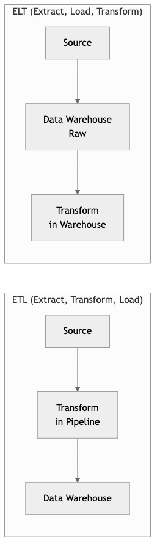
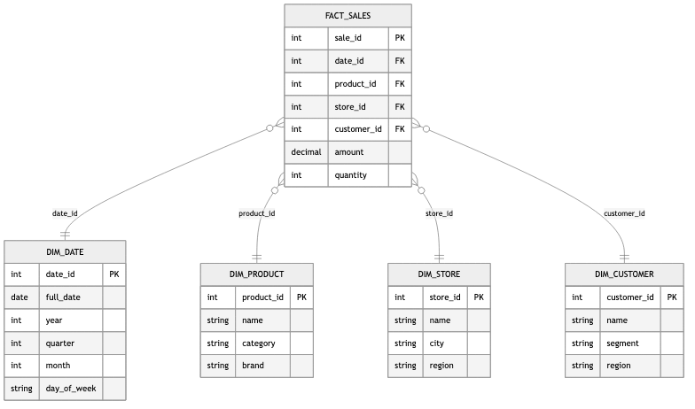

# Data Engineering & Pipelines

## Diagrams






Data engineering is the discipline of designing, building, and maintaining the systems and
infrastructure that collect, store, transform, and serve data at scale. Pipelines are the
backbone of this discipline -- directed workflows that move data from sources to destinations,
applying transformations along the way. This topic covers the foundational patterns, architectural
decisions, and practical considerations that every software engineer should understand when
working with data-intensive systems.

---

## Concepts

### ETL vs ELT Patterns

**ETL (Extract, Transform, Load)** is the traditional pattern where data is extracted from source
systems, transformed in a staging area (often an intermediate server or processing cluster), and
then loaded into a target data store. The transformation happens before the data reaches the
warehouse.

**ELT (Extract, Load, Transform)** inverts the last two steps. Raw data is extracted and loaded
directly into a powerful destination system (typically a cloud data warehouse like BigQuery,
Snowflake, or Redshift), and transformations are performed in-place using the warehouse's own
compute engine.

Key distinctions:

- **ETL** is preferable when the target system has limited compute, when you need to filter
  sensitive data before it enters the warehouse, or when transformations are well-understood
  and stable.
- **ELT** is preferable when the warehouse has abundant compute, when you want to preserve raw
  data for future reprocessing, or when transformation requirements change frequently.

In Rust, you might model a simple ETL pipeline stage as follows:

```text
/// Represents a single record flowing through the pipeline.
STRUCTURE Record
    fields : Map<String, String>

/// The Extract phase: pull records from a source.
INTERFACE Extractor
    PROCEDURE EXTRACT() → List<Record>

/// The Transform phase: apply business logic to each record.
INTERFACE Transformer
    PROCEDURE TRANSFORM(record) → Optional<Record>

/// The Load phase: write records to a destination.
INTERFACE Loader
    PROCEDURE LOAD(records) → Result<Integer>

/// A composable ETL pipeline that chains extract, transform, and load.
STRUCTURE EtlPipeline
    extractor : Extractor
    transformers : List<Transformer>
    loader : Loader

PROCEDURE EtlPipeline.RUN() → Result<Integer>
    // Extract
    raw_records ← self.extractor.EXTRACT()
    PRINT "Extracted " + LENGTH(raw_records) + " records"

    // Transform -- apply each transformer in sequence, filtering out NULL results
    transformed ← EMPTY LIST
    FOR EACH record IN raw_records DO
        current ← record
        skip ← FALSE
        FOR EACH transformer IN self.transformers DO
            result ← transformer.TRANSFORM(current)
            IF result IS NULL THEN skip ← TRUE; BREAK
            current ← result
        END FOR
        IF NOT skip THEN APPEND current TO transformed
    END FOR

    PRINT "Transformed down to " + LENGTH(transformed) + " records"

    // Load
    RETURN self.loader.LOAD(transformed)
```

### Batch vs Stream Processing

**Batch processing** operates on bounded datasets. A job reads an entire dataset (or a partition
of it), processes it, and writes the results. Batch jobs typically run on a schedule -- hourly,
daily, or triggered by the arrival of new data. Technologies like Apache Spark, dbt, and
traditional SQL-based warehouse transformations are batch-oriented.

**Stream processing** operates on unbounded datasets -- continuous flows of events. Each event
is processed as it arrives (or in micro-batches of a few seconds). Technologies like Apache
Kafka, Apache Flink, and AWS Kinesis enable stream processing.

The fundamental trade-off is latency versus complexity:

- Batch systems are simpler to reason about, easier to test, and more forgiving of errors
  (you can rerun a batch). But they introduce latency -- data is only as fresh as the last
  completed batch.
- Stream systems deliver near-real-time results but are harder to build correctly. You must
  handle late-arriving data, out-of-order events, exactly-once semantics, and backpressure.

A simplified stream processor in Rust using channels:

```text
STRUCTURE Event
    timestamp : Integer
    user_id : String
    action : String
    value : Float

/// A stream processor that reads events from a channel, applies a
/// transformation, and writes results to an output channel.
PROCEDURE STREAM_PROCESSOR(input_channel, output_channel, filter_action)
    FOR EACH event IN input_channel DO
        // Filter: only pass through events matching the target action
        IF event.action = filter_action THEN
            transformed ← Event {
                value ← event.value * 1.1,   // apply a 10% adjustment
                timestamp ← event.timestamp,
                user_id ← event.user_id,
                action ← event.action
            }
            IF SEND(output_channel, transformed) FAILS THEN
                PRINT "Output channel closed, stopping processor"
                BREAK
            END IF
        END IF
    END FOR

/// A windowed aggregator that collects events over a time window.
STRUCTURE WindowedAggregator
    window_duration_ms : Integer
    buffer : List<Event>
    window_start : Integer ← 0

PROCEDURE WindowedAggregator.PROCESS(event) → Optional<Float>
    IF self.buffer IS EMPTY THEN
        self.window_start ← event.timestamp
    END IF

    // If the event falls outside the current window, flush the window
    IF event.timestamp ≥ self.window_start + self.window_duration_ms THEN
        sum ← SUM(e.value FOR EACH e IN self.buffer)
        CLEAR(self.buffer)
        self.window_start ← event.timestamp
        APPEND event TO self.buffer
        RETURN sum
    ELSE
        APPEND event TO self.buffer
        RETURN NULL
    END IF
```

### Data Warehousing: Star Schema and Snowflake Schema

A **data warehouse** is a centralized repository optimized for analytical queries. Unlike
operational databases (OLTP), warehouses are designed for OLAP (Online Analytical Processing) --
complex queries that scan large volumes of data.

**Star schema** is the simplest warehouse modeling approach. A central **fact table** contains
measurable events (sales, clicks, transactions), and **dimension tables** radiate outward like
points of a star. Each dimension is denormalized -- all attributes for a dimension live in a
single flat table.

**Snowflake schema** normalizes the dimension tables further, breaking them into sub-dimensions.
For example, instead of a single `dim_product` table with a `category_name` column, you would
have a separate `dim_category` table referenced by `dim_product`. This reduces storage and
avoids update anomalies but increases query complexity due to additional joins.

Modeling these schemas in Rust:

```text
/// Fact table: each row represents a measurable business event.
STRUCTURE FactSale
    sale_id : Integer
    date_key : Integer        // FK to dim_date
    product_key : Integer     // FK to dim_product
    customer_key : Integer    // FK to dim_customer
    store_key : Integer       // FK to dim_store
    quantity : Integer
    unit_price : Float
    total_amount : Float
    discount_amount : Float

/// Star schema dimension: fully denormalized.
STRUCTURE DimProduct
    product_key : Integer
    product_name : String
    category_name : String     // denormalized -- lives directly here
    subcategory_name : String  // denormalized
    brand : String
    supplier_name : String     // denormalized

/// Snowflake schema: dimension is normalized into sub-dimensions.
STRUCTURE DimProductSnowflake
    product_key : Integer
    product_name : String
    category_key : Integer     // FK to DimCategory
    brand_key : Integer        // FK to DimBrand

STRUCTURE DimCategory
    category_key : Integer
    category_name : String
    department_key : Integer   // FK to DimDepartment -- further normalization

STRUCTURE DimDepartment
    department_key : Integer
    department_name : String
```

### Data Quality and Governance

Data quality refers to the accuracy, completeness, consistency, timeliness, and validity of
data. Poor data quality leads to incorrect analytics, broken dashboards, and bad business
decisions. Data governance is the broader organizational framework: who owns the data, what
policies govern its use, how lineage is tracked, and how compliance requirements are met.

Key dimensions of data quality:

- **Completeness**: Are all expected fields present? Are there unexpected nulls?
- **Accuracy**: Does the data reflect reality? Are values within expected ranges?
- **Consistency**: Do related datasets agree? If a user exists in the orders table, do they
  also exist in the users table?
- **Timeliness**: Is the data arriving within the expected SLA? Is a daily pipeline actually
  completing daily?
- **Uniqueness**: Are there duplicate records that should not exist?

A data quality validation framework in Rust:

```text
ENUMERATION ValidationResult
    Pass
    Fail(reason : String)

INTERFACE QualityCheck
    PROCEDURE NAME() → String
    PROCEDURE VALIDATE(records) → ValidationResult

/// Check that no records have a null or empty value for a required field.
STRUCTURE CompletenessCheck IMPLEMENTS QualityCheck
    field_name : String

    PROCEDURE VALIDATE(records) → ValidationResult
        missing_count ← COUNT records WHERE
            record.fields[self.field_name] IS NULL OR EMPTY
        IF missing_count = 0 THEN
            RETURN Pass
        ELSE
            RETURN Fail(missing_count + " records missing required field '" + self.field_name + "'")
        END IF

/// Check that a field's values are unique across all records.
STRUCTURE UniquenessCheck IMPLEMENTS QualityCheck
    field_name : String

    PROCEDURE VALIDATE(records) → ValidationResult
        seen ← EMPTY SET
        duplicate_count ← 0
        FOR EACH record IN records DO
            value ← record.fields[self.field_name]
            IF value IS NOT NULL THEN
                IF value IN seen THEN duplicate_count ← duplicate_count + 1
                ADD value TO seen
            END IF
        END FOR
        IF duplicate_count = 0 THEN
            RETURN Pass
        ELSE
            RETURN Fail(duplicate_count + " duplicate values found for field '" + self.field_name + "'")
        END IF

/// Run a suite of quality checks and report results.
PROCEDURE RUN_QUALITY_CHECKS(records, checks) → Boolean
    all_passed ← TRUE
    FOR EACH check IN checks DO
        result ← check.VALIDATE(records)
        IF result IS Pass THEN
            PRINT "[PASS] " + check.NAME()
        ELSE
            PRINT "[FAIL] " + check.NAME() + ": " + result.reason
            all_passed ← FALSE
        END IF
    END FOR
    RETURN all_passed
```

### Building Data Pipelines in Rust

Rust is increasingly used in data engineering for performance-critical pipeline components.
The language offers several advantages: predictable latency (no garbage collector pauses),
strong type safety that catches schema mismatches at compile time, excellent concurrency
primitives, and low memory overhead for processing large datasets.

Common Rust crates for data engineering include:

- **arrow** and **datafusion** -- in-memory columnar data processing (Apache Arrow format)
- **polars** -- a fast DataFrame library, similar to pandas but much faster
- **rdkafka** -- Kafka client for stream processing
- **tokio** -- async runtime for building concurrent pipeline stages
- **serde** -- serialization/deserialization for JSON, CSV, Parquet, and other formats
- **sqlx** -- async SQL client for database interactions

A pipeline stage using the builder pattern:

```text
/// Configuration for a pipeline stage (builder pattern).
STRUCTURE PipelineStageConfig
    name : String
    parallelism : Integer ← 1
    batch_size : Integer ← 1000
    retry_attempts : Integer ← 3
    retry_delay_ms : Integer ← 1000

PROCEDURE PipelineStageConfig.WITH_PARALLELISM(p) → self
    self.parallelism ← p; RETURN self

PROCEDURE PipelineStageConfig.WITH_BATCH_SIZE(size) → self
    self.batch_size ← size; RETURN self

PROCEDURE PipelineStageConfig.WITH_RETRIES(attempts, delay_ms) → self
    self.retry_attempts ← attempts
    self.retry_delay_ms ← delay_ms
    RETURN self

/// A pipeline composed of multiple configured stages.
STRUCTURE Pipeline
    stages : List<PipelineStageConfig>

PROCEDURE Pipeline.ADD_STAGE(stage) → self
    APPEND stage TO self.stages; RETURN self

PROCEDURE Pipeline.DESCRIBE()
    PRINT "Pipeline with " + LENGTH(self.stages) + " stages:"
    FOR i ← 0 TO LENGTH(self.stages) - 1 DO
        stage ← self.stages[i]
        PRINT "  Stage " + i + ": '" + stage.name
              + "' (parallelism=" + stage.parallelism
              + ", batch_size=" + stage.batch_size
              + ", retries=" + stage.retry_attempts + ")"
    END FOR

PROCEDURE MAIN()
    pipeline ← NEW Pipeline()
        .ADD_STAGE(PipelineStageConfig("ingest-clickstream")
            .WITH_PARALLELISM(4).WITH_BATCH_SIZE(5000))
        .ADD_STAGE(PipelineStageConfig("deduplicate")
            .WITH_PARALLELISM(2).WITH_BATCH_SIZE(10000))
        .ADD_STAGE(PipelineStageConfig("enrich-user-data")
            .WITH_PARALLELISM(8).WITH_RETRIES(5, 2000))
        .ADD_STAGE(PipelineStageConfig("write-to-warehouse")
            .WITH_PARALLELISM(2).WITH_BATCH_SIZE(50000).WITH_RETRIES(3, 5000))

    pipeline.DESCRIBE()
```

---

## Business Value

Data pipelines are the plumbing that turns raw data into actionable insight. Without reliable
pipelines, organizations cannot produce accurate reports, train machine learning models, or
make data-driven decisions. The business value manifests in several ways:

- **Faster decision-making.** Automated pipelines reduce the time between data generation and
  availability for analysis from days or weeks to hours or minutes.
- **Reduced operational cost.** Well-engineered pipelines replace manual data wrangling,
  eliminating error-prone spreadsheet work and ad-hoc scripts.
- **Revenue protection.** Data quality checks embedded in pipelines catch anomalies before they
  reach customer-facing products or financial reports.
- **Regulatory compliance.** Governance-aware pipelines track data lineage, enforce access
  controls, and produce audit trails required by regulations such as GDPR, HIPAA, and SOX.
- **Scalability.** A properly architected pipeline scales with the business. As data volumes
  grow 10x or 100x, the pipeline handles it without a complete redesign.
- **Competitive advantage.** Organizations that can reliably process and act on data faster
  than competitors gain a structural edge in pricing, personalization, fraud detection, and
  operational efficiency.

---

## Real-World Examples

### Spotify -- Event Delivery and Music Recommendations

Spotify processes over 100 billion events per day from its users. Their data pipeline ingests
playback events, search queries, playlist edits, and social interactions. These events flow
through a combination of Google Cloud Pub/Sub and Apache Beam pipelines into BigQuery for
batch analytics and into real-time systems for personalized recommendations (Discover Weekly,
Daily Mix). A critical design choice is their use of event schemas with strict versioning --
every event type has a schema registered in a central registry, and pipelines reject events
that do not conform. This prevents schema drift from corrupting downstream analytics.

### Netflix -- Real-Time Data Infrastructure

Netflix operates one of the most sophisticated data platforms in the industry. Their pipeline
architecture includes Apache Kafka for event streaming, Apache Flink for real-time processing,
and Apache Spark for batch processing, all feeding into their Iceberg-based data lakehouse.
A notable example is their real-time stream processing for A/B test analysis: when Netflix
runs an experiment (such as testing a new recommendation algorithm), the pipeline must process
billions of viewing events, join them with experiment assignments, and produce statistically
valid results within minutes. They built custom tooling to handle late-arriving data and
ensure exactly-once semantics in their aggregation pipelines.

### Airbnb -- Data Quality at Scale

Airbnb invested heavily in data quality after experiencing incidents where bad data led to
incorrect pricing recommendations and flawed business metrics. They built an internal framework
called "Minerva" -- a metrics layer that sits on top of their data warehouse. Every metric
has a canonical definition, an owner, and automated quality checks. Their pipelines include
validation stages that check for completeness, freshness, and statistical anomalies (such
as a sudden 50% drop in bookings that likely indicates a pipeline failure rather than a real
business event). When a quality check fails, the pipeline halts and alerts the data owner
rather than propagating bad data downstream.

### Uber -- Unified Batch and Stream Processing

Uber processes trillions of events per day across their marketplace, including ride requests,
driver locations, pricing calculations, and payment events. They developed an internal
platform called "Michelangelo" for ML and "AresDB" (later evolved into Apache Pinot usage)
for real-time analytics. A key architectural decision was unifying their batch and stream
processing under a single programming model, allowing engineers to write transformation
logic once and deploy it in either mode. Their pipeline handles the "lambda architecture"
problem by using Apache Flink for the speed layer and Spark for the batch layer, with a
serving layer that merges results transparently.

---

## Common Mistakes and Pitfalls

### 1. Treating Pipelines as One-Off Scripts

A common mistake is building data pipelines as ad-hoc scripts without proper error handling,
monitoring, or idempotency. These scripts work in development but fail unpredictably in
production. Every pipeline must be designed to be rerunnable (idempotent), observable
(instrumented with metrics and logs), and resilient (handling transient failures with retries
and dead-letter queues).

### 2. Ignoring Schema Evolution

Data sources change over time. A new column is added, a field is renamed, a type changes
from integer to string. Pipelines that hard-code assumptions about schema break silently
when the source evolves. Use schema registries, version your schemas explicitly, and build
pipelines that validate incoming data against expected schemas before processing.

### 3. Not Designing for Backfill

At some point, you will need to reprocess historical data -- because of a bug fix, a new
business requirement, or a schema migration. If your pipeline was not designed to support
backfill (processing arbitrary date ranges or replaying events from a specific offset), you
will face a painful and risky manual process. Design pipelines with parameterized time
ranges and the ability to reprocess without duplicating output.

### 4. Premature Adoption of Stream Processing

Stream processing adds significant complexity: state management, watermarks, exactly-once
semantics, and operational overhead. Many use cases that seem to require real-time processing
actually work fine with batch pipelines running every 5 or 15 minutes. Start with batch
processing and move to streaming only when the latency requirement genuinely demands it.

### 5. Neglecting Data Quality Checks

Loading data into a warehouse without validation is a recipe for broken dashboards and
eroded trust. Implement quality gates at every stage of the pipeline: row counts, null
checks, referential integrity, statistical distribution checks, and freshness checks. It
is far cheaper to catch a data issue in the pipeline than to discover it in a board-level
report.

### 6. Monolithic Pipelines Without Clear Ownership

Large organizations often end up with a single massive pipeline that ingests data from
dozens of sources, performs hundreds of transformations, and produces outputs for multiple
teams. When this pipeline breaks, nobody knows who is responsible for fixing it. Break
pipelines into modular, independently deployable stages with clear ownership boundaries.

---

## Trade-offs

| Dimension | Batch Processing | Stream Processing |
|---|---|---|
| Latency | Minutes to hours | Milliseconds to seconds |
| Complexity | Lower -- bounded input, simpler error handling | Higher -- state management, ordering, backpressure |
| Cost | Often cheaper -- can use spot/preemptible instances | Higher -- always-on infrastructure |
| Correctness | Easier -- rerun the whole batch on failure | Harder -- exactly-once semantics require careful design |
| Throughput | Very high -- optimized for bulk operations | High but constrained by per-event overhead |
| Testability | Straightforward -- deterministic input and output | Difficult -- time-dependent, order-dependent behavior |
| Backfill | Natural -- just run the job on a different date range | Awkward -- replaying streams at scale is non-trivial |

| Dimension | Star Schema | Snowflake Schema |
|---|---|---|
| Query performance | Faster -- fewer joins needed | Slower -- more joins required |
| Storage efficiency | Lower -- denormalized data is duplicated | Higher -- normalized data reduces redundancy |
| Query complexity | Simpler SQL -- direct joins to fact table | More complex SQL -- multi-level joins |
| Maintenance | Harder -- updates must propagate across denormalized copies | Easier -- update once in the normalized table |
| Flexibility | Good for stable, well-understood reporting | Better for evolving or complex hierarchical dimensions |

| Dimension | ETL | ELT |
|---|---|---|
| Transformation location | Staging server or processing cluster | Inside the data warehouse |
| Raw data preservation | Typically not preserved after transform | Raw data available for re-transformation |
| Compute cost | Separate compute infrastructure needed | Leverages warehouse compute (pay per query) |
| Data privacy | Easier to filter sensitive data before loading | Sensitive data enters the warehouse -- need column-level security |
| Agility | Lower -- changes require pipeline redeployment | Higher -- analysts can modify transforms via SQL |

---

## When to Use / When Not to Use

### Use Data Pipelines When

- You need to move data between systems regularly (databases, APIs, file systems, warehouses).
- Business decisions depend on aggregated or transformed data that cannot be queried directly
  from operational systems without impacting their performance.
- You must enforce data quality, apply business rules, or enrich data before it is consumed.
- Compliance requirements mandate audit trails, lineage tracking, or data retention policies.
- Multiple teams consume the same data in different forms -- a pipeline produces canonical
  datasets that serve as a single source of truth.

### Use Batch Processing When

- Latency requirements are on the order of minutes, hours, or days.
- The data naturally arrives in bounded chunks (daily file drops, hourly database snapshots).
- The transformation logic is complex and benefits from processing the full dataset at once
  (such as machine learning model training or global aggregations).
- Cost efficiency is a priority and you can schedule jobs during off-peak hours or on
  preemptible/spot instances.

### Use Stream Processing When

- Latency requirements are sub-minute (fraud detection, real-time dashboards, alerting).
- The data source is inherently unbounded (clickstreams, IoT sensor data, financial tickers).
- You need to react to individual events as they occur (sending a notification, updating a
  cache, triggering a downstream workflow).

### Do Not Use (or Simplify) When

- The data volume is small enough that a simple cron job with a SQL query suffices. Do not
  build a Kafka-Flink-Spark pipeline to process 1,000 rows per day.
- The transformation is a one-time migration. Use a script, not a recurring pipeline.
- The team lacks the operational maturity to run distributed streaming infrastructure.
  An unreliable stream processor is worse than a reliable batch job.

---

## Key Takeaways

1. **Start with batch, graduate to streaming.** Batch processing covers the vast majority of
   data pipeline use cases with far less operational complexity. Only adopt stream processing
   when you have a genuine sub-minute latency requirement that batch cannot satisfy.

2. **Idempotency is non-negotiable.** Every pipeline stage must produce the same output when
   run multiple times with the same input. This property is essential for safe retries,
   backfills, and disaster recovery.

3. **Data quality is a first-class concern, not an afterthought.** Embed validation checks
   directly into pipeline stages. Fail fast and loudly when data does not meet expectations.
   The cost of catching a data issue early is orders of magnitude less than catching it after
   it has propagated to reports and models.

4. **Schema evolution will happen -- design for it.** Use schema registries, version your data
   contracts, and build pipelines that validate schemas explicitly. Never assume the shape of
   incoming data will remain static.

5. **Observability determines reliability.** Instrument pipelines with metrics (records
   processed, processing time, error counts), structured logs, and alerting. A pipeline
   without monitoring is a pipeline you do not know is broken.

6. **Ownership must be explicit.** Every pipeline, every dataset, and every metric should have
   a named owner. When an incident occurs at 3 AM, there must be no ambiguity about who is
   responsible for resolving it.

7. **Rust is a strong choice for performance-critical pipeline components.** Its zero-cost
   abstractions, memory safety, and lack of garbage collection pauses make it well-suited
   for high-throughput, low-latency data processing. Crates like `polars`, `datafusion`, and
   `arrow` provide a mature ecosystem for columnar data processing.

---

## Further Reading

### Books

- **"Designing Data-Intensive Applications"** by Martin Kleppmann -- The definitive reference
  for understanding the foundations of data systems, covering storage engines, replication,
  partitioning, batch processing, and stream processing.
- **"The Data Warehouse Toolkit"** by Ralph Kimball and Margy Ross -- The classic guide to
  dimensional modeling, covering star schemas, snowflake schemas, slowly changing dimensions,
  and conformed dimensions.
- **"Fundamentals of Data Engineering"** by Joe Reis and Matt Housley -- A modern overview of
  the data engineering lifecycle, covering ingestion, transformation, storage, and serving.
- **"Streaming Systems"** by Tyler Akidau, Slava Chernyak, and Reuven Lax -- A deep dive into
  the theory and practice of stream processing, including windowing, watermarks, and
  exactly-once semantics.

### Articles and Resources

- "The Rise of the Data Engineer" by Maxime Beauchemin (creator of Apache Airflow) -- an
  influential essay on the emergence of data engineering as a distinct discipline.
- "Functional Data Engineering" by Maxime Beauchemin -- describes how to apply functional
  programming principles (immutability, idempotency, reproducibility) to data pipelines.
- Netflix Tech Blog: "Data Mesh -- A Data Movement and Processing Platform" -- describes
  Netflix's approach to building a unified data platform.
- Uber Engineering Blog: "Uber's Big Data Platform" -- covers the evolution of Uber's data
  infrastructure from Hadoop to a modern lakehouse architecture.

### Rust Crates

- **polars** (`polars`) -- High-performance DataFrame library for Rust. Supports lazy
  evaluation, query optimization, and out-of-core processing for datasets larger than memory.
- **datafusion** (`datafusion`) -- An extensible query engine built on Apache Arrow, capable
  of executing SQL queries against various data sources.
- **arrow** (`arrow`) -- Rust implementation of Apache Arrow, the columnar in-memory format
  that serves as the foundation for many data processing tools.
- **rdkafka** (`rdkafka`) -- Rust bindings for librdkafka, providing a high-performance
  Kafka producer and consumer for stream processing pipelines.
- **deltalake** (`deltalake`) -- Rust implementation of Delta Lake, an open table format for
  lakehouse architectures with ACID transactions.
- **serde** (`serde`) -- The standard serialization framework for Rust, essential for parsing
  JSON, CSV, Avro, and other data formats in pipeline stages.
- **tokio** (`tokio`) -- Async runtime that enables building concurrent, non-blocking pipeline
  stages with high throughput.
- **sqlx** (`sqlx`) -- Compile-time checked SQL queries for Rust, supporting PostgreSQL,
  MySQL, and SQLite -- useful for pipeline stages that interact with databases.
