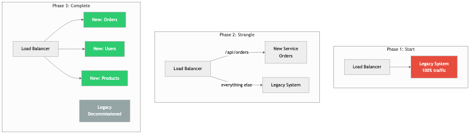

# Topic 28: Legacy Systems & Migration

## Diagrams




Legacy systems are the backbone of most established organizations. They generate revenue, serve
customers, and encode years of domain knowledge in their logic. Yet they also accumulate technical
debt, resist change, and eventually become a bottleneck for innovation. Migrating away from a
legacy system -- or modernizing it in place -- is one of the highest-stakes endeavors in software
engineering. Get it right, and you unlock agility. Get it wrong, and you risk downtime, data loss,
and organizational paralysis.

---

## Concepts

### Working with Legacy Code

Legacy code is often defined not by its age but by its lack of tests, unclear boundaries, and
resistance to safe modification. Michael Feathers famously described it as "code without tests."
Before you can migrate away from legacy code, you must first understand it well enough to avoid
breaking the behavior it provides.

Key techniques for working with legacy code:

- **Characterization tests**: Write tests that capture the current behavior of the system, even if
  that behavior is quirky or undocumented. These tests become your safety net.
- **Seam identification**: Find points in the code where you can alter behavior without editing the
  code itself -- interfaces, configuration points, dependency injection slots.
- **Dependency breaking**: Legacy systems tend to have deeply entangled dependencies. Introduce
  interfaces and indirection layers to isolate components for testing and eventual replacement.

```rust
/// A legacy pricing engine that we cannot easily modify.
/// We wrap it behind a trait so we can swap in a new implementation later.
pub trait PricingEngine {
    fn calculate_price(&self, product_id: &str, quantity: u32) -> f64;
}

/// The legacy implementation -- calls into old business logic.
pub struct LegacyPricingEngine {
    // Imagine this holds database connections, cached configs, etc.
}

impl PricingEngine for LegacyPricingEngine {
    fn calculate_price(&self, product_id: &str, quantity: u32) -> f64 {
        // Original convoluted pricing logic lives here.
        // We do not touch this; we only wrap it.
        let base = match product_id {
            "SKU-001" => 9.99,
            "SKU-002" => 19.99,
            _ => 0.0,
        };
        base * quantity as f64
    }
}

/// The new implementation that will eventually replace the legacy one.
pub struct NewPricingEngine {
    // Backed by a cleaner data model and pricing rules engine.
}

impl PricingEngine for NewPricingEngine {
    fn calculate_price(&self, product_id: &str, quantity: u32) -> f64 {
        // New logic with proper discount tiers, currency handling, etc.
        let base = self.lookup_base_price(product_id);
        let discount = self.compute_volume_discount(quantity);
        base * quantity as f64 * (1.0 - discount)
    }
}

impl NewPricingEngine {
    fn lookup_base_price(&self, _product_id: &str) -> f64 {
        10.00 // Simplified for illustration
    }

    fn compute_volume_discount(&self, quantity: u32) -> f64 {
        if quantity > 100 {
            0.15
        } else if quantity > 10 {
            0.05
        } else {
            0.0
        }
    }
}
```

### The Strangler Fig Pattern

Named after the strangler fig tree that grows around a host tree and eventually replaces it, this
pattern is the most widely recommended approach for legacy migration. Instead of a wholesale
rewrite, you incrementally replace pieces of the legacy system with new implementations while
keeping the old system running.

The process works as follows:

1. **Intercept**: Place a routing layer (proxy, API gateway, middleware) in front of the legacy
   system.
2. **Route**: Direct specific requests to the new implementation while everything else continues
   to hit the legacy system.
3. **Expand**: Over time, route more and more traffic to the new system.
4. **Retire**: Once all traffic is handled by the new system, decommission the legacy components.

```rust
use std::sync::Arc;

/// A router that implements the strangler fig pattern.
/// It decides whether to send a request to the legacy or new system.
pub struct StranglerFigRouter {
    legacy: Arc<dyn PricingEngine + Send + Sync>,
    new_system: Arc<dyn PricingEngine + Send + Sync>,
    migrated_products: Vec<String>,
}

impl StranglerFigRouter {
    pub fn new(
        legacy: Arc<dyn PricingEngine + Send + Sync>,
        new_system: Arc<dyn PricingEngine + Send + Sync>,
    ) -> Self {
        Self {
            legacy,
            new_system,
            migrated_products: Vec::new(),
        }
    }

    pub fn migrate_product(&mut self, product_id: String) {
        self.migrated_products.push(product_id);
    }

    pub fn calculate_price(&self, product_id: &str, quantity: u32) -> f64 {
        if self.migrated_products.iter().any(|p| p == product_id) {
            self.new_system.calculate_price(product_id, quantity)
        } else {
            self.legacy.calculate_price(product_id, quantity)
        }
    }
}
```

### Incremental Rewrites

A full rewrite ("let's rebuild from scratch") is one of the most dangerous decisions in software
engineering. Fred Brooks warned about second-system effect decades ago, and Joel Spolsky called
big rewrites "the single worst strategic mistake that any software company can make." Incremental
rewrites avoid this trap.

The key principles of incremental rewrites:

- **Preserve behavior first**: Before changing anything, ensure you can verify the current behavior
  through tests, shadow traffic, or dual-write comparisons.
- **Migrate slice by slice**: Choose vertical slices of functionality (e.g., one API endpoint, one
  domain entity) rather than horizontal layers (e.g., "rewrite the database layer").
- **Ship continuously**: Each increment should be deployable to production. If an increment takes
  months, it is too large.
- **Maintain two systems temporarily**: Accept the short-term cost of running both old and new code
  in parallel. The alternative -- a long-lived branch that diverges from production -- is worse.

### Migration Strategies

There are several well-established strategies for migrating legacy systems:

**Lift and Shift**: Move the legacy application as-is to a new infrastructure (e.g., from
on-premises servers to cloud VMs). This does not improve the code, but it can reduce operational
burden and unlock cloud-native tooling for future improvements.

**Re-platform**: Make minimal changes to the application to take advantage of a new platform. For
example, swapping a self-managed database for a managed service, or containerizing the application
without rewriting it.

**Re-architect**: Decompose the monolith into services or modules with cleaner boundaries. This is
the most ambitious strategy short of a full rewrite and typically uses the strangler fig approach.

**Parallel Run (Dark Launch)**: Run the new system alongside the old one, comparing outputs without
serving the new system's results to users. This builds confidence before cutover.

```rust
/// Parallel run: execute both engines and compare results for validation.
pub struct ParallelRunner {
    legacy: Arc<dyn PricingEngine + Send + Sync>,
    candidate: Arc<dyn PricingEngine + Send + Sync>,
    tolerance: f64,
}

impl ParallelRunner {
    pub fn new(
        legacy: Arc<dyn PricingEngine + Send + Sync>,
        candidate: Arc<dyn PricingEngine + Send + Sync>,
        tolerance: f64,
    ) -> Self {
        Self {
            legacy,
            candidate,
            tolerance,
        }
    }

    /// Always returns the legacy result, but logs discrepancies.
    pub fn calculate_price(&self, product_id: &str, quantity: u32) -> f64 {
        let legacy_result = self.legacy.calculate_price(product_id, quantity);
        let candidate_result = self.candidate.calculate_price(product_id, quantity);

        let diff = (legacy_result - candidate_result).abs();
        if diff > self.tolerance {
            eprintln!(
                "[MISMATCH] product={} qty={} legacy={:.2} candidate={:.2} diff={:.2}",
                product_id, quantity, legacy_result, candidate_result, diff
            );
        }

        // Always trust legacy until we are confident in the candidate.
        legacy_result
    }
}
```

### Backward Compatibility

During any migration, the old and new systems must coexist. This demands backward compatibility
across several dimensions:

- **API compatibility**: New services must accept the same request formats and return the same
  response shapes as the legacy system, at least until all consumers have migrated.
- **Data compatibility**: Database schemas must evolve without breaking readers or writers that
  have not yet been updated. This often means additive-only changes: add columns, do not rename
  or remove them until all consumers are migrated.
- **Protocol compatibility**: If the legacy system uses a proprietary binary protocol, the new
  system may need to speak both the old protocol and a modern one (e.g., gRPC or HTTP/JSON)
  during the transition.

### Database Migrations at Scale

Database migrations are often the hardest part of a legacy system migration because data is
shared state. Strategies include:

- **Expand-and-contract**: First expand the schema (add new columns/tables), deploy code that
  writes to both old and new structures, backfill historical data, deploy code that reads from
  the new structure, and finally contract (remove old columns/tables).
- **Dual writes**: Write to both the old and new databases simultaneously. This is conceptually
  simple but operationally complex -- you must handle failures in either write path and ensure
  eventual consistency.
- **Change Data Capture (CDC)**: Use tools like Debezium to stream changes from the legacy
  database to the new one. This decouples the migration from application code.
- **Online schema migration**: Tools like gh-ost (GitHub) or pt-online-schema-change (Percona)
  allow schema changes on large MySQL tables without locking.

```rust
use std::collections::HashMap;

/// Demonstrates the expand-and-contract pattern for a user record migration.
/// Phase 1: The old schema has `name` as a single field.
/// Phase 2: We add `first_name` and `last_name` (expand).
/// Phase 3: We write to both old and new fields (dual write).
/// Phase 4: We read from new fields only.
/// Phase 5: We drop the old `name` field (contract).

#[derive(Debug, Clone)]
pub struct UserRecordExpanded {
    pub id: u64,
    pub name: Option<String>,          // Old field -- will be removed in Phase 5
    pub first_name: Option<String>,    // New field -- added in Phase 2
    pub last_name: Option<String>,     // New field -- added in Phase 2
}

impl UserRecordExpanded {
    /// Phase 3: Write to both old and new fields.
    pub fn set_name(&mut self, first: &str, last: &str) {
        self.first_name = Some(first.to_string());
        self.last_name = Some(last.to_string());
        self.name = Some(format!("{} {}", first, last)); // Backward compat
    }

    /// Phase 4: Read from new fields, fall back to old if new fields are empty.
    pub fn display_name(&self) -> String {
        match (&self.first_name, &self.last_name) {
            (Some(f), Some(l)) => format!("{} {}", f, l),
            _ => self.name.clone().unwrap_or_else(|| "Unknown".to_string()),
        }
    }
}
```

### Risk Management During Migration

Migrations fail not because of technical complexity alone but because of unmanaged risk. Key risk
management practices:

- **Feature flags**: Gate new code paths behind feature flags so you can roll back instantly
  without a deployment.
- **Canary deployments**: Route a small percentage of traffic to the new system before ramping up.
- **Circuit breakers**: If the new system starts failing, automatically fall back to the legacy
  system.
- **Runbooks**: Document exactly how to roll back each phase of the migration before you start.
- **Observability**: Instrument both systems heavily. You cannot manage what you cannot measure.
  Track latency, error rates, and business metrics (e.g., order completion rate) side by side.

---

## Business Value

Legacy migration is fundamentally a business decision, not a technical one. The value it delivers
includes:

- **Reduced operational cost**: Legacy systems often run on expensive, end-of-life infrastructure.
  Migrating to modern platforms can reduce hosting, licensing, and staffing costs significantly.
- **Faster time to market**: Legacy codebases resist change. A team that spends 80% of its time
  working around legacy constraints delivers new features far slower than a team on a modern,
  well-structured codebase.
- **Talent retention and recruitment**: Engineers do not want to maintain COBOL or a tangled PHP
  monolith indefinitely. Modern technology stacks attract and retain talent.
- **Compliance and security**: Legacy systems often cannot meet modern security and regulatory
  requirements. Outdated dependencies, unpatched operating systems, and missing audit trails
  create real legal and financial liability.
- **Scalability**: Legacy architectures frequently cannot scale to meet growing demand. A migration
  to horizontally scalable services unlocks growth.
- **Reduced risk of catastrophic failure**: The longer a legacy system operates without investment,
  the more likely it is to suffer a failure that no one on the current team knows how to fix.

The business case must be made in terms the organization understands: revenue impact, cost
reduction, risk reduction, and opportunity cost of not migrating.

---

## Real-World Examples

### Amazon: From Monolith to Services (2001-2006)

In the early 2000s, Amazon's retail platform was a large C++ monolith. Deployments were slow,
teams were blocked on each other, and scaling individual components was impossible. CEO Jeff Bezos
issued his famous mandate: all teams must expose their data and functionality through service
interfaces. There would be no other form of inter-process communication. This was not a big-bang
rewrite. Teams incrementally extracted services from the monolith over several years, starting
with the most painful bottlenecks. The result was the service-oriented architecture that
eventually gave rise to AWS itself. The key lesson: executive mandate combined with incremental
execution. Amazon did not stop shipping features during the migration; they ran old and new code
in parallel and migrated piece by piece.

### Shopify: Modular Monolith (2019-Present)

Shopify's core platform is a large Ruby on Rails monolith. Rather than decomposing into
microservices -- a path they considered and rejected due to the operational complexity it would
introduce -- they chose to modularize the monolith. They drew clear boundaries within the
codebase, enforced them with tooling (a custom tool called Packwerk), and gradually untangled
dependencies between modules. This is a migration that improves the architecture without changing
the deployment topology. The lesson: migration does not always mean microservices. Sometimes the
right target architecture is a well-structured monolith. Shopify chose the path that matched
their team's operational maturity and the nature of their product.

### Twitter: From Ruby to JVM (2011-2013)

Twitter's original backend was a Ruby on Rails monolith. As traffic grew exponentially, the
system could not keep up. The infamous "Fail Whale" error page became a cultural phenomenon.
Twitter undertook a massive migration from Ruby to JVM-based services written in Scala and Java,
using their own framework (Finagle). The migration was done service by service -- the tweet
storage service, the timeline service, the search service -- each extracted and rewritten
independently. They ran parallel systems with shadow traffic to validate behavior before
cutover. The key lesson: when performance requirements fundamentally exceed what your current
platform can deliver, a migration to a different runtime is justified, but it must still be
done incrementally.

### Stripe: API Versioning for Perpetual Backward Compatibility

Stripe faces a unique legacy challenge: their API is their product, and merchants integrate
against specific API versions. Breaking changes would break their customers' businesses. Stripe
maintains backward compatibility across years of API versions through a sophisticated versioning
system. When they change an API's behavior, they write version "gates" -- transformations that
convert between the old and new representations. Each request passes through a chain of gates
that transform it from the caller's API version to the current internal representation. This is
a form of perpetual migration: the internal system evolves continuously while the external
interface remains stable across dozens of versions.

---

## Common Mistakes & Pitfalls

### 1. The Big-Bang Rewrite

The most common and most devastating mistake. A team decides to freeze the legacy system, spend
12-18 months rewriting it from scratch, and then switch over. What actually happens: the rewrite
takes longer than expected, the legacy system continues to change to meet business needs (because
the business cannot wait), the rewrite team loses context on edge cases the legacy system handles,
and the project is eventually canceled or delivers a system that is missing critical functionality.
Always prefer incremental migration.

### 2. Underestimating the Legacy System's Complexity

Legacy code is ugly for a reason. Every bizarre conditional, every special case, every workaround
exists because a real customer hit a real problem. Teams that dismiss legacy code as "just bad
code" invariably miss critical business logic during migration. Characterization tests and
extensive shadowing are essential to capture this implicit knowledge.

### 3. Migrating Without Adequate Observability

If you cannot measure the legacy system's behavior in detail -- request rates, latency
distributions, error rates, business metrics -- you cannot validate that the new system behaves
correctly. Invest in observability before you start migrating, not after.

### 4. Ignoring Data Migration

Teams often focus on code migration and treat data as an afterthought. But data migration is
frequently the hardest part. Schemas differ, data quality in the legacy system is poor, and the
volume may be enormous. Data migration must be planned, tested, and rehearsed with the same rigor
as code migration.

### 5. No Rollback Plan

Every phase of a migration must have a tested rollback plan. "We will fix it forward" is not a
rollback plan. If the new pricing engine starts returning incorrect prices at 2 AM on a Saturday,
you need to be able to revert to the legacy engine in minutes, not hours.

### 6. Letting the Migration Drag On Indefinitely

The opposite of the big-bang rewrite: a migration that never finishes. The team migrates the easy
parts and then loses momentum. The organization ends up running two systems permanently, paying
the operational cost of both. Set clear milestones, track progress publicly, and allocate
dedicated staffing to the migration effort.

---

## Trade-offs

| Approach | Advantages | Disadvantages | Risk Level |
|---|---|---|---|
| Big-bang rewrite | Clean slate, no legacy constraints | Extremely high failure rate, feature freeze required, long feedback loop | Very High |
| Strangler fig (incremental) | Low risk per increment, continuous delivery, rollback is easy | Longer total duration, must maintain two systems temporarily, routing complexity | Low to Medium |
| Lift and shift | Fast, minimal code changes, reduces infrastructure risk | Does not improve code quality or architecture, may increase cloud costs | Low |
| Re-platform | Moderate effort, gains some platform benefits | Still carries legacy code debt, partial improvement | Low to Medium |
| Re-architect (decompose) | Improves modularity, enables independent scaling and deployment | High coordination cost, distributed system complexity, requires mature DevOps | Medium to High |
| Parallel run (dark launch) | Builds confidence before cutover, catches discrepancies early | Doubles compute cost during validation, requires comparison infrastructure | Low |

---

## When to Use / When Not to Use

### When to Migrate

- The legacy system is a demonstrable bottleneck to delivering business value. Teams spend more
  time working around its limitations than building new features.
- The technology stack is end-of-life. The operating system, language runtime, or database is no
  longer receiving security patches.
- The organization cannot hire or retain engineers willing to work on the legacy stack.
- Compliance or regulatory requirements demand capabilities the legacy system cannot provide
  (e.g., audit logging, encryption at rest, GDPR data deletion).
- The system cannot scale to meet projected demand, and scaling it would cost more than migrating.

### When NOT to Migrate

- "The code is ugly" is not a sufficient reason. If the system works, is maintainable by the
  current team, and meets business needs, leave it alone.
- When the business is not willing to fund the effort properly. A half-funded migration is worse
  than no migration -- you end up with two half-working systems.
- When the team lacks the skills to operate the target architecture. Migrating from a monolith to
  microservices when the team has no experience with distributed systems, service meshes, or
  container orchestration will trade one set of problems for a worse set.
- When the system is nearing end-of-life. If the product will be decommissioned in 18 months,
  a migration is wasted effort.
- When there is no clear target architecture. "We need to get off the legacy system" is not a
  migration plan. You must know what you are migrating to and why that target is better.

---

## Key Takeaways

1. **Never attempt a big-bang rewrite.** The overwhelming majority of big-bang rewrites fail,
   are canceled, or deliver systems worse than what they replaced. Incremental migration using
   patterns like the strangler fig is almost always the correct approach.

2. **Understand the legacy system before you replace it.** Write characterization tests, run
   shadow traffic, and talk to the people who built and operated the system. The edge cases and
   workarounds in legacy code encode real business requirements.

3. **Data migration is the hard part.** Code can be deployed and rolled back in minutes. Data
   migrations on large tables can take hours or days and may not be easily reversible. Plan them
   with extreme care using expand-and-contract or change data capture patterns.

4. **Every migration phase must have a rollback plan.** Feature flags, canary deployments, and
   circuit breakers are not optional -- they are essential safety mechanisms. Test your rollback
   procedure before you need it.

5. **Migration is a business decision, not a technical one.** Frame the case in terms of cost,
   risk, velocity, and opportunity. Get executive sponsorship and dedicated funding. A migration
   that competes with feature work for resources will lose every time.

6. **Set a deadline and track progress.** Migrations that run indefinitely accumulate the costs
   of both the old and new systems. Define clear milestones, measure progress weekly, and treat
   the migration backlog with the same urgency as product work.

7. **Invest in observability before you start.** You cannot validate a migration you cannot
   measure. Instrument the legacy system for detailed metrics and logging so you have a baseline
   to compare the new system against.

---

## Further Reading

### Books

- **"Working Effectively with Legacy Code"** by Michael Feathers -- The definitive guide to
  making safe changes in codebases without tests. Essential reading before any migration effort.
- **"Monolith to Microservices"** by Sam Newman -- A practical guide to decomposition strategies,
  including the strangler fig pattern, branch by abstraction, and data migration patterns.
- **"Refactoring: Improving the Design of Existing Code"** by Martin Fowler -- While not specific
  to migration, the refactoring techniques in this book are the daily tools of incremental
  migration work.
- **"Building Microservices"** (2nd Edition) by Sam Newman -- Covers the target architecture that
  many legacy migrations aim for, with honest treatment of the operational complexity involved.
- **"Designing Data-Intensive Applications"** by Martin Kleppmann -- Essential for understanding
  database migration patterns, replication, and consistency models relevant to large-scale data
  migration.
- **"Kill It with Fire: Manage Aging Computer Systems (and Future Proof Modern Ones)"** by
  Marianne Bellotti -- A practical and opinionated guide to modernizing legacy systems, written
  by someone who has done it in government and industry contexts.

### Articles and Talks

- **"Strangler Fig Application"** by Martin Fowler (martinfowler.com) -- The original description
  of the strangler fig pattern.
- **"The Big Rewrite"** by Chad Fowler -- A widely cited essay on why big rewrites fail.
- **"Stripe's API Versioning"** by Brandur Leach -- Detailed description of how Stripe maintains
  backward compatibility across API versions.
- **"Shopify's Modular Monolith"** (Shopify Engineering Blog) -- How Shopify chose modularization
  over microservices.
- **"How We Migrated Dropbox from Nginx to Envoy"** (Dropbox Tech Blog) -- A detailed case study
  of an incremental infrastructure migration.
- **"Online Migrations at Scale"** (Stripe Engineering Blog) -- Practical patterns for migrating
  large datasets without downtime.
