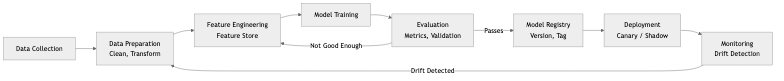
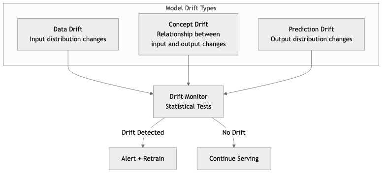

# MLOps & AI Engineering

## Diagrams






MLOps is the discipline of operationalizing machine learning models -- bridging the gap between a notebook prototype and a production system that serves predictions reliably at scale. AI Engineering extends this to encompass the full lifecycle of intelligent systems: data pipelines, training infrastructure, model serving, monitoring, and governance. This topic covers the principles, patterns, and trade-offs involved in building ML systems that are reproducible, observable, and maintainable.

---

## Concepts

### ML Pipeline

A production ML pipeline is a directed acyclic graph of stages, each with clearly defined inputs, outputs, and contracts. The canonical stages are:

1. **Data Preparation** -- Ingesting raw data, cleaning it, handling missing values, normalizing distributions, and splitting into training/validation/test sets. This stage is often the most time-consuming and the most underestimated. Schema validation (e.g., Great Expectations, custom checks) prevents silent corruption from propagating downstream.

2. **Feature Engineering & Feature Stores** -- Transforming raw data into meaningful signals for the model. A feature store is a centralized repository that manages the computation, storage, and serving of features. It decouples feature creation from model training so that teams can share and reuse features across models. Key properties of a feature store include point-in-time correctness (preventing data leakage), low-latency online serving, and high-throughput offline batch access. Examples include Feast, Tecton, and Hopsworks.

3. **Training** -- Executing the learning algorithm on prepared data. In production, training is not a one-off event but a recurring job. Considerations include distributed training across GPUs/nodes, hyperparameter tuning (grid search, Bayesian optimization), reproducibility (fixed seeds, deterministic operations), and resource management (preemptible instances, spot pricing).

4. **Evaluation** -- Measuring model quality against held-out data using metrics appropriate to the business problem (accuracy, precision/recall, AUC-ROC, RMSE, NDCG, etc.). Evaluation must also include fairness metrics, sliced performance across subgroups, and comparison against a baseline or the currently deployed model.

5. **Deployment** -- Moving a trained model artifact into a serving environment. Deployment strategies include blue-green (swap between two identical environments), canary (route a small percentage of traffic to the new model), and shadow mode (run the new model alongside production without serving its predictions to users).

### Model Versioning and Serving

Every model artifact must be versioned alongside its training data snapshot, hyperparameters, code commit, and evaluation metrics. Model registries (MLflow Model Registry, Weights & Biases, custom solutions) provide this lineage. Serving can be synchronous (REST/gRPC endpoint returning predictions in real time), asynchronous (batch scoring jobs writing results to a data store), or streaming (consuming events and producing predictions continuously).

### Inference Optimization

Reducing inference latency and cost is critical for production workloads. Common techniques include:

- **Quantization** -- Reducing weight precision from FP32 to FP16, INT8, or even INT4. This shrinks model size and accelerates computation on supported hardware.
- **Pruning** -- Removing weights or neurons that contribute little to model output.
- **Distillation** -- Training a smaller "student" model to mimic a larger "teacher" model.
- **Batching** -- Grouping multiple inference requests into a single forward pass to amortize fixed overhead.
- **Caching** -- Storing predictions for frequently seen inputs.
- **ONNX Runtime** -- Converting models to the ONNX intermediate format and running them through an optimized runtime that applies graph-level and operator-level optimizations automatically.

### A/B Testing for Models

A/B testing in ML is more nuanced than in traditional software. Model predictions influence user behavior, which in turn affects future training data (feedback loops). Proper A/B testing requires:

- A randomization unit (user, session, request) that is consistent over the experiment duration.
- Sufficient statistical power -- ML model differences can be small, requiring large sample sizes.
- Guard-rail metrics that detect regressions in safety, fairness, or system health even if the primary metric improves.
- Awareness of novelty and primacy effects -- users may behave differently simply because something changed.

### Monitoring Model Drift

Models degrade over time because the world changes. There are two primary forms of drift:

- **Data drift (covariate shift)** -- The distribution of input features changes. For example, user demographics shift after a marketing campaign targets a new audience.
- **Concept drift** -- The relationship between features and the target changes. For example, what constitutes "spam" evolves as attackers adapt.

Monitoring approaches include statistical tests (Kolmogorov-Smirnov, Population Stability Index, Jensen-Shannon divergence) on feature distributions, tracking prediction distribution shifts, and comparing live performance against a holdout or ground-truth labels when they become available.

### Ethical AI Considerations

Production ML systems carry significant ethical responsibilities:

- **Bias and fairness** -- Models trained on historical data can perpetuate or amplify existing biases. Fairness must be measured across protected attributes (race, gender, age) using metrics like demographic parity, equalized odds, and calibration.
- **Explainability** -- Stakeholders (users, regulators, internal teams) may need to understand why a model made a particular decision. Techniques include SHAP, LIME, attention visualization, and inherently interpretable models.
- **Privacy** -- Training data may contain sensitive information. Differential privacy, federated learning, and data anonymization help mitigate exposure.
- **Accountability** -- There must be clear ownership of model behavior, documented decision-making processes, and mechanisms for recourse when a model causes harm.

---

## Business Value

MLOps practices deliver measurable business value:

- **Faster time to production.** Without MLOps, the median time from a working prototype to a production deployment is measured in months. With proper pipelines, CI/CD for ML, and automated validation, this drops to days or hours.
- **Reduced operational cost.** Automated retraining, infrastructure-as-code, and inference optimization eliminate manual toil and reduce compute spend. Quantized models can cut serving costs by 50-75% with minimal accuracy loss.
- **Higher model quality.** Continuous monitoring and automated retraining catch drift before it degrades user experience. A/B testing ensures that only models that improve business metrics reach full deployment.
- **Regulatory compliance.** Model versioning, lineage tracking, and explainability tooling satisfy audit requirements in regulated industries (finance, healthcare, insurance).
- **Team velocity.** Feature stores and standardized pipelines allow data scientists to focus on modeling rather than infrastructure plumbing. Shared tooling reduces duplicated effort across teams.
- **Risk reduction.** Canary deployments, shadow mode, and guard-rail metrics prevent catastrophic model failures from reaching all users simultaneously.

---

## Real-World Examples

### Netflix: Recommendation and Personalization Platform

Netflix operates hundreds of ML models that personalize every aspect of the user experience -- title recommendations, artwork selection, search ranking, and content promotion. Their MLOps infrastructure includes a feature store that serves billions of feature lookups per day, a model lifecycle management system that tracks experiments from notebook to production, and an A/B testing platform (their internal experimentation framework) that runs thousands of concurrent experiments. Netflix monitors model drift by tracking engagement metrics (click-through rate, viewing hours) in near real time and triggers retraining when performance degrades below thresholds.

### Spotify: ML Platform (Hendrix)

Spotify built an internal ML platform called Hendrix that standardizes the lifecycle of ML models across the company. It provides managed feature pipelines, a model registry, and a unified serving layer that supports both batch and real-time inference. Spotify uses this platform for music recommendations, podcast suggestions, ad targeting, and search. A key design decision was to make the platform self-service: data scientists define their pipeline in configuration, and the platform handles orchestration, scaling, and monitoring. This reduced the median deployment time for new models from weeks to under a day.

### Uber: Michelangelo

Uber's Michelangelo platform was one of the earliest large-scale MLOps systems. It manages the full ML workflow from data preparation through serving. Notable features include a feature store that ensures consistency between training and serving (avoiding training/serving skew), support for both online and offline predictions, and deep integration with Uber's data infrastructure. Michelangelo handles models for ETAs, pricing, fraud detection, and driver matching. The platform's emphasis on reproducibility -- every prediction can be traced back to the exact model version, features, and training data -- has been influential across the industry.

### Google: TFX and Vertex AI

Google developed TensorFlow Extended (TFX) as an end-to-end platform for deploying production ML pipelines. TFX introduced many patterns now considered standard: data validation (TensorFlow Data Validation), model analysis with sliced metrics (TensorFlow Model Analysis), and a metadata store for tracking pipeline artifacts and lineage. Google later productized these capabilities as Vertex AI, a managed service that provides feature stores, model training, hyperparameter tuning, model serving with autoscaling, and built-in monitoring for data drift and prediction skew.

---

## Common Mistakes and Pitfalls

### 1. Training/Serving Skew

This is the most insidious bug in ML systems. It occurs when the feature computation logic differs between training time (offline, batch) and serving time (online, real-time). The model was trained on one distribution of features but receives a different distribution at inference time. The fix is to use a feature store that guarantees identical computation paths, or to log serving-time features and validate them against training-time features.

### 2. Treating Model Deployment as the Finish Line

Deploying a model is the beginning of its operational life, not the end of the project. Without monitoring, retraining pipelines, and rollback mechanisms, a deployed model will silently degrade. Teams that "deploy and forget" accumulate technical debt that manifests as gradually worsening business metrics.

### 3. Ignoring Data Quality

The most sophisticated model architecture cannot compensate for garbage input data. Common data quality issues include label noise, selection bias, data leakage (where information from the future or from the target variable leaks into features), stale data, and schema changes from upstream producers. Invest in data validation as a first-class pipeline stage.

### 4. Over-Engineering the Initial Pipeline

Starting with Kubernetes, distributed training, and a custom feature store when you have one model and one data scientist is counterproductive. Begin with the simplest pipeline that works (a cron job, a script, a single-node training run) and introduce complexity only when the pain of the current approach justifies it.

### 5. Neglecting Reproducibility

If you cannot reproduce a training run -- because seeds were not fixed, dependencies were not pinned, data was not snapshotted, or the code was not versioned alongside the model -- you cannot debug production issues, satisfy auditors, or reliably compare model versions.

### 6. Underestimating Inference Cost

A model that achieves state-of-the-art accuracy in a research paper may be completely impractical for production serving due to latency or cost. Always evaluate models against a latency budget and a cost envelope. A simpler model that meets business requirements at one-tenth the cost is almost always the better choice.

---

## Trade-offs

| Decision | Option A | Option B | Key Consideration |
|---|---|---|---|
| Serving mode | Real-time (REST/gRPC) | Batch scoring | Real-time adds latency requirements, infrastructure complexity, and cost; batch is simpler but stale |
| Model complexity | Deep neural network | Gradient-boosted trees / linear model | DNNs can capture complex patterns but are harder to debug, explain, and serve cheaply |
| Retraining frequency | Continuous / daily | Weekly / monthly | More frequent retraining catches drift faster but increases compute cost and pipeline complexity |
| Feature store | Build in-house | Adopt managed solution (Feast, Tecton) | In-house gives full control but requires significant engineering investment |
| Model format | Framework-native (PyTorch, TF) | ONNX | ONNX enables cross-framework portability and runtime optimization but may not support all operations |
| Quantization | FP32 (full precision) | INT8 / FP16 (reduced precision) | Reduced precision cuts latency and cost but may degrade accuracy for sensitive tasks |
| Experimentation | A/B test every change | Ship based on offline metrics | A/B testing is rigorous but slow; offline-only is fast but can miss real-world effects |
| Infrastructure | Managed cloud ML platform | Self-hosted open source stack | Managed reduces operational burden but increases vendor lock-in and cost at scale |

---

## When to Use / When Not to Use

### When to Invest in MLOps

- You have multiple models in production or plan to deploy models regularly.
- Model predictions directly affect revenue, safety, or user experience.
- You need to satisfy regulatory or audit requirements around model governance.
- Your data scientists spend more time on deployment plumbing than on modeling.
- You observe model performance degradation over time and need systematic monitoring.
- Multiple teams need to share features, data pipelines, or serving infrastructure.

### When MLOps is Overkill

- You have a single, rarely-updated model (e.g., a one-time classification for a migration project).
- The model is used internally for analysis, not for production predictions.
- Your organization has fewer than two people working on ML.
- A rule-based system or simple heuristic solves the problem adequately.
- The cost of building and maintaining ML infrastructure exceeds the value the model delivers.
- You are in the early exploration phase and do not yet know if ML is the right approach.

---

## Code Examples in Rust

### Loading and Running an ONNX Model with the `ort` Crate

The `ort` crate provides Rust bindings to ONNX Runtime, enabling high-performance model inference without Python dependencies.

```text
/// A thin wrapper around an ONNX Runtime session that handles
/// model loading, input preparation, and inference.
STRUCTURE ModelServer
    session : ONNXSession

/// Load a model from an ONNX file path.
PROCEDURE ModelServer.NEW(model_path) → Result<ModelServer>
    environment ← BUILD_ENVIRONMENT(name ← "mlops_inference")
    session ← BUILD_SESSION(environment,
        optimization_level ← Level3,
        intra_threads ← 4,
        model_file ← model_path)
    RETURN Ok(ModelServer { session })

/// Run inference on a batch of input feature vectors.
/// Returns the model output as a 2D array.
PROCEDURE ModelServer.PREDICT(input) → Result<Array2D<Float32>>
    input_shape ← SHAPE(input)
    input_value ← ARRAY_TO_TENSOR(input, self.session.allocator)
    outputs ← self.session.RUN([input_value])
    output ← EXTRACT_TENSOR(outputs[0])
    RESHAPE output TO (input_shape[0], output.columns)
    RETURN Ok(output)

/// Demonstrates model loading, warm-up, and latency measurement.
PROCEDURE MAIN() → Result
    server ← ModelServer.NEW("model.onnx")

    // Warm-up run to trigger any lazy initialization in the runtime.
    warmup_input ← ZEROS(1, 128)
    server.PREDICT(warmup_input)

    // Benchmark inference latency over 100 requests.
    batch ← ONES(32, 128)
    start ← CURRENT_TIME()
    iterations ← 100

    FOR i ← 1 TO iterations DO
        server.PREDICT(CLONE(batch))
    END FOR

    elapsed ← ELAPSED(start)
    per_request ← elapsed / iterations
    PRINT "Total: " + elapsed + ", Per batch: " + per_request
          + ", Per sample: " + (per_request / 32)
```

### Tensor Operations with the `candle` Crate

The `candle` crate is a minimalist ML framework for Rust, developed by Hugging Face. It supports GPU acceleration and provides a PyTorch-like tensor API.

```text
/// A simple feedforward network for demonstration purposes.
STRUCTURE FeedForward
    layer1 : LinearLayer
    layer2 : LinearLayer
    layer3 : LinearLayer

PROCEDURE FeedForward.NEW(input_dim, hidden_dim, output_dim, var_builder) → Result<FeedForward>
    layer1 ← LINEAR_LAYER(input_dim, hidden_dim, var_builder.SCOPE("layer1"))
    layer2 ← LINEAR_LAYER(hidden_dim, hidden_dim, var_builder.SCOPE("layer2"))
    layer3 ← LINEAR_LAYER(hidden_dim, output_dim, var_builder.SCOPE("layer3"))
    RETURN Ok(FeedForward { layer1, layer2, layer3 })

PROCEDURE FeedForward.FORWARD(x) → Result<Tensor>
    x ← RELU(self.layer1.FORWARD(x))
    x ← RELU(self.layer2.FORWARD(x))
    RETURN self.layer3.FORWARD(x)

/// Demonstrates creating a model, running a forward pass, and
/// inspecting the output tensor.
PROCEDURE MAIN() → Result
    device ← CPU

    varmap ← NEW VarMap
    vb ← VarBuilder(varmap, dtype ← Float32, device)

    model ← FeedForward.NEW(128, 64, 10, vb)

    // Create a batch of 16 samples, each with 128 features.
    input ← RANDOM_NORMAL(mean ← 0, std ← 1.0, shape ← (16, 128), device)
    output ← model.FORWARD(input)

    PRINT "Input shape:  " + DIMS(input)
    PRINT "Output shape: " + DIMS(output)
    PRINT "Output: " + output
```

### Monitoring Feature Drift with Statistical Tests

This example computes the Population Stability Index (PSI) to detect distribution shift between a reference dataset and a production dataset.

```text
STRUCTURE Bucket
    lower : Float
    upper : Float
    count : Integer

/// Compute a histogram from a list of values using fixed-width bins.
PROCEDURE COMPUTE_HISTOGRAM(values, num_bins) → List<Bucket>
    min_val ← MIN(values)
    max_val ← MAX(values)
    bin_width ← (max_val - min_val) / num_bins

    buckets ← FOR i ← 0 TO num_bins - 1:
        Bucket { lower ← min_val + i * bin_width,
                 upper ← min_val + (i + 1) * bin_width,
                 count ← 0 }

    FOR EACH v IN values DO
        idx ← MIN(FLOOR((v - min_val) / bin_width), num_bins - 1)
        buckets[idx].count ← buckets[idx].count + 1
    END FOR
    RETURN buckets

/// Compute the Population Stability Index (PSI) between a reference
/// distribution and an actual (production) distribution.
///
/// PSI = SUM( (actual_pct - reference_pct) * ln(actual_pct / reference_pct) )
///
/// Interpretation:
///   PSI < 0.1  => no significant shift
///   PSI 0.1-0.2 => moderate shift, investigate
///   PSI > 0.2  => significant shift, action required
PROCEDURE COMPUTE_PSI(reference, actual, num_bins) → Float
    ref_hist ← COMPUTE_HISTOGRAM(reference, num_bins)
    act_hist ← COMPUTE_HISTOGRAM(actual, num_bins)

    ref_total ← LENGTH(reference)
    act_total ← LENGTH(actual)
    epsilon ← 1e-8   // avoid division by zero or log(0)

    psi ← 0.0
    FOR i ← 0 TO num_bins - 1 DO
        ref_pct ← MAX(ref_hist[i].count / ref_total, epsilon)
        act_pct ← MAX(act_hist[i].count / act_total, epsilon)
        psi ← psi + (act_pct - ref_pct) * LN(act_pct / ref_pct)
    END FOR
    RETURN psi

/// Track multiple features and report drift status.
STRUCTURE DriftMonitor
    reference_data : Map<String, List<Float>>
    psi_threshold_warn : Float ← 0.1
    psi_threshold_alert : Float ← 0.2
    num_bins : Integer

ENUMERATION DriftStatus
    Stable(psi : Float)
    Warning(psi : Float)
    Alert(psi : Float)

PROCEDURE DriftMonitor.REGISTER_FEATURE(name, reference)
    self.reference_data[name] ← reference

PROCEDURE DriftMonitor.CHECK_DRIFT(name, actual) → Optional<DriftStatus>
    reference ← self.reference_data[name]
    IF reference IS NULL THEN RETURN NULL
    psi ← COMPUTE_PSI(reference, actual, self.num_bins)

    IF psi ≥ self.psi_threshold_alert THEN RETURN Alert(psi)
    ELSE IF psi ≥ self.psi_threshold_warn THEN RETURN Warning(psi)
    ELSE RETURN Stable(psi)

PROCEDURE MAIN()
    monitor ← NEW DriftMonitor(num_bins ← 20)

    // Simulate reference data (training distribution).
    reference ← [(i / 10000.0) * 10.0 + 5.0 FOR i ← 0 TO 9999]
    monitor.REGISTER_FEATURE("user_age", reference)

    // Simulate production data with a shifted distribution.
    production ← [(i / 5000.0) * 10.0 + 8.0 FOR i ← 0 TO 4999]  // shifted by +3

    MATCH monitor.CHECK_DRIFT("user_age", production)
        CASE Stable(psi):  PRINT "Feature 'user_age': STABLE (PSI = " + psi + ")"
        CASE Warning(psi): PRINT "Feature 'user_age': WARNING (PSI = " + psi + ")"
        CASE Alert(psi):   PRINT "Feature 'user_age': ALERT (PSI = " + psi + ")"
                           PRINT "Action: trigger retraining pipeline."
        CASE NULL:         PRINT "Feature 'user_age' not registered."
```

---

## Key Takeaways

1. **MLOps is fundamentally about reliability.** The goal is not to add process for its own sake but to ensure that models perform correctly, consistently, and safely in production. Every practice -- versioning, monitoring, testing -- serves this end.

2. **Training/serving skew is the most common source of silent failures.** Use a feature store or a shared feature computation layer to guarantee that the features seen during training match those seen during inference. Log and validate serving-time features.

3. **Monitor models continuously, not just at deployment time.** Data drift and concept drift are inevitable. Build automated monitoring that tracks feature distributions, prediction distributions, and downstream business metrics. Set thresholds that trigger alerts or automatic retraining.

4. **Start simple and add complexity incrementally.** A cron job that retrains a model nightly and writes predictions to a database is a perfectly valid first MLOps pipeline. Migrate to more sophisticated infrastructure (Kubernetes, feature stores, real-time serving) only when the current approach creates measurable pain.

5. **Inference cost and latency are first-class requirements.** Always evaluate models against a latency budget and a cost envelope. Techniques like quantization (INT8/FP16), ONNX Runtime optimization, and model distillation can dramatically reduce serving cost with acceptable accuracy trade-offs.

6. **Ethical considerations are engineering requirements, not afterthoughts.** Bias audits, fairness metrics, explainability, and privacy protections must be built into the pipeline from the start. Retrofitting them is far more expensive and often incomplete.

7. **Reproducibility is non-negotiable.** Pin every dependency, snapshot training data, version model artifacts alongside code, and log all hyperparameters. If you cannot reproduce a result, you cannot debug it, audit it, or confidently improve upon it.

---

## Further Reading

### Books

- *Designing Machine Learning Systems* by Chip Huyen (O'Reilly, 2022) -- The most practical and comprehensive treatment of ML systems design, covering data engineering, feature stores, training, deployment, monitoring, and organizational considerations.
- *Machine Learning Engineering* by Andriy Burkov -- A concise guide focused on the engineering practices needed to bring ML models to production.
- *Reliable Machine Learning* by Cathy Chen, Martin Uber, et al. (O'Reilly, 2022) -- Covers SRE-inspired practices for operating ML systems, including monitoring, incident response, and capacity planning.
- *Building Machine Learning Pipelines* by Hannes Hapke and Catherine Nelson (O'Reilly, 2020) -- Hands-on guide to TFX and ML pipeline construction.

### Articles and Papers

- "Hidden Technical Debt in Machine Learning Systems" (Sculley et al., NeurIPS 2015) -- The foundational paper on ML technical debt. Required reading for anyone building production ML.
- "Monitoring Machine Learning Models in Production" by Christopher Samiullah -- Practical guide to monitoring strategies and tooling.
- "Rules of Machine Learning: Best Practices for ML Engineering" by Martin Zinkevich (Google) -- Pragmatic rules distilled from years of ML engineering at Google.
- "Feature Stores for ML" by Mike Del Balso and Willem Pienaar -- Overview of feature store architecture and design decisions.

### Rust Crates

- **`candle`** (https://github.com/huggingface/candle) -- A minimalist ML framework for Rust by Hugging Face. Supports tensor operations, automatic differentiation, GPU acceleration via CUDA and Metal, and loading models in safetensors/GGUF formats. Suitable for inference and lightweight training workloads.
- **`ort`** (https://github.com/pykeio/ort) -- High-quality Rust bindings for ONNX Runtime. Provides access to the full ONNX Runtime optimization pipeline (graph optimization, operator fusion, quantization support) with a safe Rust API. The recommended crate for production ONNX model serving in Rust.
- **`tokenizers`** (https://github.com/huggingface/tokenizers) -- Hugging Face's tokenizer library, written in Rust. Handles BPE, WordPiece, and SentencePiece tokenization with high performance. Essential for NLP inference pipelines.
- **`safetensors`** (https://github.com/huggingface/safetensors) -- A safe, zero-copy tensor serialization format. Preferred over pickle-based formats for security and performance.
- **`ndarray`** -- The foundational N-dimensional array crate for Rust. Provides NumPy-like array operations and is used by most ML crates for data interchange.

### Tools and Platforms

- **MLflow** (https://mlflow.org) -- Open-source platform for experiment tracking, model registry, and deployment.
- **Feast** (https://feast.dev) -- Open-source feature store for managing and serving ML features.
- **DVC (Data Version Control)** (https://dvc.org) -- Git-based version control for data and ML pipelines.
- **Weights & Biases** (https://wandb.ai) -- Experiment tracking, model versioning, and collaboration platform.
- **Evidently AI** (https://evidentlyai.com) -- Open-source tool for monitoring data drift, model performance, and data quality in ML pipelines.
