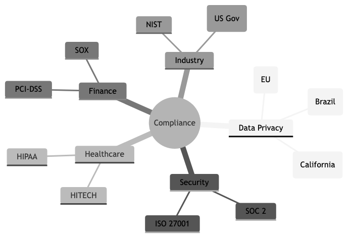

# Compliance & Regulatory Engineering

## Diagrams

Compliance and regulatory engineering is the discipline of designing, building, and operating software systems that satisfy legal, contractual, and industry-specific requirements. Unlike ad-hoc compliance efforts bolted on after the fact, regulatory engineering treats compliance as a first-class architectural concern -- embedding controls, audit mechanisms, and policy enforcement directly into the software development lifecycle. The goal is not merely to pass an audit but to build systems that are continuously and demonstrably compliant.

---

## Concepts

### GDPR (General Data Protection Regulation)

The European Union's GDPR, effective since May 2018, governs the processing of personal data belonging to individuals in the EU. Its core principles include lawfulness, fairness, and transparency; purpose limitation; data minimization; accuracy; storage limitation; integrity and confidentiality; and accountability. From an engineering perspective, GDPR compliance demands:

- **Right to erasure (right to be forgotten):** Systems must be able to locate and delete all personal data associated with a given individual across every data store, backup, cache, and third-party integration. This is architecturally non-trivial in distributed systems.
- **Data portability:** Users can request their data in a structured, machine-readable format. Engineers must build export pipelines that produce complete, well-formed outputs.
- **Consent management:** Collecting, storing, and respecting granular consent preferences requires dedicated infrastructure. Consent must be freely given, specific, informed, and unambiguous.
- **Data Processing Agreements (DPAs):** Every sub-processor in your supply chain must be contractually bound to GDPR-compatible data handling practices.
- **Breach notification:** Organizations must notify supervisory authorities within 72 hours of becoming aware of a personal data breach, which demands robust incident detection and response systems.

### SOC 2 (Service Organization Control 2)

SOC 2 is an auditing framework developed by the AICPA, organized around five Trust Service Criteria: security, availability, processing integrity, confidentiality, and privacy. Unlike a certification, SOC 2 results in an auditor's report -- either Type I (point-in-time design assessment) or Type II (effectiveness over a period, typically 6-12 months). Engineering implications include:

- **Access controls:** Implementing role-based access control (RBAC), multi-factor authentication (MFA), and principle of least privilege across all systems.
- **Change management:** Every production change must be documented, reviewed, approved, and traceable.
- **Monitoring and alerting:** Continuous monitoring of system health, security events, and anomalous activity.
- **Vendor management:** Third-party services must be assessed for their own security posture.
- **Evidence collection:** Auditors require proof that controls are operating effectively. Automated evidence collection dramatically reduces the burden.

### HIPAA (Health Insurance Portability and Accountability Act)

HIPAA governs the handling of Protected Health Information (PHI) in the United States. Its two most engineering-relevant rules are the Privacy Rule and the Security Rule. Key engineering requirements include:

- **Encryption:** PHI must be encrypted at rest and in transit. The Security Rule does not mandate specific algorithms but references NIST standards.
- **Access controls and audit logs:** Every access to PHI must be logged and attributable to a specific individual. Role-based access must enforce minimum necessary access.
- **Business Associate Agreements (BAAs):** Any third party that handles PHI on your behalf must sign a BAA. Major cloud providers offer HIPAA-eligible services, but not all services within a cloud platform qualify.
- **Backup and disaster recovery:** Covered entities must maintain retrievable exact copies of ePHI and have documented contingency plans.

### PCI-DSS (Payment Card Industry Data Security Standard)

PCI-DSS applies to any organization that stores, processes, or transmits cardholder data. It comprises 12 high-level requirements organized into six goals: build and maintain a secure network, protect cardholder data, maintain a vulnerability management program, implement strong access controls, regularly monitor and test networks, and maintain an information security policy.

Engineering considerations:

- **Network segmentation:** Cardholder data environments (CDEs) must be isolated from general corporate networks to reduce the scope of PCI-DSS compliance.
- **Tokenization and encryption:** Storing raw card numbers is strongly discouraged. Tokenization replaces sensitive data with non-sensitive substitutes, dramatically reducing scope.
- **Penetration testing:** Regular internal and external penetration tests are required.
- **Logging and monitoring:** All access to cardholder data and network resources must be logged and monitored.

### Audit Trails

An audit trail is a chronological record of system activities that provides documentary evidence of the sequence of events affecting an operation, procedure, or event. In compliance engineering, audit trails serve as the primary mechanism for demonstrating that controls are operating as intended.

Effective audit trails must be:

- **Immutable:** Once written, audit records must not be modifiable or deletable. Append-only data stores, write-once storage, or cryptographic chaining (similar to blockchain concepts) can enforce this property.
- **Complete:** Every relevant action must be captured -- who performed it, what was done, when it happened, and what the outcome was.
- **Tamper-evident:** If an audit record is altered, it must be detectable. Cryptographic hashing of log entries is a common approach.
- **Queryable:** Auditors and compliance teams must be able to search and retrieve relevant records efficiently.
- **Time-synchronized:** All systems contributing to the audit trail must use synchronized clocks (NTP) to ensure temporal consistency.

### Data Residency and Sovereignty

Data residency refers to the physical or geographic location where data is stored. Data sovereignty extends this to mean that data is subject to the laws of the country where it resides. These concepts have significant architectural implications:

- **Multi-region deployment:** Systems may need to store and process data in specific geographic regions. A user in Germany may require their data to remain within the EU.
- **Cross-border transfer restrictions:** Mechanisms such as Standard Contractual Clauses (SCCs) or adequacy decisions govern the transfer of personal data outside its region of origin. The invalidation of the EU-US Privacy Shield (Schrems II decision) forced many organizations to re-architect data flows.
- **Cloud provider region selection:** Not all cloud regions offer the same services or certifications. Region selection must balance compliance requirements with operational needs.

### Privacy by Design

Privacy by Design (PbD) is a framework developed by Ann Cavoukian that embeds privacy into the design and architecture of IT systems and business practices from the outset, rather than treating it as an afterthought. Its seven foundational principles are:

1. Proactive not reactive; preventative not remedial
2. Privacy as the default setting
3. Privacy embedded into design
4. Full functionality -- positive-sum, not zero-sum
5. End-to-end security -- full lifecycle protection
6. Visibility and transparency -- keep it open
7. Respect for user privacy -- keep it user-centric

In practice, this means conducting Data Protection Impact Assessments (DPIAs) before launching new features, implementing data minimization by default, providing privacy-preserving defaults in user interfaces, and building deletion and anonymization capabilities from the start rather than retrofitting them.

### Compliance Automation

Compliance automation uses software tools and processes to continuously verify, enforce, and report on compliance posture. Manual compliance is unsustainable at scale -- it is slow, error-prone, and creates a false sense of security between audit periods.

Key approaches include:

- **Policy as code:** Expressing compliance policies as machine-readable rules that can be automatically evaluated. Tools like Open Policy Agent (OPA), HashiCorp Sentinel, and AWS Config Rules enable this pattern.
- **Continuous control monitoring:** Automated checks that run on a schedule or in response to events, verifying that controls remain effective.
- **Automated evidence collection:** Gathering screenshots, configuration snapshots, access logs, and other audit artifacts automatically rather than manually during audit season.
- **Infrastructure as Code (IaC) scanning:** Analyzing Terraform, CloudFormation, or Kubernetes manifests for compliance violations before deployment.
- **Compliance dashboards:** Real-time visibility into compliance posture across the organization.

### Regulatory Change Management

Regulations are not static. New laws are enacted, existing regulations are amended, and court decisions reinterpret requirements. Regulatory change management is the process of monitoring, assessing, and responding to changes in the regulatory landscape.

Engineering teams must:

- **Monitor regulatory developments:** Subscribe to regulatory feeds, engage legal counsel, and participate in industry groups.
- **Assess impact:** When a regulation changes, determine which systems, data flows, and processes are affected.
- **Plan and implement changes:** Modify systems to comply with new requirements within the mandated timeline.
- **Verify compliance:** Test and validate that changes achieve the desired compliance outcome.
- **Document everything:** Maintain records of the regulatory change, the impact assessment, the remediation plan, and the verification results.

---

## Business Value

Compliance and regulatory engineering delivers tangible business value far beyond avoiding fines:

**Market access.** Many industries and geographies require specific certifications or compliance attestations before an organization can do business. SOC 2 reports are table stakes for selling SaaS to enterprise customers. HIPAA compliance is a prerequisite for handling health data in the US. PCI-DSS compliance is mandatory for processing payment cards. Without these, entire market segments are inaccessible.

**Risk reduction.** Regulatory frameworks codify best practices for data security and privacy. Organizations that comply with these frameworks are less likely to experience data breaches, and when incidents do occur, the impact is typically contained. The average cost of a data breach in 2025 exceeded $4.8 million globally (per IBM's Cost of a Data Breach report), and regulatory non-compliance was consistently identified as a cost amplifier.

**Customer trust.** In an era of frequent data breaches and growing privacy awareness, demonstrable compliance is a competitive differentiator. Customers -- especially enterprise buyers -- evaluate vendors on their security and compliance posture. A SOC 2 Type II report or ISO 27001 certification can accelerate sales cycles and reduce friction in procurement.

**Operational efficiency.** Compliance automation, when implemented well, reduces manual toil, accelerates audit cycles, and provides continuous visibility into risk. Organizations that invest in compliance engineering often find that the same infrastructure improves overall operational maturity.

**Reduced legal liability.** In the event of a breach, demonstrable compliance with applicable regulations can significantly reduce legal exposure. GDPR, for example, considers the adequacy of security measures when determining fine amounts. A well-documented compliance program is both a shield and a mitigant.

---

## Real-World Examples

### British Airways -- GDPR Fine for Inadequate Security Controls (2018-2020)

In 2018, British Airways suffered a data breach that exposed the personal and financial data of approximately 400,000 customers. Attackers compromised the airline's website and mobile app through a supply chain attack, injecting malicious JavaScript that skimmed payment card details. The UK's Information Commissioner's Office (ICO) initially proposed a fine of 183 million pounds, later reduced to 20 million pounds. The ICO's investigation found that BA had failed to implement adequate security measures -- including multi-factor authentication, timely patching, and rigorous testing -- that could have prevented or detected the breach earlier. This case demonstrated that regulators evaluate the state of technical controls, not just policies on paper.

### Anthem Health Insurance -- HIPAA Breach and Settlement (2015-2018)

Anthem, one of the largest health insurers in the United States, disclosed in 2015 that attackers had gained access to a database containing the personal information of nearly 79 million people, including names, dates of birth, Social Security numbers, and medical IDs. The breach originated from a phishing email that gave attackers access to the corporate network. Anthem ultimately paid $16 million to the U.S. Department of Health and Human Services -- the largest HIPAA settlement at that time -- plus $115 million to settle a class-action lawsuit. The HHS investigation found failures in conducting an enterprise-wide risk analysis, insufficient procedures to review information system activity, and failure to identify and respond to the breach in a timely manner.

### Equifax -- Regulatory Fallout Across Multiple Jurisdictions (2017)

The Equifax breach of 2017 exposed the personal data of 147 million people and became a case study in regulatory failure across multiple frameworks simultaneously. The breach exploited a known vulnerability in Apache Struts that had a patch available for months. Equifax's failures included inadequate patch management, an expired SSL certificate on a network monitoring tool (which meant intrusion detection was blind for 19 months), and poor network segmentation that allowed attackers to move laterally. The company faced enforcement actions and fines from the FTC ($575 million settlement), the UK's ICO, Canadian regulators, and multiple US state attorneys general. This case illustrates how a single security failure can trigger compliance consequences across dozens of regulatory regimes simultaneously.

### Marriott International -- Cross-Border Data Transfer Complications (2018-2020)

Marriott disclosed in 2018 that attackers had been present in the Starwood guest reservation system since 2014 -- predating Marriott's acquisition of Starwood in 2016. Approximately 339 million guest records were affected, including passport numbers for some individuals. The ICO fined Marriott 18.4 million pounds. This case highlighted two engineering concerns: first, the importance of thorough security due diligence during mergers and acquisitions, and second, the complications of data residency when a hotel chain operates globally but must comply with region-specific data protection laws. Marriott had to re-architect its data handling to address GDPR cross-border transfer requirements following the breach.

---

## Common Mistakes and Pitfalls

### 1. Treating Compliance as a Checkbox Exercise

The most pervasive mistake is treating compliance as a periodic event rather than a continuous discipline. Organizations that scramble to prepare for annual audits -- gathering evidence, patching gaps, and documenting controls at the last minute -- create a false sense of security. Between audits, controls drift, configurations change, and new risks emerge. The result is an organization that is "compliant" on paper for one day and non-compliant for the other 364. Compliance must be engineered into daily operations through automation, continuous monitoring, and cultural commitment.

### 2. Over-Scoping or Under-Scoping the Compliance Boundary

Scope management is critical to effective compliance. Under-scoping means excluding systems or data flows that should be in scope, leading to unaddressed risks and potential regulatory violations. Over-scoping means including systems unnecessarily, dramatically increasing the cost and complexity of compliance. PCI-DSS is a clear example: by properly segmenting the cardholder data environment and using tokenization, an organization can reduce its compliance scope by orders of magnitude. The failure to invest in proper scoping is one of the most expensive compliance mistakes.

### 3. Ignoring the Supply Chain

Modern software systems depend on dozens or hundreds of third-party services, libraries, and infrastructure providers. Each one is a potential compliance liability. Organizations frequently fail to assess whether their vendors comply with relevant regulations, fail to execute appropriate agreements (DPAs, BAAs), or fail to monitor vendor compliance over time. When a vendor suffers a breach or changes its practices, the downstream organization bears the regulatory consequences.

### 4. Building Deletion as an Afterthought

GDPR's right to erasure and similar data deletion requirements are architecturally significant. Systems that store personal data in normalized relational databases, denormalized analytics stores, backups, caches, search indices, machine learning training sets, and third-party integrations make complete deletion extremely difficult. Organizations that do not design for deletion from the start face painful and expensive retrofitting. A common engineering pattern is to associate all personal data with a central identifier and build a deletion service that propagates erasure across all stores.

### 5. Assuming Cloud Provider Compliance Covers You

AWS, Azure, and Google Cloud all maintain extensive compliance certifications and offer HIPAA-eligible, PCI-DSS compliant, and SOC 2 audited services. However, the shared responsibility model means that the cloud provider is responsible for the security of the cloud, while the customer is responsible for security in the cloud. Misconfigured S3 buckets, overly permissive IAM policies, and unencrypted databases are customer responsibilities. A cloud provider's SOC 2 report does not cover your application logic, access controls, or data handling practices.

### 6. Neglecting Regulatory Change Monitoring

Regulations evolve. The invalidation of the EU-US Privacy Shield, the passage of the California Consumer Privacy Act (CCPA) and its successor the CPRA, the emergence of data protection laws in Brazil (LGPD), India (DPDPA), and China (PIPL) -- all required engineering responses. Organizations that do not systematically monitor regulatory changes risk discovering new requirements only when they receive an enforcement notice.

---

## Trade-offs

| Dimension | More Compliance Investment | Less Compliance Investment |
|---|---|---|
| Development velocity | Slower initial development due to additional controls, reviews, and documentation requirements | Faster initial development, but potential for costly rework when compliance is eventually required |
| Operational cost | Higher ongoing cost for monitoring, auditing, evidence collection, and compliance tooling | Lower ongoing cost, but risk of large one-time costs for audit remediation, breach response, or fines |
| Market access | Broader market access, especially to regulated industries and enterprise customers | Limited to markets and customers with low compliance expectations |
| Engineering complexity | More complex architecture to support audit trails, encryption, data residency, and access controls | Simpler architecture, but potentially brittle when requirements change |
| Time to market | Longer time to market for new features due to compliance review processes | Shorter time to market, but risk of post-launch compliance issues requiring rollback or remediation |
| Data flexibility | Restricted data usage due to purpose limitation, consent requirements, and retention policies | Greater flexibility to use data for analytics, ML, and new features, but increased legal risk |
| Vendor selection | Constrained vendor choices to those meeting compliance requirements | Broader vendor options, but potential for non-compliant supply chain |
| Incident response | Faster, more structured incident response due to established procedures and monitoring | Ad hoc incident response that may fail to meet notification deadlines |
| Organizational culture | Compliance-aware culture where engineers consider regulatory implications naturally | Engineering culture focused solely on features and performance, with compliance as an afterthought |

---

## When to Use / When Not to Use

### When to Invest Heavily in Compliance Engineering

- **Handling personal data of EU residents.** GDPR applies regardless of where the organization is based. The extraterritorial scope means any company serving EU users must comply.
- **Processing health information in the US.** HIPAA compliance is non-negotiable for covered entities and their business associates.
- **Accepting or processing payment cards.** PCI-DSS compliance is required by the card brands and enforced through acquiring banks.
- **Selling to enterprise customers.** SOC 2 reports, ISO 27001 certifications, and similar attestations are increasingly required in enterprise procurement processes.
- **Operating in highly regulated industries.** Financial services (SOX, GLBA), government contracting (FedRAMP, ITAR), telecommunications, and energy all have sector-specific requirements.
- **Handling data across national borders.** Cross-border data transfer restrictions require careful architectural planning and legal coordination.
- **Preparing for an IPO or acquisition.** Acquirers and public market investors scrutinize compliance posture during due diligence.

### When a Lighter Approach May Suffice

- **Early-stage prototypes and internal tools.** If you are building an internal prototype that does not handle personal data or sensitive information, heavy compliance engineering is premature. However, be cautious -- prototypes have a way of becoming production systems.
- **Open-source projects with no hosted service.** If you are distributing code but not operating a service that processes user data, most data protection regulations do not apply to the code itself (though export control regulations may).
- **Consumer applications in unregulated domains with minimal personal data.** A single-player game that does not collect user data has few compliance obligations, though even minimal analytics or advertising SDKs can bring GDPR or CCPA into scope.
- **Purely analytical workloads on anonymized data.** If data has been properly anonymized (not merely pseudonymized), it falls outside the scope of most data protection regulations. However, the bar for true anonymization is high, and re-identification risks must be carefully assessed.

Note that "lighter approach" never means "no approach." Even in low-risk scenarios, basic practices like secure defaults, minimal data collection, and clear privacy notices are prudent.

---

## Key Takeaways

1. **Compliance is an architectural concern, not an administrative one.** The ability to comply with regulations is determined by system design decisions made early in development. Retrofitting compliance into an existing system is dramatically more expensive and error-prone than building it in from the start.

2. **Automate everything you can.** Manual compliance processes do not scale, introduce human error, and create gaps between audit periods. Policy as code, continuous control monitoring, and automated evidence collection transform compliance from a periodic burden into a continuous assurance mechanism.

3. **Scope management is a force multiplier.** Proper scoping -- through network segmentation, tokenization, data minimization, and architectural isolation -- can reduce compliance cost and complexity by orders of magnitude. Every system, data store, and data flow you can exclude from scope is one less thing to secure, monitor, and audit.

4. **The supply chain is your compliance boundary.** Your compliance posture is only as strong as your weakest vendor. Rigorous vendor assessment, appropriate contractual agreements, and ongoing monitoring are essential. A breach at a sub-processor is your breach in the eyes of regulators.

5. **Design for data lifecycle management from day one.** Build systems that know what data they hold, where it came from, why it was collected, how long it should be retained, and how to delete it completely. These capabilities are required by virtually every modern privacy regulation and are extremely difficult to add retroactively.

6. **Regulatory landscapes are dynamic.** New regulations, amendments, court decisions, and enforcement trends continuously reshape compliance requirements. Organizations need systematic processes for monitoring, assessing, and responding to regulatory change -- not just reacting when penalties arrive.

7. **Compliance and security are related but distinct.** A system can be secure but non-compliant (for example, it encrypts everything but lacks proper consent management). A system can be compliant on paper but insecure (for example, it has all required policies documented but does not enforce them technically). Effective compliance engineering requires both strong security foundations and deliberate regulatory alignment.

---

## Further Reading

### Books

- **"GDPR: A Game of Snakes and Ladders" by Paul Voigt and Axel von dem Bussche** -- A comprehensive legal and practical guide to GDPR, useful for engineers who need to understand the regulatory text in depth.
- **"The Security Risk Assessment Handbook" by Douglas Landoll** -- Covers risk assessment methodologies that underpin compliance frameworks like HIPAA and SOC 2.
- **"Privacy Engineering" by Ian Oliver** -- Focuses on the technical implementation of privacy requirements, bridging the gap between legal obligations and system design.
- **"Designing Data-Intensive Applications" by Martin Kleppmann** -- While not a compliance book per se, its treatment of data modeling, replication, and distributed systems is essential background for understanding the engineering challenges of compliance at scale.
- **"Information Privacy Engineering and Privacy by Design" by William Stallings** -- Provides a structured approach to integrating privacy considerations into the software engineering process.

### Articles and Standards

- **NIST Cybersecurity Framework (CSF)** -- A widely adopted framework for organizing and improving cybersecurity posture, frequently referenced in compliance programs.
- **NIST SP 800-53** -- The catalog of security and privacy controls used by US federal agencies and frequently adopted by private sector organizations.
- **ISO 27001 and ISO 27701** -- International standards for information security management systems (27001) and privacy information management (27701).
- **OWASP Top 10 and OWASP ASVS** -- Application security standards that address many of the technical control requirements found in compliance frameworks.
- **"The GDPR Compliance Checklist for Developers" (multiple sources)** -- Practical engineering guides for implementing GDPR requirements in software systems.

### Tools

- **Open Policy Agent (OPA)** -- A general-purpose policy engine that enables policy as code across the stack, from Kubernetes admission control to API authorization.
- **HashiCorp Vault** -- Secrets management and encryption as a service, essential for managing cryptographic keys, database credentials, and API tokens in a compliant manner.
- **Vanta, Drata, Secureframe** -- Compliance automation platforms that continuously monitor controls, collect evidence, and streamline audit preparation for SOC 2, ISO 27001, HIPAA, and PCI-DSS.
- **OneTrust, BigID** -- Privacy management platforms for consent management, data mapping, DPIA automation, and data subject request fulfillment.
- **AWS Config, Azure Policy, Google Cloud Organization Policies** -- Cloud-native policy enforcement tools for ensuring infrastructure configurations comply with organizational and regulatory requirements.
- **Terraform Sentinel, Checkov, tfsec** -- Infrastructure as code scanning tools that identify compliance and security violations in infrastructure definitions before deployment.
- **Osquery** -- An open-source endpoint visibility tool that allows compliance teams to query the state of servers and workstations using SQL, useful for verifying endpoint compliance controls.
