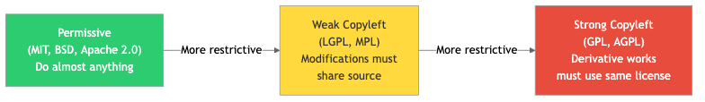

# Topic 33: Open Source & Inner Source

## Diagrams

Open source software (OSS) is software whose source code is made publicly available under a license that grants users the right to use, study, modify, and distribute the software. Inner source applies the lessons and practices of open source development to proprietary codebases within an organization. Both approaches fundamentally reshape how software is built, maintained, and governed.

---

## Concepts

### OSS Licensing

Software licenses define the legal terms under which code can be used, modified, and redistributed. Choosing the right license is one of the most consequential decisions for any open source project.

#### MIT License

The MIT License is one of the most permissive and widely used open source licenses. It permits virtually unrestricted use, modification, distribution, and sublicensing of the software, requiring only that the original copyright notice and license text be included in copies or substantial portions of the software. There is no requirement to release derivative works under the same license. This makes it attractive for both individual developers and corporations who want to incorporate open source code into proprietary products without legal friction.

#### Apache License 2.0

The Apache License 2.0 is also a permissive license, but it includes an explicit patent grant. Contributors to an Apache-licensed project automatically grant users a royalty-free patent license covering any patents that would be infringed by the contribution. It also includes a patent retaliation clause: if a user initiates patent litigation alleging that the software infringes a patent, their patent license under the Apache License is terminated. This makes Apache 2.0 particularly attractive in enterprise contexts where patent concerns are significant. Like MIT, it does not require derivative works to be open sourced.

#### GNU General Public License (GPL)

The GPL family of licenses (GPLv2, GPLv3, AGPL) are copyleft licenses. The defining characteristic of copyleft is that any derivative work must also be distributed under the same license. If you modify GPL-licensed code and distribute the modified version, you must release your modifications under the GPL as well. GPLv3 adds provisions addressing software patents and anti-tivoization (preventing hardware restrictions on modified software). The AGPL extends the distribution trigger to include providing access over a network, closing the so-called "SaaS loophole."

#### Key Differences Between Licenses

| Aspect | MIT | Apache 2.0 | GPLv3 |
|---|---|---|---|
| Permissiveness | Very high | High | Restrictive (copyleft) |
| Patent grant | No explicit grant | Explicit patent grant | Implicit patent grant |
| Patent retaliation | None | Yes | Yes |
| Copyleft requirement | None | None | Strong copyleft |
| Can mix with proprietary code | Yes | Yes | No (derivative must be GPL) |
| Attribution required | Yes (license text) | Yes (NOTICE file, license text) | Yes (prominent notices) |
| Network use triggers distribution | No | No | No (AGPL: Yes) |

Other notable licenses include the BSD 2-Clause and 3-Clause licenses (similar to MIT), the Mozilla Public License 2.0 (a "weak copyleft" license that applies copyleft at the file level rather than the project level), and Creative Commons licenses (typically used for documentation and media rather than code).

### Governance Models

Open source governance defines who makes decisions, how contributions are evaluated, and how the project evolves over time. There is no single correct model; the right choice depends on the project's size, maturity, and community dynamics.

#### Benevolent Dictator for Life (BDFL)

A single individual holds ultimate decision-making authority. This model works well for smaller projects or those with a strong founding vision. The Linux kernel under Linus Torvalds and Python under Guido van Rossum (before his retirement from the role) are classic examples. The BDFL model provides clear, fast decision-making but creates a single point of failure and can discourage participation if the dictator is perceived as unresponsive or biased.

#### Meritocratic / Committee Governance

Decision-making authority is distributed among a group of trusted contributors, often called committers or maintainers. The Apache Software Foundation uses this model extensively: contributors earn merit through sustained, high-quality contributions and are eventually voted into committer or PMC (Project Management Committee) roles. This model scales better than BDFL but can suffer from slow decision-making and political dynamics.

#### Foundation-Based Governance

A formal legal entity (a foundation) oversees the project. Foundations like the Linux Foundation, Apache Software Foundation, Cloud Native Computing Foundation (CNCF), and Eclipse Foundation provide legal protection, trademark management, financial stewardship, and neutral ground for competing corporate contributors. Foundation governance is essential for large, multi-stakeholder projects where no single company should control the direction.

#### Corporate-Led Open Source

A single company controls the project's roadmap and makes most decisions, while accepting external contributions. Examples include React (Meta), Angular (Google), and VS Code (Microsoft). This model provides strong direction and resources but can create tension if the community feels their needs are subordinated to the company's commercial interests.

### Community Management

Effective community management is the difference between a thriving open source project and an abandoned repository. Key practices include:

**Establishing clear contribution guidelines.** A CONTRIBUTING.md file should explain how to set up a development environment, the coding standards expected, the process for submitting issues and pull requests, and the code review workflow. Without this, potential contributors face unnecessary friction.

**Defining a Code of Conduct.** A Code of Conduct sets behavioral expectations for all participants. The Contributor Covenant is the most widely adopted template. Enforcement must be consistent and transparent; a Code of Conduct without enforcement is worse than having none, because it creates false expectations.

**Responsive issue and PR triage.** Acknowledging contributions promptly, even if a full review takes time, signals that the project values its contributors. Projects that leave pull requests unreviewed for weeks or months will lose contributors.

**Documentation as a first-class concern.** Good documentation lowers the barrier to contribution. This includes not just API documentation but architectural decision records, onboarding guides, and explanations of non-obvious design choices.

**Transparent roadmaps and decision-making.** Contributors are more likely to invest time in a project when they understand its direction and can influence it. Public roadmaps, RFCs (Request for Comments), and open design discussions build trust and engagement.

### Contributing to OSS

Contributing to open source is not limited to writing code. Valuable contributions include:

- Filing well-structured bug reports with reproduction steps
- Improving documentation, tutorials, and examples
- Triaging and categorizing issues
- Reviewing pull requests from other contributors
- Translating documentation and UI strings
- Designing logos, websites, and user interfaces
- Mentoring new contributors
- Speaking about the project at conferences and meetups

For code contributions, the typical workflow involves forking the repository, creating a feature branch, making changes, writing or updating tests, and submitting a pull request. Successful contributors familiarize themselves with the project's conventions before submitting their first PR and start with small, well-scoped changes to build trust.

### Maintaining OSS Projects

Maintaining an open source project is a substantial commitment that extends far beyond writing code. Maintainers are responsible for:

- Reviewing and merging contributions
- Managing releases, changelogs, and versioning (typically following Semantic Versioning)
- Responding to security vulnerabilities and issuing patches
- Managing CI/CD pipelines and build infrastructure
- Mediating community disputes
- Making architectural decisions that balance current needs with long-term sustainability
- Preventing maintainer burnout by distributing responsibilities and setting boundaries

Burnout is a significant and well-documented problem in open source. Maintainers of popular projects often face overwhelming volumes of issues, feature requests, and support questions, frequently without compensation. Establishing sustainable practices early, including saying "no" to scope creep and delegating effectively, is critical.

### Inner Source Practices Within Companies

Inner source applies open source development principles within the boundaries of a single organization. Rather than teams working in isolation on proprietary codebases, inner source encourages cross-team collaboration using the same tools and workflows that power open source.

**Key inner source practices include:**

**Discoverable repositories.** Code is stored in repositories that any employee can find, read, and potentially contribute to. This contrasts with the common pattern of teams hiding their code behind access controls.

**Pull request-based contributions.** Engineers from other teams submit changes via pull requests rather than filing tickets and waiting for the owning team to implement the change. The owning team reviews and merges contributions, maintaining quality control.

**Trusted committers.** Analogous to open source maintainers, trusted committers within a team are responsible for reviewing and merging external contributions. They also mentor contributors from other teams.

**Documentation and self-service.** Inner source projects must be well-documented so that engineers from other teams can understand and contribute to the codebase without extensive hand-holding.

**Standardized tooling.** Inner source works best when the organization has standardized development tools, CI/CD systems, and code review platforms across teams.

---

## Business Value

Open source and inner source deliver measurable business value across multiple dimensions:

**Reduced development costs.** Organizations that use open source effectively avoid reinventing solutions that already exist. The Linux Foundation estimated in 2015 that the Linux kernel alone would cost over $5 billion to develop from scratch. Every company that uses Linux benefits from this shared investment.

**Accelerated time to market.** Building on open source frameworks, libraries, and infrastructure allows teams to focus their engineering effort on differentiated capabilities rather than commodity infrastructure.

**Talent attraction and retention.** Engineers want to work on interesting problems using modern tools, and many prefer employers who contribute to open source. Allowing employees to contribute to OSS projects and open sourcing internal tools are effective recruiting strategies.

**Improved code quality.** Code that will be read by the public or by other teams within the company tends to be better documented, better tested, and more carefully designed than code written in isolation. The "many eyes" effect provides a broader review surface.

**Innovation through cross-pollination.** Inner source breaks down silos between teams. When engineers from different teams contribute to shared codebases, knowledge flows across organizational boundaries, and solutions developed in one context are adapted to others.

**Reduced duplication.** Large organizations frequently discover that multiple teams have independently built similar solutions. Inner source makes existing solutions discoverable and reusable, reducing wasted effort.

**Strategic influence.** Companies that lead popular open source projects gain influence over technical standards and ecosystems. This influence can shape markets in favorable directions and establish the company as a thought leader.

**Security through transparency.** While the "many eyes make all bugs shallow" claim is sometimes overstated, open source projects do benefit from external security audits, penetration testing, and vulnerability reports from a broader community than any single company could maintain.

---

## Real-World Examples

### Linux Kernel

The Linux kernel is the most successful open source project in history by virtually any measure. It powers the majority of the world's servers, all Android devices, most embedded systems, and the top 500 supercomputers. Its governance model, led by Linus Torvalds as BDFL with a hierarchy of subsystem maintainers, has scaled to accommodate thousands of contributors from hundreds of companies. The kernel's development process, centered on mailing lists and a rigorous patch review culture, has maintained high code quality despite the project's enormous scale. Companies like Red Hat, Intel, Google, and Samsung employ full-time kernel developers, demonstrating how commercial interests and open source collaboration can coexist productively.

### Rust Language and the Rust Foundation

Rust began as a personal project by Mozilla engineer Graydon Hoare, grew within Mozilla, and was eventually transitioned to the Rust Foundation in 2021. The Foundation, whose founding members include AWS, Google, Huawei, Microsoft, and Mozilla, provides financial and legal support while the language's technical direction is governed by a team-based model with distinct teams for the compiler, language design, library, and other concerns. Rust's governance evolution illustrates the common pattern of a project outgrowing its original organizational home and transitioning to a neutral foundation to ensure long-term sustainability and multi-stakeholder trust.

### Microsoft's Inner Source Transformation

Microsoft's journey from a company that once called open source "a cancer" (Steve Ballmer, 2001) to the world's largest contributor to open source on GitHub is one of the most dramatic cultural transformations in technology history. Internally, Microsoft adopted inner source practices across its engineering organization. The company consolidated from hundreds of isolated version control systems to a unified Git-based platform (which also drove the development and open sourcing of Git Virtual File System, later VFS for Git). Engineers across the company can discover, read, and contribute to codebases owned by other teams. This shift broke down organizational silos, reduced duplicated effort, and accelerated development velocity. Microsoft's acquisition of GitHub in 2018 and its stewardship of projects like VS Code, TypeScript, and .NET further cemented this transformation.

### Google's Approach to Open Source

Google has a long history of strategic open source engagement. Projects like Kubernetes (donated to the CNCF), TensorFlow, Android, Chromium, and Go have become foundational infrastructure across the industry. Google's open sourcing of Kubernetes is a particularly instructive case: by open sourcing the technology derived from its internal Borg container orchestration system, Google created a platform that standardized container orchestration, reduced the competitive advantage of proprietary cloud platforms, and established Google Cloud as a natural home for Kubernetes workloads. Internally, Google operates with a monorepo and a culture of code readability and shared ownership that embodies many inner source principles, even if the company does not use that specific term.

---

## Common Mistakes & Pitfalls

### 1. Ignoring License Compliance

Organizations often consume open source libraries without tracking their licenses or understanding the obligations those licenses impose. Using a GPL-licensed library in a proprietary product without complying with the GPL's copyleft requirements can expose the organization to legal liability. Every organization using open source should maintain a Software Bill of Materials (SBOM) and have a clear license compliance policy reviewed by legal counsel.

### 2. Open Sourcing Without a Maintenance Plan

Companies frequently open source internal tools with great fanfare and then fail to allocate ongoing engineering time for maintenance. The repository accumulates unanswered issues and unreviewed pull requests, damaging the company's reputation in the developer community. Open sourcing a project is a commitment, not a one-time event. If the organization is not prepared to maintain the project or explicitly hand it off to a community, it is better to not open source it at all.

### 3. Treating Inner Source as Just "Shared Code"

Making repositories visible to the entire organization is necessary but insufficient for inner source. Without clear contribution guidelines, responsive maintainers, adequate documentation, and organizational incentives for cross-team contribution, inner source devolves into "read-only open source" where other teams can see the code but cannot effectively contribute to it. Cultural change and management support are prerequisites.

### 4. Underestimating Community Management Effort

Building a healthy open source community requires sustained effort in documentation, issue triage, contributor mentoring, conflict resolution, and communication. Projects that focus exclusively on code and neglect community management struggle to attract and retain contributors. Community management is a skill that should be valued and resourced accordingly.

### 5. Confusing "Open Source" with "Free Labor"

Some organizations view open source primarily as a way to get free development work from external contributors. This extractive mindset poisons community relationships. Successful open source is built on reciprocity: organizations that consume open source should contribute back through code, funding, documentation, or other support. The sustainability problems plaguing many critical open source projects (such as the xz/liblzma supply chain attack in 2024, which exploited an overburdened solo maintainer) demonstrate the consequences of this imbalance.

### 6. Failing to Secure the Software Supply Chain

Dependencies on open source packages introduce supply chain risk. The left-pad incident (2016), event-stream malware injection (2018), and Log4Shell vulnerability (2021) demonstrated how a vulnerability or malicious change in a widely-used open source package can cascade across the entire software ecosystem. Organizations must implement dependency scanning, vulnerability monitoring, pinned versions, lock files, and regular dependency updates as part of their security practices.

---

## Trade-offs

| Dimension | Open Source Approach | Proprietary / Closed Source Approach |
|---|---|---|
| Development cost | Lower (shared investment, community contributions) | Higher (all development borne internally) |
| Speed of adoption | Faster (no procurement, free to evaluate) | Slower (licensing, vendor evaluation) |
| Control over direction | Lower (community influence, competing interests) | Higher (full control over roadmap) |
| Competitive moat | Weaker (competitors can use the same code) | Stronger (proprietary technology as differentiator) |
| Code quality visibility | Transparent (anyone can audit) | Opaque (security through obscurity, limited review) |
| Maintenance burden | Shared but unpredictable (community may lose interest) | Predictable (internal team, funded by revenue) |
| Talent attraction | Strong signal (engineers value OSS participation) | Neutral to weak (less visibility) |
| Licensing flexibility | Constrained by chosen license | Full flexibility |
| Security vulnerability response | Faster detection (many eyes), but public disclosure | Slower detection, but controlled disclosure timeline |
| Long-term sustainability | Depends on community health and funding | Depends on company's financial health |
| Vendor lock-in risk | Lower (can fork, switch providers) | Higher (proprietary APIs, formats, protocols) |

| Dimension | Inner Source | Traditional Siloed Development |
|---|---|---|
| Cross-team collaboration | High (pull request model, shared code) | Low (tickets, meetings, handoffs) |
| Code discoverability | High (centralized, searchable repositories) | Low (fragmented, access-controlled) |
| Duplication of effort | Reduced (shared solutions are visible) | Common (teams unaware of parallel efforts) |
| Team autonomy | Somewhat reduced (must review external PRs) | High (team controls all changes) |
| Onboarding cost | Lower (documentation-driven, self-service) | Higher (tribal knowledge, per-team processes) |
| Organizational overhead | Requires tooling, process, culture investment | Lower upfront, higher long-term cost |

---

## When to Use / When Not to Use

### When to Open Source

- **Commodity infrastructure and tooling.** If the software is not a core competitive differentiator, open sourcing it allows the organization to share the maintenance burden with the community. Build tools, testing frameworks, and infrastructure libraries are strong candidates.
- **Platform and ecosystem building.** Open sourcing a platform encourages an ecosystem of tools, integrations, and extensions that increase the platform's value. Kubernetes, React, and TensorFlow are examples of this strategy.
- **Standards establishment.** When an organization wants to establish its approach as an industry standard, open sourcing the reference implementation is an effective strategy.
- **Talent acquisition.** Open source projects showcase engineering culture and technical capabilities, attracting engineers who want to work on those projects.
- **When the project benefits from diverse use cases.** Projects that serve many different contexts benefit from the variety of bug reports, feature requests, and contributions that a diverse community provides.

### When NOT to Open Source

- **Core competitive differentiators.** If the software embodies proprietary algorithms, unique data processing techniques, or other intellectual property that provides a direct competitive advantage, open sourcing it gives that advantage to competitors.
- **When the organization cannot commit to maintenance.** Abandoning an open source project damages reputation. If the resources for ongoing maintenance are not available, do not open source.
- **When the code has embedded secrets or proprietary dependencies.** Code that references internal systems, contains hardcoded credentials, or depends on proprietary libraries that cannot be open sourced requires significant cleanup before release.
- **When license compliance is unclear.** If the codebase incorporates third-party code whose licensing is uncertain, open sourcing it creates legal risk.

### When to Adopt Inner Source

- **Large organizations with multiple teams building on shared platforms.** Inner source reduces duplication and accelerates development when teams frequently need changes in codebases owned by other teams.
- **When cross-team dependencies cause bottlenecks.** If teams routinely wait weeks for other teams to implement changes, inner source allows them to contribute directly.
- **When organizational silos impede knowledge sharing.** Inner source forces documentation and transparency, breaking down information asymmetries between teams.

### When NOT to Adopt Inner Source

- **Small organizations where communication is already fluid.** In a 20-person company where everyone sits in the same room, the overhead of formal inner source processes may exceed the benefits.
- **When security or regulatory requirements demand strict access control.** Some codebases (cryptographic key management, certain financial systems) may require access restrictions incompatible with broad inner source visibility.
- **Without organizational commitment.** Inner source requires cultural change, tooling investment, and management support. Adopting it superficially without these prerequisites wastes effort.

---

## Key Takeaways

1. **License choice has lasting consequences.** The license you choose for an open source project determines who can use your code, how they can use it, and what obligations they incur. Permissive licenses (MIT, Apache 2.0) maximize adoption; copyleft licenses (GPL, AGPL) maximize the open source commons. Changing a license after the fact requires consent from all contributors, making it practically impossible for large projects.

2. **Governance must scale with the project.** A solo maintainer making all decisions works for small projects but breaks down as the project grows. Successful projects evolve their governance models over time, often transitioning from BDFL to committee-based or foundation-based governance as the contributor base expands.

3. **Community is the product.** For open source projects, the community of contributors, users, and advocates is at least as valuable as the code itself. A mediocre codebase with an excellent community will outperform an excellent codebase with no community. Invest in community management accordingly.

4. **Inner source requires cultural change, not just tooling.** Making repositories visible is the easy part. The hard part is incentivizing cross-team contributions, training maintainers to review external pull requests constructively, and convincing management to allocate time for contributing to codebases their team does not own.

5. **Open source sustainability is an industry-wide problem.** Critical infrastructure depends on projects maintained by small, often unpaid teams. Organizations that depend on open source have an ethical and strategic obligation to support the projects they rely on, whether through direct funding, employee contributions, or other means.

6. **Supply chain security is non-negotiable.** Every open source dependency is an attack surface. Organizations must maintain visibility into their dependency trees, monitor for vulnerabilities, and have processes for rapid response when vulnerabilities are discovered.

7. **Open source is a strategy, not a philosophy.** The most effective organizations treat open source as a strategic tool with specific business objectives, not as an end in itself. They open source deliberately, with clear goals for what they expect to achieve and concrete plans for ongoing investment.

---

## Further Reading

### Books

- **"Producing Open Source Software" by Karl Fogel** -- A comprehensive guide to running a successful open source project, covering technical infrastructure, social dynamics, and governance. Available free online at producingoss.com.
- **"Working in Public: The Making and Maintenance of Open Source Software" by Nadia Eghbal** -- An examination of the economics and social dynamics of modern open source, with particular attention to the sustainability challenges facing maintainers.
- **"The Cathedral and the Bazaar" by Eric S. Raymond** -- The foundational essay that articulated the open source development model and contrasted it with traditional closed-source development. Essential historical context even if some arguments have aged.
- **"Open Source Law, Policy and Practice" edited by Amanda Brock** -- A detailed legal treatment of open source licensing, compliance, and policy, useful for engineers and managers who need to understand the legal dimensions.
- **"Forge Your Future with Open Source" by VM (Vicky) Brasseur** -- A practical guide for individuals looking to contribute to open source projects, covering how to find projects, make contributions, and build a reputation.

### Articles and Reports

- **"Understanding Inner Source" by the InnerSource Commons Foundation** -- The InnerSource Commons (innersourcecommons.org) maintains a collection of patterns, case studies, and learning paths for organizations adopting inner source.
- **"Roads and Bridges: The Unseen Labor Behind Our Digital Infrastructure" by Nadia Eghbal (Ford Foundation, 2016)** -- A report documenting the infrastructure crisis in open source and the sustainability challenges facing critical projects.
- **"The CHAOSS Project" (chaoss.community)** -- An initiative focused on defining metrics for open source community health, useful for organizations evaluating projects to depend on or contribute to.
- **"A Guide to Open Source Software for Procurement Professionals" by the Linux Foundation** -- Practical guidance for organizations establishing open source policies and procurement practices.
- **GitHub's "Open Source Guides" (opensource.guide)** -- Maintained by GitHub, these guides cover starting, contributing to, and maintaining open source projects, as well as building communities and establishing governance.
- **"Managing Inner Source Projects" by the InnerSource Commons** -- A pattern catalog documenting proven approaches to common inner source challenges, from trusted committer roles to contribution agreements.
